# Security and Configuration

<cite>
**Referenced Files in This Document**
- [sandboxFilter.ts](file://packages/computer-use/src/guardrails/sandboxFilter.ts)
- [securityLogger.ts](file://packages/computer-use/src/guardrails/securityLogger.ts)
- [types.ts](file://packages/computer-use/src/guardrails/types.ts)
- [index.ts](file://packages/computer-use/src/guardrails/index.ts)
- [sandboxValidationReporter.ts](file://packages/computer-use/src/sandboxValidationReporter.ts)
- [sandbox.ts](file://packages/computer-use/src/sandbox.ts)
- [runtime.ts](file://packages/shared/src/plugins/runtime.ts)
- [pairing.ts](file://packages/communication/src/pairing.ts)
- [config.ts](file://apps/mobile/src/config.ts)
- [server.mjs](file://apps/desktop/src-tauri/sidecar/server.mjs)
- [desktop-schema.json](file://apps/desktop/src-tauri/gen/schemas/desktop-schema.json)
- [windows-schema.json](file://apps/desktop/src-tauri/gen/schemas/windows-schema.json)
- [budget.yaml](file://packages/ai-engine/.ghita/budget.yaml)
- [fallbackManager.ts](file://packages/ai-engine/src/gateway/fallbackManager.ts)
- [cost.ts](file://packages/ai-engine/src/utils/cost.ts)
- [secure-key-loader.ts](file://packages/ai-engine/src/utils/secure-key-loader.ts)
- [configLoader.ts](file://packages/ai-engine/src/utils/configLoader.ts)
- [unifiedRouter.ts](file://packages/ai-engine/src/router/unifiedRouter.ts)
- [orchestrator.ts](file://packages/ai-engine/src/orchestrator.ts)
- [security-blacklist.yaml](file://.ghita/security-blacklist.yaml)
- [rules.yaml](file://.ghita/rules.yaml)
- [budget.yaml](file://.ghita/budget.yaml)
- [developer_security.txt](file://group/Chat_2026-05-31_08-10-16/developer_security.txt)
</cite>

## Table of Contents
1. [Introduction](#introduction)
2. [Project Structure](#project-structure)
3. [Core Components](#core-components)
4. [Architecture Overview](#architecture-overview)
5. [Detailed Component Analysis](#detailed-component-analysis)
6. [Dependency Analysis](#dependency-analysis)
7. [Performance Considerations](#performance-considerations)
8. [Troubleshooting Guide](#troubleshooting-guide)
9. [Conclusion](#conclusion)
10. [Appendices](#appendices)

## Introduction
This document explains the Security and Configuration management of the GHITA Coding Agent. It covers the security architecture including access control, data protection, and policy enforcement via the ghita security framework. It documents configuration management across environment variables, feature flags, runtime configuration, AI provider settings, and platform-specific permissions. It also details the security blacklist, automated security checks, budget management, rule enforcement, secure pairing between mobile and desktop, and security monitoring and auditing practices.

## Project Structure
Security and configuration spans multiple packages and platforms:
- Guardrails and sandbox security live under the computer-use package.
- AI engine manages budgets, provider configuration, and secure key loading.
- Communication handles pairing between mobile and desktop.
- Desktop Tauri integrates filesystem permissions and schema validation.
- Mobile injects environment-based configuration.
- Shared runtime enforces plugin security.

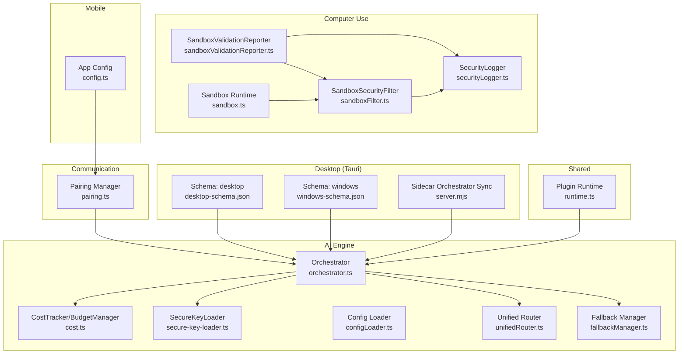

**Diagram sources**
- [sandboxFilter.ts:389-632](file://packages/computer-use/src/guardrails/sandboxFilter.ts#L389-L632)
- [securityLogger.ts:210-228](file://packages/computer-use/src/guardrails/securityLogger.ts#L210-L228)
- [sandboxValidationReporter.ts:1-79](file://packages/computer-use/src/sandboxValidationReporter.ts#L1-L79)
- [sandbox.ts:270-324](file://packages/computer-use/src/sandbox.ts#L270-L324)
- [orchestrator.ts:64-104](file://packages/ai-engine/src/orchestrator.ts#L64-L104)
- [cost.ts:89-150](file://packages/ai-engine/src/utils/cost.ts#L89-L150)
- [secure-key-loader.ts:36-80](file://packages/ai-engine/src/utils/secure-key-loader.ts#L36-L80)
- [configLoader.ts:50-94](file://packages/ai-engine/src/utils/configLoader.ts#L50-L94)
- [unifiedRouter.ts:109-148](file://packages/ai-engine/src/router/unifiedRouter.ts#L109-L148)
- [fallbackManager.ts:135-176](file://packages/ai-engine/src/gateway/fallbackManager.ts#L135-L176)
- [pairing.ts:1-54](file://packages/communication/src/pairing.ts#L1-L54)
- [desktop-schema.json:228-241](file://apps/desktop/src-tauri/gen/schemas/desktop-schema.json#L228-L241)
- [windows-schema.json:228-241](file://apps/desktop/src-tauri/gen/schemas/windows-schema.json#L228-L241)
- [server.mjs:721-752](file://apps/desktop/src-tauri/sidecar/server.mjs#L721-L752)
- [config.ts:1-8](file://apps/mobile/src/config.ts#L1-L8)
- [runtime.ts:36-68](file://packages/shared/src/plugins/runtime.ts#L36-L68)

**Section sources**
- [sandboxFilter.ts:389-632](file://packages/computer-use/src/guardrails/sandboxFilter.ts#L389-L632)
- [orchestrator.ts:64-104](file://packages/ai-engine/src/orchestrator.ts#L64-L104)
- [pairing.ts:1-54](file://packages/communication/src/pairing.ts#L1-L54)
- [desktop-schema.json:228-241](file://apps/desktop/src-tauri/gen/schemas/desktop-schema.json#L228-L241)
- [windows-schema.json:228-241](file://apps/desktop/src-tauri/gen/schemas/windows-schema.json#L228-L241)
- [config.ts:1-8](file://apps/mobile/src/config.ts#L1-L8)
- [runtime.ts:36-68](file://packages/shared/src/plugins/runtime.ts#L36-L68)

## Core Components
- Security Filter: Validates commands against built-in and custom blacklists, whitelists, and severity thresholds; supports optional approval callbacks and logging.
- Security Logger: Stores security events locally with timestamps, approvals, and severity codes.
- Sandbox Runtime: Executes code in isolated environments with controlled environments and timeouts.
- Budget Management: Tracks spending per session/day and triggers alerts based on configurable thresholds.
- Secure Key Loader: Loads provider API keys from environment variables with caching and no exposure in logs.
- Pairing Manager: Generates time-limited 6-character codes for secure pairing between mobile and desktop.
- Tauri Permissions: Enforces filesystem permissions for application configuration folders.
- Plugin Runtime: Validates plugin entrypoints and extensions to prevent path traversal and disallow unsafe file types.

**Section sources**
- [sandboxFilter.ts:416-516](file://packages/computer-use/src/guardrails/sandboxFilter.ts#L416-L516)
- [securityLogger.ts:210-228](file://packages/computer-use/src/guardrails/securityLogger.ts#L210-L228)
- [sandbox.ts:270-324](file://packages/computer-use/src/sandbox.ts#L270-L324)
- [cost.ts:89-150](file://packages/ai-engine/src/utils/cost.ts#L89-L150)
- [secure-key-loader.ts:36-80](file://packages/ai-engine/src/utils/secure-key-loader.ts#L36-L80)
- [pairing.ts:1-54](file://packages/communication/src/pairing.ts#L1-L54)
- [desktop-schema.json:228-241](file://apps/desktop/src-tauri/gen/schemas/desktop-schema.json#L228-L241)
- [windows-schema.json:228-241](file://apps/desktop/src-tauri/gen/schemas/windows-schema.json#L228-L241)
- [runtime.ts:36-68](file://packages/shared/src/plugins/runtime.ts#L36-L68)

## Architecture Overview
The security architecture integrates guardrails, sandboxing, budget controls, and secure communications across platforms.

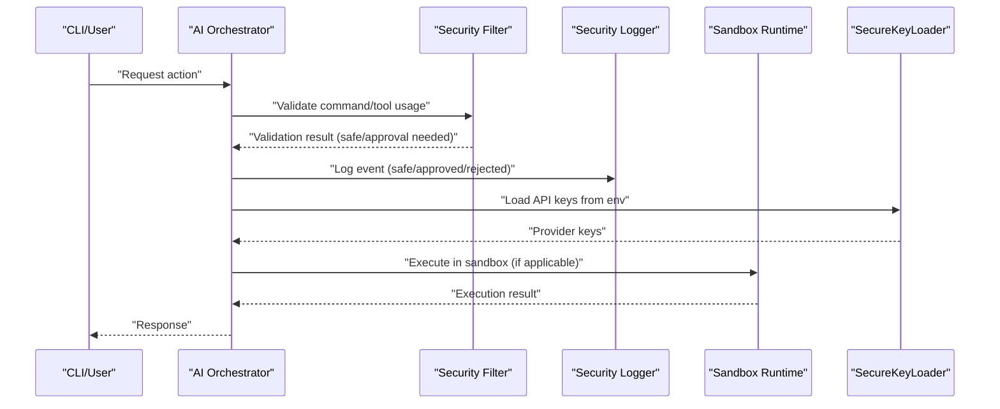

**Diagram sources**
- [sandboxFilter.ts:416-516](file://packages/computer-use/src/guardrails/sandboxFilter.ts#L416-L516)
- [securityLogger.ts:210-228](file://packages/computer-use/src/guardrails/securityLogger.ts#L210-L228)
- [sandbox.ts:270-324](file://packages/computer-use/src/sandbox.ts#L270-L324)
- [secure-key-loader.ts:36-80](file://packages/ai-engine/src/utils/secure-key-loader.ts#L36-L80)
- [orchestrator.ts:64-104](file://packages/ai-engine/src/orchestrator.ts#L64-L104)

## Detailed Component Analysis

### Security Filter and Blacklist
The security filter enforces a layered policy:
- Whitelist: Permits known-safe commands immediately.
- Built-in blacklist: Matches against predefined patterns.
- Custom blacklist: Loaded from .ghita/security-blacklist.yaml with compile-time regex validation.
- Severity thresholds: Determines whether to block immediately or request approval.
- Approval callback: Optional GUI/Olt approval flow.
- Logging: Records all decisions with severity codes and timestamps.

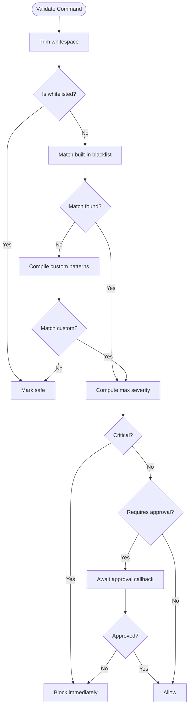

**Diagram sources**
- [sandboxFilter.ts:416-516](file://packages/computer-use/src/guardrails/sandboxFilter.ts#L416-L516)
- [types.ts:40-88](file://packages/computer-use/src/guardrails/types.ts#L40-L88)
- [security-blacklist.yaml](file://.ghita/security-blacklist.yaml)

**Section sources**
- [sandboxFilter.ts:416-516](file://packages/computer-use/src/guardrails/sandboxFilter.ts#L416-L516)
- [types.ts:40-88](file://packages/computer-use/src/guardrails/types.ts#L40-L88)
- [.ghita/security-blacklist.yaml](file://.ghita/security-blacklist.yaml)

### Security Logger
The security logger persists events to a local database and exposes queries for recent blocks and block rates. It records approval outcomes and severity codes for auditability.

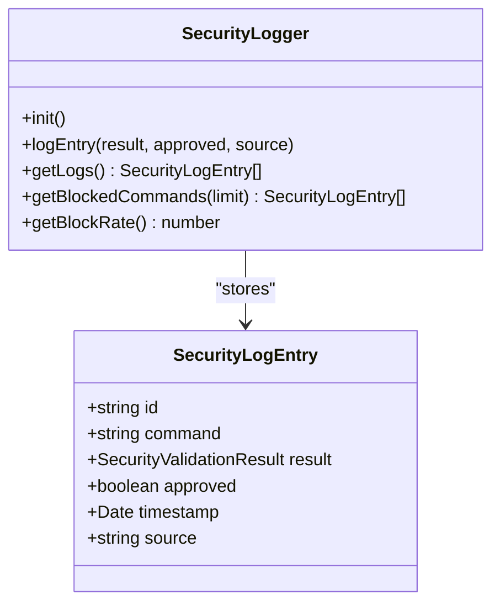

**Diagram sources**
- [securityLogger.ts:210-228](file://packages/computer-use/src/guardrails/securityLogger.ts#L210-L228)
- [types.ts:56-72](file://packages/computer-use/src/guardrails/types.ts#L56-L72)

**Section sources**
- [securityLogger.ts:210-228](file://packages/computer-use/src/guardrails/securityLogger.ts#L210-L228)
- [types.ts:56-72](file://packages/computer-use/src/guardrails/types.ts#L56-L72)

### Automated Security Checks and Reports
The sandbox validation reporter runs targeted tests across DSO orchestration, security filter effectiveness, headless scanning, and integration. It generates structured reports with pass/fail/warning outcomes and recommendations.

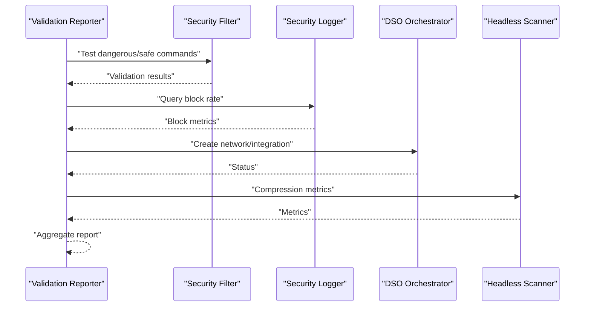

**Diagram sources**
- [sandboxValidationReporter.ts:1-79](file://packages/computer-use/src/sandboxValidationReporter.ts#L1-L79)
- [sandboxValidationReporter.ts:131-233](file://packages/computer-use/src/sandboxValidationReporter.ts#L131-L233)
- [sandboxValidationReporter.ts:236-254](file://packages/computer-use/src/sandboxValidationReporter.ts#L236-L254)

**Section sources**
- [sandboxValidationReporter.ts:1-79](file://packages/computer-use/src/sandboxValidationReporter.ts#L1-L79)
- [sandboxValidationReporter.ts:131-233](file://packages/computer-use/src/sandboxValidationReporter.ts#L131-L233)
- [sandboxValidationReporter.ts:236-254](file://packages/computer-use/src/sandboxValidationReporter.ts#L236-L254)

### Sandbox Runtime and Execution Controls
The sandbox runtime executes code with:
- Controlled environment variables (clean copy of process.env).
- Timeouts and exit-code handling.
- Language-specific runners and temporary file isolation.

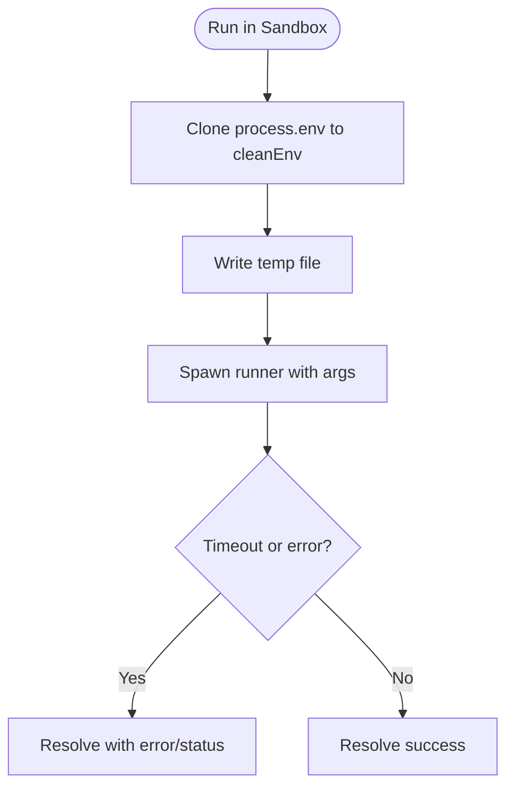

**Diagram sources**
- [sandbox.ts:270-324](file://packages/computer-use/src/sandbox.ts#L270-L324)

**Section sources**
- [sandbox.ts:270-324](file://packages/computer-use/src/sandbox.ts#L270-L324)

### Budget Management and Spending Controls
Budget management tracks spending per session and day, compares against configured limits, and triggers alerts at configurable thresholds. It writes default budget configuration if missing and parses YAML entries.

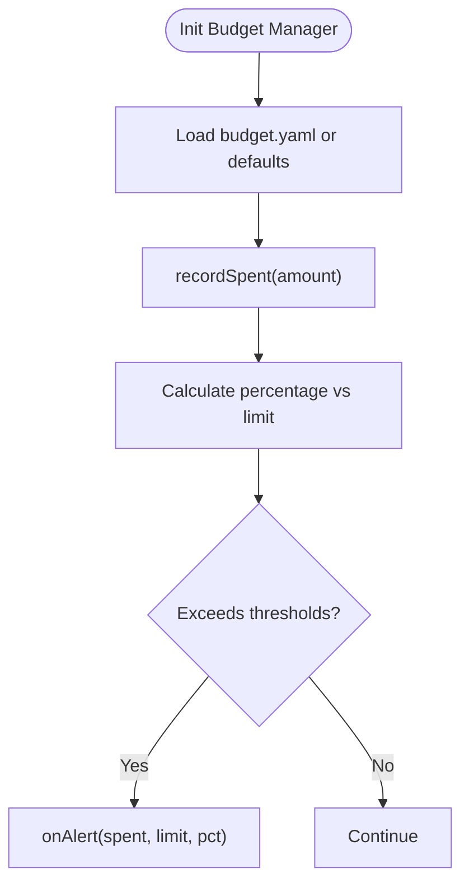

**Diagram sources**
- [fallbackManager.ts:135-176](file://packages/ai-engine/src/gateway/fallbackManager.ts#L135-L176)
- [cost.ts:89-150](file://packages/ai-engine/src/utils/cost.ts#L89-L150)
- [.ghita/budget.yaml](file://.ghita/budget.yaml)

**Section sources**
- [fallbackManager.ts:135-176](file://packages/ai-engine/src/gateway/fallbackManager.ts#L135-L176)
- [cost.ts:89-150](file://packages/ai-engine/src/utils/cost.ts#L89-L150)
- [.ghita/budget.yaml](file://.ghita/budget.yaml)

### Secure Key Loading and Provider Configuration
API keys are loaded from environment variables and cached securely. Provider configurations are loaded from YAML or environment, with support for encrypted keys in configuration files.

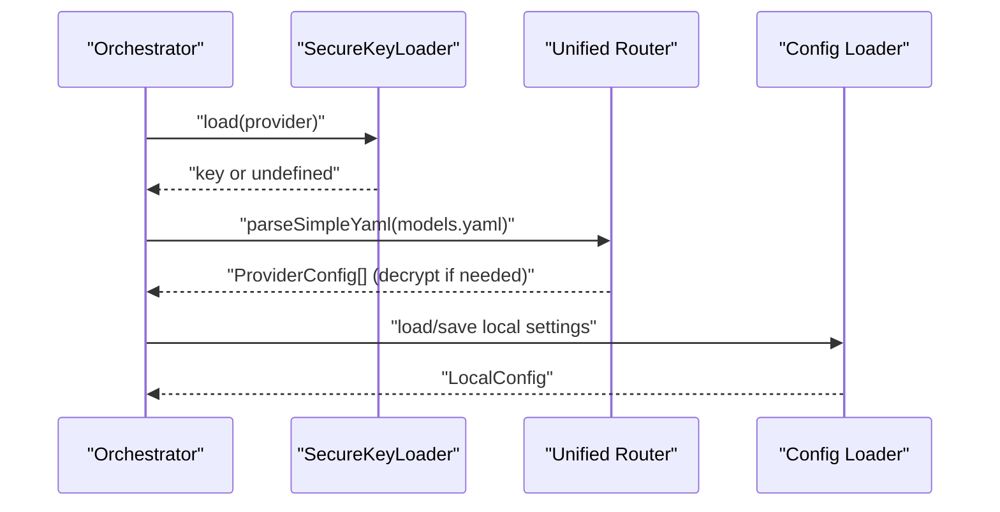

**Diagram sources**
- [secure-key-loader.ts:36-80](file://packages/ai-engine/src/utils/secure-key-loader.ts#L36-L80)
- [unifiedRouter.ts:109-148](file://packages/ai-engine/src/router/unifiedRouter.ts#L109-L148)
- [configLoader.ts:50-94](file://packages/ai-engine/src/utils/configLoader.ts#L50-L94)

**Section sources**
- [secure-key-loader.ts:36-80](file://packages/ai-engine/src/utils/secure-key-loader.ts#L36-L80)
- [unifiedRouter.ts:109-148](file://packages/ai-engine/src/router/unifiedRouter.ts#L109-L148)
- [configLoader.ts:50-94](file://packages/ai-engine/src/utils/configLoader.ts#L50-L94)

### Secure Pairing Between Mobile and Desktop
The pairing manager generates a time-limited 6-character code and validates submissions. It ensures mutual verification and automatic regeneration upon expiry.

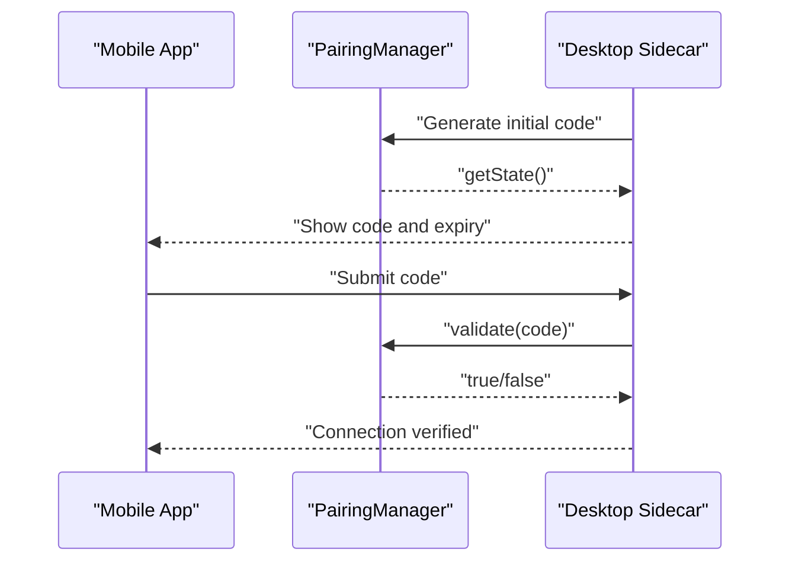

**Diagram sources**
- [pairing.ts:1-54](file://packages/communication/src/pairing.ts#L1-L54)
- [config.ts:1-8](file://apps/mobile/src/config.ts#L1-L8)
- [server.mjs:721-752](file://apps/desktop/src-tauri/sidecar/server.mjs#L721-L752)

**Section sources**
- [pairing.ts:1-54](file://packages/communication/src/pairing.ts#L1-L54)
- [config.ts:1-8](file://apps/mobile/src/config.ts#L1-L8)
- [server.mjs:721-752](file://apps/desktop/src-tauri/sidecar/server.mjs#L721-L752)

### Platform-Specific Permissions (Tauri)
Tauri schemas define filesystem permissions for application configuration folders, enabling scoped access to configuration data.

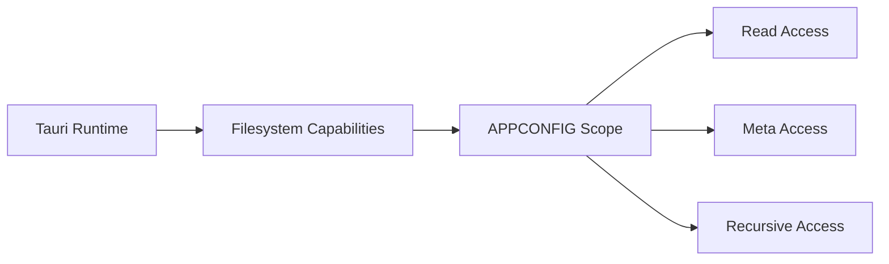

**Diagram sources**
- [desktop-schema.json:228-241](file://apps/desktop/src-tauri/gen/schemas/desktop-schema.json#L228-L241)
- [windows-schema.json:228-241](file://apps/desktop/src-tauri/gen/schemas/windows-schema.json#L228-L241)

**Section sources**
- [desktop-schema.json:228-241](file://apps/desktop/src-tauri/gen/schemas/desktop-schema.json#L228-L241)
- [windows-schema.json:228-241](file://apps/desktop/src-tauri/gen/schemas/windows-schema.json#L228-L241)

### Plugin Runtime Security
The plugin runtime enforces:
- Path traversal prevention by resolving entrypoints within the plugin directory.
- Allowed file extensions (.js, .mjs, .ts).
- Dynamic import with explicit file URLs.

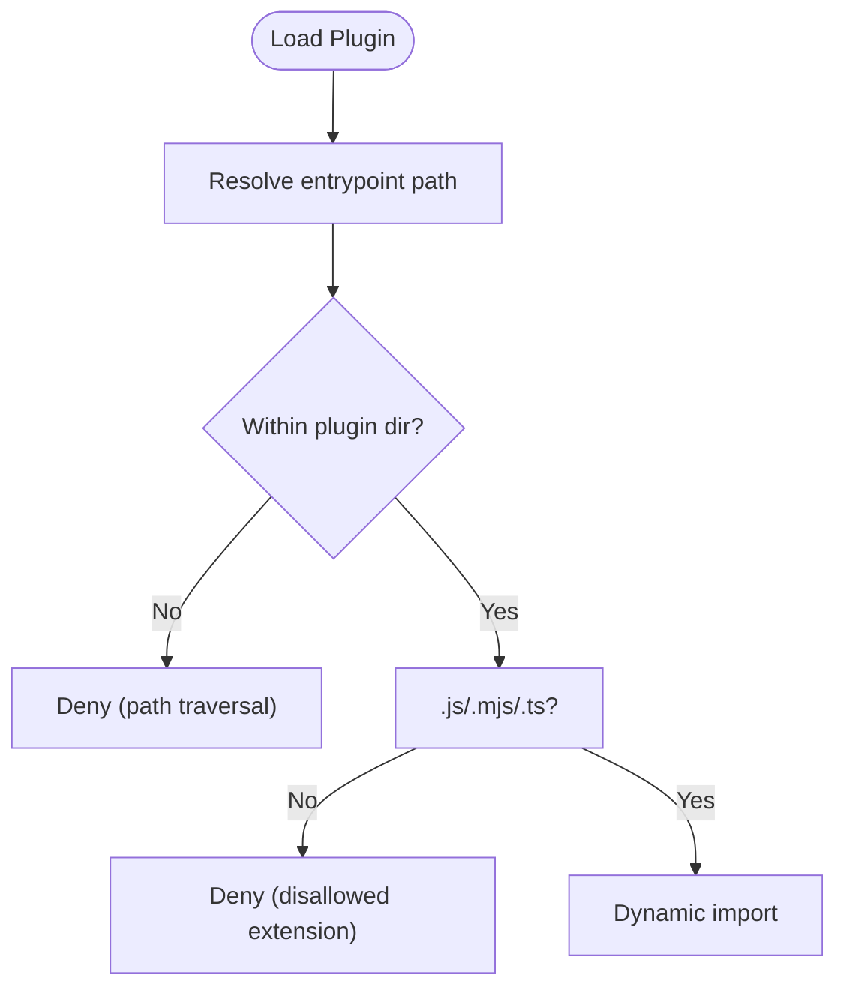

**Diagram sources**
- [runtime.ts:36-68](file://packages/shared/src/plugins/runtime.ts#L36-L68)

**Section sources**
- [runtime.ts:36-68](file://packages/shared/src/plugins/runtime.ts#L36-L68)

## Dependency Analysis
The security and configuration system exhibits strong cohesion within guardrails, budgeting, and provider configuration, with clear separation of concerns across packages.

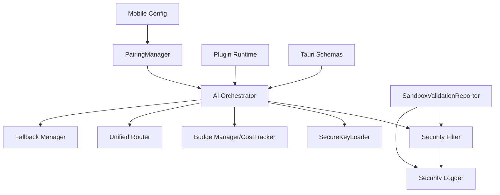

**Diagram sources**
- [orchestrator.ts:64-104](file://packages/ai-engine/src/orchestrator.ts#L64-L104)
- [sandboxFilter.ts:389-632](file://packages/computer-use/src/guardrails/sandboxFilter.ts#L389-L632)
- [securityLogger.ts:210-228](file://packages/computer-use/src/guardrails/securityLogger.ts#L210-L228)
- [sandboxValidationReporter.ts:1-79](file://packages/computer-use/src/sandboxValidationReporter.ts#L1-L79)
- [pairing.ts:1-54](file://packages/communication/src/pairing.ts#L1-L54)
- [config.ts:1-8](file://apps/mobile/src/config.ts#L1-L8)
- [runtime.ts:36-68](file://packages/shared/src/plugins/runtime.ts#L36-L68)
- [desktop-schema.json:228-241](file://apps/desktop/src-tauri/gen/schemas/desktop-schema.json#L228-L241)

**Section sources**
- [orchestrator.ts:64-104](file://packages/ai-engine/src/orchestrator.ts#L64-L104)
- [sandboxFilter.ts:389-632](file://packages/computer-use/src/guardrails/sandboxFilter.ts#L389-L632)
- [securityLogger.ts:210-228](file://packages/computer-use/src/guardrails/securityLogger.ts#L210-L228)
- [sandboxValidationReporter.ts:1-79](file://packages/computer-use/src/sandboxValidationReporter.ts#L1-L79)
- [pairing.ts:1-54](file://packages/communication/src/pairing.ts#L1-L54)
- [config.ts:1-8](file://apps/mobile/src/config.ts#L1-L8)
- [runtime.ts:36-68](file://packages/shared/src/plugins/runtime.ts#L36-L68)
- [desktop-schema.json:228-241](file://apps/desktop/src-tauri/gen/schemas/desktop-schema.json#L228-L241)

## Performance Considerations
- Regex compilation for custom patterns occurs during filter initialization; keep pattern lists concise.
- Approval callbacks introduce latency; batch or debounce requests where feasible.
- Budget alerts are computed per spend event; avoid excessive small transactions to reduce alert churn.
- Sandbox execution timeouts protect resources; tune per workload to balance safety and responsiveness.
- Tauri filesystem operations should remain scoped to minimize I/O overhead.

## Troubleshooting Guide
- Invalid security-blacklist.yaml: The filter merges defaults with user-provided config; ensure custom patterns are valid regex and whitelist entries are strings.
- Budget YAML parsing failures: The fallback manager writes defaults if parsing fails; verify YAML indentation and numeric values.
- API key not loaded: Verify environment variables and provider mapping; keys are cached and not logged.
- Pairing code expired: Codes regenerate automatically after TTL; ensure clocks are synchronized.
- Plugin load failures: Confirm entrypoint path is inside plugin directory and uses allowed extensions.
- Tauri permission denied: Review APPCONFIG permissions in generated schemas and ensure capability files grant required scopes.

**Section sources**
- [sandboxFilter.ts:547-556](file://packages/computer-use/src/guardrails/sandboxFilter.ts#L547-L556)
- [fallbackManager.ts:135-176](file://packages/ai-engine/src/gateway/fallbackManager.ts#L135-L176)
- [secure-key-loader.ts:36-80](file://packages/ai-engine/src/utils/secure-key-loader.ts#L36-L80)
- [pairing.ts:1-54](file://packages/communication/src/pairing.ts#L1-L54)
- [runtime.ts:36-68](file://packages/shared/src/plugins/runtime.ts#L36-L68)
- [desktop-schema.json:228-241](file://apps/desktop/src-tauri/gen/schemas/desktop-schema.json#L228-L241)

## Conclusion
The GHITA Coding Agent implements a robust security and configuration framework centered on command validation, sandboxing, budget controls, secure key management, and secure pairing. The system’s modular design enables clear separation of concerns, while automated reporting and logging facilitate continuous monitoring and improvement.

## Appendices

### Configuration Options Summary
- Environment variables: API keys and cloud discovery settings are injected at runtime.
- AI provider configuration: Loaded from YAML or environment; supports encrypted keys.
- Budget configuration: Session/day limits and alert thresholds via YAML.
- Security blacklist: Built-in and custom patterns with severity and approval rules.
- Tauri permissions: Scoped filesystem access for application configuration.
- Feature flags: Command-line flag parsing in skills; runtime toggles supported by orchestrator hooks.

**Section sources**
- [config.ts:1-8](file://apps/mobile/src/config.ts#L1-L8)
- [unifiedRouter.ts:109-148](file://packages/ai-engine/src/router/unifiedRouter.ts#L109-L148)
- [configLoader.ts:50-94](file://packages/ai-engine/src/utils/configLoader.ts#L50-L94)
- [.ghita/budget.yaml](file://.ghita/budget.yaml)
- [sandboxFilter.ts:389-398](file://packages/computer-use/src/guardrails/sandboxFilter.ts#L389-L398)
- [desktop-schema.json:228-241](file://apps/desktop/src-tauri/gen/schemas/desktop-schema.json#L228-L241)
- [sandboxValidationReporter.ts:141-187](file://packages/computer-use/src/sandboxValidationReporter.ts#L141-L187)

### Security Best Practices and Compliance
- Treat all configuration files and environment variables as sensitive; never hardcode secrets.
- Regularly audit dependencies and review security advisories.
- Enforce least privilege for Tauri capabilities and plugin entrypoints.
- Monitor security logs and block rates; investigate anomalies promptly.
- Validate configurations at startup and fail closed on invalid settings.

**Section sources**
- [developer_security.txt:45-78](file://group/Chat_2026-05-31_08-10-16/developer_security.txt#L45-L78)
- [runtime.ts:36-68](file://packages/shared/src/plugins/runtime.ts#L36-L68)
- [securityLogger.ts:210-228](file://packages/computer-use/src/guardrails/securityLogger.ts#L210-L228)