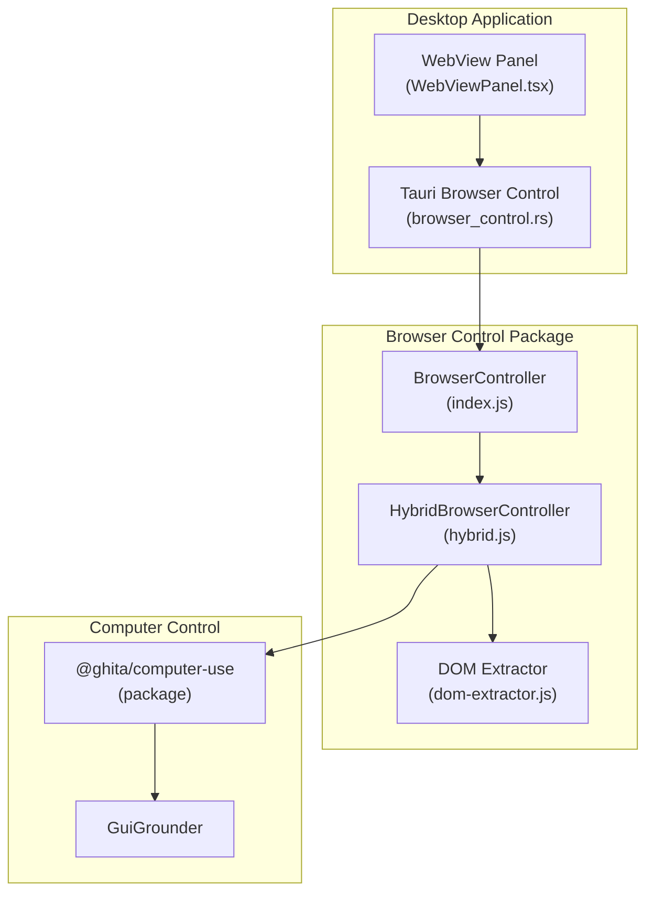
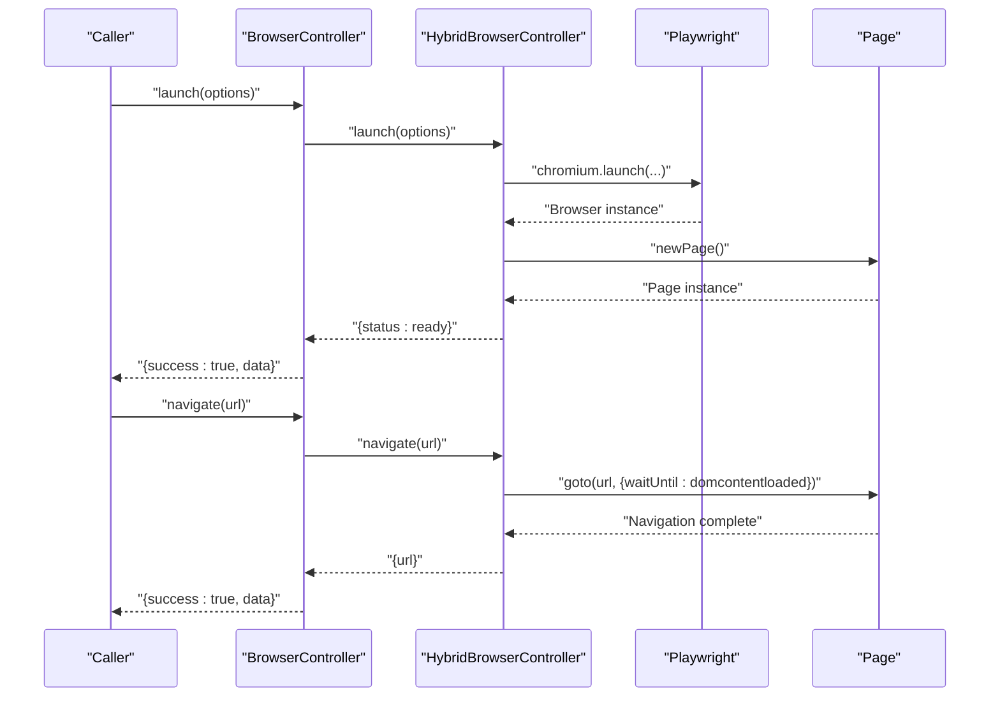
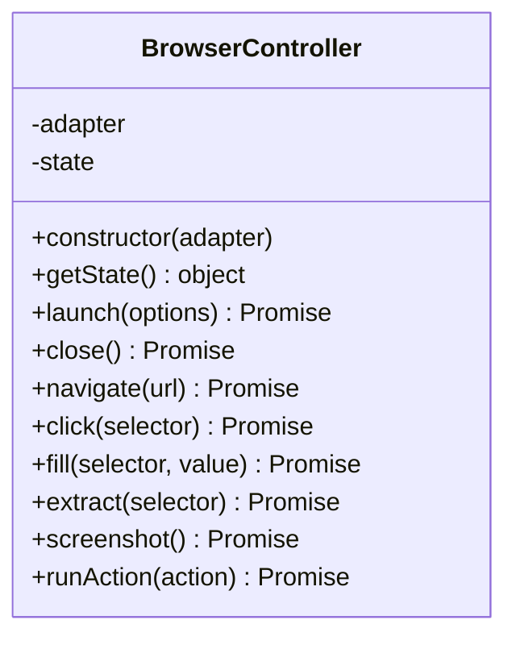
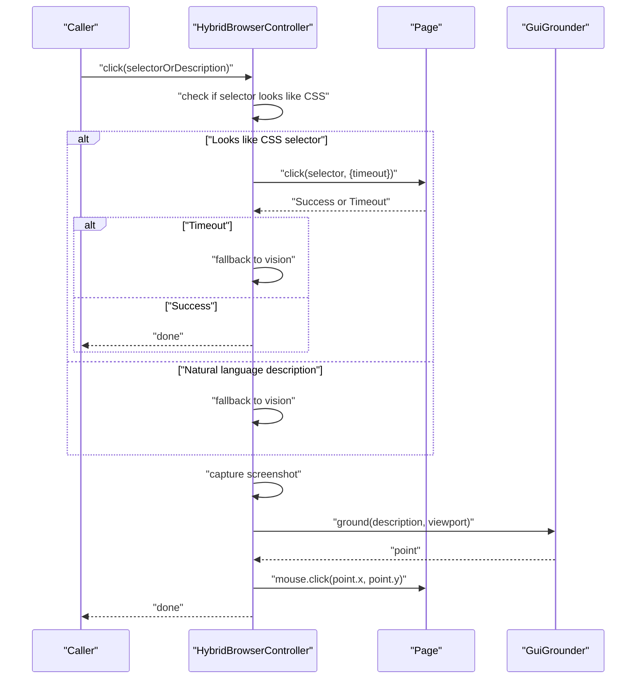
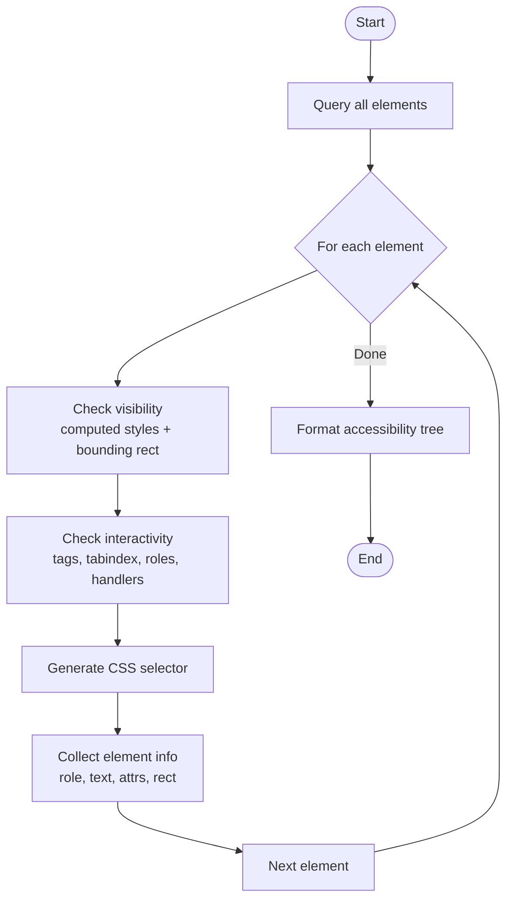
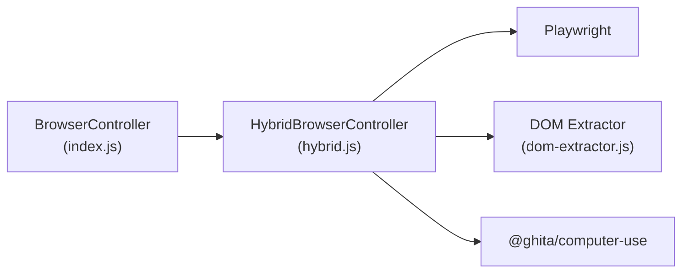
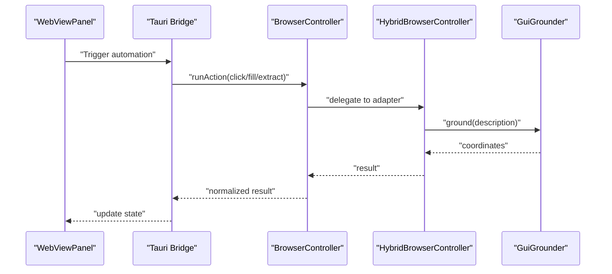

# Browser Control

<cite>
**Referenced Files in This Document**
- [index.js](file://packages/browser-control/dist/index.js)
- [hybrid.js](file://packages/browser-control/dist/hybrid.js)
- [dom-extractor.js](file://packages/browser-control/dist/dom-extractor.js)
- [browser_control.rs](file://apps/desktop/src-tauri/src/browser_control.rs)
- [WebViewPanel.tsx](file://apps/desktop/src/components/WebViewPanel.tsx)
- [computer_use package](file://packages/computer-use/)
</cite>

## Table of Contents
1. [Introduction](#introduction)
2. [Project Structure](#project-structure)
3. [Core Components](#core-components)
4. [Architecture Overview](#architecture-overview)
5. [Detailed Component Analysis](#detailed-component-analysis)
6. [Dependency Analysis](#dependency-analysis)
7. [Performance Considerations](#performance-considerations)
8. [Troubleshooting Guide](#troubleshooting-guide)
9. [Security Considerations](#security-considerations)
10. [Headless Mode Configuration](#headless-mode-configuration)
11. [Integration with Computer Control System](#integration-with-computer-control-system)
12. [Browser Compatibility and Platform Limitations](#browser-compatibility-and-platform-limitations)
13. [Conclusion](#conclusion)

## Introduction
This document describes the browser control system that powers web automation within the GHITA Coding Agent ecosystem. It focuses on the BrowserController implementation, its adapter-based design, and the hybrid Playwright-based adapter that enables cross-browser automation. The system supports navigation, form filling, button clicking, element extraction, screenshots, and accessibility tree generation. It also outlines the integration with the computer control system for combined desktop and web automation, along with security, performance, and troubleshooting considerations.

## Project Structure
The browser control system is primarily implemented in the browser-control package and integrates with the desktop application and computer control subsystems.

**Diagram sources**
- [index.js:15-95](file://packages/browser-control/dist/index.js#L15-L95)
- [hybrid.js:6-144](file://packages/browser-control/dist/hybrid.js#L6-L144)
- [dom-extractor.js:4-186](file://packages/browser-control/dist/dom-extractor.js#L4-L186)
- [browser_control.rs](file://apps/desktop/src-tauri/src/browser_control.rs)
- [WebViewPanel.tsx](file://apps/desktop/src/components/WebViewPanel.tsx)

**Section sources**
- [index.js:1-174](file://packages/browser-control/dist/index.js#L1-L174)
- [hybrid.js:1-145](file://packages/browser-control/dist/hybrid.js#L1-L145)
- [dom-extractor.js:1-187](file://packages/browser-control/dist/dom-extractor.js#L1-L187)

## Core Components
- BrowserController: An adapter-based controller that exposes standardized methods for launching, closing, navigating, clicking, filling, extracting text, and taking screenshots. It delegates actions to an injected adapter and returns normalized results with success/error metadata.
- HybridBrowserController: A Playwright-backed implementation that launches Chromium, navigates pages, clicks/fills via DOM selectors or fallback to vision-based grounding, captures screenshots, and extracts interactive elements and accessibility trees.
- DOM Extractor: A client-side evaluation utility that discovers visible, interactive elements, generates CSS selectors, and formats an accessibility tree for human-readable guidance.

Key capabilities:
- Navigation: Open URLs and wait until content is loaded.
- Interaction: Click buttons/links and fill inputs via CSS selectors or natural language descriptions.
- Extraction: Retrieve page text or a list of interactive elements.
- Screenshot: Capture PNG images and return base64-encoded data with MIME type.
- Accessibility: Build a formatted accessibility tree for element discovery and selection.

**Section sources**
- [index.js:15-95](file://packages/browser-control/dist/index.js#L15-L95)
- [hybrid.js:16-143](file://packages/browser-control/dist/hybrid.js#L16-L143)
- [dom-extractor.js:4-186](file://packages/browser-control/dist/dom-extractor.js#L4-L186)

## Architecture Overview
The system uses an adapter-first design. The BrowserController defines the contract and delegates work to an adapter. The HybridBrowserController is a concrete adapter backed by Playwright, enabling robust cross-browser automation with optional fallback to computer vision for element targeting.

**Diagram sources**
- [index.js:24-52](file://packages/browser-control/dist/index.js#L24-L52)
- [hybrid.js:16-41](file://packages/browser-control/dist/hybrid.js#L16-L41)

## Detailed Component Analysis

### BrowserController
Responsibilities:
- State management: Tracks lifecycle (idle, launching, ready, closed, error).
- Action routing: Delegates runAction to navigate, click, fill, extract, or screenshot.
- Result normalization: Returns consistent {success, data, error, screenshot} structures.

Important behaviors:
- Adapter availability checks: Methods return explicit failures when required adapter methods are missing.
- Error propagation: Captures exceptions during launch/close/navigation and updates state with lastError.
- Fallback handling: fill prefers explicit fill method but falls back to type if fill is unavailable.

**Diagram sources**
- [index.js:15-95](file://packages/browser-control/dist/index.js#L15-L95)

**Section sources**
- [index.js:15-95](file://packages/browser-control/dist/index.js#L15-L95)

### HybridBrowserController
Capabilities:
- Launch/close: Starts/stops a Chromium instance and manages a single page.
- Navigation: Navigates to a URL and waits for content to load.
- Click/Fill: Attempts DOM-based interaction first; if it fails or the input is a natural language description, it captures a screenshot and uses GuiGrounder to ground the description to coordinates, then performs mouse/keyboard actions.
- Screenshot: Captures PNG images and returns base64-encoded data with MIME type.
- Element extraction: Uses DOM extractor to gather interactive elements and formats an accessibility tree.

**Diagram sources**
- [hybrid.js:45-73](file://packages/browser-control/dist/hybrid.js#L45-L73)
- [hybrid.js:77-108](file://packages/browser-control/dist/hybrid.js#L77-L108)

**Section sources**
- [hybrid.js:6-144](file://packages/browser-control/dist/hybrid.js#L6-L144)

### DOM Extractor
Features:
- Discovers visible, interactive elements using computed styles and bounding rectangles.
- Generates CSS selectors with id/class/path fallbacks.
- Builds an accessibility tree with roles, text, placeholders, values, ARIA labels, names, and links.
- Formats a human-readable tree for element selection guidance.

**Diagram sources**
- [dom-extractor.js:4-186](file://packages/browser-control/dist/dom-extractor.js#L4-L186)

**Section sources**
- [dom-extractor.js:4-186](file://packages/browser-control/dist/dom-extractor.js#L4-L186)

## Dependency Analysis
- BrowserController depends on an adapter implementing the required methods (launch, close, navigate, click, fill/type, extractText, screenshot).
- HybridBrowserController depends on Playwright for browser automation and @ghita/computer-use for vision-based grounding.
- DOM Extractor is used by HybridBrowserController to provide element discovery and accessibility tree generation.

**Diagram sources**
- [index.js:15-95](file://packages/browser-control/dist/index.js#L15-L95)
- [hybrid.js:6-144](file://packages/browser-control/dist/hybrid.js#L6-L144)
- [dom-extractor.js:4-186](file://packages/browser-control/dist/dom-extractor.js#L4-L186)

**Section sources**
- [index.js:15-95](file://packages/browser-control/dist/index.js#L15-L95)
- [hybrid.js:6-144](file://packages/browser-control/dist/hybrid.js#L6-L144)
- [dom-extractor.js:4-186](file://packages/browser-control/dist/dom-extractor.js#L4-L186)

## Performance Considerations
- Headless mode: Enabling headless reduces rendering overhead and improves speed but may affect dynamic content timing; adjust wait strategies accordingly.
- Screenshot capture: PNG screenshots are base64-encoded; large pages increase payload size. Consider reducing viewport or capturing specific regions when possible.
- Vision fallback: Using GuiGrounder adds latency due to image processing; reserve for cases where DOM selectors are unreliable.
- Element discovery: Scanning the DOM for interactive elements is efficient but can be costly on very large pages; limit scope to targeted selectors when feasible.

## Troubleshooting Guide
Common issues and resolutions:
- Browser launch failure: Verify adapter availability and Playwright installation. Check for errors returned by the adapter and review state transitions.
- Navigation timeout: Increase wait strategies or ensure the target URL is reachable. Confirm that the page loads expected content.
- Click/fill failures: If DOM selectors fail, use natural language descriptions for vision-based grounding. Ensure the element is visible and not obscured.
- Screenshot errors: Confirm the browser/page is initialized before capturing. Validate viewport size retrieval.
- Accessibility tree empty: On pages with minimal interactive elements or heavy shadow DOM, rely on explicit selectors or vision grounding.

**Section sources**
- [index.js:24-52](file://packages/browser-control/dist/index.js#L24-L52)
- [hybrid.js:38-41](file://packages/browser-control/dist/hybrid.js#L38-L41)
- [hybrid.js:45-73](file://packages/browser-control/dist/hybrid.js#L45-L73)
- [hybrid.js:77-108](file://packages/browser-control/dist/hybrid.js#L77-L108)

## Security Considerations
- Sandboxing: Run browsers in isolated profiles and avoid sharing credentials across sessions. Prefer incognito/private modes when applicable.
- Origin restrictions: Restrict navigation to trusted domains and sanitize inputs for navigation and element selectors to prevent injection.
- Safe browsing practices: Disable unnecessary permissions and extensions. Avoid loading untrusted content that could exploit automation contexts.
- Data handling: Treat captured screenshots and extracted text as sensitive. Apply retention policies and secure storage mechanisms.

## Headless Mode Configuration
- Headless option: Controlled via launch options passed to the adapter. When headless is enabled, rendering occurs without a visible UI, improving performance and stability in automated environments.
- Impact: Faster startup and reduced resource usage; may alter timing-sensitive behaviors. Adjust wait conditions and viewport handling to account for differences in rendering.

**Section sources**
- [hybrid.js:18-21](file://packages/browser-control/dist/hybrid.js#L18-L21)

## Integration with Computer Control System
- Vision grounding: HybridBrowserController leverages GuiGrounder from @ghita/computer-use to translate natural language descriptions into precise coordinates for clicks and fills.
- Combined automation: Desktop actions (mouse/keyboard) complement browser actions, enabling seamless workflows across UI surfaces.
- WebView panel: The desktop application’s WebViewPanel can host browser automation alongside other UI components, coordinating actions through the browser control APIs.

**Diagram sources**
- [WebViewPanel.tsx](file://apps/desktop/src/components/WebViewPanel.tsx)
- [browser_control.rs](file://apps/desktop/src-tauri/src/browser_control.rs)
- [hybrid.js:63-73](file://packages/browser-control/dist/hybrid.js#L63-L73)

**Section sources**
- [hybrid.js:6-144](file://packages/browser-control/dist/hybrid.js#L6-L144)
- [computer_use package](file://packages/computer-use/)

## Browser Compatibility and Platform Limitations
- Chromium-based automation: The hybrid adapter launches Chromium via Playwright, ensuring compatibility with modern web standards and headless operation.
- Cross-browser support: While the current implementation targets Chromium, Playwright supports multiple engines; extending the adapter to other browsers is feasible with appropriate configuration.
- Platform-specific constraints: Some platforms may require additional drivers or configurations for Playwright. Ensure proper environment setup and permissions for automation.

## Conclusion
The browser control system provides a flexible, adapter-based foundation for web automation, with a robust Playwright-backed implementation that supports navigation, interaction, extraction, and screenshot capture. Its integration with the computer control system enables hybrid DOM and vision-based automation, while structured error handling and state management improve reliability. By following security best practices, tuning headless mode, and leveraging accessibility tree generation, teams can build resilient automation workflows across diverse web applications.