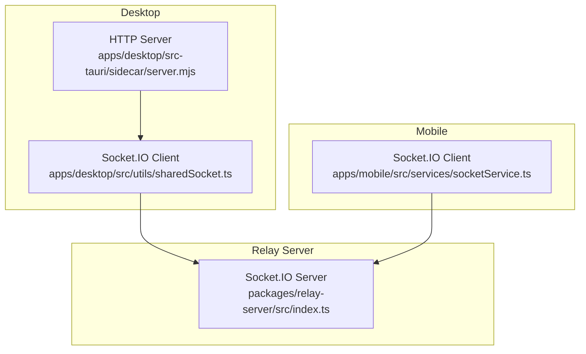
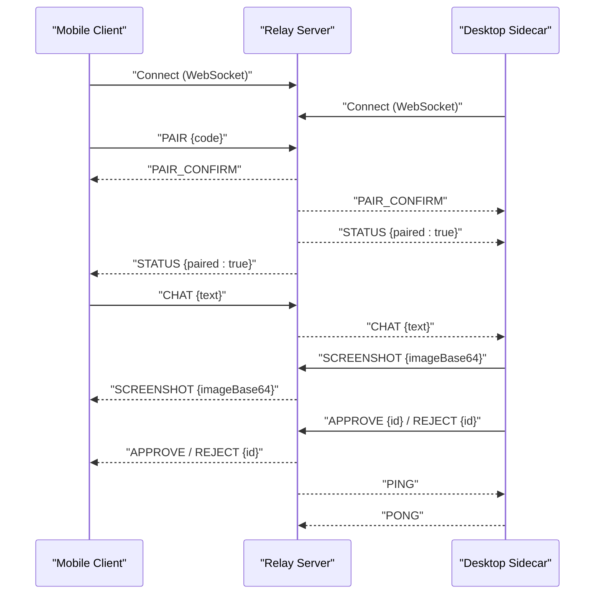
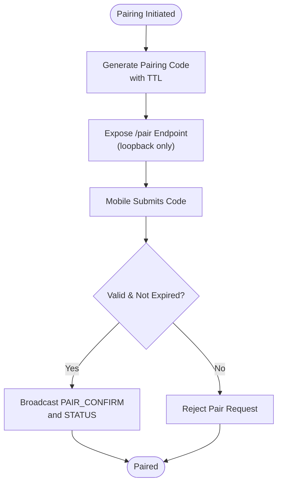
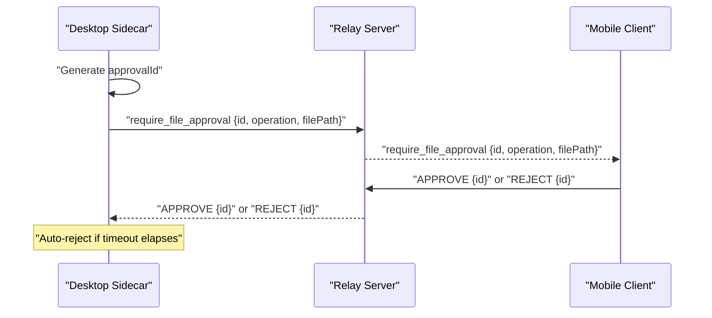
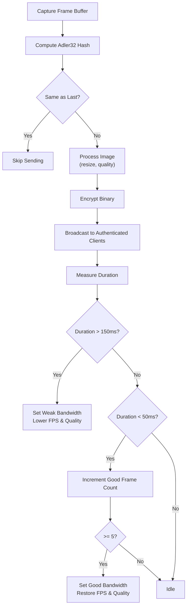
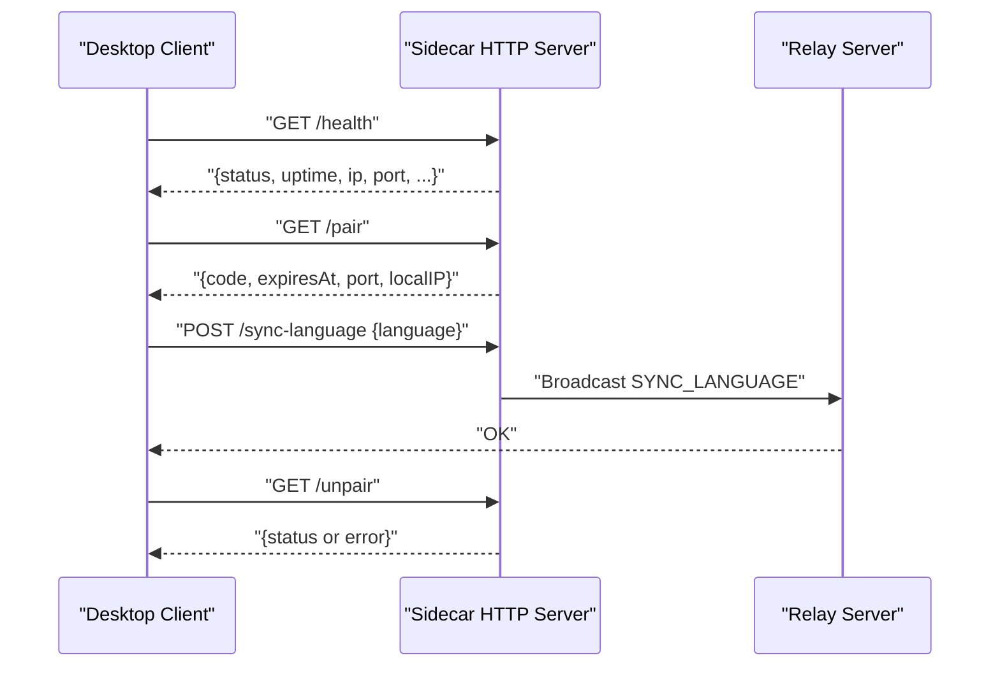
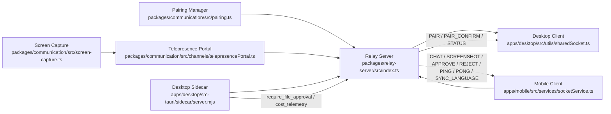

# Communication Protocol

<cite>
**Referenced Files in This Document**
- [SOCKET_EVENTS constants completeness check:840-867](file://tests/e2e/e2e-integration.test.ts#L840-L867)
- [communicationServer.test.ts:33-112](file://tests/unit/communicationServer.test.ts#L33-L112)
- [communicationServer.test.ts:597-635](file://tests/unit/communicationServer.test.ts#L597-L635)
- [relay/index.ts:38-80](file://packages/relay-server/src/index.ts#L38-L80)
- [pairing.ts:1-54](file://packages/communication/src/pairing.ts#L1-L54)
- [telepresencePortal.ts:144-342](file://packages/communication/src/channels/telepresencePortal.ts#L144-L342)
- [telepresenceOptimization.test.ts:80-128](file://packages/communication/tests/telepresenceOptimization.test.ts#L80-L128)
- [screen-capture.ts:1-131](file://packages/communication/src/screen-capture.ts#L1-L131)
- [server.mjs:176-222](file://apps/desktop/src-tauri/sidecar/server.mjs#L176-L222)
- [server.mjs:445-526](file://apps/desktop/src-tauri/sidecar/server.mjs#L445-L526)
- [RemoteControlScreen.tsx:147-193](file://apps/mobile/src/screens/RemoteControlScreen.tsx#L147-L193)
</cite>

## Table of Contents
1. [Introduction](#introduction)
2. [Project Structure](#project-structure)
3. [Core Components](#core-components)
4. [Architecture Overview](#architecture-overview)
5. [Detailed Component Analysis](#detailed-component-analysis)
6. [Dependency Analysis](#dependency-analysis)
7. [Performance Considerations](#performance-considerations)
8. [Troubleshooting Guide](#troubleshooting-guide)
9. [Conclusion](#conclusion)

## Introduction
This document describes the Socket.IO-based communication protocol used across the desktop, mobile, and relay/cloud services. It covers the event-driven architecture, bidirectional messaging, pairing and approval workflows, screen streaming, health endpoints, error handling, and dual transport support. The goal is to provide a comprehensive yet accessible guide for developers integrating or extending the system.

## Project Structure
The communication protocol spans three primary areas:
- Relay server: central Socket.IO server managing pairing, routing, and rate limiting.
- Desktop sidecar: embedded HTTP server exposing health and pairing endpoints; integrates with Socket.IO for approvals and telemetry.
- Mobile client: consumes Socket.IO events and displays UI updates, including approvals and cost telemetry.

**Diagram sources**
- [relay/index.ts:38-80](file://packages/relay-server/src/index.ts#L38-L80)
- [server.mjs:445-526](file://apps/desktop/src-tauri/sidecar/server.mjs#L445-L526)

**Section sources**
- [relay/index.ts:38-80](file://packages/relay-server/src/index.ts#L38-L80)
- [server.mjs:445-526](file://apps/desktop/src-tauri/sidecar/server.mjs#L445-L526)

## Core Components
- Event naming conventions: The system defines a canonical set of Socket.IO event names covering connection lifecycle, pairing, commands, chat, screenshots, approvals, status, errors, pings, screen streaming, unpairing, and language synchronization. See the constants completeness test for the authoritative list and validation of uniqueness.
- Relay server: Implements Socket.IO with WebSocket and HTTP long-polling transports, heartbeat intervals, and a pairing registry mapping pairing codes to device sockets.
- Desktop sidecar: Provides HTTP endpoints for health, pairing, language sync, and unpairing, and bridges approvals and telemetry to the Socket.IO network.
- Telepresence portal: Manages screen streaming with adaptive quality and bandwidth-aware throttling.
- Pairing manager: Generates and validates transient pairing codes with TTL and auto-regeneration.
- Mobile UI: Subscribes to Socket.IO events and reacts to approvals, chat responses, and telemetry.

**Section sources**
- [SOCKET_EVENTS constants completeness check:840-867](file://tests/e2e/e2e-integration.test.ts#L840-L867)
- [relay/index.ts:38-80](file://packages/relay-server/src/index.ts#L38-L80)
- [server.mjs:176-222](file://apps/desktop/src-tauri/sidecar/server.mjs#L176-L222)
- [telepresencePortal.ts:144-342](file://packages/communication/src/channels/telepresencePortal.ts#L144-L342)
- [pairing.ts:1-54](file://packages/communication/src/pairing.ts#L1-L54)
- [RemoteControlScreen.tsx:147-193](file://apps/mobile/src/screens/RemoteControlScreen.tsx#L147-L193)

## Architecture Overview
The system uses a central relay server to manage device pairing and message routing. Desktop and mobile connect via Socket.IO. The desktop also exposes HTTP endpoints for local operations and integrates approvals and telemetry. The relay maintains pairing state and routes messages between paired peers.

**Diagram sources**
- [relay/index.ts:38-80](file://packages/relay-server/src/index.ts#L38-L80)
- [communicationServer.test.ts:597-635](file://tests/unit/communicationServer.test.ts#L597-L635)

## Detailed Component Analysis

### Event-Driven Architecture and Naming Conventions
- Canonical events include: CONNECT, DISCONNECT, PAIR, PAIR_CONFIRM, COMMAND, CHAT, SCREENSHOT, APPROVE, REJECT, STATUS, ERROR, PING, PONG, SCREEN_STREAM, UNPAIR, and SYNC_LANGUAGE. These are validated for existence and uniqueness in tests.
- Bidirectional communication: Events flow from mobile to desktop (e.g., CHAT, COMMAND) and from desktop to mobile (e.g., SCREENSHOT, APPROVE, PONG). Some events are broadcast to paired peers.

**Section sources**
- [SOCKET_EVENTS constants completeness check:840-867](file://tests/e2e/e2e-integration.test.ts#L840-L867)
- [communicationServer.test.ts:597-635](file://tests/unit/communicationServer.test.ts#L597-L635)

### Pairing Protocol
- Pairing code generation: The desktop generates a 6-character code with a TTL (default 5 minutes). Codes auto-regenerate upon expiry.
- Validation: Mobile submits the pairing code; the relay validates against stored code and role metadata.
- Expiration handling: Expired codes are rejected; clients should re-request a new code from the desktop HTTP endpoint.
- Routing: On successful pairing, the relay updates pairing state and broadcasts STATUS to both peers.

**Diagram sources**
- [pairing.ts:1-54](file://packages/communication/src/pairing.ts#L1-L54)
- [server.mjs:466-481](file://apps/desktop/src-tauri/sidecar/server.mjs#L466-L481)
- [relay/index.ts:45-54](file://packages/relay-server/src/index.ts#L45-L54)

**Section sources**
- [pairing.ts:1-54](file://packages/communication/src/pairing.ts#L1-L54)
- [server.mjs:466-481](file://apps/desktop/src-tauri/sidecar/server.mjs#L466-L481)
- [relay/index.ts:45-54](file://packages/relay-server/src/index.ts#L45-L54)

### Approval Workflow for Sensitive Operations
- Approval IDs: The desktop assigns unique approval IDs to operations (e.g., file writes). Pending approvals are tracked with a timeout mechanism.
- Timeout handling: Pending approvals automatically reject after a timeout window.
- Automatic rejection: If the mobile does not respond, the desktop rejects the operation.
- Broadcasting: The desktop broadcasts require_* events to the mobile; approvals/rejections are sent back to the desktop.

**Diagram sources**
- [server.mjs:183-203](file://apps/desktop/src-tauri/sidecar/server.mjs#L183-L203)

**Section sources**
- [server.mjs:183-203](file://apps/desktop/src-tauri/sidecar/server.mjs#L183-L203)

### Screen Streaming Protocol
- Telepresence portal: Streams desktop frames to authenticated mobile clients with adaptive quality and bandwidth-aware throttling.
- Quality settings: Frames are processed and optionally encrypted before broadcast. The portal adjusts FPS and JPEG quality based on observed round-trip time.
- Bandwidth considerations: Static-frame deduplication reduces unnecessary traffic; dynamic throttling switches to lower FPS and quality under latency or weak bandwidth conditions.

**Diagram sources**
- [telepresencePortal.ts:271-309](file://packages/communication/src/channels/telepresencePortal.ts#L271-L309)
- [telepresenceOptimization.test.ts:80-128](file://packages/communication/tests/telepresenceOptimization.test.ts#L80-L128)

**Section sources**
- [telepresencePortal.ts:172-188](file://packages/communication/src/channels/telepresencePortal.ts#L172-L188)
- [telepresencePortal.ts:271-309](file://packages/communication/src/channels/telepresencePortal.ts#L271-L309)
- [telepresenceOptimization.test.ts:80-128](file://packages/communication/tests/telepresenceOptimization.test.ts#L80-L128)

### Health Check Endpoints
- /health: Returns server status, uptime, IP, port, hostname, and optionally pairing code and device list for loopback access.
- /pair: Returns the current pairing code and expiry for loopback access.
- /sync-language: Accepts POST with language payload; broadcasts SYNC_LANGUAGE to clients.
- /unpair: Handles unpairing logic (loopback-restricted).

**Diagram sources**
- [server.mjs:445-526](file://apps/desktop/src-tauri/sidecar/server.mjs#L445-L526)

**Section sources**
- [server.mjs:445-526](file://apps/desktop/src-tauri/sidecar/server.mjs#L445-L526)

### Dual Transport Support and Fallback Mechanisms
- Transports: The relay supports WebSocket and HTTP polling transports, with configured ping intervals and timeouts.
- Fallback: If WebSocket fails, HTTP polling provides connectivity. Clients reconnect automatically on disconnect.

**Section sources**
- [relay/index.ts:38-43](file://packages/relay-server/src/index.ts#L38-L43)

### Error Handling and Recovery
- Rate limiting: The relay tracks per-socket event counts and enforces a rate limit per second to prevent abuse.
- Graceful degradation: Screen capture failures are handled without stopping the stream; approvals time out automatically.
- UI feedback: The mobile app surfaces errors and vibrates to alert users of security-sensitive events.

**Section sources**
- [relay/index.ts:52-69](file://packages/relay-server/src/index.ts#L52-L69)
- [screen-capture.ts:121-131](file://packages/communication/src/screen-capture.ts#L121-L131)
- [RemoteControlScreen.tsx:185-193](file://apps/mobile/src/screens/RemoteControlScreen.tsx#L185-L193)

## Dependency Analysis
The following diagram shows how components depend on each other and exchange events:

**Diagram sources**
- [pairing.ts:1-54](file://packages/communication/src/pairing.ts#L1-L54)
- [telepresencePortal.ts:144-342](file://packages/communication/src/channels/telepresencePortal.ts#L144-L342)
- [screen-capture.ts:1-131](file://packages/communication/src/screen-capture.ts#L1-L131)
- [server.mjs:176-222](file://apps/desktop/src-tauri/sidecar/server.mjs#L176-L222)
- [relay/index.ts:38-80](file://packages/relay-server/src/index.ts#L38-L80)

**Section sources**
- [relay/index.ts:38-80](file://packages/relay-server/src/index.ts#L38-L80)
- [server.mjs:176-222](file://apps/desktop/src-tauri/sidecar/server.mjs#L176-L222)
- [telepresencePortal.ts:144-342](file://packages/communication/src/channels/telepresencePortal.ts#L144-L342)
- [pairing.ts:1-54](file://packages/communication/src/pairing.ts#L1-L54)

## Performance Considerations
- Adaptive streaming: The telepresence portal dynamically adjusts FPS and JPEG quality based on measured latency and good frame counts.
- Static frame deduplication: Prevents redundant transmissions when the screen content has not changed.
- Rate limiting: Protects the relay from overload and ensures fair resource allocation.
- Transport selection: WebSocket with HTTP polling fallback improves resilience and reachability.

[No sources needed since this section provides general guidance]

## Troubleshooting Guide
- Pairing fails: Verify the pairing code is correct and not expired; ensure the /pair endpoint is accessed locally; confirm both devices are connected to the same network.
- Approvals not received: Check that the mobile client receives require_* events and responds within the timeout window; verify broadcast of APPROVE/REJECT from the mobile to the desktop.
- Screen streaming lag: Observe latency measurements; the portal may throttle quality; ensure sufficient bandwidth and reduce external load.
- Health endpoint errors: Confirm loopback access restrictions; verify the sidecar is running and responding to GET /health and POST /sync-language.
- Rate limit exceeded: Reduce event frequency or wait for the next reset window.

**Section sources**
- [relay/index.ts:52-69](file://packages/relay-server/src/index.ts#L52-L69)
- [server.mjs:466-481](file://apps/desktop/src-tauri/sidecar/server.mjs#L466-L481)
- [telepresencePortal.ts:271-309](file://packages/communication/src/channels/telepresencePortal.ts#L271-L309)

## Conclusion
The Socket.IO-based communication protocol provides a robust, event-driven foundation for pairing, secure approvals, real-time chat, and adaptive screen streaming across desktop, mobile, and relay/cloud services. Its dual transport support, built-in rate limiting, and adaptive streaming ensure reliable operation under varying network conditions. The documented endpoints and workflows enable consistent integration and troubleshooting.