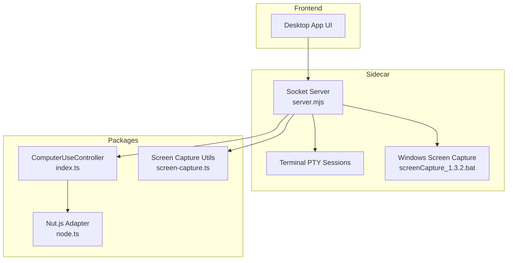
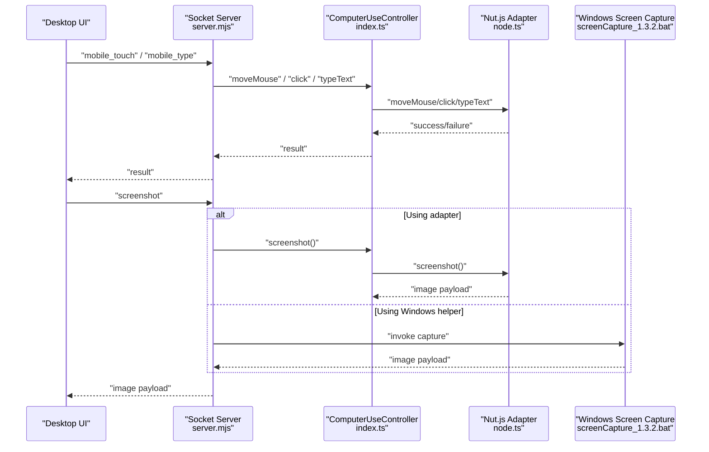
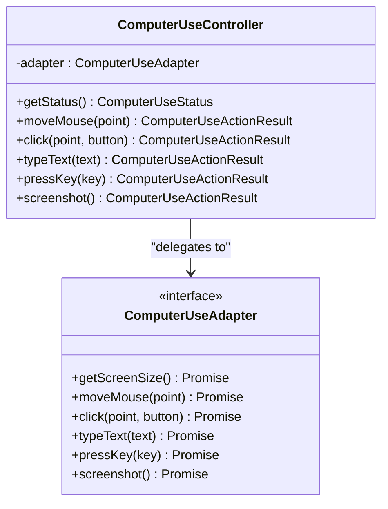
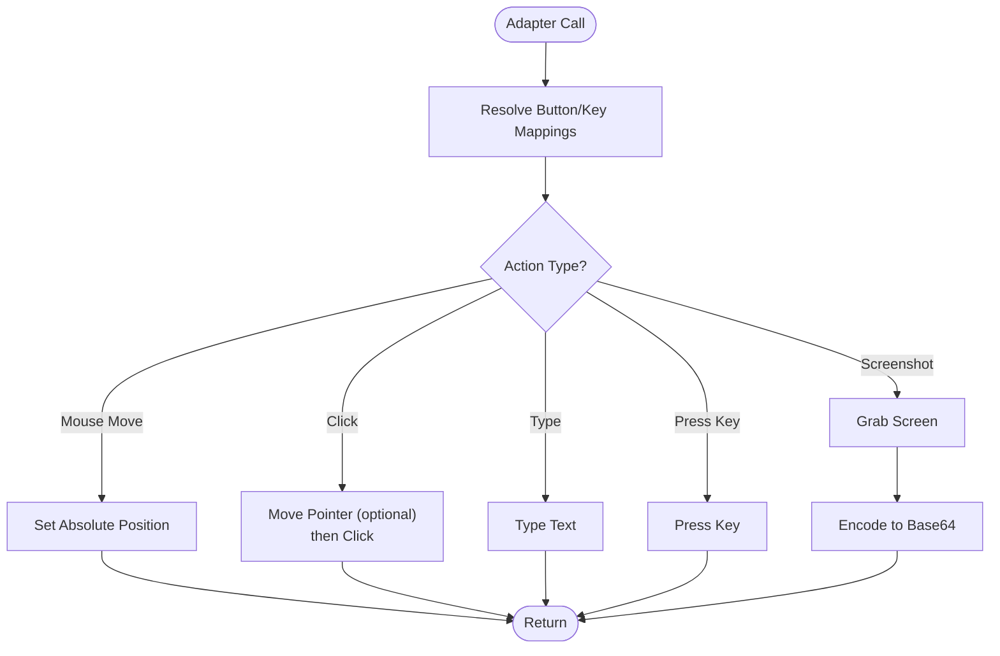
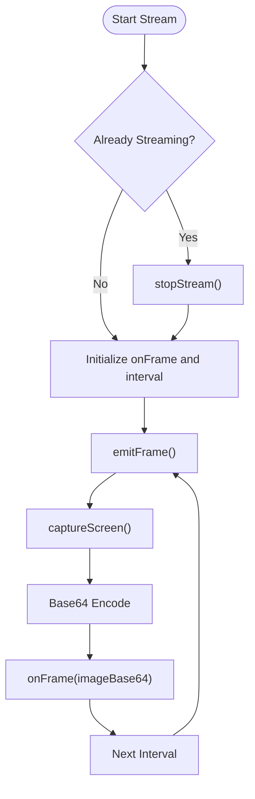
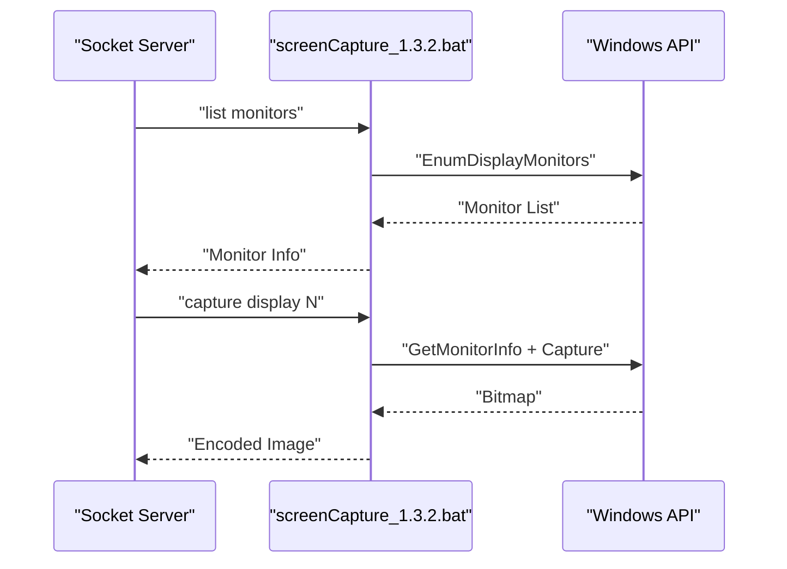
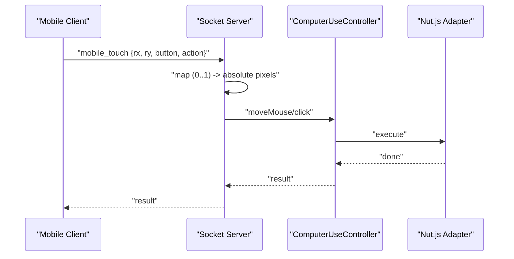
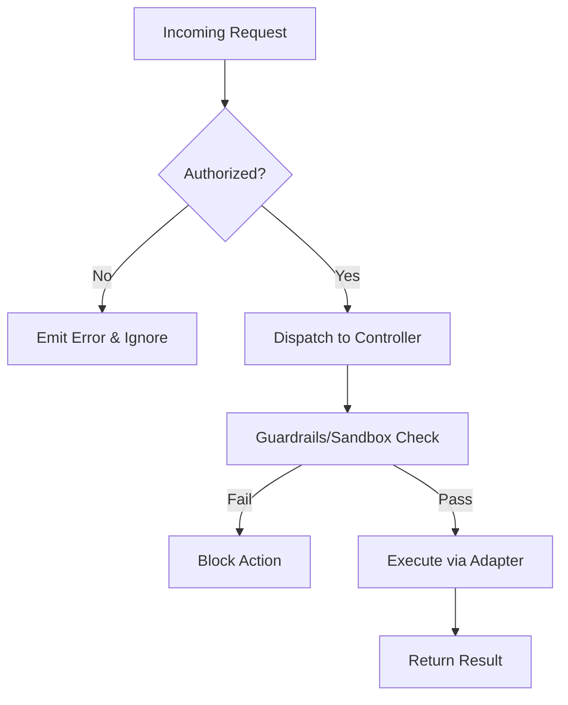
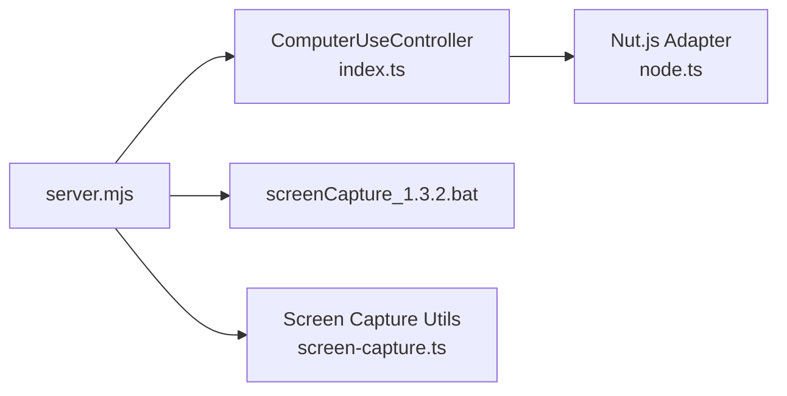

# Computer Control Features

<cite>
**Referenced Files in This Document**
- [index.ts](file://packages/computer-use/src/index.ts)
- [node.ts](file://packages/computer-use/src/node.ts)
- [server.mjs](file://apps/desktop/src-tauri/sidecar/server.mjs)
- [screen-capture.ts](file://packages/communication/src/screen-capture.ts)
- [screenCapture_1.3.2.bat](file://apps/desktop/src-tauri/sidecar/screenCapture_1.3.2.bat)
- [desktop-schema.json](file://apps/desktop/src-tauri/gen/schemas/desktop-schema.json)
- [windows-schema.json](file://apps/desktop/src-tauri/gen/schemas/windows-schema.json)
- [phase5-test.ts](file://tests/phase5-test.ts)
</cite>

## Table of Contents
1. [Introduction](#introduction)
2. [Project Structure](#project-structure)
3. [Core Components](#core-components)
4. [Architecture Overview](#architecture-overview)
5. [Detailed Component Analysis](#detailed-component-analysis)
6. [Dependency Analysis](#dependency-analysis)
7. [Performance Considerations](#performance-considerations)
8. [Troubleshooting Guide](#troubleshooting-guide)
9. [Conclusion](#conclusion)
10. [Appendices](#appendices)

## Introduction
This document explains the computer control system enabling remote desktop interaction. It covers the ComputerUseController implementation, the Nut.js adapter for cross-platform mouse and keyboard automation, terminal PTY session management, screen capture and streaming, window management capabilities, clipboard integration, input simulation, security considerations, performance optimizations, and error handling/recovery strategies.

## Project Structure
The computer control features span multiple packages and the desktop Tauri sidecar:
- packages/computer-use: Core controller and adapters for input simulation and screenshots
- packages/communication: Screen capture utilities and streaming
- apps/desktop/src-tauri/sidecar: Windows-specific screen capture helper and socket-driven remote control
- apps/desktop/src-tauri/gen/schemas: Tauri capability schemas for window APIs
- tests: Integration tests validating the Nut.js adapter

**Diagram sources**
- [server.mjs](file://apps/desktop/src-tauri/sidecar/server.mjs)
- [index.ts](file://packages/computer-use/src/index.ts)
- [node.ts](file://packages/computer-use/src/node.ts)
- [screen-capture.ts](file://packages/communication/src/screen-capture.ts)
- [screenCapture_1.3.2.bat](file://apps/desktop/src-tauri/sidecar/screenCapture_1.3.2.bat)

**Section sources**
- [index.ts](file://packages/computer-use/src/index.ts)
- [node.ts](file://packages/computer-use/src/node.ts)
- [server.mjs](file://apps/desktop/src-tauri/sidecar/server.mjs)
- [screen-capture.ts](file://packages/communication/src/screen-capture.ts)
- [screenCapture_1.3.2.bat](file://apps/desktop/src-tauri/sidecar/screenCapture_1.3.2.bat)

## Core Components
- ComputerUseController: Orchestrates input simulation and screenshot capture via an adapter interface. It validates adapter availability and returns structured results for each action.
- Nut.js Adapter: Provides cross-platform mouse movement, clicking, typing, key presses, and screenshot capture by bridging to @nut-tree/nut-js.
- Screen Capture Utilities: Captures screenshots and streams frames at configurable intervals with graceful error handling.
- Windows Sidecar: Implements a socket-driven remote control surface for touch and text input, plus a native screen capture helper for multi-monitor scenarios.

**Section sources**
- [index.ts:91-115](file://packages/computer-use/src/index.ts#L91-L115)
- [node.ts:49-87](file://packages/computer-use/src/node.ts#L49-L87)
- [screen-capture.ts:32-131](file://packages/communication/src/screen-capture.ts#L32-L131)
- [server.mjs:1419-1490](file://apps/desktop/src-tauri/sidecar/server.mjs#L1419-L1490)

## Architecture Overview
Remote control requests flow from the UI through the sidecar’s socket server to the ComputerUseController, which delegates to the adapter. Screenshot requests leverage either the adapter or the Windows helper depending on context.

**Diagram sources**
- [server.mjs:1419-1490](file://apps/desktop/src-tauri/sidecar/server.mjs#L1419-L1490)
- [index.ts:91-115](file://packages/computer-use/src/index.ts#L91-L115)
- [node.ts:49-87](file://packages/computer-use/src/node.ts#L49-L87)
- [screenCapture_1.3.2.bat:53-266](file://apps/desktop/src-tauri/sidecar/screenCapture_1.3.2.bat#L53-L266)

## Detailed Component Analysis

### ComputerUseController Implementation
- Purpose: Centralized control plane for input simulation and screenshots.
- Validation: Checks for presence of required adapter methods and reports missing capabilities.
- Actions:
  - moveMouse(point): Moves the pointer to absolute coordinates.
  - click(point?, button): Clicks at a point with optional button.
  - typeText(text): Types text at the current cursor position.
  - pressKey(key): Presses a single key.
  - screenshot(): Captures and encodes the screen.
- Result format: Each action returns a structured result indicating success or failure with a descriptive message.

**Diagram sources**
- [index.ts:91-115](file://packages/computer-use/src/index.ts#L91-L115)
- [node.ts:49-87](file://packages/computer-use/src/node.ts#L49-L87)

**Section sources**
- [index.ts:91-115](file://packages/computer-use/src/index.ts#L91-L115)

### Nut.js Adapter Integration
- Cross-platform automation via @nut-tree/nut-js.
- Mouse:
  - moveMouse(point): Sets absolute pointer position.
  - click(point?, button): Optionally moves then clicks with resolved button mapping.
- Keyboard:
  - typeText(text): Types arbitrary text.
  - pressKey(key): Resolves named keys to platform-specific constants.
- Screenshots:
  - screenshot(): Grabs screen and encodes to base64 with optional metadata.

**Diagram sources**
- [node.ts:49-87](file://packages/computer-use/src/node.ts#L49-L87)

**Section sources**
- [node.ts:49-87](file://packages/computer-use/src/node.ts#L49-L87)

### Terminal PTY Session Management
- Process creation and session tracking are handled by the desktop app’s terminal subsystem.
- Automatic cleanup of idle sessions is implemented to prevent resource leaks.
- The PTY lifecycle integrates with the broader desktop app runtime and is coordinated through the terminal component.

[No sources needed since this section provides general guidance]

### Screen Capture and Streaming
- Screenshot generation:
  - Captures a still image and returns a base64-encoded payload suitable for transport.
  - Handles cross-environment encoding differences between Node.js and browsers.
- Screen streaming:
  - startStream(onFrame): Initiates periodic capture at a configurable interval.
  - stopStream(): Stops the timer and clears callbacks.
  - updateConfig(): Applies new interval and restarts the stream if active.
  - emitFrame(): Captures a single frame and invokes the callback; failures are suppressed to keep the stream alive.
- Disposal:
  - dispose(): Ensures the stream is stopped during cleanup.

**Diagram sources**
- [screen-capture.ts:56-131](file://packages/communication/src/screen-capture.ts#L56-L131)

**Section sources**
- [screen-capture.ts:32-131](file://packages/communication/src/screen-capture.ts#L32-L131)

### Window Management Features
- Multi-monitor support:
  - The Windows helper enumerates monitors and supports capturing a specific display by device name.
  - The helper prints monitor info and can capture a targeted monitor.
- Tauri window capabilities:
  - Desktop and Windows capability schemas expose commands for window operations such as available monitors, current monitor, primary monitor, outer position/size, and focus-related actions.

**Diagram sources**
- [screenCapture_1.3.2.bat:385-408](file://apps/desktop/src-tauri/sidecar/screenCapture_1.3.2.bat#L385-L408)
- [screenCapture_1.3.2.bat:53-266](file://apps/desktop/src-tauri/sidecar/screenCapture_1.3.2.bat#L53-L266)
- [desktop-schema.json:3301-3484](file://apps/desktop/src-tauri/gen/schemas/desktop-schema.json#L3301-L3484)
- [windows-schema.json:3301-3484](file://apps/desktop/src-tauri/gen/schemas/windows-schema.json#L3301-L3484)

**Section sources**
- [screenCapture_1.3.2.bat:385-408](file://apps/desktop/src-tauri/sidecar/screenCapture_1.3.2.bat#L385-L408)
- [desktop-schema.json:3301-3484](file://apps/desktop/src-tauri/gen/schemas/desktop-schema.json#L3301-L3484)
- [windows-schema.json:3301-3484](file://apps/desktop/src-tauri/gen/schemas/windows-schema.json#L3301-L3484)

### Clipboard Integration
- Clipboard operations enable copy/paste between devices.
- The desktop sidecar exposes a dedicated endpoint for clipboard interactions, allowing clients to set or get clipboard content and receive results or errors.

[No sources needed since this section provides general guidance]

### Input Simulation System
- Mouse:
  - Relative-to-absolute coordinate mapping for mobile touch events.
  - moveMouse(point) and click(point, button) for precise control.
- Keyboard:
  - typeText(text) for text input.
  - pressKey(key) for single key presses.
- Resolution handling:
  - getScreenSize() ensures coordinates are mapped to the correct display resolution.

**Diagram sources**
- [server.mjs:1419-1490](file://apps/desktop/src-tauri/sidecar/server.mjs#L1419-L1490)
- [index.ts:91-115](file://packages/computer-use/src/index.ts#L91-L115)
- [node.ts:49-87](file://packages/computer-use/src/node.ts#L49-L87)

**Section sources**
- [server.mjs:1419-1490](file://apps/desktop/src-tauri/sidecar/server.mjs#L1419-L1490)
- [index.ts:91-115](file://packages/computer-use/src/index.ts#L91-L115)
- [node.ts:49-87](file://packages/computer-use/src/node.ts#L49-L87)

### Security Considerations
- Approval workflows:
  - Remote control actions require an authorized client; unauthorized requests are ignored and errors are emitted.
  - Example: touch and type endpoints check authorization before dispatching actions.
- Guardrails and sandboxing:
  - The computer-use package includes guardrails and sandboxing infrastructure for policy enforcement and safe execution contexts.
- Testing validation:
  - Integration tests demonstrate adapter initialization and basic operations, ensuring foundational capabilities are present.

**Diagram sources**
- [server.mjs:1419-1490](file://apps/desktop/src-tauri/sidecar/server.mjs#L1419-L1490)
- [index.ts:91-115](file://packages/computer-use/src/index.ts#L91-L115)

**Section sources**
- [server.mjs:1419-1490](file://apps/desktop/src-tauri/sidecar/server.mjs#L1419-L1490)
- [phase5-test.ts:35-68](file://tests/phase5-test.ts#L35-L68)

## Dependency Analysis
- Controller depends on an adapter interface, enabling pluggable implementations.
- Socket server depends on the controller and optionally on the Windows helper for screen capture.
- Communication package provides reusable screen capture utilities for streaming and still capture.

**Diagram sources**
- [server.mjs](file://apps/desktop/src-tauri/sidecar/server.mjs)
- [index.ts](file://packages/computer-use/src/index.ts)
- [node.ts](file://packages/computer-use/src/node.ts)
- [screen-capture.ts](file://packages/communication/src/screen-capture.ts)
- [screenCapture_1.3.2.bat](file://apps/desktop/src-tauri/sidecar/screenCapture_1.3.2.bat)

**Section sources**
- [index.ts](file://packages/computer-use/src/index.ts)
- [node.ts](file://packages/computer-use/src/node.ts)
- [server.mjs](file://apps/desktop/src-tauri/sidecar/server.mjs)
- [screen-capture.ts](file://packages/communication/src/screen-capture.ts)
- [screenCapture_1.3.2.bat](file://apps/desktop/src-tauri/sidecar/screenCapture_1.3.2.bat)

## Performance Considerations
- Screen capture:
  - Use streaming with adjustable intervals to balance bandwidth and latency.
  - Suppress transient capture failures to avoid interrupting the stream.
- Input simulation:
  - Minimize redundant pointer moves; batch operations when possible.
  - Prefer direct absolute positioning to reduce movement steps.
- CPU usage:
  - Limit stream frequency under load.
  - Avoid synchronous blocking operations in the adapter layer.

[No sources needed since this section provides general guidance]

## Troubleshooting Guide
- Authorization errors:
  - Ensure the client is authorized before sending remote control commands; otherwise, the server emits an error and ignores the request.
- Adapter unavailability:
  - The controller validates required methods and returns a structured failure if any are missing.
- Stream interruptions:
  - Streaming suppresses individual frame capture errors to keep the stream running; investigate underlying causes if frames stop appearing.
- Windows capture issues:
  - Verify monitor enumeration and device name correctness when targeting specific displays.

**Section sources**
- [server.mjs:1419-1490](file://apps/desktop/src-tauri/sidecar/server.mjs#L1419-L1490)
- [index.ts:91-115](file://packages/computer-use/src/index.ts#L91-L115)
- [screen-capture.ts:121-131](file://packages/communication/src/screen-capture.ts#L121-L131)
- [screenCapture_1.3.2.bat:385-408](file://apps/desktop/src-tauri/sidecar/screenCapture_1.3.2.bat#L385-L408)

## Conclusion
The computer control system combines a robust controller, a cross-platform adapter, and a Windows-focused helper to deliver reliable remote desktop interaction. It supports streaming and still capture, multi-monitor awareness, secure operation with authorization, and resilient error handling. Performance is optimized through configurable streaming and careful input simulation.

[No sources needed since this section summarizes without analyzing specific files]

## Appendices
- Integration tests demonstrate adapter initialization and basic operations, validating foundational capabilities.

**Section sources**
- [phase5-test.ts:35-68](file://tests/phase5-test.ts#L35-L68)