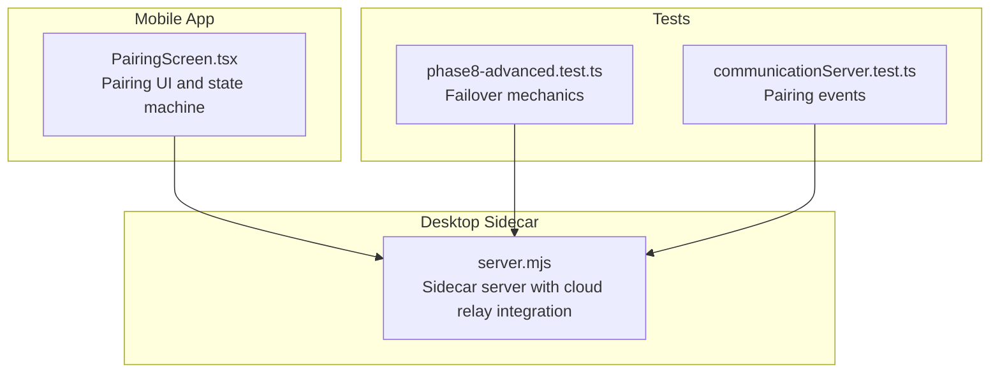
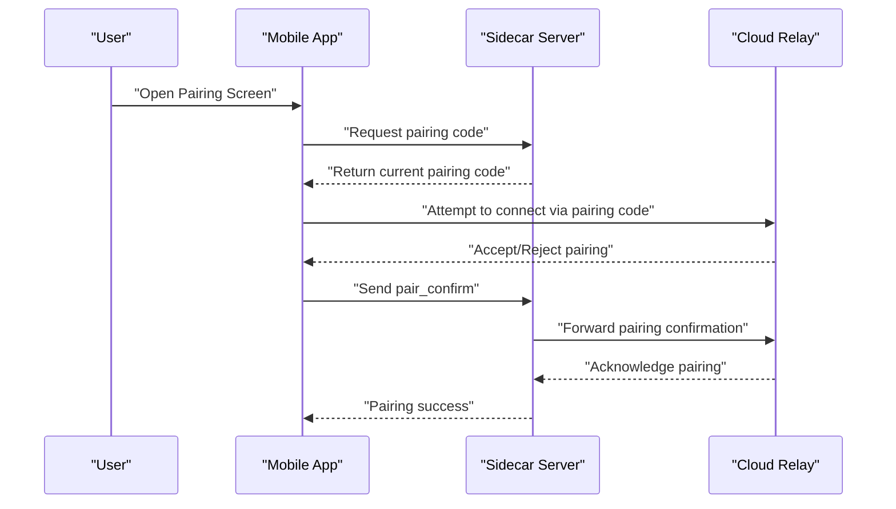
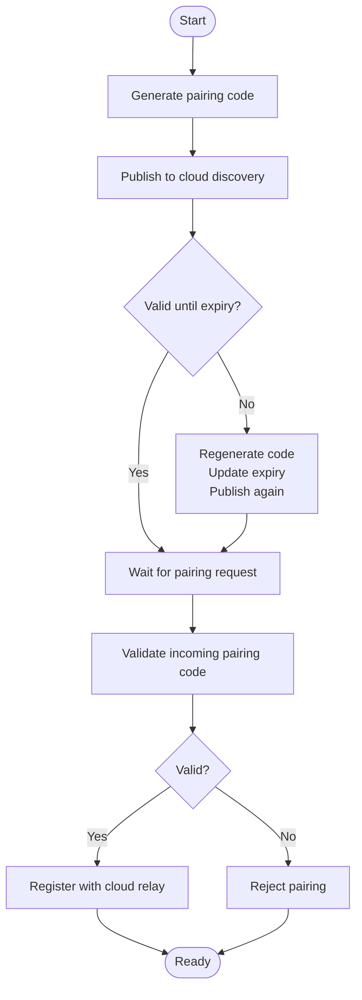
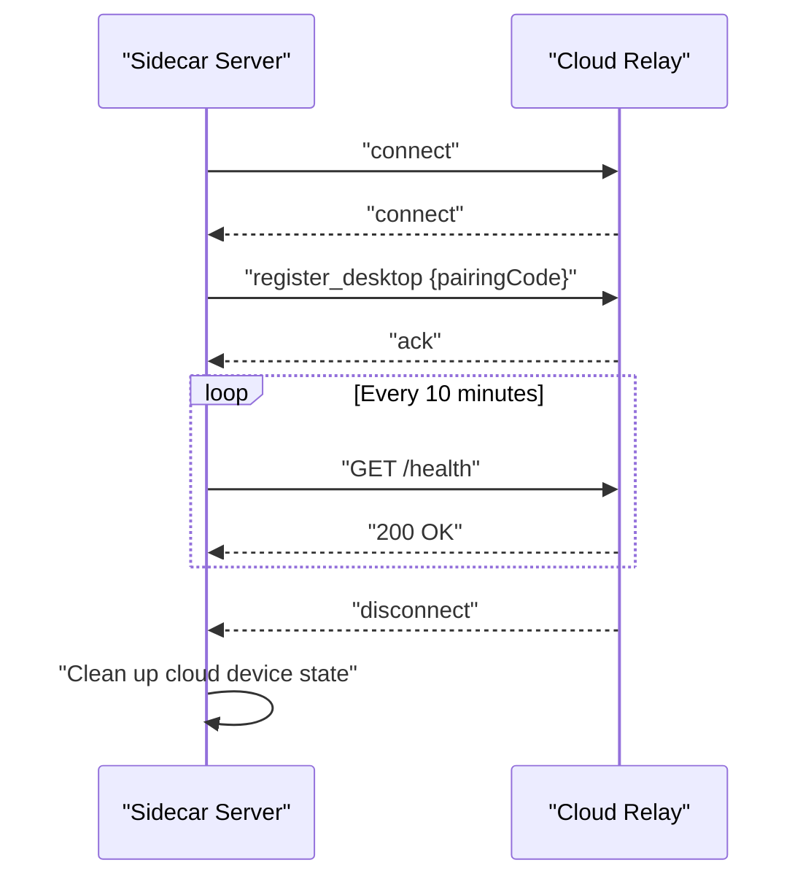
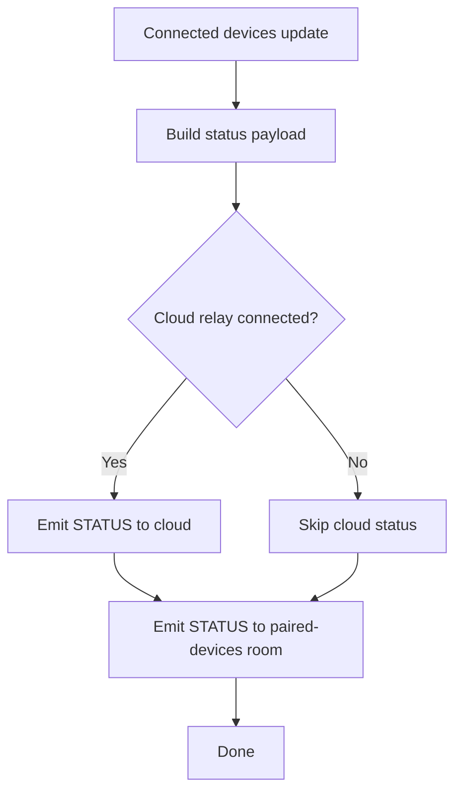
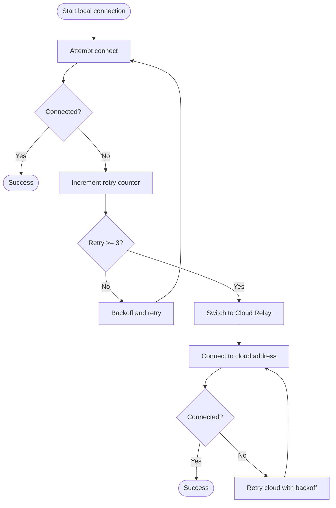
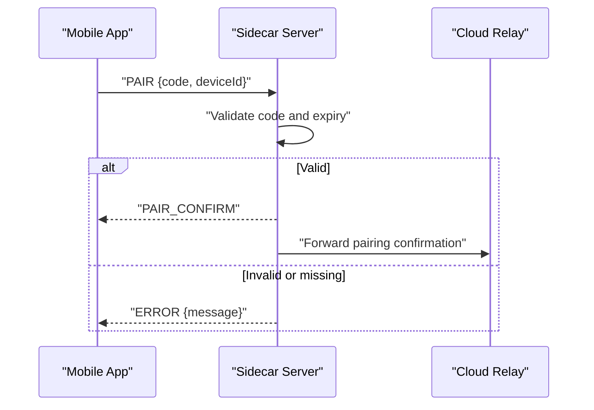
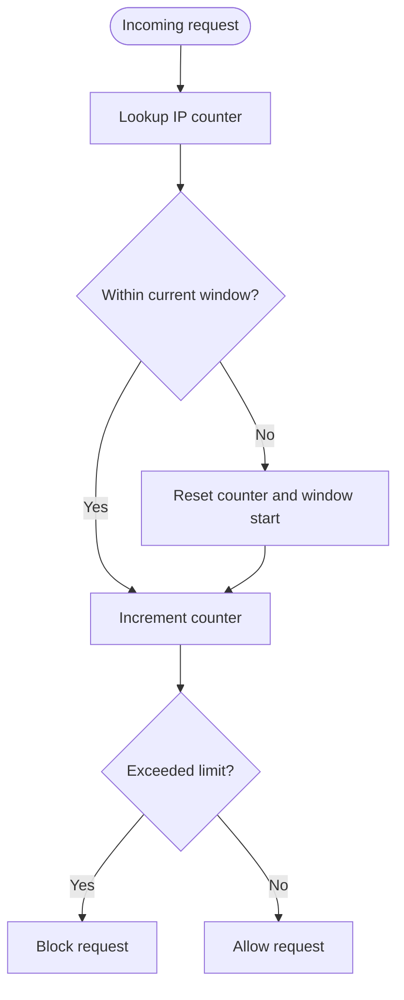
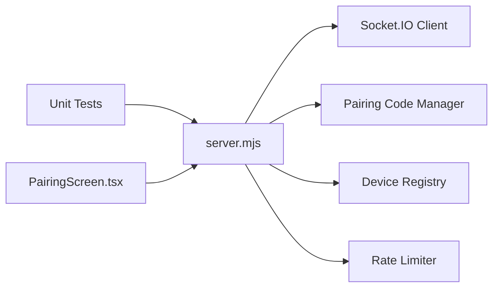

# Relay Server

<cite>
**Referenced Files in This Document**
- [server.mjs](file://apps/desktop/src-tauri/sidecar/server.mjs)
- [phase8-advanced.test.ts](file://tests/unit/phase8-advanced.test.ts)
- [communicationServer.test.ts](file://tests/unit/communicationServer.test.ts)
- [PairingScreen.tsx](file://apps/mobile/src/screens/PairingScreen.tsx)
</cite>

## Table of Contents
1. [Introduction](#introduction)
2. [Project Structure](#project-structure)
3. [Core Components](#core-components)
4. [Architecture Overview](#architecture-overview)
5. [Detailed Component Analysis](#detailed-component-analysis)
6. [Dependency Analysis](#dependency-analysis)
7. [Performance Considerations](#performance-considerations)
8. [Troubleshooting Guide](#troubleshooting-guide)
9. [Conclusion](#conclusion)
10. [Appendices](#appendices)

## Introduction
This document describes the relay server implementation that enables cloud connectivity and connection management for remote device pairing and communication. It covers:
- Cloud discovery via pairing code publishing and device registration
- Network broadcasting and fallback mechanisms
- Connection establishment and routing between devices behind NAT/firewalls
- Load balancing and connection pooling strategies
- Security measures for cloud communications
- Health monitoring and automatic reconnection
- Configuration options and integration with the main sidecar server

## Project Structure
The relay-related functionality is primarily implemented in the desktop sidecar server script and complemented by tests and UI components that exercise pairing and failover logic.

**Diagram sources**
- [server.mjs](file://apps/desktop/src-tauri/sidecar/server.mjs)
- [PairingScreen.tsx](file://apps/mobile/src/screens/PairingScreen.tsx)
- [phase8-advanced.test.ts](file://tests/unit/phase8-advanced.test.ts)
- [communicationServer.test.ts](file://tests/unit/communicationServer.test.ts)

**Section sources**
- [server.mjs](file://apps/desktop/src-tauri/sidecar/server.mjs)
- [PairingScreen.tsx](file://apps/mobile/src/screens/PairingScreen.tsx)
- [phase8-advanced.test.ts](file://tests/unit/phase8-advanced.test.ts)
- [communicationServer.test.ts](file://tests/unit/communicationServer.test.ts)

## Core Components
- Cloud discovery and pairing:
  - Pairing code generation, expiration, and publishing to the cloud discovery service
  - Validation of pairing codes and regeneration on expiry
- Cloud relay connection:
  - Initialization of the Socket.IO client against the configured cloud relay URL
  - Registration of the pairing code with the cloud relay upon successful connection
  - Keep-alive pings to prevent idle timeouts
- Local device management:
  - Tracking connected devices and emitting status updates to paired devices and the cloud
  - Finding special cloud relay device entries
- Fallback and failover:
  - Transition from local to cloud relay after repeated connection failures
- Rate limiting:
  - Per-IP request limiting for discovery endpoints

**Section sources**
- [server.mjs](file://apps/desktop/src-tauri/sidecar/server.mjs)

## Architecture Overview
The system integrates a local sidecar server with a cloud relay to enable secure, NAT-friendly device pairing and communication. The desktop sidecar manages local devices, publishes pairing codes to the cloud, and maintains a persistent connection to the cloud relay. Mobile clients use the pairing code to establish a controlled connection path through the cloud relay.

**Diagram sources**
- [server.mjs](file://apps/desktop/src-tauri/sidecar/server.mjs)
- [PairingScreen.tsx](file://apps/mobile/src/screens/PairingScreen.tsx)
- [communicationServer.test.ts](file://tests/unit/communicationServer.test.ts)

## Detailed Component Analysis

### Cloud Discovery and Pairing System
- Pairing code lifecycle:
  - Generation with expiration and periodic regeneration
  - Publishing to cloud discovery when code changes or expires
  - Validation logic checks expiry and uppercase equality
- Cloud registration:
  - On successful cloud relay connection, the current pairing code is registered
- Broadcasting:
  - Status updates are emitted to a dedicated room for paired devices
  - When cloud relay is connected, status is also sent to the cloud

**Diagram sources**
- [server.mjs](file://apps/desktop/src-tauri/sidecar/server.mjs)

**Section sources**
- [server.mjs](file://apps/desktop/src-tauri/sidecar/server.mjs)

### Cloud Relay Connection Management
- Initialization:
  - Socket.IO client configured with WebSocket transport, reconnection, and timeout settings
- Events:
  - Connect: registers the pairing code with the cloud relay
  - Disconnect: cleans up cloud device state and emits disconnect event
- Keep-alive:
  - Periodic self-ping to the cloud relay health endpoint to avoid idle termination

**Diagram sources**
- [server.mjs](file://apps/desktop/src-tauri/sidecar/server.mjs)

**Section sources**
- [server.mjs](file://apps/desktop/src-tauri/sidecar/server.mjs)

### Local Device Management and Status Broadcasting
- Device tracking:
  - Maintains a collection of connected devices
  - Supports lookup by socket ID and identification of the cloud relay device
- Status reporting:
  - Aggregates device counts and details
  - Emits status to the paired devices room
  - Emits status to the cloud relay when connected

**Diagram sources**
- [server.mjs](file://apps/desktop/src-tauri/sidecar/server.mjs)

**Section sources**
- [server.mjs](file://apps/desktop/src-tauri/sidecar/server.mjs)

### Fallback Mechanisms: Local to Cloud Relay
- The client-side state machine transitions from local to cloud relay after repeated connection failures
- Threshold: three failed local connection attempts triggers the switch
- Action: reconnect to the configured cloud relay address

**Diagram sources**
- [phase8-advanced.test.ts](file://tests/unit/phase8-advanced.test.ts)

**Section sources**
- [phase8-advanced.test.ts](file://tests/unit/phase8-advanced.test.ts)

### Pairing Flow and Event Handling
- The pairing flow validates presence of required fields and checks code validity
- Successful pairing emits confirmation and proceeds with registration

**Diagram sources**
- [communicationServer.test.ts](file://tests/unit/communicationServer.test.ts)
- [server.mjs](file://apps/desktop/src-tauri/sidecar/server.mjs)

**Section sources**
- [communicationServer.test.ts](file://tests/unit/communicationServer.test.ts)
- [server.mjs](file://apps/desktop/src-tauri/sidecar/server.mjs)

### Rate Limiting for Discovery Requests
- Per-IP sliding window rate limiting
- Automatic cleanup of stale counters

**Diagram sources**
- [server.mjs](file://apps/desktop/src-tauri/sidecar/server.mjs)

**Section sources**
- [server.mjs](file://apps/desktop/src-tauri/sidecar/server.mjs)

## Dependency Analysis
- The desktop sidecar depends on:
  - Socket.IO client for cloud relay connectivity
  - Local device registry and status broadcasting
  - Pairing code generation and validation
  - Rate limiting for discovery endpoints
- Tests validate:
  - Pairing event handling and error conditions
  - Failover behavior from local to cloud relay

**Diagram sources**
- [server.mjs](file://apps/desktop/src-tauri/sidecar/server.mjs)
- [phase8-advanced.test.ts](file://tests/unit/phase8-advanced.test.ts)
- [communicationServer.test.ts](file://tests/unit/communicationServer.test.ts)
- [PairingScreen.tsx](file://apps/mobile/src/screens/PairingScreen.tsx)

**Section sources**
- [server.mjs](file://apps/desktop/src-tauri/sidecar/server.mjs)
- [phase8-advanced.test.ts](file://tests/unit/phase8-advanced.test.ts)
- [communicationServer.test.ts](file://tests/unit/communicationServer.test.ts)
- [PairingScreen.tsx](file://apps/mobile/src/screens/PairingScreen.tsx)

## Performance Considerations
- Keep-alive pings reduce idle disconnections during low traffic periods
- Reconnection backoff prevents thundering herd on cloud relay
- Sliding window rate limiting protects discovery endpoints from abuse
- Status broadcasting is scoped to rooms to minimize unnecessary emissions

## Troubleshooting Guide
- Cloud relay unreachable:
  - Verify the configured cloud relay URL and network access
  - Confirm reconnection attempts and backoff behavior
  - Check keep-alive pings and logs for intermittent failures
- Pairing failures:
  - Ensure pairing code is valid and not expired
  - Confirm that the pairing code matches the expected uppercase value
  - Validate that the cloud relay is registered with the current pairing code
- Device status not updating:
  - Confirm that the paired devices room exists and receives status broadcasts
  - Verify that the cloud socket is connected before sending cloud status

**Section sources**
- [server.mjs](file://apps/desktop/src-tauri/sidecar/server.mjs)
- [communicationServer.test.ts](file://tests/unit/communicationServer.test.ts)

## Conclusion
The relay server implementation provides a robust cloud-based pairing and routing mechanism that enables devices behind NAT/firewalls to discover and communicate securely. It includes discovery, registration, status broadcasting, fallback to cloud relay, and operational safeguards such as rate limiting and keep-alive pings. Integration with the sidecar server ensures seamless transitions between local and cloud communication modes.

## Appendices

### Configuration Options
- Cloud relay URL and transport settings
- Pairing code TTL and regeneration behavior
- Rate limit thresholds and window durations
- Keep-alive ping interval and health endpoint

**Section sources**
- [server.mjs](file://apps/desktop/src-tauri/sidecar/server.mjs)