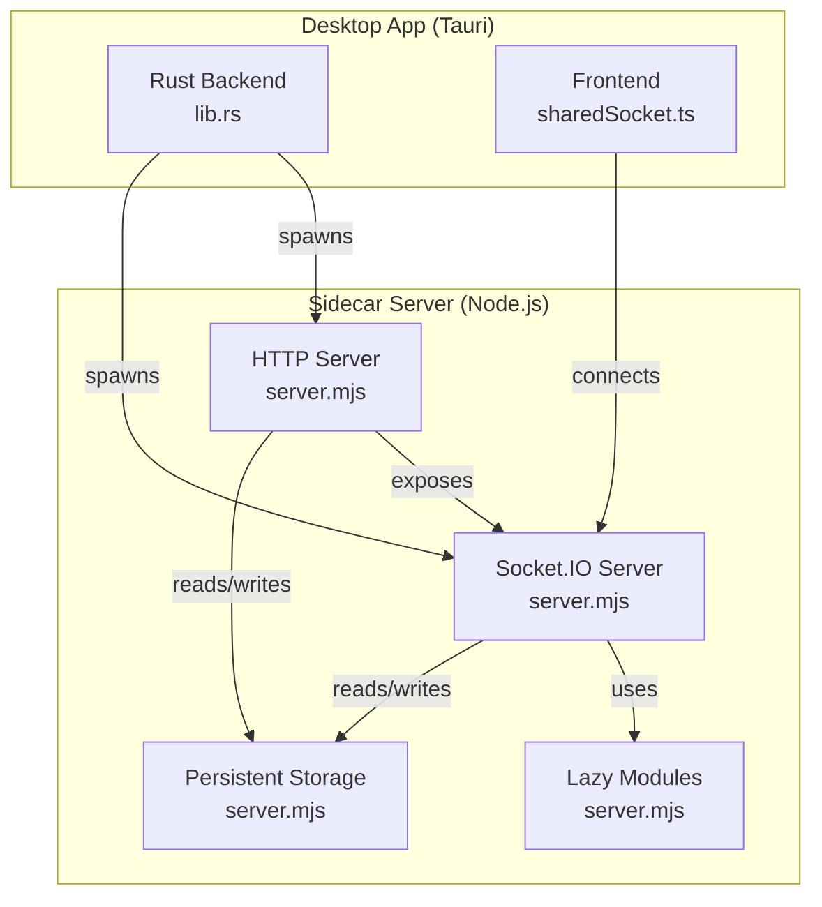
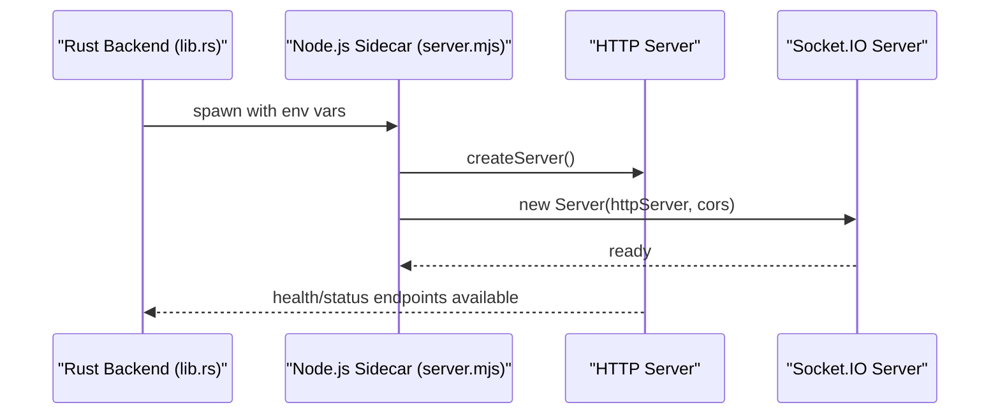
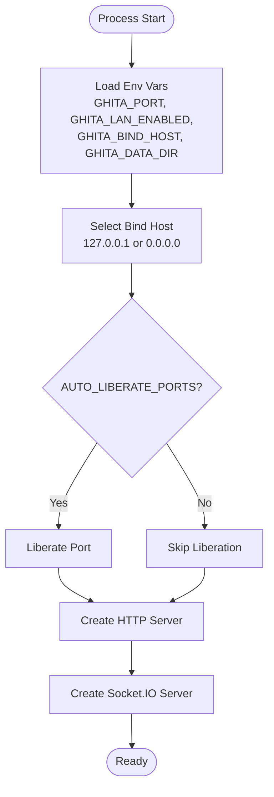
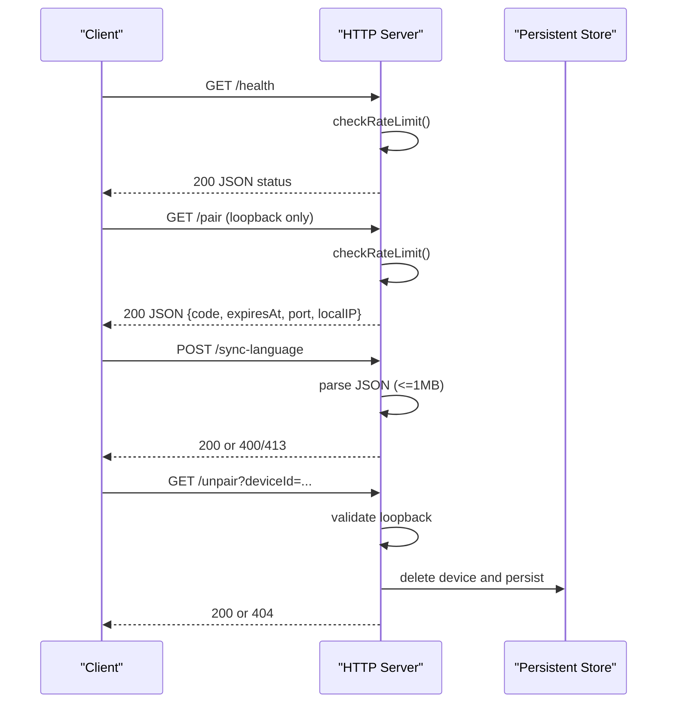
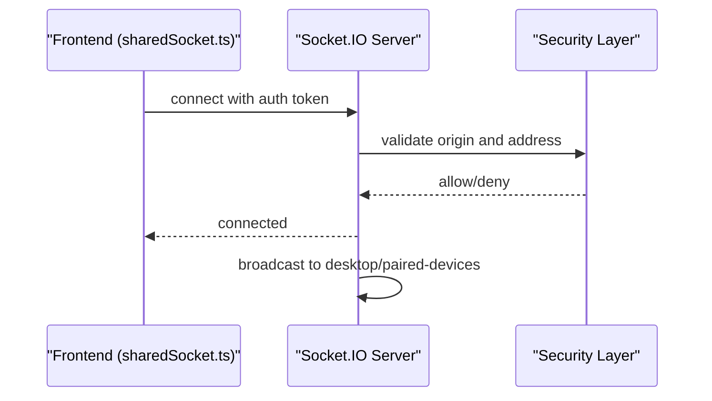
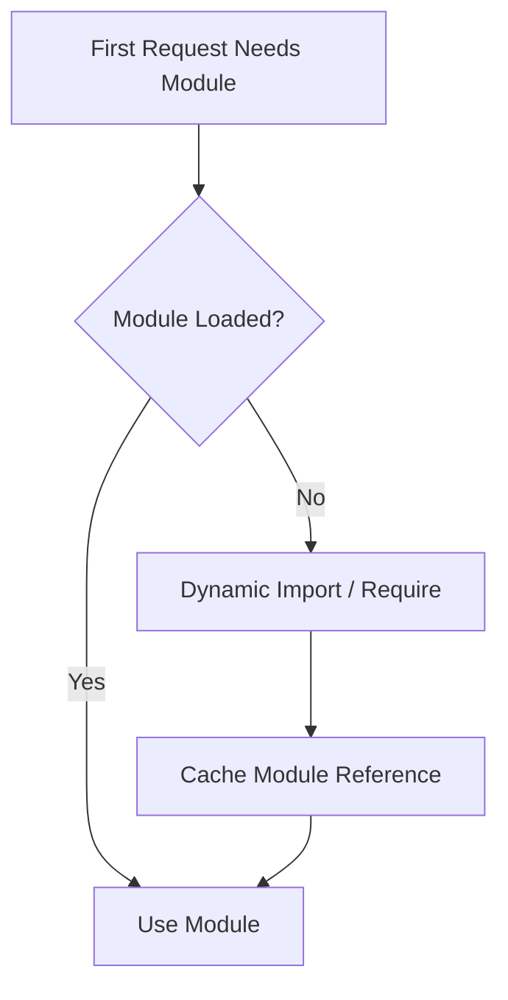
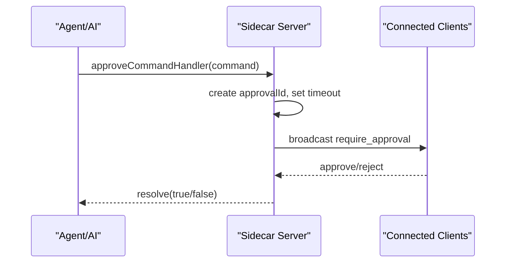
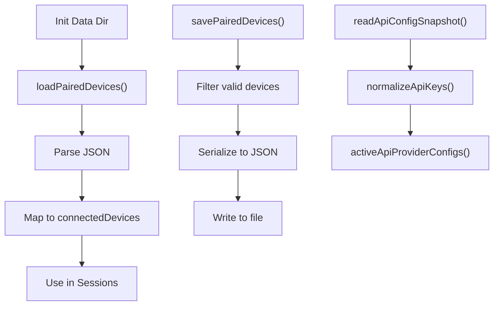
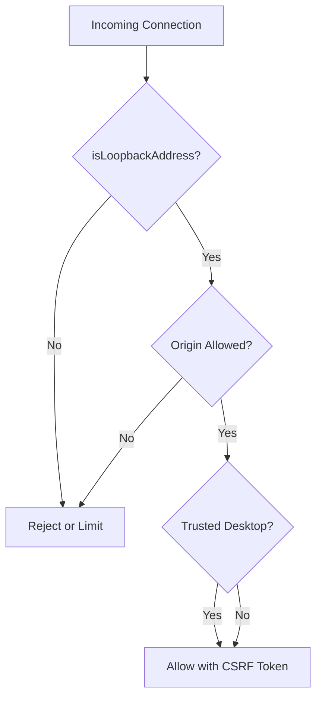
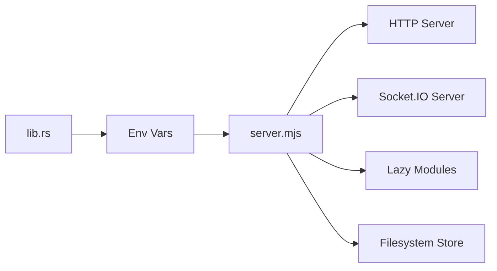

# Sidecar Server Architecture

<cite>
**Referenced Files in This Document**
- [server.mjs](file://apps/desktop/src-tauri/sidecar/server.mjs)
- [server.bundle.mjs](file://apps/desktop/src-tauri/sidecar/server.bundle.mjs)
- [lib.rs](file://apps/desktop/src-tauri/src/lib.rs)
- [sharedSocket.ts](file://apps/desktop/src/utils/sharedSocket.ts)
</cite>

## Table of Contents
1. [Introduction](#introduction)
2. [Project Structure](#project-structure)
3. [Core Components](#core-components)
4. [Architecture Overview](#architecture-overview)
5. [Detailed Component Analysis](#detailed-component-analysis)
6. [Dependency Analysis](#dependency-analysis)
7. [Performance Considerations](#performance-considerations)
8. [Troubleshooting Guide](#troubleshooting-guide)
9. [Conclusion](#conclusion)

## Introduction
This document describes the Sidecar Server Architecture that powers the GHITA Coding Agent ecosystem. The server is a Node.js standalone process designed to serve as the central communication hub between desktop, mobile, and AI services. It exposes:
- An HTTP server for health checks, pairing, language synchronization, and administrative operations
- A Socket.IO server for real-time bidirectional communication with clients
- A modular, lazy-loading system for heavy dependencies such as AI engines, skills, computer use, and browser control
- Robust security controls including loopback validation, origin checks, trusted desktop detection, CORS enforcement, and rate limiting
- Persistent storage for paired devices and API configurations

## Project Structure
The Sidecar Server lives in the desktop application’s Tauri integration and is launched by the Rust backend. The key elements are:
- Rust launcher: starts Node.js with environment variables and manages lifecycle
- Node.js server: HTTP + Socket.IO server with lazy modules and security policies
- Frontend utilities: shared Socket.IO connection for the desktop app

**Diagram sources**
- [lib.rs:41-153](file://apps/desktop/src-tauri/src/lib.rs#L41-L153)
- [server.mjs:417-562](file://apps/desktop/src-tauri/sidecar/server.mjs#L417-L562)
- [server.mjs:564-580](file://apps/desktop/src-tauri/sidecar/server.mjs#L564-L580)
- [server.mjs:17-69](file://apps/desktop/src-tauri/sidecar/server.mjs#L17-L69)
- [server.mjs:613-673](file://apps/desktop/src-tauri/sidecar/server.mjs#L613-L673)
- [sharedSocket.ts:28-80](file://apps/desktop/src/utils/sharedSocket.ts#L28-L80)

**Section sources**
- [lib.rs:41-153](file://apps/desktop/src-tauri/src/lib.rs#L41-L153)
- [server.mjs:417-562](file://apps/desktop/src-tauri/sidecar/server.mjs#L417-L562)
- [server.mjs:564-580](file://apps/desktop/src-tauri/sidecar/server.mjs#L564-L580)
- [sharedSocket.ts:28-80](file://apps/desktop/src/utils/sharedSocket.ts#L28-L80)

## Core Components
- Server initialization and environment configuration
- HTTP server with CORS and rate limiting
- Socket.IO server with origin validation and trusted desktop detection
- Lazy loading of heavy modules
- Persistent storage for paired devices and API configurations
- Approval system for sensitive operations
- Security controls: loopback validation, origin checks, trusted desktop sockets

**Section sources**
- [server.mjs:71-80](file://apps/desktop/src-tauri/sidecar/server.mjs#L71-L80)
- [server.mjs:417-562](file://apps/desktop/src-tauri/sidecar/server.mjs#L417-L562)
- [server.mjs:564-580](file://apps/desktop/src-tauri/sidecar/server.mjs#L564-L580)
- [server.mjs:17-69](file://apps/desktop/src-tauri/sidecar/server.mjs#L17-L69)
- [server.mjs:613-673](file://apps/desktop/src-tauri/sidecar/server.mjs#L613-L673)
- [server.mjs:151-203](file://apps/desktop/src-tauri/sidecar/server.mjs#L151-L203)

## Architecture Overview
The Sidecar Server is launched by the Rust backend and runs as a standalone Node.js process. It exposes:
- HTTP endpoints for health, pairing, language sync, and device unpairing
- Socket.IO channels for real-time events and approvals
- A registry of host skills and controllers for computer use and browser control
- A lazy module loader to defer expensive imports until first use

**Diagram sources**
- [lib.rs:118-127](file://apps/desktop/src-tauri/src/lib.rs#L118-L127)
- [server.mjs:417-418](file://apps/desktop/src-tauri/sidecar/server.mjs#L417-L418)
- [server.mjs:564-580](file://apps/desktop/src-tauri/sidecar/server.mjs#L564-L580)

## Detailed Component Analysis

### Server Initialization and Environment Management
- Port binding and host selection based on LAN enablement
- Optional port liberation to reclaim stale listeners
- Cloud discovery publishing for pairing and relay
- Session token generation for CSRF protection at the Socket.IO level

**Diagram sources**
- [server.mjs:71-79](file://apps/desktop/src-tauri/sidecar/server.mjs#L71-L79)
- [server.mjs:124-147](file://apps/desktop/src-tauri/sidecar/server.mjs#L124-L147)
- [server.mjs:417-418](file://apps/desktop/src-tauri/sidecar/server.mjs#L417-L418)
- [server.mjs:564-580](file://apps/desktop/src-tauri/sidecar/server.mjs#L564-L580)

**Section sources**
- [server.mjs:71-79](file://apps/desktop/src-tauri/sidecar/server.mjs#L71-L79)
- [server.mjs:124-147](file://apps/desktop/src-tauri/sidecar/server.mjs#L124-L147)
- [lib.rs:118-127](file://apps/desktop/src-tauri/src/lib.rs#L118-L127)

### HTTP Server Implementation and Endpoints
- Health endpoint returns runtime stats and pairing info for loopback clients
- Pair endpoint exposes a short-lived pairing code for trusted local origins
- Sync language endpoint accepts JSON payloads with size limits
- Unpair endpoint removes a device by ID and notifies the client
- CORS enforcement and preflight handling
- Rate limiting per IP with periodic cleanup

**Diagram sources**
- [server.mjs:417-562](file://apps/desktop/src-tauri/sidecar/server.mjs#L417-L562)
- [server.mjs:365-396](file://apps/desktop/src-tauri/sidecar/server.mjs#L365-L396)

**Section sources**
- [server.mjs:417-562](file://apps/desktop/src-tauri/sidecar/server.mjs#L417-L562)
- [server.mjs:365-396](file://apps/desktop/src-tauri/sidecar/server.mjs#L365-L396)

### Socket.IO Server and Dual-Mode Communication
- CORS origin validation with explicit allowlist for localhost, 127.0.0.1, tauri.localhost, ::1, and optionally LAN ranges
- Trusted desktop detection validates loopback addresses for desktop clients
- Session token-based auth for CSRF protection
- Broadcasting to desktop and paired devices, with optional cloud forwarding

**Diagram sources**
- [sharedSocket.ts:28-80](file://apps/desktop/src/utils/sharedSocket.ts#L28-L80)
- [server.mjs:564-580](file://apps/desktop/src-tauri/sidecar/server.mjs#L564-L580)
- [server.mjs:101-121](file://apps/desktop/src-tauri/sidecar/server.mjs#L101-L121)
- [server.mjs:105-108](file://apps/desktop/src-tauri/sidecar/server.mjs#L105-L108)

**Section sources**
- [sharedSocket.ts:28-80](file://apps/desktop/src/utils/sharedSocket.ts#L28-L80)
- [server.mjs:564-580](file://apps/desktop/src-tauri/sidecar/server.mjs#L564-L580)
- [server.mjs:101-121](file://apps/desktop/src-tauri/sidecar/server.mjs#L101-L121)
- [server.mjs:105-108](file://apps/desktop/src-tauri/sidecar/server.mjs#L105-L108)

### Lazy Loading Strategy for Heavy Dependencies
- AI engine, skills, computer use, browser control, agents, and node-pty are loaded on first use
- This defers expensive imports and native addons to improve startup time

**Diagram sources**
- [server.mjs:17-69](file://apps/desktop/src-tauri/sidecar/server.mjs#L17-L69)

**Section sources**
- [server.mjs:17-69](file://apps/desktop/src-tauri/sidecar/server.mjs#L17-L69)

### Approval System for Sensitive Operations
- Terminal command execution approvals
- File write/modify approvals
- Timeout-based auto-rejection after a fixed period
- Centralized approval registry and broadcasting to clients

**Diagram sources**
- [server.mjs:151-203](file://apps/desktop/src-tauri/sidecar/server.mjs#L151-L203)

**Section sources**
- [server.mjs:151-203](file://apps/desktop/src-tauri/sidecar/server.mjs#L151-L203)

### Persistent Storage for Paired Devices and API Configurations
- Paired devices stored in a JSON file with metadata
- API configurations loaded and normalized for orchestrator providers
- Safe read/write with error logging

**Diagram sources**
- [server.mjs:613-673](file://apps/desktop/src-tauri/sidecar/server.mjs#L613-L673)
- [server.mjs:675-752](file://apps/desktop/src-tauri/sidecar/server.mjs#L675-L752)

**Section sources**
- [server.mjs:613-673](file://apps/desktop/src-tauri/sidecar/server.mjs#L613-L673)
- [server.mjs:675-752](file://apps/desktop/src-tauri/sidecar/server.mjs#L675-L752)

### Security Measures
- Loopback address validation for HTTP and Socket.IO
- Origin validation allowing localhost variants and optionally LAN ranges
- Trusted desktop socket detection for loopback addresses
- Rate limiting per IP with periodic cleanup
- CORS policy enforced at Socket.IO level

**Diagram sources**
- [server.mjs:88-121](file://apps/desktop/src-tauri/sidecar/server.mjs#L88-L121)
- [server.mjs:564-580](file://apps/desktop/src-tauri/sidecar/server.mjs#L564-L580)
- [server.mjs:365-396](file://apps/desktop/src-tauri/sidecar/server.mjs#L365-L396)

**Section sources**
- [server.mjs:88-121](file://apps/desktop/src-tauri/sidecar/server.mjs#L88-L121)
- [server.mjs:564-580](file://apps/desktop/src-tauri/sidecar/server.mjs#L564-L580)
- [server.mjs:365-396](file://apps/desktop/src-tauri/sidecar/server.mjs#L365-L396)

## Dependency Analysis
- Rust backend launches Node.js with environment variables and captures stdout for IPC
- Node.js server depends on HTTP and Socket.IO for transport
- Lazy modules are dynamically imported when required
- Persistent storage relies on filesystem I/O

**Diagram sources**
- [lib.rs:118-127](file://apps/desktop/src-tauri/src/lib.rs#L118-L127)
- [server.mjs:17-69](file://apps/desktop/src-tauri/sidecar/server.mjs#L17-L69)
- [server.mjs:613-673](file://apps/desktop/src-tauri/sidecar/server.mjs#L613-L673)

**Section sources**
- [lib.rs:118-127](file://apps/desktop/src-tauri/src/lib.rs#L118-L127)
- [server.mjs:17-69](file://apps/desktop/src-tauri/sidecar/server.mjs#L17-L69)
- [server.mjs:613-673](file://apps/desktop/src-tauri/sidecar/server.mjs#L613-L673)

## Performance Considerations
- Lazy loading of heavy modules significantly reduces startup time
- PTY session cleanup prevents resource leaks
- Rate limiting protects against abuse
- Bundled server script minimizes cold-start overhead

[No sources needed since this section provides general guidance]

## Troubleshooting Guide
- Server fails to start: verify environment variables and port availability; check stdout logs emitted by the Rust backend
- Cannot connect via Socket.IO: ensure origin is allowed and loopback address is validated; confirm session token auth
- HTTP rate limited: adjust client behavior or increase rate window/threshold
- Pairing not working: confirm loopback access and that pairing code is requested locally
- Persistent storage errors: check data directory permissions and JSON validity

**Section sources**
- [lib.rs:129-149](file://apps/desktop/src-tauri/src/lib.rs#L129-L149)
- [server.mjs:417-562](file://apps/desktop/src-tauri/sidecar/server.mjs#L417-L562)
- [server.mjs:365-396](file://apps/desktop/src-tauri/sidecar/server.mjs#L365-L396)

## Conclusion
The Sidecar Server is a robust, secure, and modular communication hub that enables seamless collaboration between desktop, mobile, and AI services. Its lazy-loading architecture, strict security controls, and persistent storage model provide a scalable foundation for future enhancements while maintaining a fast startup and reliable operation.