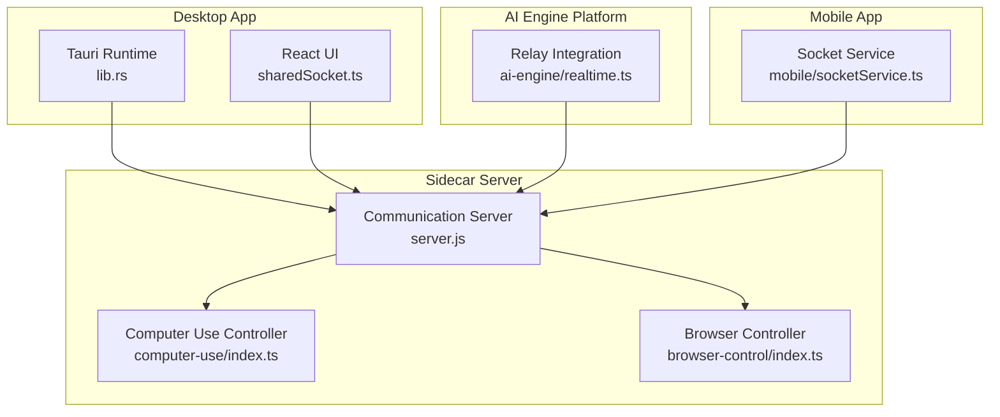
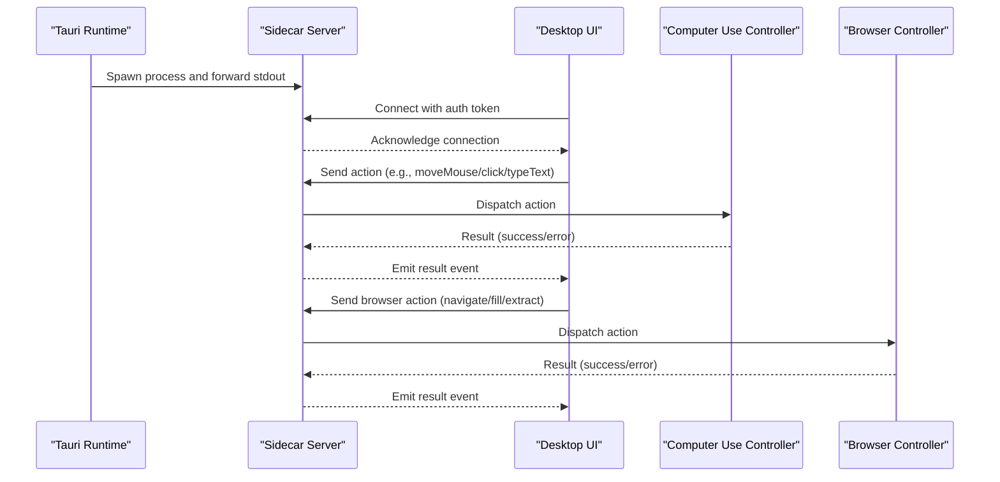
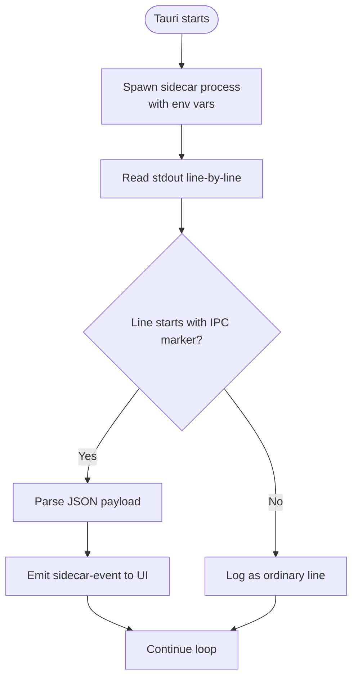
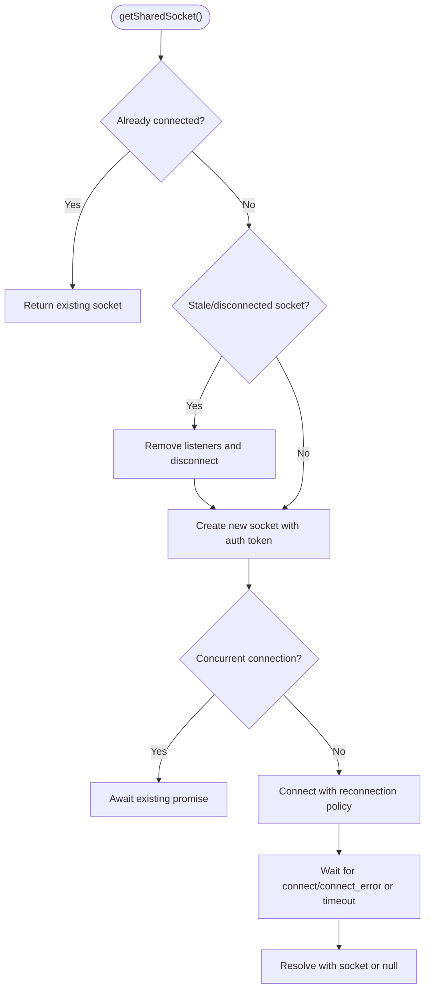
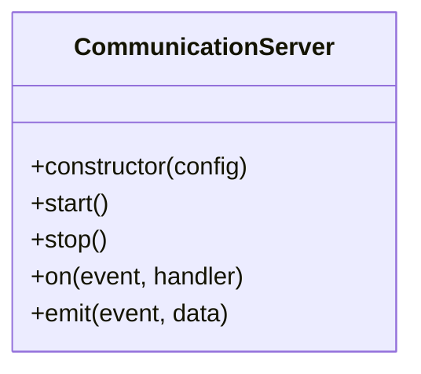
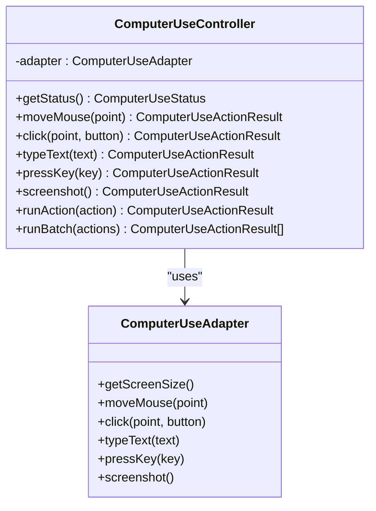
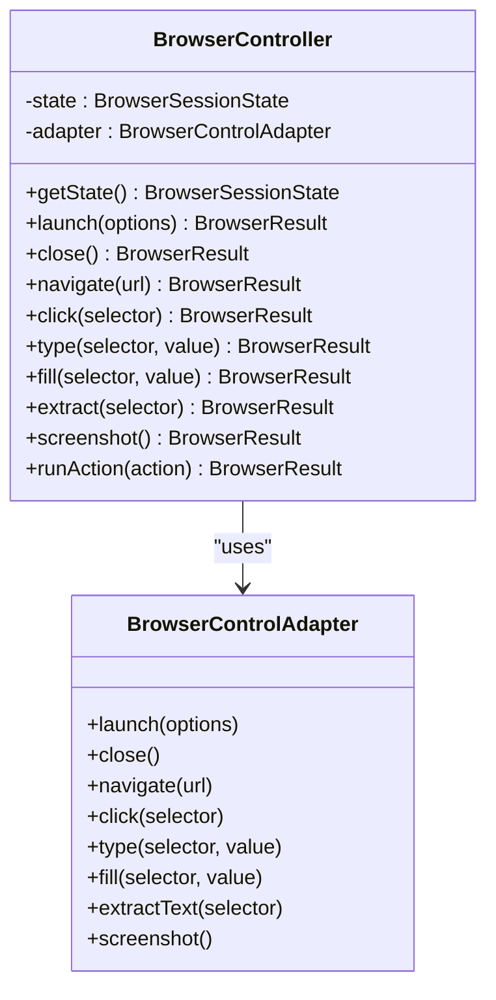
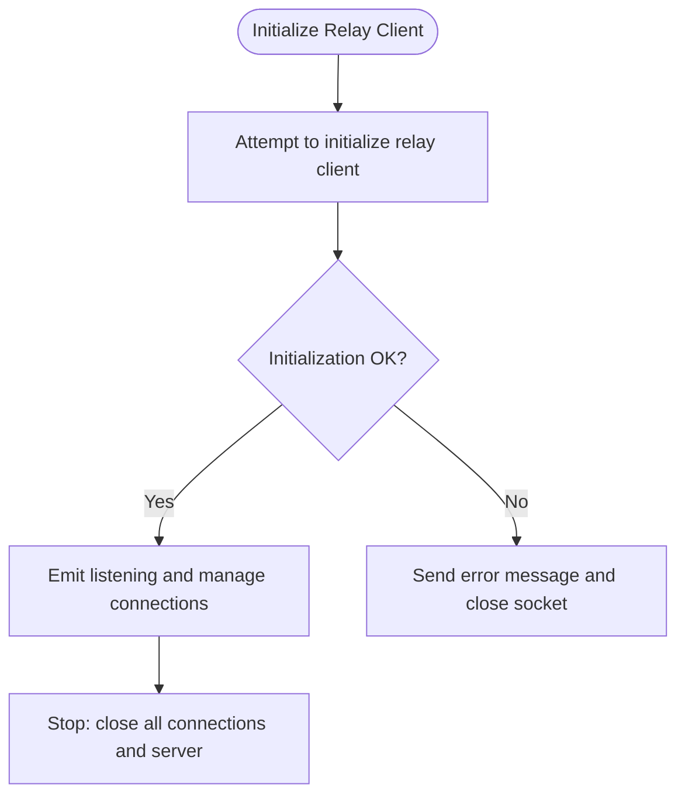
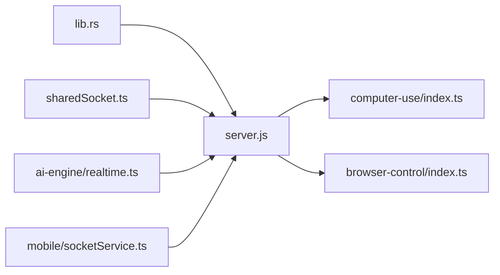

# Sidecar Server and Communication

<cite>
**Referenced Files in This Document**
- [lib.rs](file://apps/desktop/src-tauri/src/lib.rs)
- [sharedSocket.ts](file://apps/desktop/src/utils/sharedSocket.ts)
- [communicationServer.test.ts](file://tests/unit/communicationServer.test.ts)
- [index.ts](file://packages/communication/src/server.js)
- [constants.js](file://packages/shared/src/constants.js)
- [index.ts](file://packages/computer-use/src/index.ts)
- [index.ts](file://packages/browser-control/src/index.ts)
- [hybrid.ts](file://packages/browser-control/src/hybrid.ts)
- [realtime.ts](file://packages/ai-engine/src/platform/realtime.ts)
- [phase8-advanced.test.ts](file://tests/unit/phase8-advanced.test.ts)
</cite>

## Table of Contents
1. [Introduction](#introduction)
2. [Project Structure](#project-structure)
3. [Core Components](#core-components)
4. [Architecture Overview](#architecture-overview)
5. [Detailed Component Analysis](#detailed-component-analysis)
6. [Dependency Analysis](#dependency-analysis)
7. [Performance Considerations](#performance-considerations)
8. [Troubleshooting Guide](#troubleshooting-guide)
9. [Conclusion](#conclusion)
10. [Appendices](#appendices)

## Introduction
This document explains the Sidecar Server and Communication system that powers real-time collaboration between the desktop application, mobile clients, and AI services. The Node.js sidecar server acts as the central coordinator for AI operations, manages Socket.IO-based communication, and bridges the desktop app to external services. It also orchestrates computer control (mouse, keyboard, screenshots) and browser control features, while supporting a relay server for connection management and failover.

## Project Structure
The Sidecar and Communication system spans several packages and platforms:
- Desktop Tauri integration spawns and supervises the sidecar process and forwards logs/events to the UI.
- Socket.IO client in the desktop app maintains a single persistent connection to the sidecar.
- Communication server encapsulates Socket.IO event handling and lifecycle.
- Computer control and browser control packages define action models and adapters for OS and browser automation.
- AI engine platform module integrates with a relay server for real-time streaming.
- Mobile app connects via a dedicated Socket.IO service.
- Relay server logic supports fallback routing and resilience.

**Diagram sources**
- [lib.rs:117-150](file://apps/desktop/src-tauri/src/lib.rs#L117-L150)
- [sharedSocket.ts:1-87](file://apps/desktop/src/utils/sharedSocket.ts#L1-L87)
- [index.ts](file://packages/communication/src/server.js)
- [index.ts:91-264](file://packages/computer-use/src/index.ts#L91-L264)
- [index.ts:43-123](file://packages/browser-control/src/index.ts#L43-L123)
- [realtime.ts:64-95](file://packages/ai-engine/src/platform/realtime.ts#L64-L95)

**Section sources**
- [lib.rs:117-150](file://apps/desktop/src-tauri/src/lib.rs#L117-L150)
- [sharedSocket.ts:1-87](file://apps/desktop/src/utils/sharedSocket.ts#L1-L87)

## Core Components
- Sidecar process launcher and event forwarding in Tauri runtime.
- Shared Socket.IO client for the desktop app with session token auth and reconnection.
- Communication server implementing Socket.IO event handling and lifecycle.
- Computer use controller with typed actions and adapter-based OS automation.
- Browser controller with DOM and hybrid (vision-grounded) automation.
- Relay server integration for real-time streaming and failover routing.

**Section sources**
- [lib.rs:117-150](file://apps/desktop/src-tauri/src/lib.rs#L117-L150)
- [sharedSocket.ts:1-87](file://apps/desktop/src/utils/sharedSocket.ts#L1-L87)
- [index.ts](file://packages/communication/src/server.js)
- [index.ts:91-264](file://packages/computer-use/src/index.ts#L91-L264)
- [index.ts:43-123](file://packages/browser-control/src/index.ts#L43-L123)
- [realtime.ts:64-95](file://packages/ai-engine/src/platform/realtime.ts#L64-L95)

## Architecture Overview
The desktop app launches the sidecar server, which exposes a Socket.IO endpoint. The desktop UI maintains a singleton Socket.IO connection using a session token. The sidecar listens for events, routes them to appropriate controllers (computer use, browser control), and emits updates. The AI engine platform optionally streams data through a relay server, and the mobile app connects similarly.

**Diagram sources**
- [lib.rs:117-150](file://apps/desktop/src-tauri/src/lib.rs#L117-L150)
- [sharedSocket.ts:28-80](file://apps/desktop/src/utils/sharedSocket.ts#L28-L80)
- [index.ts](file://packages/communication/src/server.js)
- [index.ts:141-263](file://packages/computer-use/src/index.ts#L141-L263)
- [index.ts:106-122](file://packages/browser-control/src/index.ts#L106-L122)

## Detailed Component Analysis

### Sidecar Process Launcher (Tauri)
- Spawns the Node.js sidecar server with environment variables for port, data directory, and LAN enablement.
- Reads sidecar stdout and forwards structured IPC events to the desktop UI via Tauri’s event system.

**Diagram sources**
- [lib.rs:117-150](file://apps/desktop/src-tauri/src/lib.rs#L117-L150)

**Section sources**
- [lib.rs:117-150](file://apps/desktop/src-tauri/src/lib.rs#L117-L150)

### Shared Socket.IO Client (Desktop)
- Generates a session token for auth and CSRF protection.
- Establishes a WebSocket-only Socket.IO connection to the sidecar.
- Implements deduplicated connection attempts, reconnection policy, and a short connection readiness timeout.

**Diagram sources**
- [sharedSocket.ts:28-80](file://apps/desktop/src/utils/sharedSocket.ts#L28-L80)

**Section sources**
- [sharedSocket.ts:1-87](file://apps/desktop/src/utils/sharedSocket.ts#L1-L87)

### Communication Server (Socket.IO)
- Encapsulates server lifecycle and event handling.
- Unit tests demonstrate connection handling, event registration, and server listen/close behavior.

**Diagram sources**
- [index.ts](file://packages/communication/src/server.js)

**Section sources**
- [communicationServer.test.ts:1-70](file://tests/unit/communicationServer.test.ts#L1-L70)
- [constants.js](file://packages/shared/src/constants.js)

### Computer Control Features
- Action model defines mouse movement, clicking, typing, key presses, and screenshots.
- Controller validates adapter availability and executes actions, returning structured results.
- Skills are exposed for integration with the skill system.

**Diagram sources**
- [index.ts:50-140](file://packages/computer-use/src/index.ts#L50-L140)
- [index.ts:141-263](file://packages/computer-use/src/index.ts#L141-L263)

**Section sources**
- [index.ts:91-264](file://packages/computer-use/src/index.ts#L91-L264)

### Browser Control System
- Session state tracks lifecycle and errors.
- Actions include launching, closing, navigating, clicking, typing, extracting text, and taking screenshots.
- Hybrid controller supports DOM selectors and vision-grounded fallback for robust automation.

**Diagram sources**
- [index.ts:43-123](file://packages/browser-control/src/index.ts#L43-L123)
- [hybrid.ts:45-71](file://packages/browser-control/src/hybrid.ts#L45-L71)

**Section sources**
- [index.ts:1-202](file://packages/browser-control/src/index.ts#L1-L202)
- [hybrid.ts:38-71](file://packages/browser-control/src/hybrid.ts#L38-L71)

### Relay Server Integration (Realtime Streaming)
- The AI engine platform initializes a relay client and gracefully handles initialization failures.
- Provides a WebSocket server abstraction for streaming scenarios.

**Diagram sources**
- [realtime.ts:64-95](file://packages/ai-engine/src/platform/realtime.ts#L64-L95)

**Section sources**
- [realtime.ts:64-95](file://packages/ai-engine/src/platform/realtime.ts#L64-L95)

### Mobile Socket Service
- Mobile app maintains a dedicated Socket.IO service for connection management and messaging.
- Supports similar event-driven workflows as the desktop app.

[No sources needed since this section describes conceptual integration without analyzing specific files]

### Approval Workflows and Safety Controls
- The system does not expose explicit approval mechanisms for terminal commands or other sensitive actions in the analyzed files.
- Security considerations include session tokens, single-connection reuse, and adapter availability checks.

[No sources needed since this section synthesizes safety patterns without quoting specific code]

## Dependency Analysis
- Desktop Tauri depends on the sidecar process and forwards IPC events to the UI.
- Desktop UI depends on a shared Socket.IO client configured with transport and auth.
- Communication server depends on Socket.IO and event constants.
- Controllers depend on adapter interfaces for OS and browser automation.
- AI engine platform depends on relay server integration.
- Mobile app depends on a separate socket service.

**Diagram sources**
- [lib.rs:117-150](file://apps/desktop/src-tauri/src/lib.rs#L117-L150)
- [sharedSocket.ts:1-87](file://apps/desktop/src/utils/sharedSocket.ts#L1-L87)
- [index.ts](file://packages/communication/src/server.js)
- [index.ts:91-264](file://packages/computer-use/src/index.ts#L91-L264)
- [index.ts:43-123](file://packages/browser-control/src/index.ts#L43-L123)
- [realtime.ts:64-95](file://packages/ai-engine/src/platform/realtime.ts#L64-L95)

**Section sources**
- [lib.rs:117-150](file://apps/desktop/src-tauri/src/lib.rs#L117-L150)
- [sharedSocket.ts:1-87](file://apps/desktop/src/utils/sharedSocket.ts#L1-L87)
- [index.ts](file://packages/communication/src/server.js)
- [index.ts:91-264](file://packages/computer-use/src/index.ts#L91-L264)
- [index.ts:43-123](file://packages/browser-control/src/index.ts#L43-L123)
- [realtime.ts:64-95](file://packages/ai-engine/src/platform/realtime.ts#L64-L95)

## Performance Considerations
- Prefer a single shared Socket.IO connection to reduce overhead and duplicate connections.
- Use reconnection policies with bounded delays and retry limits to balance responsiveness and resource usage.
- Batch computer control actions when possible to minimize round-trips.
- Limit browser automation retries and timeouts to avoid blocking the UI thread.
- Offload heavy operations (e.g., screenshots) to background threads or adapters.

[No sources needed since this section provides general guidance]

## Troubleshooting Guide
- Connection issues: Verify the sidecar is running, the port is correct, and the session token is present. Check reconnection attempts and transport selection.
- Adapter unavailability: Confirm that required OS and browser adapters are implemented and available before invoking actions.
- Relay initialization failures: Inspect error messages emitted during relay client initialization and ensure proper teardown.
- LAN/WAN failover: Validate that local connection attempts trigger cloud fallback after exceeding retry thresholds.

**Section sources**
- [sharedSocket.ts:28-80](file://apps/desktop/src/utils/sharedSocket.ts#L28-L80)
- [index.ts:91-140](file://packages/computer-use/src/index.ts#L91-L140)
- [index.ts:43-72](file://packages/browser-control/src/index.ts#L43-L72)
- [realtime.ts:64-95](file://packages/ai-engine/src/platform/realtime.ts#L64-L95)
- [phase8-advanced.test.ts:100-134](file://tests/unit/phase8-advanced.test.ts#L100-L134)

## Conclusion
The Sidecar Server and Communication system centralizes AI operations and real-time coordination between desktop, mobile, and AI services. Socket.IO enables responsive, event-driven workflows, while controllers encapsulate OS and browser automation. Relay server integration supports resilient streaming, and the desktop app’s shared socket ensures efficient connectivity. Safety and reliability are addressed through session tokens, adapter checks, and failover logic.

[No sources needed since this section summarizes without analyzing specific files]

## Appendices
- Event types and message formats are defined centrally and consumed by the communication server and controllers.
- Mobile app socket service mirrors the desktop pattern for consistent cross-platform behavior.

[No sources needed since this section provides general guidance]