# Integration and E2E Testing

<cite>
**Referenced Files in This Document**
- [e2e-integration.test.ts](file://tests/e2e/e2e-integration.test.ts)
- [Terminal.integration.test.ts](file://apps/desktop/src/components/Terminal.integration.test.ts)
- [socket-io-mock.ts](file://tests/unit/socket-io-mock.ts)
- [socket-io-relay-mock.ts](file://tests/unit/socket-io-relay-mock.ts)
- [phase1.test.ts](file://tests/unit/phase1.test.ts)
- [phase2.test.ts](file://tests/unit/phase2.test.ts)
- [phase5-platform.test.ts](file://tests/unit/phase5-platform.test.ts)
- [phase6-relay.test.ts](file://tests/unit/phase6-relay.test.ts)
- [phase7-agentic.test.ts](file://tests/unit/phase7-agentic.test.ts)
- [phase8-advanced.test.ts](file://tests/unit/phase8-advanced.test.ts)
- [qualityLoop.test.ts](file://tests/quality-loop/qualityLoop.test.ts)
- [compare-methods.ts](file://tests/quality-loop/compare-methods.ts)
- [evaluator.ts](file://tests/quality-loop/evaluator.ts)
- [vitest.config.ts](file://apps/desktop/vitest.config.ts)
- [test-setup.ts](file://apps/desktop/src/test-setup.ts)
- [terminal.ts](file://apps/desktop/src/components/Terminal.tsx)
- [sharedSocket.ts](file://apps/desktop/src/utils/sharedSocket.ts)
- [bluetoothService.ts](file://apps/mobile/src/services/bluetoothService.ts)
- [socketService.ts](file://apps/mobile/src/services/socketService.ts)
- [storageService.ts](file://apps/mobile/src/services/storageService.ts)
- [extension.ts](file://apps/vscode-extension/src/extension.ts)
- [tauri.conf.json](file://apps/desktop/src-tauri/tauri.conf.json)
- [main.rs](file://apps/desktop/src-tauri/src/main.rs)
- [lib.rs](file://apps/desktop/src-tauri/src/lib.rs)
- [server.mjs](file://apps/desktop/src-tauri/sidecar/server.mjs)
- [app.manifest](file://apps/desktop/src-tauri/sidecar/app.manifest)
- [screenCapture_1.3.2.bat](file://apps/desktop/src-tauri/sidecar/screenCapture_1.3.2.bat)
- [package.json](file://apps/desktop/package.json)
- [package.json](file://apps/mobile/package.json)
- [package.json](file://apps/vscode-extension/package.json)
- [package.json](file://package.json)
- [.prettierrc](file://.prettierrc)
- [eslint.config.js](file://eslint.config.js)
- [turbo.json](file://turbo.json)
</cite>

## Table of Contents
1. [Introduction](#introduction)
2. [Project Structure](#project-structure)
3. [Core Components](#core-components)
4. [Architecture Overview](#architecture-overview)
5. [Detailed Component Analysis](#detailed-component-analysis)
6. [Dependency Analysis](#dependency-analysis)
7. [Performance Considerations](#performance-considerations)
8. [Troubleshooting Guide](#troubleshooting-guide)
9. [Conclusion](#conclusion)
10. [Appendices](#appendices)

## Introduction
This document describes the Integration and End-to-End (E2E) Testing strategies for a cross-platform system composed of a desktop application (Tauri-based), a mobile application (React Native), and a VS Code extension. It explains how integration tests validate communication across components, how E2E scenarios simulate complete user journeys, and how the testing framework is configured across platforms. It also covers Socket.IO communication patterns, Tauri command execution, cross-platform data synchronization, and phase-based validation aligned with development phases.

## Project Structure
The testing ecosystem is organized around:
- Unit tests for individual packages and modules
- Integration tests validating component interactions
- E2E tests covering cross-platform workflows
- Quality loop tests evaluating performance and correctness metrics
- Platform-specific test configurations and mocks

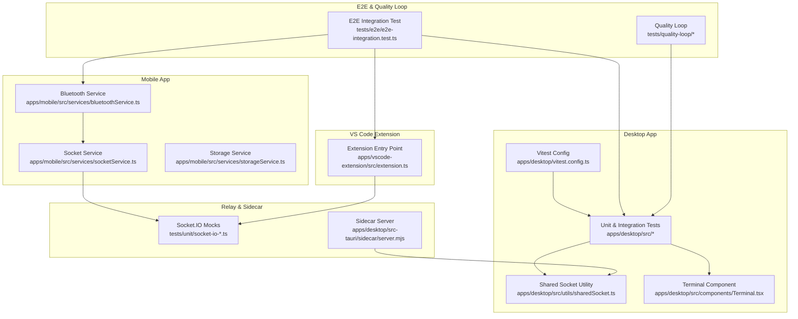

**Diagram sources**
- [vitest.config.ts:1-200](file://apps/desktop/vitest.config.ts#L1-L200)
- [sharedSocket.ts:1-200](file://apps/desktop/src/utils/sharedSocket.ts#L1-L200)
- [terminal.ts:1-200](file://apps/desktop/src/components/Terminal.tsx#L1-L200)
- [bluetoothService.ts:1-200](file://apps/mobile/src/services/bluetoothService.ts#L1-L200)
- [socketService.ts:1-200](file://apps/mobile/src/services/socketService.ts#L1-L200)
- [storageService.ts:1-200](file://apps/mobile/src/services/storageService.ts#L1-L200)
- [extension.ts:1-200](file://apps/vscode-extension/src/extension.ts#L1-L200)
- [socket-io-mock.ts:1-200](file://tests/unit/socket-io-mock.ts#L1-L200)
- [socket-io-relay-mock.ts:1-200](file://tests/unit/socket-io-relay-mock.ts#L1-L200)
- [server.mjs:1-200](file://apps/desktop/src-tauri/sidecar/server.mjs#L1-L200)
- [e2e-integration.test.ts:1-200](file://tests/e2e/e2e-integration.test.ts#L1-L200)
- [qualityLoop.test.ts:1-200](file://tests/quality-loop/qualityLoop.test.ts#L1-L200)

**Section sources**
- [vitest.config.ts:1-200](file://apps/desktop/vitest.config.ts#L1-L200)
- [test-setup.ts:1-200](file://apps/desktop/src/test-setup.ts#L1-L200)
- [e2e-integration.test.ts:1-200](file://tests/e2e/e2e-integration.test.ts#L1-L200)

## Core Components
- Desktop integration tests validate terminal behavior and socket interactions.
- Mobile services encapsulate Bluetooth and Socket.IO communication for pairing and remote control.
- VS Code extension integrates with the backend via Tauri commands and Socket.IO.
- Relay and sidecar components provide local server support for screen capture and device control.
- E2E tests orchestrate cross-platform user journeys, including pairing, remote control, and AI-assisted coding.
- Quality loop tests evaluate correctness and performance across multiple runs.

Key implementation references:
- Terminal integration tests: [Terminal.integration.test.ts:1-200](file://apps/desktop/src/components/Terminal.integration.test.ts#L1-L200)
- Shared socket utility: [sharedSocket.ts:1-200](file://apps/desktop/src/utils/sharedSocket.ts#L1-L200)
- Mobile socket service: [socketService.ts:1-200](file://apps/mobile/src/services/socketService.ts#L1-L200)
- Mobile Bluetooth service: [bluetoothService.ts:1-200](file://apps/mobile/src/services/bluetoothService.ts#L1-L200)
- VS Code extension entry: [extension.ts:1-200](file://apps/vscode-extension/src/extension.ts#L1-L200)
- Sidecar server: [server.mjs:1-200](file://apps/desktop/src-tauri/sidecar/server.mjs#L1-L200)
- E2E integration test: [e2e-integration.test.ts:1-200](file://tests/e2e/e2e-integration.test.ts#L1-L200)
- Quality loop: [qualityLoop.test.ts:1-200](file://tests/quality-loop/qualityLoop.test.ts#L1-L200)

**Section sources**
- [Terminal.integration.test.ts:1-200](file://apps/desktop/src/components/Terminal.integration.test.ts#L1-L200)
- [sharedSocket.ts:1-200](file://apps/desktop/src/utils/sharedSocket.ts#L1-L200)
- [socketService.ts:1-200](file://apps/mobile/src/services/socketService.ts#L1-L200)
- [bluetoothService.ts:1-200](file://apps/mobile/src/services/bluetoothService.ts#L1-L200)
- [extension.ts:1-200](file://apps/vscode-extension/src/extension.ts#L1-L200)
- [server.mjs:1-200](file://apps/desktop/src-tauri/sidecar/server.mjs#L1-L200)
- [e2e-integration.test.ts:1-200](file://tests/e2e/e2e-integration.test.ts#L1-L200)
- [qualityLoop.test.ts:1-200](file://tests/quality-loop/qualityLoop.test.ts#L1-L200)

## Architecture Overview
The integration and E2E testing architecture spans three platforms and a relay server:
- Desktop: React + Tauri, with a shared Socket.IO client and a sidecar process for device control.
- Mobile: React Native with Bluetooth and Socket.IO services for pairing and remote control.
- VS Code: Extension using Tauri commands to communicate with the desktop backend.
- Relay: Local server supporting screen capture and device interaction.

```mermaid
graph TB
subgraph "Desktop"
D_UI["Desktop UI<br/>React + Tauri"]
D_Socket["Socket.IO Client<br/>sharedSocket.ts"]
D_Sidecar["Sidecar Server<br/>server.mjs"]
end
subgraph "Mobile"
M_App["Mobile App<br/>React Native"]
M_BT["Bluetooth Service"]
M_IO["Socket.IO Service"]
end
subgraph "VS Code"
V_Ext["Extension"]
end
subgraph "Relay"
R_Server["Local Relay Server"]
end
M_App <- --> M_IO
M_App <- --> M_BT
D_UI <- --> D_Socket
D_UI <- --> D_Sidecar
V_Ext <- --> D_Socket
D_Socket <- --> R_Server
M_IO <- --> R_Server
```

**Diagram sources**
- [sharedSocket.ts:1-200](file://apps/desktop/src/utils/sharedSocket.ts#L1-L200)
- [server.mjs:1-200](file://apps/desktop/src-tauri/sidecar/server.mjs#L1-L200)
- [socketService.ts:1-200](file://apps/mobile/src/services/socketService.ts#L1-L200)
- [bluetoothService.ts:1-200](file://apps/mobile/src/services/bluetoothService.ts#L1-L200)
- [extension.ts:1-200](file://apps/vscode-extension/src/extension.ts#L1-L200)

## Detailed Component Analysis

### Desktop Integration Tests
Desktop integration tests validate terminal behavior and socket interactions under realistic conditions. They set up test fixtures, manage lifecycle hooks, and assert outcomes against expected behaviors.

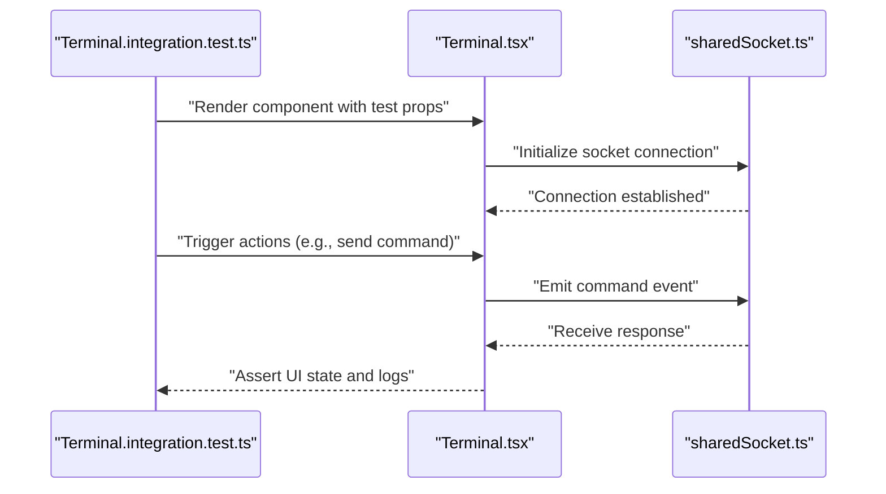

**Diagram sources**
- [Terminal.integration.test.ts:1-200](file://apps/desktop/src/components/Terminal.integration.test.ts#L1-L200)
- [terminal.ts:1-200](file://apps/desktop/src/components/Terminal.tsx#L1-L200)
- [sharedSocket.ts:1-200](file://apps/desktop/src/utils/sharedSocket.ts#L1-L200)

**Section sources**
- [Terminal.integration.test.ts:1-200](file://apps/desktop/src/components/Terminal.integration.test.ts#L1-L200)
- [terminal.ts:1-200](file://apps/desktop/src/components/Terminal.tsx#L1-L200)
- [sharedSocket.ts:1-200](file://apps/desktop/src/utils/sharedSocket.ts#L1-L200)

### Mobile Services: Bluetooth and Socket.IO
Mobile services encapsulate platform-specific pairing and communication:
- Bluetooth service manages device discovery and pairing.
- Socket.IO service handles real-time messaging with the relay server.
- Storage service persists pairing tokens and session data.

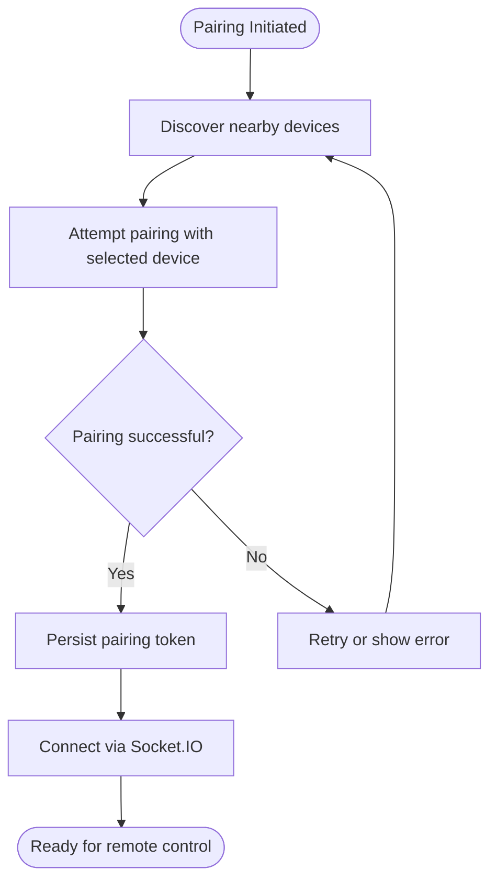

**Diagram sources**
- [bluetoothService.ts:1-200](file://apps/mobile/src/services/bluetoothService.ts#L1-L200)
- [socketService.ts:1-200](file://apps/mobile/src/services/socketService.ts#L1-L200)
- [storageService.ts:1-200](file://apps/mobile/src/services/storageService.ts#L1-L200)

**Section sources**
- [bluetoothService.ts:1-200](file://apps/mobile/src/services/bluetoothService.ts#L1-L200)
- [socketService.ts:1-200](file://apps/mobile/src/services/socketService.ts#L1-L200)
- [storageService.ts:1-200](file://apps/mobile/src/services/storageService.ts#L1-L200)

### VS Code Extension Integration
The VS Code extension communicates with the desktop backend using Tauri commands and Socket.IO. It initializes the extension lifecycle and coordinates with the desktop sidecar and relay server.

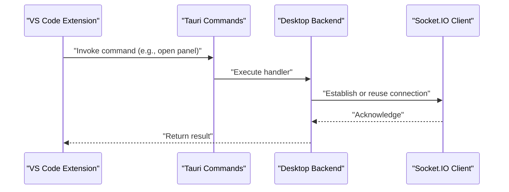

**Diagram sources**
- [extension.ts:1-200](file://apps/vscode-extension/src/extension.ts#L1-L200)
- [sharedSocket.ts:1-200](file://apps/desktop/src/utils/sharedSocket.ts#L1-L200)

**Section sources**
- [extension.ts:1-200](file://apps/vscode-extension/src/extension.ts#L1-L200)
- [sharedSocket.ts:1-200](file://apps/desktop/src/utils/sharedSocket.ts#L1-L200)

### E2E Integration Scenarios
E2E tests simulate complete user journeys across platforms, including device pairing, remote control workflows, and AI-assisted coding sessions. They coordinate between desktop, mobile, and VS Code components.

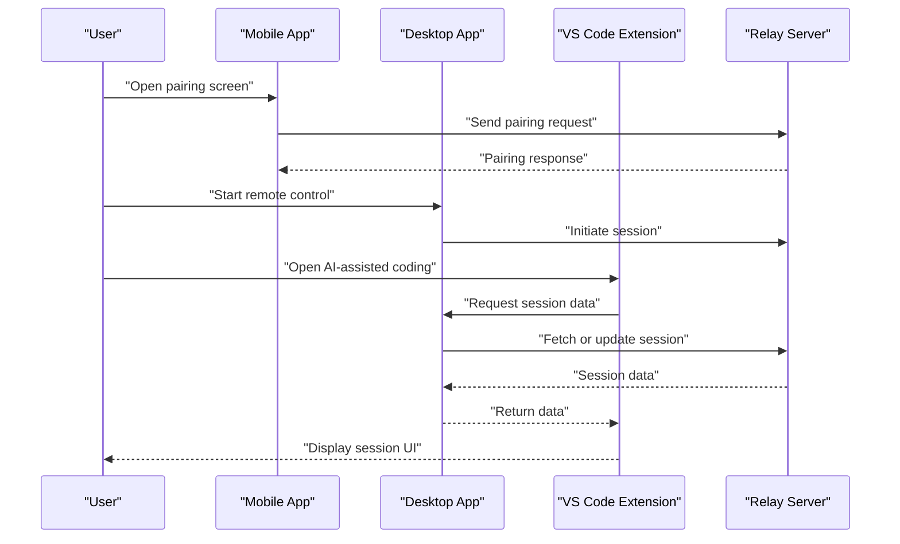

**Diagram sources**
- [e2e-integration.test.ts:1-200](file://tests/e2e/e2e-integration.test.ts#L1-L200)
- [bluetoothService.ts:1-200](file://apps/mobile/src/services/bluetoothService.ts#L1-L200)
- [socketService.ts:1-200](file://apps/mobile/src/services/socketService.ts#L1-L200)
- [sharedSocket.ts:1-200](file://apps/desktop/src/utils/sharedSocket.ts#L1-L200)
- [extension.ts:1-200](file://apps/vscode-extension/src/extension.ts#L1-L200)

**Section sources**
- [e2e-integration.test.ts:1-200](file://tests/e2e/e2e-integration.test.ts#L1-L200)

### Phase-Based Integration Testing
Development phases define structured validation steps:
- Phase 1: Basic functionality and environment setup
- Phase 2: Core workflows and data flow
- Phase 5: Platform integration and cross-device sync
- Phase 6: Relay server and network resilience
- Phase 7: Agentic behaviors and AI-assisted coding
- Phase 8: Advanced features and scalability

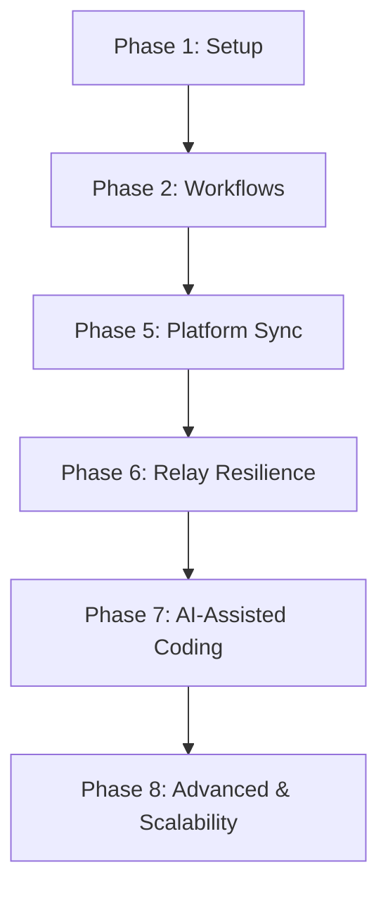

**Diagram sources**
- [phase1.test.ts:1-200](file://tests/unit/phase1.test.ts#L1-L200)
- [phase2.test.ts:1-200](file://tests/unit/phase2.test.ts#L1-L200)
- [phase5-platform.test.ts:1-200](file://tests/unit/phase5-platform.test.ts#L1-L200)
- [phase6-relay.test.ts:1-200](file://tests/unit/phase6-relay.test.ts#L1-L200)
- [phase7-agentic.test.ts:1-200](file://tests/unit/phase7-agentic.test.ts#L1-L200)
- [phase8-advanced.test.ts:1-200](file://tests/unit/phase8-advanced.test.ts#L1-L200)

**Section sources**
- [phase1.test.ts:1-200](file://tests/unit/phase1.test.ts#L1-L200)
- [phase2.test.ts:1-200](file://tests/unit/phase2.test.ts#L1-L200)
- [phase5-platform.test.ts:1-200](file://tests/unit/phase5-platform.test.ts#L1-L200)
- [phase6-relay.test.ts:1-200](file://tests/unit/phase6-relay.test.ts#L1-L200)
- [phase7-agentic.test.ts:1-200](file://tests/unit/phase7-agentic.test.ts#L1-L200)
- [phase8-advanced.test.ts:1-200](file://tests/unit/phase8-advanced.test.ts#L1-L200)

### Socket.IO Communication Patterns
Socket.IO is central to real-time communication across platforms. Mocks are used to isolate and validate behavior during unit and integration tests.

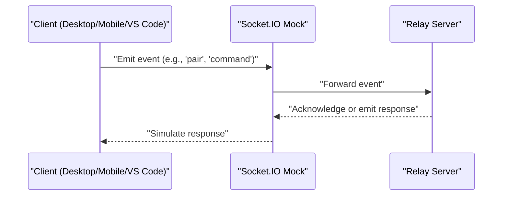

**Diagram sources**
- [socket-io-mock.ts:1-200](file://tests/unit/socket-io-mock.ts#L1-L200)
- [socket-io-relay-mock.ts:1-200](file://tests/unit/socket-io-relay-mock.ts#L1-L200)
- [sharedSocket.ts:1-200](file://apps/desktop/src/utils/sharedSocket.ts#L1-L200)
- [socketService.ts:1-200](file://apps/mobile/src/services/socketService.ts#L1-L200)

**Section sources**
- [socket-io-mock.ts:1-200](file://tests/unit/socket-io-mock.ts#L1-L200)
- [socket-io-relay-mock.ts:1-200](file://tests/unit/socket-io-relay-mock.ts#L1-L200)
- [sharedSocket.ts:1-200](file://apps/desktop/src/utils/sharedSocket.ts#L1-L200)
- [socketService.ts:1-200](file://apps/mobile/src/services/socketService.ts#L1-L200)

### Tauri Command Execution
Tauri commands bridge the VS Code extension to the desktop backend. The configuration defines allowed commands and capabilities.

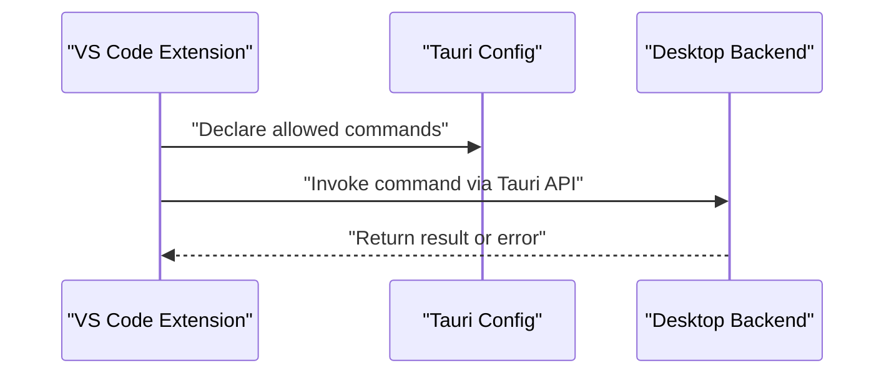

**Diagram sources**
- [tauri.conf.json:1-200](file://apps/desktop/src-tauri/tauri.conf.json#L1-L200)
- [main.rs:1-200](file://apps/desktop/src-tauri/src/main.rs#L1-L200)
- [lib.rs:1-200](file://apps/desktop/src-tauri/src/lib.rs#L1-L200)
- [extension.ts:1-200](file://apps/vscode-extension/src/extension.ts#L1-L200)

**Section sources**
- [tauri.conf.json:1-200](file://apps/desktop/src-tauri/tauri.conf.json#L1-L200)
- [main.rs:1-200](file://apps/desktop/src-tauri/src/main.rs#L1-L200)
- [lib.rs:1-200](file://apps/desktop/src-tauri/src/lib.rs#L1-L200)
- [extension.ts:1-200](file://apps/vscode-extension/src/extension.ts#L1-L200)

### Cross-Platform Data Synchronization
Cross-platform synchronization ensures consistent state across desktop, mobile, and VS Code. It leverages Socket.IO and local storage to maintain session data and pairing tokens.

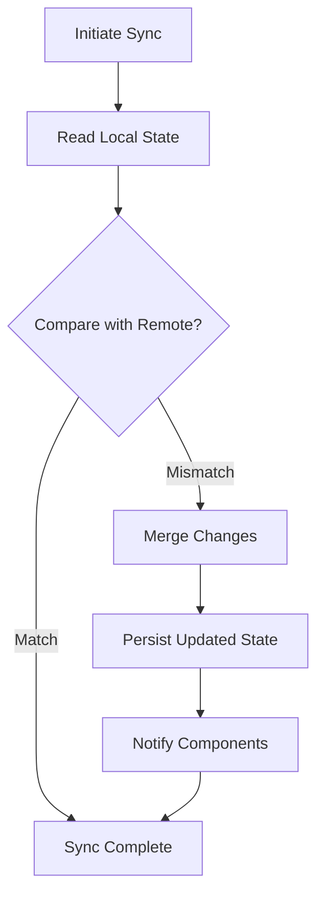

**Diagram sources**
- [storageService.ts:1-200](file://apps/mobile/src/services/storageService.ts#L1-L200)
- [sharedSocket.ts:1-200](file://apps/desktop/src/utils/sharedSocket.ts#L1-L200)
- [socketService.ts:1-200](file://apps/mobile/src/services/socketService.ts#L1-L200)

**Section sources**
- [storageService.ts:1-200](file://apps/mobile/src/services/storageService.ts#L1-L200)
- [sharedSocket.ts:1-200](file://apps/desktop/src/utils/sharedSocket.ts#L1-L200)
- [socketService.ts:1-200](file://apps/mobile/src/services/socketService.ts#L1-L200)

### Quality Loop Testing
Quality loop tests evaluate correctness and performance across multiple iterations, comparing methods and aggregating metrics.

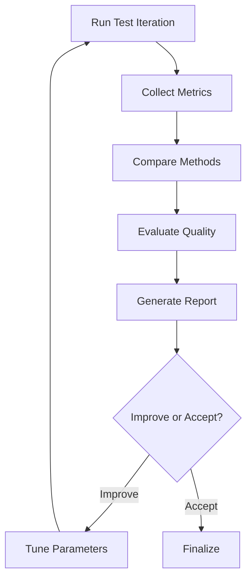

**Diagram sources**
- [qualityLoop.test.ts:1-200](file://tests/quality-loop/qualityLoop.test.ts#L1-L200)
- [compare-methods.ts:1-200](file://tests/quality-loop/compare-methods.ts#L1-L200)
- [evaluator.ts:1-200](file://tests/quality-loop/evaluator.ts#L1-L200)

**Section sources**
- [qualityLoop.test.ts:1-200](file://tests/quality-loop/qualityLoop.test.ts#L1-L200)
- [compare-methods.ts:1-200](file://tests/quality-loop/compare-methods.ts#L1-L200)
- [evaluator.ts:1-200](file://tests/quality-loop/evaluator.ts#L1-L200)

## Dependency Analysis
Testing dependencies span multiple packages and platforms. The desktop Vitest configuration enables component and integration tests, while mocks isolate Socket.IO behavior for deterministic validation.

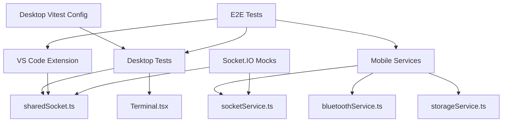

**Diagram sources**
- [vitest.config.ts:1-200](file://apps/desktop/vitest.config.ts#L1-L200)
- [sharedSocket.ts:1-200](file://apps/desktop/src/utils/sharedSocket.ts#L1-L200)
- [terminal.ts:1-200](file://apps/desktop/src/components/Terminal.tsx#L1-L200)
- [socketService.ts:1-200](file://apps/mobile/src/services/socketService.ts#L1-L200)
- [bluetoothService.ts:1-200](file://apps/mobile/src/services/bluetoothService.ts#L1-L200)
- [storageService.ts:1-200](file://apps/mobile/src/services/storageService.ts#L1-L200)
- [extension.ts:1-200](file://apps/vscode-extension/src/extension.ts#L1-L200)
- [socket-io-mock.ts:1-200](file://tests/unit/socket-io-mock.ts#L1-L200)
- [socket-io-relay-mock.ts:1-200](file://tests/unit/socket-io-relay-mock.ts#L1-L200)
- [e2e-integration.test.ts:1-200](file://tests/e2e/e2e-integration.test.ts#L1-L200)

**Section sources**
- [vitest.config.ts:1-200](file://apps/desktop/vitest.config.ts#L1-L200)
- [socket-io-mock.ts:1-200](file://tests/unit/socket-io-mock.ts#L1-L200)
- [socket-io-relay-mock.ts:1-200](file://tests/unit/socket-io-relay-mock.ts#L1-L200)

## Performance Considerations
- Use lightweight mocks for Socket.IO to avoid network overhead in unit tests.
- Prefer deterministic test data and controlled environments for performance measurements.
- Isolate heavy operations (e.g., screen capture) behind feature flags or optional modules.
- Profile integration tests to identify bottlenecks in cross-platform communication.
- Apply caching strategies for repeated test setups and teardowns.

## Troubleshooting Guide
Common issues and resolutions:
- Socket.IO connection failures: Verify mock initialization and server readiness before emitting events.
- Mobile pairing errors: Confirm Bluetooth permissions and device availability; retry pairing on transient failures.
- VS Code command errors: Check Tauri capability declarations and command registration.
- Desktop sidecar not responding: Validate sidecar startup and port binding; ensure firewall rules allow local connections.
- E2E flakiness: Add retries and assertions for asynchronous operations; stabilize timing-sensitive steps.

**Section sources**
- [socket-io-mock.ts:1-200](file://tests/unit/socket-io-mock.ts#L1-L200)
- [socket-io-relay-mock.ts:1-200](file://tests/unit/socket-io-relay-mock.ts#L1-L200)
- [bluetoothService.ts:1-200](file://apps/mobile/src/services/bluetoothService.ts#L1-L200)
- [tauri.conf.json:1-200](file://apps/desktop/src-tauri/tauri.conf.json#L1-L200)
- [server.mjs:1-200](file://apps/desktop/src-tauri/sidecar/server.mjs#L1-L200)

## Conclusion
The testing strategy combines unit, integration, and E2E tests across desktop, mobile, and VS Code to validate cross-platform communication, real-time collaboration, and end-to-end user workflows. Socket.IO mocks, Tauri command validation, and quality loop evaluations ensure reliability, performance, and continuous improvement.

## Appendices

### Test Environment Setup
- Install dependencies using the monorepo configuration.
- Configure platform-specific environments (Android/iOS emulators, desktop OS).
- Initialize test databases or mock servers for Socket.IO and relay interactions.
- Set up CI/CD with parallel jobs for unit, integration, and E2E suites.

**Section sources**
- [package.json:1-200](file://package.json#L1-L200)
- [package.json:1-200](file://apps/desktop/package.json#L1-L200)
- [package.json:1-200](file://apps/mobile/package.json#L1-L200)
- [package.json:1-200](file://apps/vscode-extension/package.json#L1-L200)

### Test Data Preparation
- Prepare minimal datasets for pairing tokens, session IDs, and device metadata.
- Seed mock Socket.IO channels with predefined events and responses.
- Use deterministic timestamps and identifiers to simplify assertions.

**Section sources**
- [socket-io-mock.ts:1-200](file://tests/unit/socket-io-mock.ts#L1-L200)
- [socket-io-relay-mock.ts:1-200](file://tests/unit/socket-io-relay-mock.ts#L1-L200)

### Cross-Platform Compatibility Testing
- Validate UI and behavior on Windows, macOS, and Linux for the desktop app.
- Test on multiple Android and iOS versions for the mobile app.
- Verify extension compatibility across VS Code versions and operating systems.

**Section sources**
- [tauri.conf.json:1-200](file://apps/desktop/src-tauri/tauri.conf.json#L1-L200)
- [package.json:1-200](file://apps/mobile/package.json#L1-L200)
- [package.json:1-200](file://apps/vscode-extension/package.json#L1-L200)

### Performance, Load, and Stress Testing
- Introduce artificial delays and backpressure in Socket.IO mocks to simulate network conditions.
- Run long-running E2E scenarios to detect memory leaks and resource exhaustion.
- Aggregate quality loop metrics to track regression trends over time.

**Section sources**
- [qualityLoop.test.ts:1-200](file://tests/quality-loop/qualityLoop.test.ts#L1-L200)
- [compare-methods.ts:1-200](file://tests/quality-loop/compare-methods.ts#L1-L200)
- [evaluator.ts:1-200](file://tests/quality-loop/evaluator.ts#L1-L200)

### Test Execution Pipeline and CI/CD
- Define separate jobs for unit, integration, and E2E tests.
- Parallelize platform-specific jobs to reduce total runtime.
- Publish test reports and artifacts for traceability.

**Section sources**
- [turbo.json:1-200](file://turbo.json#L1-L200)
- [eslint.config.js:1-200](file://eslint.config.js#L1-L200)
- [.prettierrc:1-200](file://.prettierrc#L1-L200)