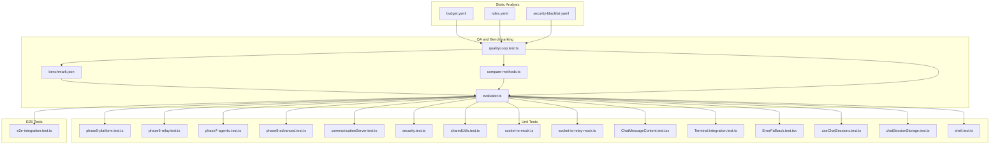
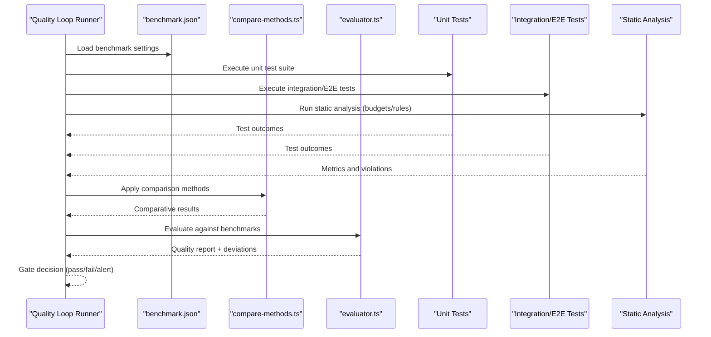
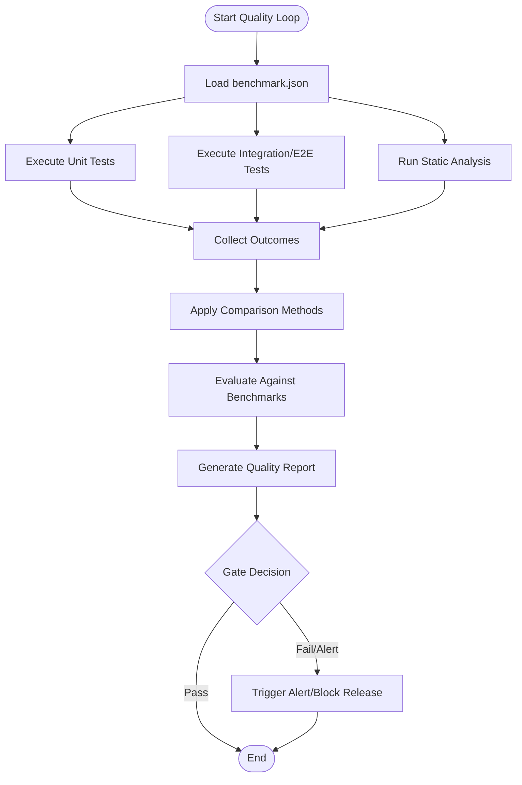
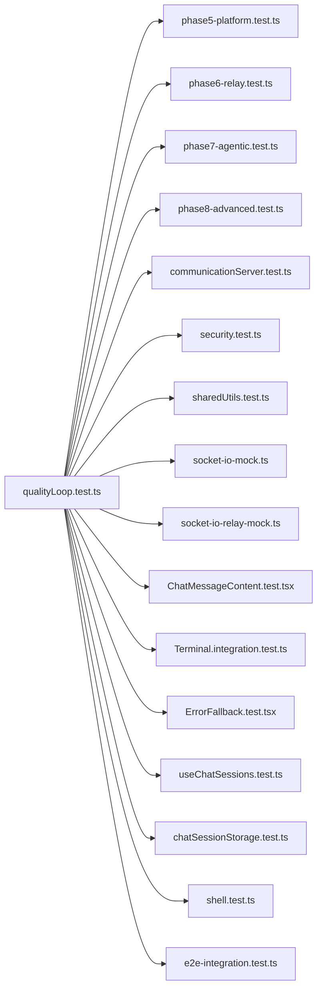
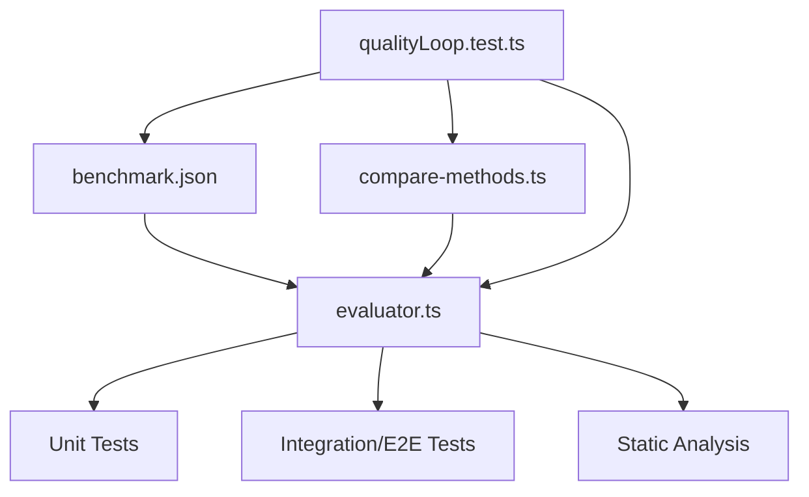

# Quality Assurance and Benchmarks

<cite>
**Referenced Files in This Document**
- [benchmark.json](file://tests/quality-loop/benchmark.json)
- [compare-methods.ts](file://tests/quality-loop/compare-methods.ts)
- [evaluator.ts](file://tests/quality-loop/evaluator.ts)
- [qualityLoop.test.ts](file://tests/quality-loop/qualityLoop.test.ts)
- [e2e-integration.test.ts](file://tests/e2e/e2e-integration.test.ts)
- [phase5-platform.test.ts](file://tests/unit/phase5-platform.test.ts)
- [phase6-relay.test.ts](file://tests/unit/phase6-relay.test.ts)
- [phase7-agentic.test.ts](file://tests/unit/phase7-agentic.test.ts)
- [phase8-advanced.test.ts](file://tests/unit/phase8-advanced.test.ts)
- [communicationServer.test.ts](file://tests/unit/communicationServer.test.ts)
- [security.test.ts](file://tests/unit/security.test.ts)
- [sharedUtils.test.ts](file://tests/unit/sharedUtils.test.ts)
- [socket-io-mock.ts](file://tests/unit/socket-io-mock.ts)
- [socket-io-relay-mock.ts](file://tests/unit/socket-io-relay-mock.ts)
- [ChatMessageContent.test.tsx](file://apps/desktop/src/components/ChatMessageContent.test.tsx)
- [Terminal.integration.test.ts](file://apps/desktop/src/components/Terminal.integration.test.ts)
- [ErrorFallback.test.tsx](file://apps/desktop/src/components/ErrorFallback.test.tsx)
- [useChatSessions.test.ts](file://apps/desktop/src/hooks/useChatSessions.test.ts)
- [chatSessionStorage.test.ts](file://apps/desktop/src/utils/chatSessionStorage.test.ts)
- [shell.test.ts](file://apps/desktop/src/utils/shell.test.ts)
- [budget.yaml](file://.ghita/budget.yaml)
- [rules.yaml](file://.ghita/rules.yaml)
- [security-blacklist.yaml](file://.ghita/security-blacklist.yaml)
- [.prettierrc](file://.prettierrc)
- [CONTRIBUTING.md](file://CONTRIBUTING.md)
- [README.md](file://README.md)
</cite>

## Table of Contents
1. [Introduction](#introduction)
2. [Project Structure](#project-structure)
3. [Core Components](#core-components)
4. [Architecture Overview](#architecture-overview)
5. [Detailed Component Analysis](#detailed-component-analysis)
6. [Dependency Analysis](#dependency-analysis)
7. [Performance Considerations](#performance-considerations)
8. [Troubleshooting Guide](#troubleshooting-guide)
9. [Conclusion](#conclusion)
10. [Appendices](#appendices)

## Introduction
This document describes the Quality Assurance and Benchmarking system implemented in the repository. It explains the quality loop that continuously evaluates system performance and functionality via automated testing and evaluation metrics, the benchmarking framework for performance measurement and comparative analysis, and the evaluator system that assesses results, generates quality reports, and detects regressions. It also covers configuration via benchmark.json, comparison methodologies, statistical analysis approaches, automated quality assessment workflows, thresholds, alerting mechanisms, and CI integration patterns. Guidance is included for interpreting quality metrics, performance trends, and reliability indicators, along with best practices and continuous improvement strategies.

## Project Structure
The QA and benchmarking artifacts are primarily located under the tests/quality-loop directory, alongside broader unit, integration, and E2E tests. The quality loop integrates with existing test suites and static analysis rulesets.

**Diagram sources**
- [benchmark.json](file://tests/quality-loop/benchmark.json)
- [compare-methods.ts](file://tests/quality-loop/compare-methods.ts)
- [evaluator.ts](file://tests/quality-loop/evaluator.ts)
- [qualityLoop.test.ts](file://tests/quality-loop/qualityLoop.test.ts)
- [e2e-integration.test.ts](file://tests/e2e/e2e-integration.test.ts)
- [phase5-platform.test.ts](file://tests/unit/phase5-platform.test.ts)
- [phase6-relay.test.ts](file://tests/unit/phase6-relay.test.ts)
- [phase7-agentic.test.ts](file://tests/unit/phase7-agentic.test.ts)
- [phase8-advanced.test.ts](file://tests/unit/phase8-advanced.test.ts)
- [communicationServer.test.ts](file://tests/unit/communicationServer.test.ts)
- [security.test.ts](file://tests/unit/security.test.ts)
- [sharedUtils.test.ts](file://tests/unit/sharedUtils.test.ts)
- [socket-io-mock.ts](file://tests/unit/socket-io-mock.ts)
- [socket-io-relay-mock.ts](file://tests/unit/socket-io-relay-mock.ts)
- [ChatMessageContent.test.tsx](file://apps/desktop/src/components/ChatMessageContent.test.tsx)
- [Terminal.integration.test.ts](file://apps/desktop/src/components/Terminal.integration.test.ts)
- [ErrorFallback.test.tsx](file://apps/desktop/src/components/ErrorFallback.test.tsx)
- [useChatSessions.test.ts](file://apps/desktop/src/hooks/useChatSessions.test.ts)
- [chatSessionStorage.test.ts](file://apps/desktop/src/utils/chatSessionStorage.test.ts)
- [shell.test.ts](file://apps/desktop/src/utils/shell.test.ts)
- [budget.yaml](file://.ghita/budget.yaml)
- [rules.yaml](file://.ghita/rules.yaml)
- [security-blacklist.yaml](file://.ghita/security-blacklist.yaml)

**Section sources**
- [benchmark.json](file://tests/quality-loop/benchmark.json)
- [compare-methods.ts](file://tests/quality-loop/compare-methods.ts)
- [evaluator.ts](file://tests/quality-loop/evaluator.ts)
- [qualityLoop.test.ts](file://tests/quality-loop/qualityLoop.test.ts)

## Core Components
- benchmark.json: Defines benchmark categories, metrics, thresholds, and comparison settings used by the quality loop.
- compare-methods.ts: Implements comparative analysis strategies (e.g., baseline vs current, rolling windows, statistical significance).
- evaluator.ts: Orchestrates evaluation of test outcomes against configured benchmarks, computes deviations, and produces quality reports.
- qualityLoop.test.ts: Drives the quality loop workflow, invoking evaluators and comparison methods, and integrating with static analysis budgets and rules.

Key responsibilities:
- Continuous evaluation: Periodic runs of unit/integration/E2E tests and static analysis.
- Comparative analysis: Baseline comparisons and trend detection.
- Reporting and regression detection: Aggregated metrics, deviation alerts, and quality gates.
- CI integration: Automated triggers and quality gates during PRs and releases.

**Section sources**
- [benchmark.json](file://tests/quality-loop/benchmark.json)
- [compare-methods.ts](file://tests/quality-loop/compare-methods.ts)
- [evaluator.ts](file://tests/quality-loop/evaluator.ts)
- [qualityLoop.test.ts](file://tests/quality-loop/qualityLoop.test.ts)

## Architecture Overview
The quality loop architecture ties together test execution, benchmark configuration, comparative analysis, and reporting.

**Diagram sources**
- [benchmark.json](file://tests/quality-loop/benchmark.json)
- [compare-methods.ts](file://tests/quality-loop/compare-methods.ts)
- [evaluator.ts](file://tests/quality-loop/evaluator.ts)
- [qualityLoop.test.ts](file://tests/quality-loop/qualityLoop.test.ts)
- [e2e-integration.test.ts](file://tests/e2e/e2e-integration.test.ts)
- [phase5-platform.test.ts](file://tests/unit/phase5-platform.test.ts)
- [phase6-relay.test.ts](file://tests/unit/phase6-relay.test.ts)
- [phase7-agentic.test.ts](file://tests/unit/phase7-agentic.test.ts)
- [phase8-advanced.test.ts](file://tests/unit/phase8-advanced.test.ts)
- [communicationServer.test.ts](file://tests/unit/communicationServer.test.ts)
- [security.test.ts](file://tests/unit/security.test.ts)
- [sharedUtils.test.ts](file://tests/unit/sharedUtils.test.ts)
- [socket-io-mock.ts](file://tests/unit/socket-io-mock.ts)
- [socket-io-relay-mock.ts](file://tests/unit/socket-io-relay-mock.ts)
- [ChatMessageContent.test.tsx](file://apps/desktop/src/components/ChatMessageContent.test.tsx)
- [Terminal.integration.test.ts](file://apps/desktop/src/components/Terminal.integration.test.ts)
- [ErrorFallback.test.tsx](file://apps/desktop/src/components/ErrorFallback.test.tsx)
- [useChatSessions.test.ts](file://apps/desktop/src/hooks/useChatSessions.test.ts)
- [chatSessionStorage.test.ts](file://apps/desktop/src/utils/chatSessionStorage.test.ts)
- [shell.test.ts](file://apps/desktop/src/utils/shell.test.ts)

## Detailed Component Analysis

### Quality Loop Orchestration
The quality loop test file coordinates the end-to-end workflow:
- Loads benchmark configuration.
- Executes unit, integration, and E2E tests.
- Gathers static analysis metrics.
- Applies comparison methods.
- Evaluates against benchmarks.
- Produces a quality report and determines pass/fail gates.

**Diagram sources**
- [qualityLoop.test.ts](file://tests/quality-loop/qualityLoop.test.ts)
- [benchmark.json](file://tests/quality-loop/benchmark.json)
- [compare-methods.ts](file://tests/quality-loop/compare-methods.ts)
- [evaluator.ts](file://tests/quality-loop/evaluator.ts)

**Section sources**
- [qualityLoop.test.ts](file://tests/quality-loop/qualityLoop.test.ts)

### Benchmark Configuration (benchmark.json)
The benchmark configuration defines:
- Categories and metrics to track (e.g., test coverage, runtime, resource usage).
- Thresholds for acceptable performance and quality.
- Comparison strategies (e.g., baseline vs current, rolling average).
- Statistical significance settings for regression detection.

Recommended structure and fields:
- categories: Metric families (e.g., performance, stability, security).
- metrics: Individual KPIs with units and targets.
- thresholds: Absolute and relative limits per metric.
- comparison: Baseline method, window size, confidence level.
- alerting: Severity levels and notification channels.

Interpretation guidance:
- Absolute thresholds flag hard failures.
- Relative thresholds detect regressions compared to baseline.
- Statistical significance reduces false positives from noise.

**Section sources**
- [benchmark.json](file://tests/quality-loop/benchmark.json)

### Comparative Analysis Methods (compare-methods.ts)
Comparison methods implement:
- Baseline vs current comparisons.
- Rolling averages and moving windows.
- Statistical tests (e.g., t-test) for significance.
- Trend detection and anomaly scoring.

Typical operations:
- Normalize metrics across runs.
- Compute deltas and percent changes.
- Apply significance thresholds.
- Flag anomalies and trends.

**Section sources**
- [compare-methods.ts](file://tests/quality-loop/compare-methods.ts)

### Evaluator System (evaluator.ts)
Evaluator responsibilities:
- Aggregate outcomes from all test suites and static analysis.
- Apply thresholds and comparison results to compute compliance.
- Generate structured quality reports with deviations and severity.
- Identify potential regressions and highlight failing categories.

Output format guidance:
- Summary: Pass/Fail, total deviations, top failing categories.
- Details: Per-category metrics, thresholds, and comparative scores.
- Recommendations: Suggested actions for remediation.

**Section sources**
- [evaluator.ts](file://tests/quality-loop/evaluator.ts)

### Test Suite Coverage
The quality loop integrates with multiple test suites:
- Unit tests: Platform, relay, agentic, advanced, communication, security, shared utilities, and component tests.
- Integration/E2E tests: Desktop terminal and error fallback scenarios.
- Static analysis: Budgets, rules, and security blacklist enforcement.

**Diagram sources**
- [qualityLoop.test.ts](file://tests/quality-loop/qualityLoop.test.ts)
- [phase5-platform.test.ts](file://tests/unit/phase5-platform.test.ts)
- [phase6-relay.test.ts](file://tests/unit/phase6-relay.test.ts)
- [phase7-agentic.test.ts](file://tests/unit/phase7-agentic.test.ts)
- [phase8-advanced.test.ts](file://tests/unit/phase8-advanced.test.ts)
- [communicationServer.test.ts](file://tests/unit/communicationServer.test.ts)
- [security.test.ts](file://tests/unit/security.test.ts)
- [sharedUtils.test.ts](file://tests/unit/sharedUtils.test.ts)
- [socket-io-mock.ts](file://tests/unit/socket-io-mock.ts)
- [socket-io-relay-mock.ts](file://tests/unit/socket-io-relay-mock.ts)
- [ChatMessageContent.test.tsx](file://apps/desktop/src/components/ChatMessageContent.test.tsx)
- [Terminal.integration.test.ts](file://apps/desktop/src/components/Terminal.integration.test.ts)
- [ErrorFallback.test.tsx](file://apps/desktop/src/components/ErrorFallback.test.tsx)
- [useChatSessions.test.ts](file://apps/desktop/src/hooks/useChatSessions.test.ts)
- [chatSessionStorage.test.ts](file://apps/desktop/src/utils/chatSessionStorage.test.ts)
- [shell.test.ts](file://apps/desktop/src/utils/shell.test.ts)
- [e2e-integration.test.ts](file://tests/e2e/e2e-integration.test.ts)

**Section sources**
- [phase5-platform.test.ts](file://tests/unit/phase5-platform.test.ts)
- [phase6-relay.test.ts](file://tests/unit/phase6-relay.test.ts)
- [phase7-agentic.test.ts](file://tests/unit/phase7-agentic.test.ts)
- [phase8-advanced.test.ts](file://tests/unit/phase8-advanced.test.ts)
- [communicationServer.test.ts](file://tests/unit/communicationServer.test.ts)
- [security.test.ts](file://tests/unit/security.test.ts)
- [sharedUtils.test.ts](file://tests/unit/sharedUtils.test.ts)
- [socket-io-mock.ts](file://tests/unit/socket-io-mock.ts)
- [socket-io-relay-mock.ts](file://tests/unit/socket-io-relay-mock.ts)
- [ChatMessageContent.test.tsx](file://apps/desktop/src/components/ChatMessageContent.test.tsx)
- [Terminal.integration.test.ts](file://apps/desktop/src/components/Terminal.integration.test.ts)
- [ErrorFallback.test.tsx](file://apps/desktop/src/components/ErrorFallback.test.tsx)
- [useChatSessions.test.ts](file://apps/desktop/src/hooks/useChatSessions.test.ts)
- [chatSessionStorage.test.ts](file://apps/desktop/src/utils/chatSessionStorage.test.ts)
- [shell.test.ts](file://apps/desktop/src/utils/shell.test.ts)
- [e2e-integration.test.ts](file://tests/e2e/e2e-integration.test.ts)

## Dependency Analysis
The quality loop depends on:
- Configuration: benchmark.json.
- Comparison: compare-methods.ts.
- Evaluation: evaluator.ts.
- Execution: qualityLoop.test.ts.
- Inputs: Unit/integration/E2E tests and static analysis outputs.

**Diagram sources**
- [benchmark.json](file://tests/quality-loop/benchmark.json)
- [compare-methods.ts](file://tests/quality-loop/compare-methods.ts)
- [evaluator.ts](file://tests/quality-loop/evaluator.ts)
- [qualityLoop.test.ts](file://tests/quality-loop/qualityLoop.test.ts)

**Section sources**
- [benchmark.json](file://tests/quality-loop/benchmark.json)
- [compare-methods.ts](file://tests/quality-loop/compare-methods.ts)
- [evaluator.ts](file://tests/quality-loop/evaluator.ts)
- [qualityLoop.test.ts](file://tests/quality-loop/qualityLoop.test.ts)

## Performance Considerations
- Benchmark granularity: Prefer category-level and metric-level thresholds to isolate regressions.
- Statistical robustness: Use significance tests and rolling windows to reduce noise.
- CI efficiency: Parallelize test execution and cache dependencies to minimize runtime.
- Resource monitoring: Track CPU, memory, and disk metrics alongside functional tests.
- Historical baselines: Maintain long-term baselines to detect subtle drifts.

## Troubleshooting Guide
Common issues and resolutions:
- False positives from noise:
  - Increase window sizes or apply smoothing.
  - Raise significance thresholds.
- Missing regressions:
  - Tighten absolute thresholds.
  - Add targeted tests for previously flaky areas.
- Overly strict gates:
  - Review budget.yaml and rules.yaml to align with project goals.
  - Use severity tiers to escalate regressions appropriately.

**Section sources**
- [budget.yaml](file://.ghita/budget.yaml)
- [rules.yaml](file://.ghita/rules.yaml)
- [security-blacklist.yaml](file://.ghita/security-blacklist.yaml)

## Conclusion
The Quality Assurance and Benchmarking system establishes a repeatable, automated process for continuous evaluation of system performance and functionality. By combining benchmark.json-driven metrics, comparative analysis, and evaluator-driven reporting, it enables early detection of regressions and informed decision-making at release gates. Integrating with unit, integration, and E2E tests, along with static analysis, ensures comprehensive coverage across functional correctness, performance, and policy compliance.

## Appendices

### Appendix A: Example Quality Loop Implementation
- Configure benchmark.json with categories, metrics, thresholds, and comparison settings.
- Implement compare-methods.ts to compute deltas and significance.
- Build evaluator.ts to aggregate outcomes and produce quality reports.
- Wire qualityLoop.test.ts to orchestrate execution and gate decisions.
- Integrate with CI to trigger quality loops on PRs and scheduled runs.

**Section sources**
- [benchmark.json](file://tests/quality-loop/benchmark.json)
- [compare-methods.ts](file://tests/quality-loop/compare-methods.ts)
- [evaluator.ts](file://tests/quality-loop/evaluator.ts)
- [qualityLoop.test.ts](file://tests/quality-loop/qualityLoop.test.ts)

### Appendix B: Interpreting Quality Metrics and Trends
- Pass/Fail: Overall compliance against thresholds.
- Deviations: Per-category and per-metric deltas from baseline.
- Trends: Moving averages and regression flags.
- Reliability: Stability metrics derived from test outcome variance.

**Section sources**
- [evaluator.ts](file://tests/quality-loop/evaluator.ts)

### Appendix C: CI Integration and Quality Gates
- Trigger quality loops on pull requests and main branch pushes.
- Gate merges on quality report pass/fail and severity thresholds.
- Surface quality reports in CI logs and artifacts.
- Block releases if regressions exceed tolerance.

**Section sources**
- [qualityLoop.test.ts](file://tests/quality-loop/qualityLoop.test.ts)
- [CONTRIBUTING.md](file://CONTRIBUTING.md)
- [README.md](file://README.md)

### Appendix D: Best Practices and Continuous Improvement
- Keep thresholds aligned with product goals and historical baselines.
- Regularly review and refine categories and metrics.
- Encourage adding targeted tests for unstable or critical paths.
- Use static analysis budgets to prevent policy drift.
- Document and iterate on evaluation criteria and alerting policies.

**Section sources**
- [budget.yaml](file://.ghita/budget.yaml)
- [rules.yaml](file://.ghita/rules.yaml)
- [security-blacklist.yaml](file://.ghita/security-blacklist.yaml)
- [.prettierrc](file://.prettierrc)
- [CONTRIBUTING.md](file://CONTRIBUTING.md)
- [README.md](file://README.md)