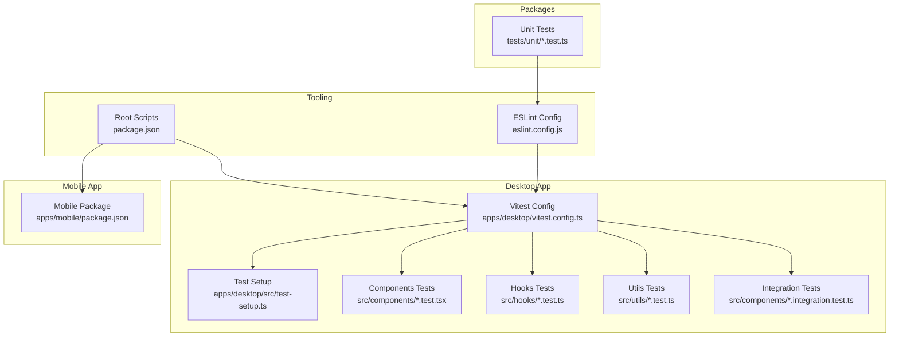
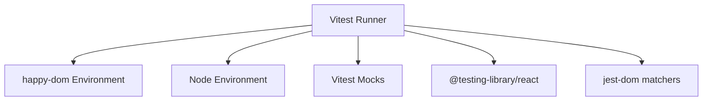
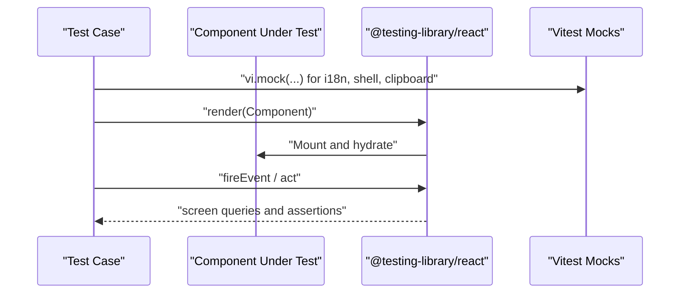
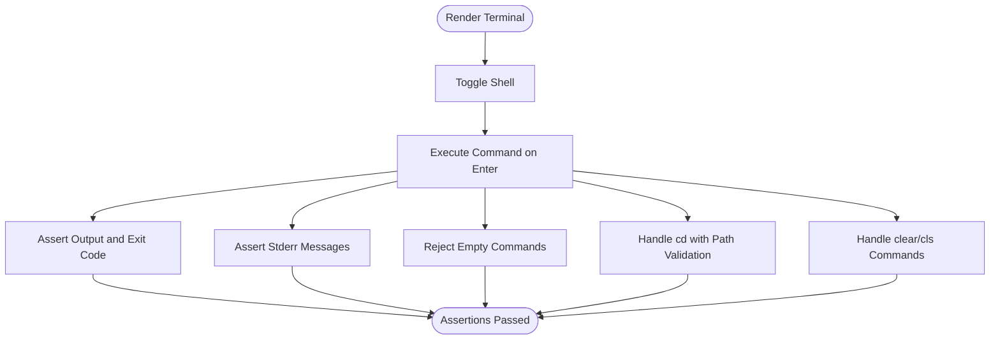
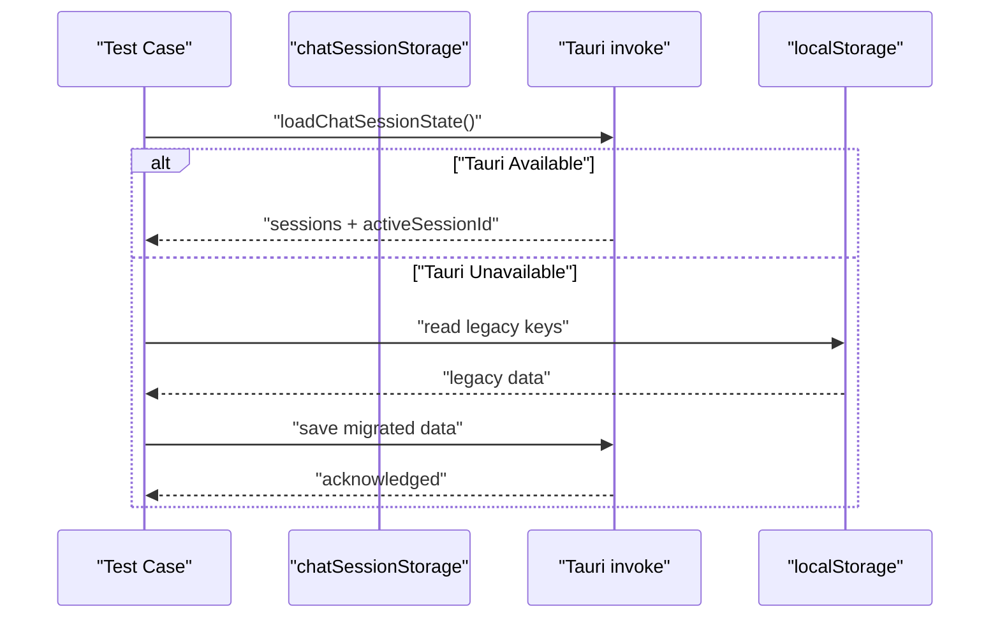
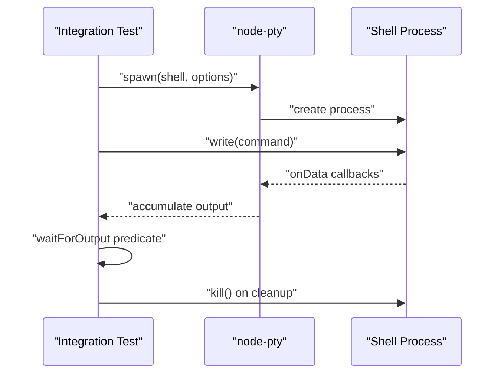
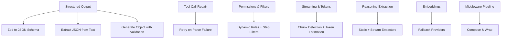
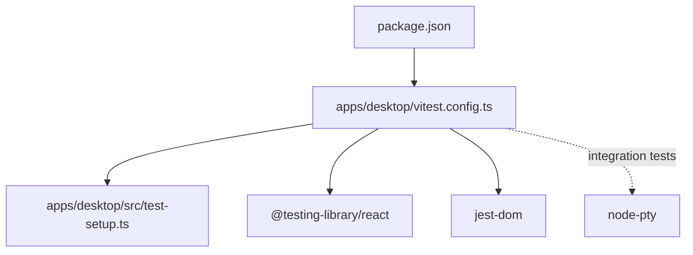

# Testing Best Practices and Guidelines

<cite>
**Referenced Files in This Document**
- [apps/desktop/vitest.config.ts](file://apps/desktop/vitest.config.ts)
- [apps/desktop/src/test-setup.ts](file://apps/desktop/src/test-setup.ts)
- [apps/desktop/package.json](file://apps/desktop/package.json)
- [apps/desktop/src/components/ChatMessageContent.test.tsx](file://apps/desktop/src/components/ChatMessageContent.test.tsx)
- [apps/desktop/src/components/Terminal.test.tsx](file://apps/desktop/src/components/Terminal.test.tsx)
- [apps/desktop/src/hooks/useChatSessions.test.ts](file://apps/desktop/src/hooks/useChatSessions.test.ts)
- [apps/desktop/src/utils/chatSessionStorage.test.ts](file://apps/desktop/src/utils/chatSessionStorage.test.ts)
- [apps/desktop/src/components/Terminal.integration.test.ts](file://apps/desktop/src/components/Terminal.integration.test.ts)
- [tests/unit/phase1.test.ts](file://tests/unit/phase1.test.ts)
- [eslint.config.js](file://eslint.config.js)
- [package.json](file://package.json)
- [apps/mobile/package.json](file://apps/mobile/package.json)
</cite>

## Table of Contents
1. [Introduction](#introduction)
2. [Project Structure](#project-structure)
3. [Core Components](#core-components)
4. [Architecture Overview](#architecture-overview)
5. [Detailed Component Analysis](#detailed-component-analysis)
6. [Dependency Analysis](#dependency-analysis)
7. [Performance Considerations](#performance-considerations)
8. [Troubleshooting Guide](#troubleshooting-guide)
9. [Conclusion](#conclusion)
10. [Appendices](#appendices)

## Introduction
This document defines comprehensive testing best practices and guidelines for the entire codebase. It consolidates testing standards, coding conventions, and quality assurance practices across desktop, mobile, and VS Code extension components. It documents test organization principles, naming conventions, structural patterns, mocking strategies, test data management, environment setup, cross-platform considerations, asynchronous and real-time testing patterns, debugging and logging techniques, maintenance and refactoring practices, documentation standards, and integration with development workflows and CI pipelines. The goal is to ensure maintainable, reliable, and scalable test suites that support robust development and release processes.

## Project Structure
The repository follows a monorepo layout with multiple applications and packages. Testing is primarily organized per-application with Vitest for unit and integration tests, and Playwright for end-to-end scenarios. Desktop tests leverage happy-dom for DOM simulation, while integration tests spawn real PTY processes using node-pty. ESLint and Prettier enforce code quality and formatting across the codebase.

**Diagram sources**
- [apps/desktop/vitest.config.ts:1-17](file://apps/desktop/vitest.config.ts#L1-L17)
- [apps/desktop/src/test-setup.ts:1-6](file://apps/desktop/src/test-setup.ts#L1-L6)
- [apps/desktop/src/components/ChatMessageContent.test.tsx:1-264](file://apps/desktop/src/components/ChatMessageContent.test.tsx#L1-L264)
- [apps/desktop/src/components/Terminal.test.tsx:1-320](file://apps/desktop/src/components/Terminal.test.tsx#L1-L320)
- [apps/desktop/src/hooks/useChatSessions.test.ts:1-316](file://apps/desktop/src/hooks/useChatSessions.test.ts#L1-L316)
- [apps/desktop/src/utils/chatSessionStorage.test.ts:1-67](file://apps/desktop/src/utils/chatSessionStorage.test.ts#L1-L67)
- [apps/desktop/src/components/Terminal.integration.test.ts:1-512](file://apps/desktop/src/components/Terminal.integration.test.ts#L1-L512)
- [tests/unit/phase1.test.ts:1-732](file://tests/unit/phase1.test.ts#L1-L732)
- [eslint.config.js:1-50](file://eslint.config.js#L1-L50)
- [package.json:1-55](file://package.json#L1-L55)
- [apps/mobile/package.json:1-44](file://apps/mobile/package.json#L1-L44)

**Section sources**
- [apps/desktop/vitest.config.ts:1-17](file://apps/desktop/vitest.config.ts#L1-L17)
- [apps/desktop/src/test-setup.ts:1-6](file://apps/desktop/src/test-setup.ts#L1-L6)
- [package.json:1-55](file://package.json#L1-L55)

## Core Components
- Test runner and environment
  - Vitest configured with happy-dom for DOM simulation and node environment for integration tests.
  - Global setup registers jest-dom matchers for UI assertions.
- Linting and formatting
  - ESLint enforces TypeScript strictness, unused variable rules, and console usage policies.
  - Formatting via Prettier is integrated into scripts.
- Cross-platform coverage
  - Desktop app tests cover React components, hooks, and utilities with platform-specific mocks.
  - Mobile app uses React Native; scripts and configurations are present for typechecking and linting.
  - VS Code extension is present but lacks explicit test configuration in the referenced files.

Key practices observed:
- Environment selection: @vitest-environment directive selects happy-dom for unit tests and node for integration requiring native addons.
- Mock-first approach: Third-party APIs (e.g., Tauri shell, i18n, clipboard) are mocked to isolate units.
- Asynchronous testing: Timers are faked for hooks and UI components; waits are used for DOM updates.
- Integration boundaries: Real PTY sessions are spawned for end-to-end verification of terminal behavior.

**Section sources**
- [apps/desktop/vitest.config.ts:1-17](file://apps/desktop/vitest.config.ts#L1-L17)
- [apps/desktop/src/test-setup.ts:1-6](file://apps/desktop/src/test-setup.ts#L1-L6)
- [apps/desktop/src/components/ChatMessageContent.test.tsx:1-264](file://apps/desktop/src/components/ChatMessageContent.test.tsx#L1-L264)
- [apps/desktop/src/components/Terminal.test.tsx:1-320](file://apps/desktop/src/components/Terminal.test.tsx#L1-L320)
- [apps/desktop/src/hooks/useChatSessions.test.ts:1-316](file://apps/desktop/src/hooks/useChatSessions.test.ts#L1-L316)
- [apps/desktop/src/utils/chatSessionStorage.test.ts:1-67](file://apps/desktop/src/utils/chatSessionStorage.test.ts#L1-L67)
- [apps/desktop/src/components/Terminal.integration.test.ts:1-512](file://apps/desktop/src/components/Terminal.integration.test.ts#L1-L512)
- [eslint.config.js:1-50](file://eslint.config.js#L1-L50)
- [apps/desktop/package.json:1-61](file://apps/desktop/package.json#L1-L61)
- [apps/mobile/package.json:1-44](file://apps/mobile/package.json#L1-L44)

## Architecture Overview
The testing architecture separates concerns across unit, integration, and end-to-end layers. Unit tests rely on happy-dom and Vitest’s mocking capabilities. Integration tests run in a Node environment to exercise native modules. E2E tests are orchestrated via Playwright in other parts of the repository. The desktop app’s test harness is configured centrally, while package-level tests reside under tests/unit.

**Diagram sources**
- [apps/desktop/vitest.config.ts:1-17](file://apps/desktop/vitest.config.ts#L1-L17)
- [apps/desktop/src/test-setup.ts:1-6](file://apps/desktop/src/test-setup.ts#L1-L6)

**Section sources**
- [apps/desktop/vitest.config.ts:1-17](file://apps/desktop/vitest.config.ts#L1-L17)
- [apps/desktop/src/test-setup.ts:1-6](file://apps/desktop/src/test-setup.ts#L1-L6)

## Detailed Component Analysis

### Desktop Component Tests
Desktop tests demonstrate strong adherence to isolation, deterministic behavior, and cross-platform compatibility. Representative patterns include:
- Component rendering and accessibility assertions with @testing-library/react.
- Mocking external dependencies (i18n, shell utilities, clipboard) to ensure reproducibility.
- Edge-case validations (XSS sanitization, long content rendering, deeply nested structures).
- Clipboard API mocking via Object.defineProperty due to happy-dom limitations.

**Diagram sources**
- [apps/desktop/src/components/ChatMessageContent.test.tsx:1-264](file://apps/desktop/src/components/ChatMessageContent.test.tsx#L1-L264)

**Section sources**
- [apps/desktop/src/components/ChatMessageContent.test.tsx:1-264](file://apps/desktop/src/components/ChatMessageContent.test.tsx#L1-L264)

### Terminal Component and Hook Tests
Terminal tests showcase robust mocking of Tauri shell plugin and Zustand store, ensuring deterministic command execution, shell toggling, and error handling. Hook tests utilize fake timers and act helpers to stabilize asynchronous effects and microtasks.

**Diagram sources**
- [apps/desktop/src/components/Terminal.test.tsx:1-320](file://apps/desktop/src/components/Terminal.test.tsx#L1-L320)

**Section sources**
- [apps/desktop/src/components/Terminal.test.tsx:1-320](file://apps/desktop/src/components/Terminal.test.tsx#L1-L320)
- [apps/desktop/src/hooks/useChatSessions.test.ts:1-316](file://apps/desktop/src/hooks/useChatSessions.test.ts#L1-L316)

### Chat Session Storage Tests
These tests validate persistence migration and fallback mechanisms between Tauri backend and localStorage. They demonstrate careful setup of global mocks and assertion of migration behavior.

**Diagram sources**
- [apps/desktop/src/utils/chatSessionStorage.test.ts:1-67](file://apps/desktop/src/utils/chatSessionStorage.test.ts#L1-L67)

**Section sources**
- [apps/desktop/src/utils/chatSessionStorage.test.ts:1-67](file://apps/desktop/src/utils/chatSessionStorage.test.ts#L1-L67)

### Terminal Integration Tests (PTY)
Integration tests spawn real PTY sessions via node-pty and validate end-to-end I/O, session lifecycle, idle timeouts, and cleanup semantics. These tests override the default environment to node and use asynchronous output accumulation with timeouts.

**Diagram sources**
- [apps/desktop/src/components/Terminal.integration.test.ts:1-512](file://apps/desktop/src/components/Terminal.integration.test.ts#L1-L512)

**Section sources**
- [apps/desktop/src/components/Terminal.integration.test.ts:1-512](file://apps/desktop/src/components/Terminal.integration.test.ts#L1-L512)

### AI Engine Unit Tests
Package-level unit tests validate structured output generation, error hierarchies, tool call repair, permissions, streaming, token calculation, reasoning extraction, embeddings, and middleware composition. These tests emphasize deterministic mocking and schema-driven validation.

**Diagram sources**
- [tests/unit/phase1.test.ts:1-732](file://tests/unit/phase1.test.ts#L1-L732)

**Section sources**
- [tests/unit/phase1.test.ts:1-732](file://tests/unit/phase1.test.ts#L1-L732)

## Dependency Analysis
Testing dependencies and their relationships:
- Desktop Vitest configuration depends on React plugin, happy-dom environment, and a centralized test setup.
- Desktop tests depend on @testing-library/react and jest-dom for assertions.
- Integration tests depend on node-pty and require node environment.
- Root scripts orchestrate test execution across packages and apps.

**Diagram sources**
- [apps/desktop/vitest.config.ts:1-17](file://apps/desktop/vitest.config.ts#L1-L17)
- [apps/desktop/src/test-setup.ts:1-6](file://apps/desktop/src/test-setup.ts#L1-L6)
- [apps/desktop/package.json:1-61](file://apps/desktop/package.json#L1-L61)
- [apps/desktop/src/components/Terminal.integration.test.ts:1-512](file://apps/desktop/src/components/Terminal.integration.test.ts#L1-L512)
- [package.json:1-55](file://package.json#L1-L55)

**Section sources**
- [apps/desktop/vitest.config.ts:1-17](file://apps/desktop/vitest.config.ts#L1-L17)
- [apps/desktop/src/test-setup.ts:1-6](file://apps/desktop/src/test-setup.ts#L1-L6)
- [apps/desktop/package.json:1-61](file://apps/desktop/package.json#L1-L61)
- [package.json:1-55](file://package.json#L1-L55)

## Performance Considerations
- Prefer happy-dom for unit tests to minimize overhead; reserve node environment for native addon tests.
- Use fake timers to avoid real delays in asynchronous hooks and UI interactions.
- Limit heavy DOM rendering in unit tests; prefer focused component tests with minimal props.
- For integration tests, manage process lifecycles carefully to prevent resource leaks.
- Keep test fixtures small and deterministic; avoid expensive I/O in hot paths.
- Parallelize independent tests where possible; avoid shared mutable state between tests.

## Troubleshooting Guide
Common issues and remedies:
- Clipboard API failures in happy-dom
  - Symptom: Clipboard-related tests fail due to read-only descriptors.
  - Fix: Use Object.defineProperty to override navigator.clipboard with a mock.
  - Reference: [apps/desktop/src/components/ChatMessageContent.test.tsx:34-41](file://apps/desktop/src/components/ChatMessageContent.test.tsx#L34-L41)
- Mock cleanup and isolation
  - Symptom: Tests leak state or interfere with each other.
  - Fix: Clear mocks in beforeEach and restore timers in afterEach.
  - References:
    - [apps/desktop/src/components/ChatMessageContent.test.tsx:46-48](file://apps/desktop/src/components/ChatMessageContent.test.tsx#L46-L48)
    - [apps/desktop/src/hooks/useChatSessions.test.ts:57-61](file://apps/desktop/src/hooks/useChatSessions.test.ts#L57-L61)
- Asynchronous timing issues
  - Symptom: Tests flake due to timers or microtasks.
  - Fix: Use fake timers and act helpers; ensure waits for DOM updates.
  - References:
    - [apps/desktop/src/hooks/useChatSessions.test.ts:11-22](file://apps/desktop/src/hooks/useChatSessions.test.ts#L11-L22)
    - [apps/desktop/src/components/Terminal.test.tsx:116-130](file://apps/desktop/src/components/Terminal.test.tsx#L116-L130)
- Integration test stability
  - Symptom: PTY tests hang or fail intermittently.
  - Fix: Implement robust output accumulation with timeouts; ensure cleanup in afterEach/afterAll.
  - Reference: [apps/desktop/src/components/Terminal.integration.test.ts:40-71](file://apps/desktop/src/components/Terminal.integration.test.ts#L40-L71)
- Lint and format errors blocking tests
  - Symptom: Pre-commit hooks or CI fail due to lint/format violations.
  - Fix: Run lint and format scripts; align with eslint.config.js rules.
  - References:
    - [eslint.config.js:1-50](file://eslint.config.js#L1-L50)
    - [package.json:18-20](file://package.json#L18-L20)

**Section sources**
- [apps/desktop/src/components/ChatMessageContent.test.tsx:34-41](file://apps/desktop/src/components/ChatMessageContent.test.tsx#L34-L41)
- [apps/desktop/src/hooks/useChatSessions.test.ts:11-22](file://apps/desktop/src/hooks/useChatSessions.test.ts#L11-L22)
- [apps/desktop/src/components/Terminal.test.tsx:116-130](file://apps/desktop/src/components/Terminal.test.tsx#L116-L130)
- [apps/desktop/src/components/Terminal.integration.test.ts:40-71](file://apps/desktop/src/components/Terminal.integration.test.ts#L40-L71)
- [eslint.config.js:1-50](file://eslint.config.js#L1-L50)
- [package.json:18-20](file://package.json#L18-L20)

## Conclusion
The project employs a layered testing strategy with clear separation between unit, integration, and E2E concerns. Desktop tests exemplify best practices in mocking, deterministic environments, and cross-platform compatibility. Integration tests validate real-world behavior using native modules. Linting and formatting standards ensure consistent code quality. Adopting these patterns across mobile and VS Code extension components will strengthen reliability and maintainability.

## Appendices

### Testing Standards and Naming Conventions
- File naming
  - Unit tests: *.test.ts or *.test.tsx
  - Integration tests: *.integration.test.ts
- Describe blocks
  - Group related behaviors under descriptive titles.
- Test functions
  - Use it() for individual assertions; group related checks within the same test.
- Mocking
  - Isolate external dependencies via vi.mock and setup files.
- Environment selection
  - Use @vitest-environment happy-dom for DOM-dependent tests; node for native addons.
- Assertions
  - Prefer @testing-library queries and jest-dom matchers for semantic assertions.

### Cross-Platform Testing Considerations
- Desktop
  - Mock Tauri APIs and shell integrations; validate platform-specific behavior via conditional logic in tests.
- Mobile
  - Validate React Native components and services; ensure scripts for typecheck and lint are available.
- VS Code Extension
  - Confirm presence of test configuration and environment setup; align with desktop patterns.

### Asynchronous and Real-Time Patterns
- Hooks and UI
  - Fake timers and act helpers for stable async flows.
- Streaming and middleware
  - Validate chunking, pacing, and token estimation with controlled inputs.
- Real-time communication
  - Use fake timers and deterministic mocks for socket and provider interactions.

### Test Data Management
- Local storage mocks for persistence fallbacks.
- Fixture data for permissions, tool call repair, and streaming metrics.
- Minimal, deterministic datasets to reduce flakiness.

### Debugging and Logging
- Use console.warn/error sparingly; leverage test logs to capture state snapshots.
- Add targeted logs around complex flows to aid diagnosis.
- Prefer focused tests with clear assertions to simplify debugging.

### Maintenance and Refactoring
- Keep tests independent; avoid shared mutable state.
- Refactor large describe blocks into smaller, cohesive units.
- Update mocks when underlying APIs change; ensure migrations remain backward compatible.

### CI and Workflows
- Root scripts orchestrate lint, typecheck, and test execution.
- Integrate ESLint and formatting checks into pre-commit and CI pipelines.
- Partition tests by platform and package to optimize CI runtime.

**Section sources**
- [package.json:1-55](file://package.json#L1-L55)
- [apps/mobile/package.json:1-44](file://apps/mobile/package.json#L1-L44)