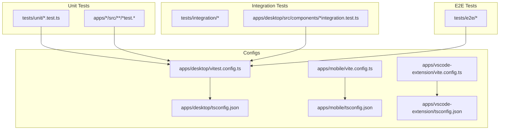
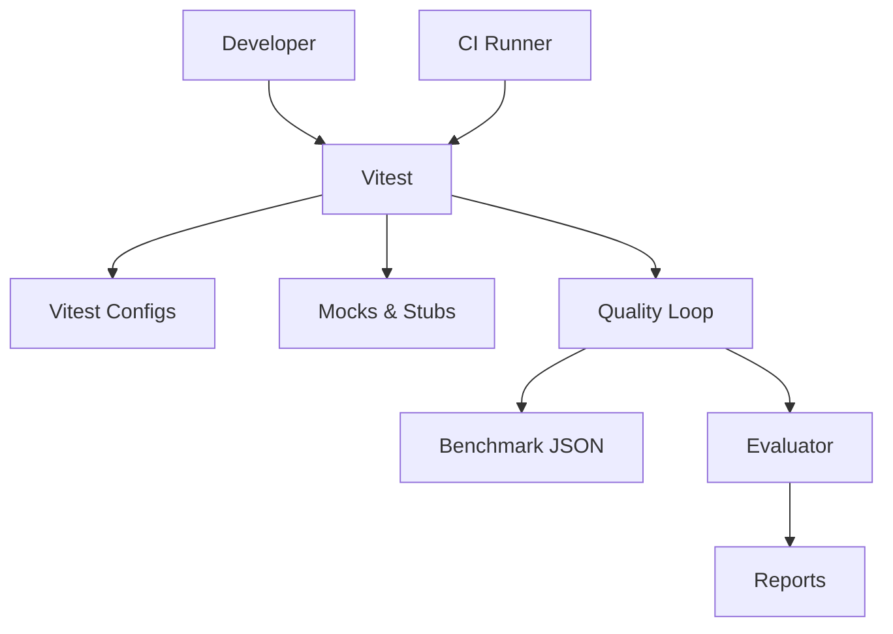
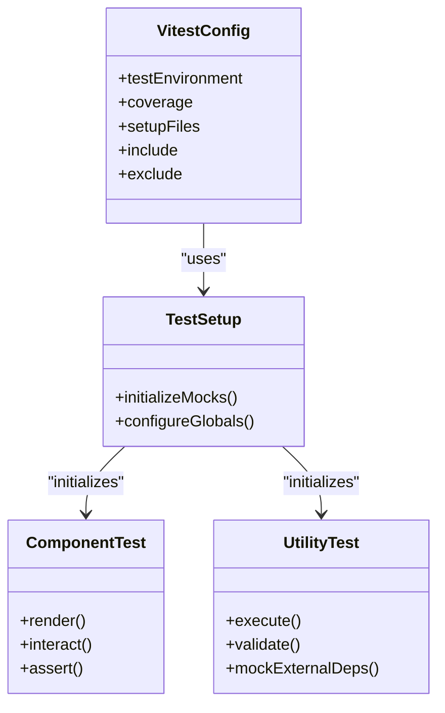
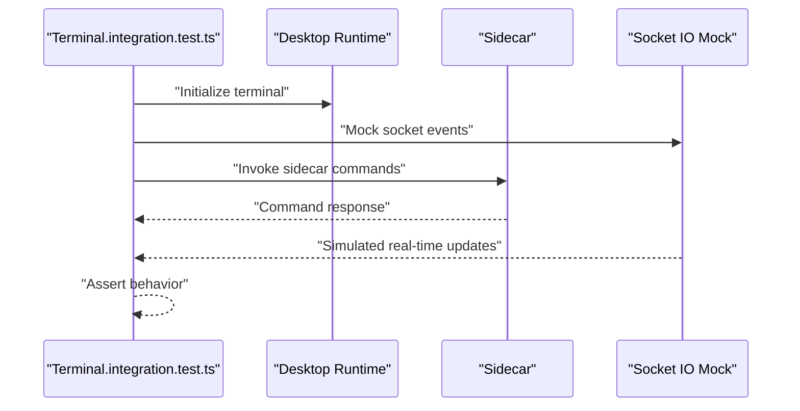
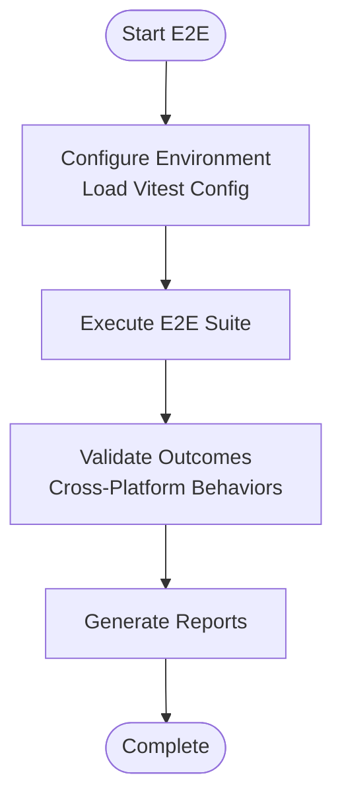
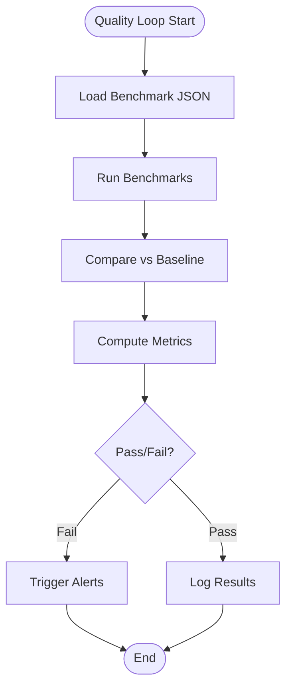
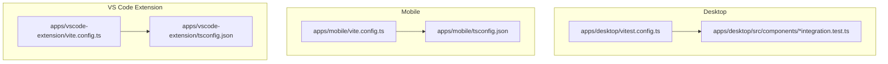
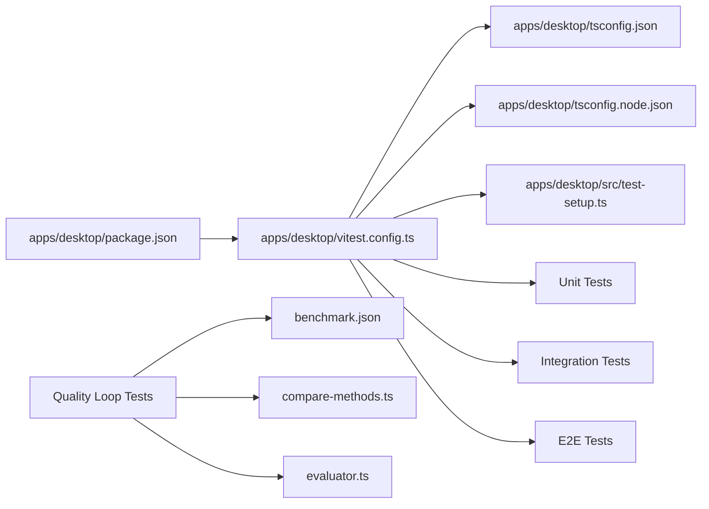

# Testing Strategy

<cite>
**Referenced Files in This Document**
- [vitest.config.ts](file://apps/desktop/vitest.config.ts)
- [test-setup.ts](file://apps/desktop/src/test-setup.ts)
- [Terminal.integration.test.ts](file://apps/desktop/src/components/Terminal.integration.test.ts)
- [ChatMessageContent.test.tsx](file://apps/desktop/src/components/ChatMessageContent.test.tsx)
- [ErrorFallback.test.tsx](file://apps/desktop/src/components/ErrorFallback.test.tsx)
- [useChatSessions.test.ts](file://apps/desktop/src/hooks/useChatSessions.test.ts)
- [chatSessionStorage.test.ts](file://apps/desktop/src/utils/chatSessionStorage.test.ts)
- [shell.test.ts](file://apps/desktop/src/utils/shell.test.ts)
- [Terminal.test.tsx](file://apps/desktop/src/components/Terminal.test.tsx)
- [socket-io-mock.ts](file://tests/unit/socket-io-mock.ts)
- [socket-io-relay-mock.ts](file://tests/unit/socket-io-relay-mock.ts)
- [screenshot-desktop-mock.ts](file://tests/unit/screenshot-desktop-mock.ts)
- [phase5-platform.test.ts](file://tests/unit/phase5-platform.test.ts)
- [phase6-relay.test.ts](file://tests/unit/phase6-relay.test.ts)
- [phase7-agentic.test.ts](file://tests/unit/phase7-agentic.test.ts)
- [phase8-advanced.test.ts](file://tests/unit/phase8-advanced.test.ts)
- [security.test.ts](file://tests/unit/security.test.ts)
- [communicationServer.test.ts](file://tests/unit/communicationServer.test.ts)
- [sharedUtils.test.ts](file://tests/unit/sharedUtils.test.ts)
- [gitWorkflow.test.ts](file://tests/unit/gitWorkflow.test.ts)
- [markdownChecks.test.ts](file://tests/unit/markdownChecks.test.ts)
- [registry.test.ts](file://tests/unit/registry.test.ts)
- [astLock.test.ts](file://tests/unit/astLock.test.ts)
- [crypto.test.ts](file://tests/unit/crypto.test.ts)
- [fileExplorer.test.ts](file://tests/unit/fileExplorer.test.ts)
- [telepresence.test.ts](file://tests/unit/telepresence.test.ts)
- [scti.test.ts](file://tests/unit/scti.test.ts)
- [e2e-integration.test.ts](file://tests/e2e/e2e-integration.test.ts)
- [benchmark.json](file://tests/quality-loop/benchmark.json)
- [compare-methods.ts](file://tests/quality-loop/compare-methods.ts)
- [evaluator.ts](file://tests/quality-loop/evaluator.ts)
- [qualityLoop.test.ts](file://tests/quality-loop/qualityLoop.test.ts)
- [package.json](file://apps/desktop/package.json)
- [vite.config.ts](file://apps/desktop/vite.config.ts)
- [tsconfig.json](file://apps/desktop/tsconfig.json)
- [tsconfig.node.json](file://apps/desktop/tsconfig.node.json)
- [vite.config.ts](file://apps/mobile/vite.config.ts)
- [package.json](file://apps/mobile/package.json)
- [tsconfig.json](file://apps/mobile/tsconfig.json)
- [tsconfig.node.json](file://apps/mobile/tsconfig.node.json)
- [vite.config.ts](file://apps/vscode-extension/vite.config.ts)
- [package.json](file://apps/vscode-extension/package.json)
- [tsconfig.json](file://apps/vscode-extension/tsconfig.json)
- [tsconfig.node.json](file://apps/vscode-extension/tsconfig.node.json)
- [README.md](file://README.md)
- [CONTRIBUTING.md](file://CONTRIBUTING.md)
</cite>

## Table of Contents
1. [Introduction](#introduction)
2. [Project Structure](#project-structure)
3. [Core Components](#core-components)
4. [Architecture Overview](#architecture-overview)
5. [Detailed Component Analysis](#detailed-component-analysis)
6. [Dependency Analysis](#dependency-analysis)
7. [Performance Considerations](#performance-considerations)
8. [Troubleshooting Guide](#troubleshooting-guide)
9. [Conclusion](#conclusion)
10. [Appendices](#appendices)

## Introduction
This document describes the Testing Strategy and Quality Assurance system implemented across the monorepo. It explains the multi-level testing approach spanning unit, integration, and end-to-end (E2E) testing, with a focus on:
- Unit testing with Vitest for isolated component and utility validation
- Integration testing for cross-platform functionality (desktop, mobile, VS Code extension)
- E2E testing for complete user workflows
- Test configuration, mocking strategies, and environment management
- Quality loop implementation for continuous evaluation via automated benchmarks and metrics
- Patterns for component testing, API integration testing, and real-time communication testing
- Cross-platform testing strategies and CI considerations
- Performance, security, and regression testing approaches
- Execution workflows and reporting mechanisms

## Project Structure
The testing system is organized into three primary suites:
- Unit tests: Located under tests/unit and package-specific test folders, validating individual units and utilities
- Integration tests: Found in tests/integration and platform-specific component integration tests (e.g., Terminal.integration.test.ts)
- E2E tests: Located under tests/e2e, covering complete user workflows

Vitest is configured per application/package with dedicated config files. Desktop, mobile, and VS Code extension each maintain separate Vitest configurations and TypeScript settings tailored to their environments.

**Diagram sources**
- [vitest.config.ts](file://apps/desktop/vitest.config.ts)
- [vite.config.ts](file://apps/mobile/vite.config.ts)
- [vite.config.ts](file://apps/vscode-extension/vite.config.ts)
- [tsconfig.json](file://apps/desktop/tsconfig.json)
- [tsconfig.json](file://apps/mobile/tsconfig.json)
- [tsconfig.json](file://apps/vscode-extension/tsconfig.json)

**Section sources**
- [vitest.config.ts](file://apps/desktop/vitest.config.ts)
- [vite.config.ts](file://apps/mobile/vite.config.ts)
- [vite.config.ts](file://apps/vscode-extension/vite.config.ts)
- [tsconfig.json](file://apps/desktop/tsconfig.json)
- [tsconfig.json](file://apps/mobile/tsconfig.json)
- [tsconfig.json](file://apps/vscode-extension/tsconfig.json)

## Core Components
- Vitest configuration and test setup:
  - Centralized Vitest configuration for the desktop app defines test patterns, environment, and coverage settings
  - Shared test setup initializes global mocks and environment helpers for consistent test runs
- Mocking strategies:
  - Socket IO mocks for real-time communication testing
  - Relay mocks for relay server interactions
  - Desktop screenshot mocks for UI capture validations
- Quality loop:
  - Automated benchmarking and evaluation pipeline with JSON benchmark definitions and comparison utilities
  - Continuous evaluation of system performance and functionality metrics

Key unit tests demonstrate component-level validation, hook behavior, utility functions, and platform-specific integrations. Integration tests validate cross-component and cross-package interactions. E2E tests simulate end-to-end user journeys.

**Section sources**
- [vitest.config.ts](file://apps/desktop/vitest.config.ts)
- [test-setup.ts](file://apps/desktop/src/test-setup.ts)
- [socket-io-mock.ts](file://tests/unit/socket-io-mock.ts)
- [socket-io-relay-mock.ts](file://tests/unit/socket-io-relay-mock.ts)
- [screenshot-desktop-mock.ts](file://tests/unit/screenshot-desktop-mock.ts)
- [benchmark.json](file://tests/quality-loop/benchmark.json)
- [compare-methods.ts](file://tests/quality-loop/compare-methods.ts)
- [evaluator.ts](file://tests/quality-loop/evaluator.ts)
- [qualityLoop.test.ts](file://tests/quality-loop/qualityLoop.test.ts)

## Architecture Overview
The testing architecture integrates platform-specific configurations with a unified quality loop. Vitest orchestrates test discovery and execution across unit, integration, and E2E layers. Mocks isolate external dependencies for deterministic testing. The quality loop periodically evaluates performance and functional metrics against baselines.

**Diagram sources**
- [vitest.config.ts](file://apps/desktop/vitest.config.ts)
- [benchmark.json](file://tests/quality-loop/benchmark.json)
- [evaluator.ts](file://tests/quality-loop/evaluator.ts)
- [qualityLoop.test.ts](file://tests/quality-loop/qualityLoop.test.ts)

## Detailed Component Analysis

### Unit Testing with Vitest
- Coverage and environment:
  - Vitest configuration enables DOM-like globals and sets the test environment suitable for component and utility tests
  - TypeScript configs define module resolution and path aliases for accurate imports during tests
- Component tests:
  - Example: Terminal component tests validate rendering and behavior under various conditions
  - Example: ChatMessageContent and ErrorFallback tests ensure UI correctness and error handling
- Hook and utility tests:
  - useChatSessions tests validate session management logic
  - chatSessionStorage tests validate persistence and retrieval
  - shell utility tests validate process execution and environment interactions
- Package-level unit tests:
  - Platform, relay, agentic, advanced, security, communication, shared utilities, git workflow, markdown checks, registry, AST lock, cryptography, file explorer, telepresence, SCTI, and more

**Diagram sources**
- [vitest.config.ts](file://apps/desktop/vitest.config.ts)
- [test-setup.ts](file://apps/desktop/src/test-setup.ts)

**Section sources**
- [vitest.config.ts](file://apps/desktop/vitest.config.ts)
- [test-setup.ts](file://apps/desktop/src/test-setup.ts)
- [Terminal.test.tsx](file://apps/desktop/src/components/Terminal.test.tsx)
- [ChatMessageContent.test.tsx](file://apps/desktop/src/components/ChatMessageContent.test.tsx)
- [ErrorFallback.test.tsx](file://apps/desktop/src/components/ErrorFallback.test.tsx)
- [useChatSessions.test.ts](file://apps/desktop/src/hooks/useChatSessions.test.ts)
- [chatSessionStorage.test.ts](file://apps/desktop/src/utils/chatSessionStorage.test.ts)
- [shell.test.ts](file://apps/desktop/src/utils/shell.test.ts)
- [phase5-platform.test.ts](file://tests/unit/phase5-platform.test.ts)
- [phase6-relay.test.ts](file://tests/unit/phase6-relay.test.ts)
- [phase7-agentic.test.ts](file://tests/unit/phase7-agentic.test.ts)
- [phase8-advanced.test.ts](file://tests/unit/phase8-advanced.test.ts)
- [security.test.ts](file://tests/unit/security.test.ts)
- [communicationServer.test.ts](file://tests/unit/communicationServer.test.ts)
- [sharedUtils.test.ts](file://tests/unit/sharedUtils.test.ts)
- [gitWorkflow.test.ts](file://tests/unit/gitWorkflow.test.ts)
- [markdownChecks.test.ts](file://tests/unit/markdownChecks.test.ts)
- [registry.test.ts](file://tests/unit/registry.test.ts)
- [astLock.test.ts](file://tests/unit/astLock.test.ts)
- [crypto.test.ts](file://tests/unit/crypto.test.ts)
- [fileExplorer.test.ts](file://tests/unit/fileExplorer.test.ts)
- [telepresence.test.ts](file://tests/unit/telepresence.test.ts)
- [scti.test.ts](file://tests/unit/scti.test.ts)

### Integration Testing for Cross-Platform Functionality
- Desktop integration:
  - Terminal.integration.test.ts validates terminal behavior in the desktop environment, ensuring proper integration with Tauri and sidecar components
- Cross-package integration:
  - Platform, relay, agentic, and advanced integration tests validate inter-module dependencies and data flow
- Real-time communication:
  - Socket IO and relay mocks enable deterministic testing of real-time events and server interactions

**Diagram sources**
- [Terminal.integration.test.ts](file://apps/desktop/src/components/Terminal.integration.test.ts)
- [socket-io-mock.ts](file://tests/unit/socket-io-mock.ts)
- [socket-io-relay-mock.ts](file://tests/unit/socket-io-relay-mock.ts)

**Section sources**
- [Terminal.integration.test.ts](file://apps/desktop/src/components/Terminal.integration.test.ts)
- [socket-io-mock.ts](file://tests/unit/socket-io-mock.ts)
- [socket-io-relay-mock.ts](file://tests/unit/socket-io-relay-mock.ts)
- [phase5-platform.test.ts](file://tests/unit/phase5-platform.test.ts)
- [phase6-relay.test.ts](file://tests/unit/phase6-relay.test.ts)
- [phase7-agentic.test.ts](file://tests/unit/phase7-agentic.test.ts)
- [phase8-advanced.test.ts](file://tests/unit/phase8-advanced.test.ts)

### End-to-End Testing for Complete User Workflows
- E2E integration tests:
  - e2e-integration.test.ts simulates end-to-end user journeys across components and platforms
- Test environment:
  - Vitest configuration and platform-specific Vite configs support E2E execution environments

**Diagram sources**
- [e2e-integration.test.ts](file://tests/e2e/e2e-integration.test.ts)
- [vitest.config.ts](file://apps/desktop/vitest.config.ts)

**Section sources**
- [e2e-integration.test.ts](file://tests/e2e/e2e-integration.test.ts)
- [vitest.config.ts](file://apps/desktop/vitest.config.ts)

### Quality Loop Implementation
- Benchmarking:
  - benchmark.json defines baseline metrics and thresholds for performance and functional evaluations
- Evaluation:
  - compare-methods.ts compares current results against baselines
  - evaluator.ts computes metrics and determines pass/fail outcomes
  - qualityLoop.test.ts orchestrates the evaluation workflow
- Reporting:
  - Results are aggregated and surfaced for continuous monitoring and regression detection

**Diagram sources**
- [benchmark.json](file://tests/quality-loop/benchmark.json)
- [compare-methods.ts](file://tests/quality-loop/compare-methods.ts)
- [evaluator.ts](file://tests/quality-loop/evaluator.ts)
- [qualityLoop.test.ts](file://tests/quality-loop/qualityLoop.test.ts)

**Section sources**
- [benchmark.json](file://tests/quality-loop/benchmark.json)
- [compare-methods.ts](file://tests/quality-loop/compare-methods.ts)
- [evaluator.ts](file://tests/quality-loop/evaluator.ts)
- [qualityLoop.test.ts](file://tests/quality-loop/qualityLoop.test.ts)

### Cross-Platform Testing Strategies
- Desktop:
  - Vitest configuration and component tests validate UI and runtime behavior
  - Integration tests validate terminal and sidecar interactions
- Mobile:
  - Platform-specific Vite and TypeScript configs support React Native testing
- VS Code Extension:
  - Dedicated Vitest configuration and TypeScript settings for extension testing

**Diagram sources**
- [vitest.config.ts](file://apps/desktop/vitest.config.ts)
- [vite.config.ts](file://apps/mobile/vite.config.ts)
- [tsconfig.json](file://apps/mobile/tsconfig.json)
- [vite.config.ts](file://apps/vscode-extension/vite.config.ts)
- [tsconfig.json](file://apps/vscode-extension/tsconfig.json)

**Section sources**
- [vitest.config.ts](file://apps/desktop/vitest.config.ts)
- [vite.config.ts](file://apps/mobile/vite.config.ts)
- [tsconfig.json](file://apps/mobile/tsconfig.json)
- [vite.config.ts](file://apps/vscode-extension/vite.config.ts)
- [tsconfig.json](file://apps/vscode-extension/tsconfig.json)

## Dependency Analysis
- Test configuration dependencies:
  - Desktop Vitest config depends on TypeScript configs and package.json scripts
  - Mobile and VS Code extension configs mirror similar patterns for their platforms
- Mock dependencies:
  - Socket IO and relay mocks decouple tests from external systems, enabling reliable assertions
- Quality loop dependencies:
  - Evaluator relies on benchmark definitions and comparison utilities

**Diagram sources**
- [package.json](file://apps/desktop/package.json)
- [vitest.config.ts](file://apps/desktop/vitest.config.ts)
- [tsconfig.json](file://apps/desktop/tsconfig.json)
- [tsconfig.node.json](file://apps/desktop/tsconfig.node.json)
- [test-setup.ts](file://apps/desktop/src/test-setup.ts)
- [benchmark.json](file://tests/quality-loop/benchmark.json)
- [compare-methods.ts](file://tests/quality-loop/compare-methods.ts)
- [evaluator.ts](file://tests/quality-loop/evaluator.ts)

**Section sources**
- [package.json](file://apps/desktop/package.json)
- [vitest.config.ts](file://apps/desktop/vitest.config.ts)
- [tsconfig.json](file://apps/desktop/tsconfig.json)
- [tsconfig.node.json](file://apps/desktop/tsconfig.node.json)
- [test-setup.ts](file://apps/desktop/src/test-setup.ts)
- [benchmark.json](file://tests/quality-loop/benchmark.json)
- [compare-methods.ts](file://tests/quality-loop/compare-methods.ts)
- [evaluator.ts](file://tests/quality-loop/evaluator.ts)

## Performance Considerations
- Benchmark-driven performance validation:
  - Use benchmark.json to define performance baselines and thresholds
  - compare-methods.ts and evaluator.ts provide automated comparisons and metric computation
- Test isolation and speed:
  - Mock external dependencies to avoid flaky and slow tests
  - Prefer unit tests for fast feedback loops; reserve integration and E2E tests for cross-boundary validations
- Coverage and noise reduction:
  - Configure Vitest coverage thresholds to ensure meaningful test coverage without over-testing

[No sources needed since this section provides general guidance]

## Troubleshooting Guide
- Common issues and resolutions:
  - Environment mismatches: Verify Vitest and TypeScript configs align with platform requirements
  - Mock inconsistencies: Ensure mocks are initialized in test-setup and applied consistently across suites
  - Quality loop failures: Review benchmark.json thresholds and evaluator logic to identify regressions
- Debugging tips:
  - Enable verbose logging in Vitest for failing tests
  - Use targeted test filtering to isolate problematic suites
  - Validate mock expectations after each test run

**Section sources**
- [vitest.config.ts](file://apps/desktop/vitest.config.ts)
- [test-setup.ts](file://apps/desktop/src/test-setup.ts)
- [benchmark.json](file://tests/quality-loop/benchmark.json)
- [evaluator.ts](file://tests/quality-loop/evaluator.ts)

## Conclusion
The Testing Strategy leverages a robust multi-level approach powered by Vitest, comprehensive mocking, and a quality loop for continuous evaluation. Unit, integration, and E2E tests collectively ensure reliability across desktop, mobile, and VS Code extension platforms. The documented patterns and configurations provide a scalable foundation for maintaining high-quality standards while supporting rapid iteration and cross-platform development.

[No sources needed since this section summarizes without analyzing specific files]

## Appendices

### Test Organization Summary
- Unit tests: Component, hook, and utility validations
- Integration tests: Cross-component and cross-package interactions
- E2E tests: End-to-end user workflows
- Quality loop: Automated benchmarking and evaluation

**Section sources**
- [vitest.config.ts](file://apps/desktop/vitest.config.ts)
- [e2e-integration.test.ts](file://tests/e2e/e2e-integration.test.ts)
- [qualityLoop.test.ts](file://tests/quality-loop/qualityLoop.test.ts)

### Best Practices Checklist
- Write focused unit tests with clear assertions
- Use mocks for external dependencies
- Keep integration tests minimal and deterministic
- Validate E2E workflows regularly in CI
- Monitor quality loop metrics and address regressions promptly
- Maintain consistent TypeScript and Vitest configurations across platforms

[No sources needed since this section provides general guidance]