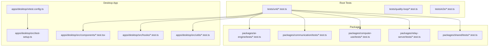
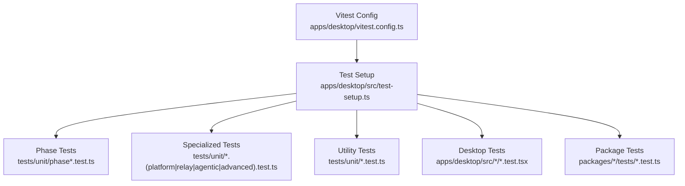
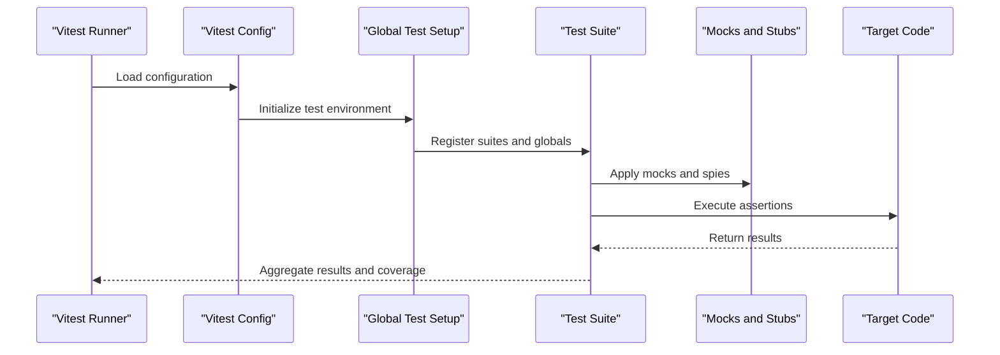
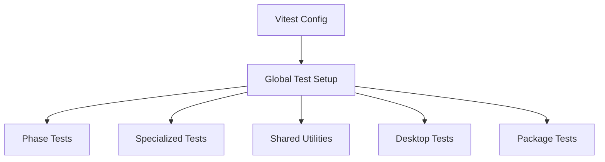

# Unit Testing

<cite>
**Referenced Files in This Document**
- [vitest.config.ts](file://apps/desktop/vitest.config.ts)
- [test-setup.ts](file://apps/desktop/src/test-setup.ts)
- [phase1.test.ts](file://tests/unit/phase1.test.ts)
- [phase2.test.ts](file://tests/unit/phase2.test.ts)
- [phase5-platform.test.ts](file://tests/unit/phase5-platform.test.ts)
- [phase6-relay.test.ts](file://tests/unit/phase6-relay.test.ts)
- [phase7-agentic.test.ts](file://tests/unit/phase7-agentic.test.ts)
- [phase8-advanced.test.ts](file://tests/unit/phase8-advanced.test.ts)
- [orchestrator.test.ts](file://tests/unit/orchestrator.test.ts)
- [communicationServer.test.ts](file://tests/unit/communicationServer.test.ts)
- [socket-io-mock.ts](file://tests/unit/socket-io-mock.ts)
- [socket-io-relay-mock.ts](file://tests/unit/socket-io-relay-mock.ts)
- [screenshot-desktop-mock.ts](file://tests/unit/screenshot-desktop-mock.ts)
- [sharedUtils.test.ts](file://tests/unit/sharedUtils.test.ts)
- [registry.test.ts](file://tests/unit/registry.test.ts)
- [configLoader.test.ts](file://tests/unit/configLoader.test.ts)
- [crypto.test.ts](file://tests/unit/crypto.test.ts)
- [security.test.ts](file://tests/unit/security.test.ts)
- [markdownChecks.test.ts](file://tests/unit/markdownChecks.test.ts)
- [gitWorkflow.test.ts](file://tests/unit/gitWorkflow.test.ts)
- [fileExplorer.test.ts](file://tests/unit/fileExplorer.test.ts)
- [telepresence.test.ts](file://tests/unit/telepresence.test.ts)
- [scti.test.ts](file://tests/unit/scti.test.ts)
- [astLock.test.ts](file://tests/unit/astLock.test.ts)
- [qualityLoop.test.ts](file://tests/quality-loop/qualityLoop.test.ts)
- [e2e-integration.test.ts](file://tests/e2e/e2e-integration.test.ts)
- [Terminal.integration.test.ts](file://apps/desktop/src/components/Terminal.integration.test.ts)
- [useChatSessions.test.ts](file://apps/desktop/src/hooks/useChatSessions.test.ts)
- [chatSessionStorage.test.ts](file://apps/desktop/src/utils/chatSessionStorage.test.ts)
- [shell.test.ts](file://apps/desktop/src/utils/shell.test.ts)
- [ErrorFallback.test.tsx](file://apps/desktop/src/components/ErrorFallback.test.tsx)
- [ChatMessageContent.test.tsx](file://apps/desktop/src/components/ChatMessageContent.test.tsx)
- [Terminal.test.tsx](file://apps/desktop/src/components/Terminal.test.tsx)
</cite>

## Table of Contents
1. [Introduction](#introduction)
2. [Project Structure](#project-structure)
3. [Core Components](#core-components)
4. [Architecture Overview](#architecture-overview)
5. [Detailed Component Analysis](#detailed-component-analysis)
6. [Dependency Analysis](#dependency-analysis)
7. [Performance Considerations](#performance-considerations)
8. [Troubleshooting Guide](#troubleshooting-guide)
9. [Conclusion](#conclusion)
10. [Appendices](#appendices)

## Introduction
This document describes the unit testing framework and implementation used across the project. It explains the Vitest-based setup, test configuration, and testing patterns applied to orchestrator functionality, platform-specific components, relay server operations, agentic systems, and advanced features. It also documents test organization by feature phases (phase1–phase8), specialized categories, utilities, mocks for external dependencies, and environment setup. Guidance is provided for writing effective unit tests, naming conventions, assertion patterns, edge cases, error conditions, and boundary scenarios. Examples illustrate component testing, utility function testing, and integration point testing. Finally, it covers the test execution workflow, coverage reporting, and continuous integration practices.

## Project Structure
The testing system is organized around:
- A centralized unit test suite under tests/unit, grouped by feature phases and categories.
- Package-level and app-level Vitest configurations.
- Test setup utilities and global mocks.
- Desktop app-specific component and hook tests.
- Quality loop and end-to-end tests for broader validation.

**Diagram sources**
- [vitest.config.ts:1-200](file://apps/desktop/vitest.config.ts#L1-L200)
- [test-setup.ts:1-200](file://apps/desktop/src/test-setup.ts#L1-L200)

**Section sources**
- [vitest.config.ts:1-200](file://apps/desktop/vitest.config.ts#L1-L200)
- [test-setup.ts:1-200](file://apps/desktop/src/test-setup.ts#L1-L200)

## Core Components
- Vitest configuration defines test environment, module resolution, globals, coverage, and reporters.
- Global test setup initializes mocks and shared behaviors for DOM, timers, and networking.
- Phase-based unit tests validate orchestrator, platform, relay, agentic, and advanced features.
- Specialized tests cover utilities, security, crypto, markdown checks, Git workflow, file explorer, telepresence, SCTI, AST lock, and registry.
- Desktop component, hook, and utility tests ensure UI correctness and integration points.
- Quality loop and end-to-end tests validate broader system behavior and integration.

Key implementation patterns:
- Mock external dependencies using dedicated mock modules.
- Use isolated testing patterns with beforeEach/beforeAll to reset state.
- Favor deterministic assertions and controlled inputs to avoid flakiness.
- Leverage Vitest’s built-in spies, stubs, and fake timers for async and event-driven code.

**Section sources**
- [vitest.config.ts:1-200](file://apps/desktop/vitest.config.ts#L1-L200)
- [test-setup.ts:1-200](file://apps/desktop/src/test-setup.ts#L1-L200)
- [phase1.test.ts:1-200](file://tests/unit/phase1.test.ts#L1-L200)
- [phase2.test.ts:1-200](file://tests/unit/phase2.test.ts#L1-L200)
- [phase5-platform.test.ts:1-200](file://tests/unit/phase5-platform.test.ts#L1-L200)
- [phase6-relay.test.ts:1-200](file://tests/unit/phase6-relay.test.ts#L1-L200)
- [phase7-agentic.test.ts:1-200](file://tests/unit/phase7-agentic.test.ts#L1-L200)
- [phase8-advanced.test.ts:1-200](file://tests/unit/phase8-advanced.test.ts#L1-L200)

## Architecture Overview
The testing architecture centers on Vitest with a global setup and package-specific configurations. Tests are categorized by feature phases and specialized domains, enabling focused validation and incremental coverage.

**Diagram sources**
- [vitest.config.ts:1-200](file://apps/desktop/vitest.config.ts#L1-L200)
- [test-setup.ts:1-200](file://apps/desktop/src/test-setup.ts#L1-L200)
- [phase1.test.ts:1-200](file://tests/unit/phase1.test.ts#L1-L200)
- [phase6-relay.test.ts:1-200](file://tests/unit/phase6-relay.test.ts#L1-L200)
- [sharedUtils.test.ts:1-200](file://tests/unit/sharedUtils.test.ts#L1-L200)
- [Terminal.test.tsx:1-200](file://apps/desktop/src/components/Terminal.test.tsx#L1-L200)

## Detailed Component Analysis

### Vitest Configuration and Environment Setup
- Test environment: jsdom-like DOM, Node globals, fake timers, and fetch polyfills.
- Module resolution: aliases for @/* paths and package-level configs.
- Coverage: thresholds and reporter configuration for CI visibility.
- Reporters: default and JUnit for CI integration.
- Globals: exposes Vitest APIs globally for concise test syntax.

Best practices:
- Keep module resolution aligned with build tooling to mirror runtime behavior.
- Configure coverage thresholds per package to maintain quality gates.
- Use fake timers consistently for time-dependent logic.

**Section sources**
- [vitest.config.ts:1-200](file://apps/desktop/vitest.config.ts#L1-L200)

### Global Test Setup
- Initializes DOM environment and global mocks.
- Sets up fake timers and resets them between tests.
- Provides shared mock implementations for networking and platform APIs.

Guidance:
- Centralize cross-cutting concerns in test setup to reduce duplication.
- Ensure cleanup after each test to prevent state leakage.

**Section sources**
- [test-setup.ts:1-200](file://apps/desktop/src/test-setup.ts#L1-L200)

### Phase-Based Unit Tests
- Phase 1–2: Foundational orchestration and early-stage integrations.
- Phase 5: Platform-specific components and device abstractions.
- Phase 6: Relay server operations and communication protocols.
- Phase 7: Agentic systems and autonomous workflows.
- Phase 8: Advanced features and edge-case handling.

Testing strategies:
- Use deterministic fixtures and controlled inputs.
- Mock external services and enforce strict spy assertions.
- Validate state transitions and error propagation paths.

Examples of focus areas:
- Orchestrator: command dispatch, state machine transitions, and failure recovery.
- Platform: device enumeration, capability detection, and sandboxing.
- Relay: connection lifecycle, message routing, and reconnection logic.
- Agentic: skill invocation, memory retrieval, and decision-making loops.

**Section sources**
- [phase1.test.ts:1-200](file://tests/unit/phase1.test.ts#L1-L200)
- [phase2.test.ts:1-200](file://tests/unit/phase2.test.ts#L1-L200)
- [phase5-platform.test.ts:1-200](file://tests/unit/phase5-platform.test.ts#L1-L200)
- [phase6-relay.test.ts:1-200](file://tests/unit/phase6-relay.test.ts#L1-L200)
- [phase7-agentic.test.ts:1-200](file://tests/unit/phase7-agentic.test.ts#L1-L200)
- [phase8-advanced.test.ts:1-200](file://tests/unit/phase8-advanced.test.ts#L1-L200)

### Specialized Test Categories
- Communication server: socket lifecycle, message parsing, and error handling.
- Security and crypto: encryption/decryption, hashing, and key management.
- Markdown checks and Git workflow: validation rules and commit hooks.
- File explorer and telepresence: filesystem operations and remote session handling.
- SCTI and AST lock: structured content integrity and concurrency controls.
- Registry: service discovery and health checks.

Mocking strategies:
- Socket mocks emulate real-time events and disconnections.
- Platform mocks isolate OS-specific behavior.
- Network mocks simulate latency and failures.

**Section sources**
- [communicationServer.test.ts:1-200](file://tests/unit/communicationServer.test.ts#L1-L200)
- [security.test.ts:1-200](file://tests/unit/security.test.ts#L1-L200)
- [crypto.test.ts:1-200](file://tests/unit/crypto.test.ts#L1-L200)
- [markdownChecks.test.ts:1-200](file://tests/unit/markdownChecks.test.ts#L1-L200)
- [gitWorkflow.test.ts:1-200](file://tests/unit/gitWorkflow.test.ts#L1-L200)
- [fileExplorer.test.ts:1-200](file://tests/unit/fileExplorer.test.ts#L1-L200)
- [telepresence.test.ts:1-200](file://tests/unit/telepresence.test.ts#L1-L200)
- [scti.test.ts:1-200](file://tests/unit/scti.test.ts#L1-L200)
- [astLock.test.ts:1-200](file://tests/unit/astLock.test.ts#L1-L200)
- [registry.test.ts:1-200](file://tests/unit/registry.test.ts#L1-L200)

### Desktop Component, Hook, and Utility Tests
- Component tests: render, user interactions, and accessibility checks.
- Hook tests: state updates, side effects, and dependency invocations.
- Utility tests: pure functions, serialization, and formatting helpers.

Patterns:
- Use React Testing Library patterns for components.
- Mock dependencies injected via context or props.
- Assert on rendered output and emitted events.

**Section sources**
- [ErrorFallback.test.tsx:1-200](file://apps/desktop/src/components/ErrorFallback.test.tsx#L1-L200)
- [ChatMessageContent.test.tsx:1-200](file://apps/desktop/src/components/ChatMessageContent.test.tsx#L1-L200)
- [Terminal.test.tsx:1-200](file://apps/desktop/src/components/Terminal.test.tsx#L1-L200)
- [useChatSessions.test.ts:1-200](file://apps/desktop/src/hooks/useChatSessions.test.ts#L1-L200)
- [chatSessionStorage.test.ts:1-200](file://apps/desktop/src/utils/chatSessionStorage.test.ts#L1-L200)
- [shell.test.ts:1-200](file://apps/desktop/src/utils/shell.test.ts#L1-L200)

### Quality Loop and End-to-End Tests
- Quality loop: automated evaluation and comparison of methods.
- End-to-end: integration-level scenarios spanning multiple subsystems.

Approach:
- Use deterministic seeds and controlled environments.
- Capture metrics and regressions for continuous monitoring.

**Section sources**
- [qualityLoop.test.ts:1-200](file://tests/quality-loop/qualityLoop.test.ts#L1-L200)
- [e2e-integration.test.ts:1-200](file://tests/e2e/e2e-integration.test.ts#L1-L200)

## Architecture Overview

**Diagram sources**
- [vitest.config.ts:1-200](file://apps/desktop/vitest.config.ts#L1-L200)
- [test-setup.ts:1-200](file://apps/desktop/src/test-setup.ts#L1-L200)

## Detailed Component Analysis

### Mock Implementations for External Dependencies
- Socket mocks: emulate real-time events, disconnections, and reconnections for communication server tests.
- Relay mocks: simulate relay server behavior for client-side logic validation.
- Screenshot desktop mock: isolate desktop-specific screenshot capture for UI tests.

Usage patterns:
- Replace dynamic imports with static mocks during setup.
- Use spies to verify interactions without executing heavy operations.
- Reset mocks between tests to avoid cross-contamination.

**Section sources**
- [socket-io-mock.ts:1-200](file://tests/unit/socket-io-mock.ts#L1-L200)
- [socket-io-relay-mock.ts:1-200](file://tests/unit/socket-io-relay-mock.ts#L1-L200)
- [screenshot-desktop-mock.ts:1-200](file://tests/unit/screenshot-desktop-mock.ts#L1-L200)

### Testing Strategies for Individual Components
- Isolation: minimize external dependencies; inject mocks via constructor or DI.
- Determinism: seed random generators, freeze time, and control environment variables.
- Assertions: prefer explicit assertions over implicit ones; assert both success and failure paths.
- Edge cases: empty inputs, nulls, out-of-range values, and concurrent operations.
- Error conditions: invalid states, timeouts, and partial failures.

Example patterns:
- Component rendering and event emission.
- Hook state transitions and effect lifecycles.
- Utility function purity and boundary conditions.

**Section sources**
- [sharedUtils.test.ts:1-200](file://tests/unit/sharedUtils.test.ts#L1-L200)
- [configLoader.test.ts:1-200](file://tests/unit/configLoader.test.ts#L1-L200)

### Integration Point Testing
- Validate data flow between modules and services.
- Ensure proper error propagation and fallback mechanisms.
- Test cross-package boundaries with minimal coupling assumptions.

**Section sources**
- [orchestrator.test.ts:1-200](file://tests/unit/orchestrator.test.ts#L1-L200)
- [communicationServer.test.ts:1-200](file://tests/unit/communicationServer.test.ts#L1-L200)

## Dependency Analysis
The testing system exhibits layered dependencies:
- Root Vitest configuration influences all suites.
- Global setup affects all tests uniformly.
- Phase and specialized tests depend on shared mocks and utilities.
- Desktop component tests rely on React and DOM mocks.
- Package tests operate independently but share common patterns.

**Diagram sources**
- [vitest.config.ts:1-200](file://apps/desktop/vitest.config.ts#L1-L200)
- [test-setup.ts:1-200](file://apps/desktop/src/test-setup.ts#L1-L200)

**Section sources**
- [vitest.config.ts:1-200](file://apps/desktop/vitest.config.ts#L1-L200)
- [test-setup.ts:1-200](file://apps/desktop/src/test-setup.ts#L1-L200)

## Performance Considerations
- Prefer lightweight mocks and deterministic inputs to reduce flakiness and improve speed.
- Use fake timers to eliminate real delays in tests.
- Limit snapshot updates and avoid overly broad assertions to keep suites fast.
- Run focused suites in CI to reduce total execution time.

## Troubleshooting Guide
Common issues and resolutions:
- Flaky tests due to timing: replace real timers with fake timers and ensure cleanup.
- Mock mismatches: verify mock application order and reset between tests.
- Coverage gaps: add targeted tests for untested branches and error paths.
- CI inconsistencies: align Node and Vitest versions across environments.

Diagnostic tips:
- Enable verbose logging and JUnit reports for CI analysis.
- Use Vitest’s built-in coverage tools to identify missing lines.
- Validate assertions with minimal reproduction cases.

**Section sources**
- [vitest.config.ts:1-200](file://apps/desktop/vitest.config.ts#L1-L200)

## Conclusion
The unit testing framework leverages Vitest with a robust configuration and global setup to support comprehensive coverage across orchestrator, platform, relay, agentic, and advanced features. By organizing tests by phases and specialized categories, applying consistent mocking strategies, and enforcing deterministic patterns, the suite ensures reliability and maintainability. Adhering to the guidance herein will help contributors write effective, readable, and resilient unit tests that integrate seamlessly with CI pipelines.

## Appendices

### Writing Effective Unit Tests
- Naming conventions: describe the scenario and expected outcome succinctly.
- Assertion patterns: use clear, specific assertions; avoid vague checks.
- Test organization: group related tests and keep setup/teardown minimal.
- Edge cases: explicitly test boundary conditions and error paths.

### Test Execution Workflow
- Local: run Vitest with configured reporters and coverage thresholds.
- CI: enforce coverage minimums and fail on regressions.

### Coverage Reporting
- Thresholds: configure per-package coverage targets.
- Reports: combine default and JUnit for CI integration.

[No sources needed since this section provides general guidance]