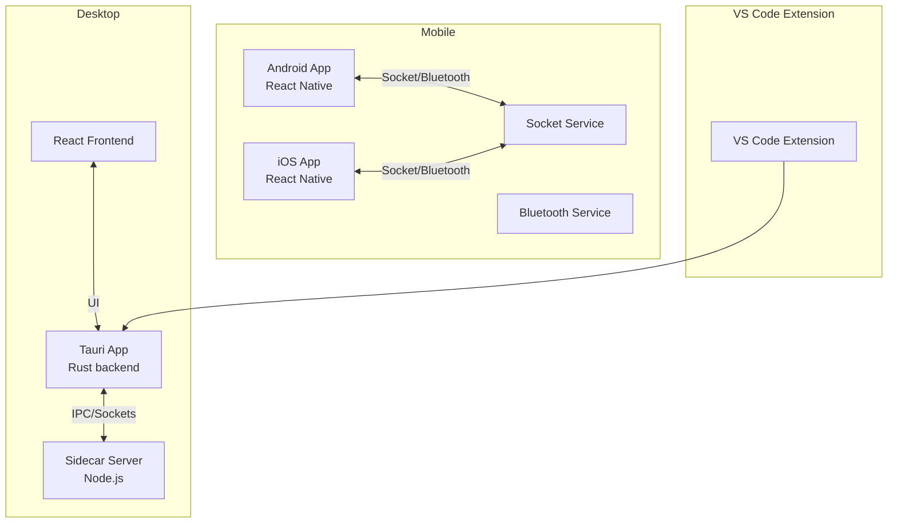
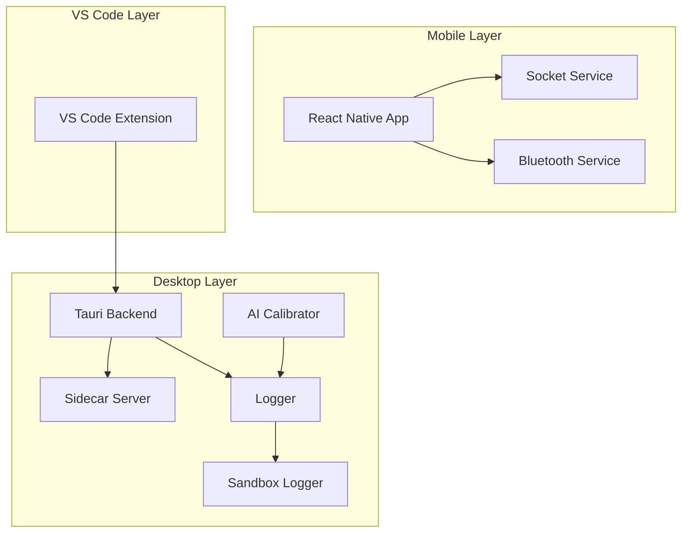
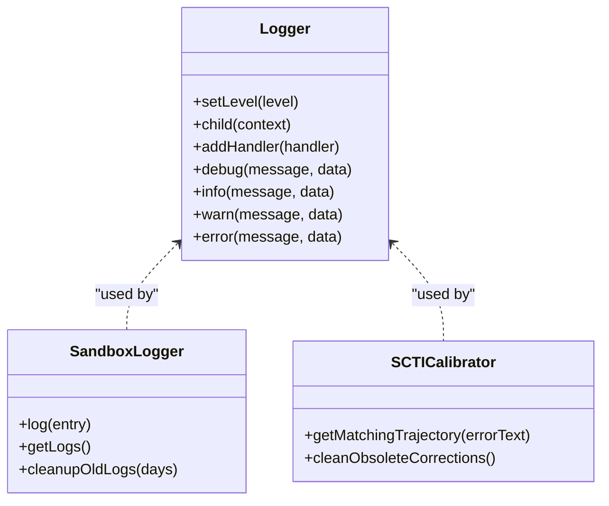
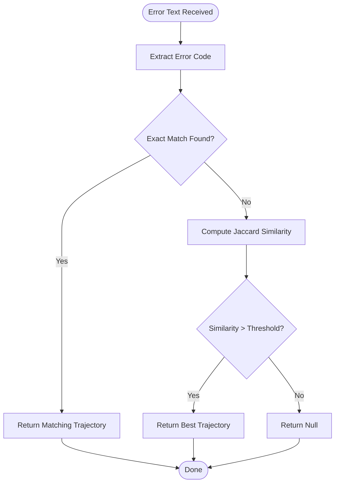
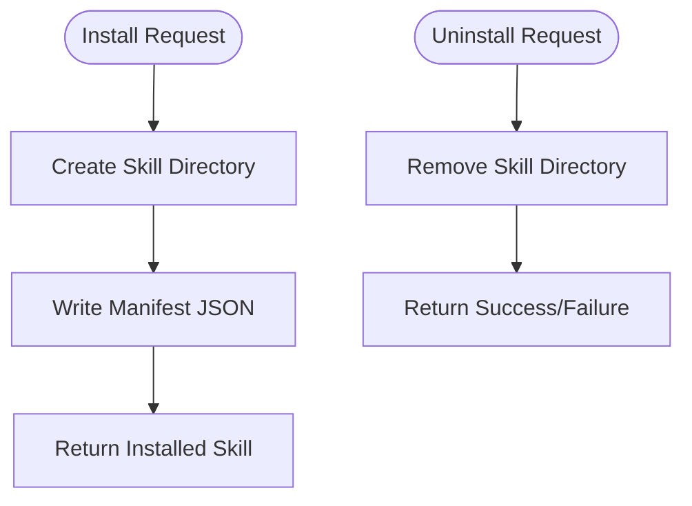
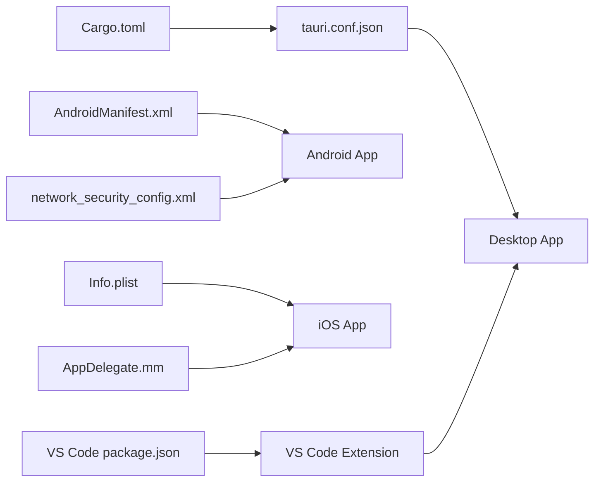

# Troubleshooting and FAQ

<cite>
**Referenced Files in This Document**
- [README.md](file://README.md)
- [logger.ts](file://packages/shared/src/logger.ts)
- [sandboxLogger.ts](file://packages/computer-use/src/sandbox/sandboxLogger.ts)
- [sctiCalibrator.ts](file://packages/ai-engine/src/middleware/sctiCalibrator.ts)
- [installer.ts](file://packages/skills/src/marketplace/installer.ts)
- [Cargo.toml](file://apps/desktop/src-tauri/Cargo.toml)
- [tauri.conf.json](file://apps/desktop/src-tauri/tauri.conf.json)
- [server.mjs](file://apps/desktop/src-tauri/sidecar/server.mjs)
- [build-sidecar.mjs](file://apps/desktop/scripts/build-sidecar.mjs)
- [MainActivity.kt](file://apps/mobile/android/app/src/main/java/com/ghitamobile/MainActivity.kt)
- [MainApplication.kt](file://apps/mobile/android/app/src/main/java/com/ghitamobile/MainApplication.kt)
- [AndroidManifest.xml](file://apps/mobile/android/app/src/main/AndroidManifest.xml)
- [network_security_config.xml](file://apps/mobile/android/app/src/main/res/xml/network_security_config.xml)
- [AppDelegate.mm](file://apps/mobile/ios/GhitaMobile/AppDelegate.mm)
- [Info.plist](file://apps/mobile/ios/GhitaMobile/Info.plist)
- [socketService.ts](file://apps/mobile/src/services/socketService.ts)
- [bluetoothService.ts](file://apps/mobile/src/services/bluetoothService.ts)
- [extension.ts](file://apps/vscode-extension/src/extension.ts)
- [package.json](file://apps/vscode-extension/package.json)
- [developer_security.txt](file://group/Chat_2026-05-31_08-10-16/developer_security.txt)
- [marketplace-view.tsx](file://apps/desktop/src/views/MarketplaceView.tsx)
</cite>

## Table of Contents
1. [Introduction](#introduction)
2. [Project Structure](#project-structure)
3. [Core Components](#core-components)
4. [Architecture Overview](#architecture-overview)
5. [Detailed Component Analysis](#detailed-component-analysis)
6. [Dependency Analysis](#dependency-analysis)
7. [Performance Considerations](#performance-considerations)
8. [Troubleshooting Guide](#troubleshooting-guide)
9. [Frequently Asked Questions](#frequently-asked-questions)
10. [Conclusion](#conclusion)
11. [Appendices](#appendices)

## Introduction
This document provides comprehensive troubleshooting and FAQ guidance for GHITA CODING AGENT across desktop, mobile, and VS Code extension platforms. It covers installation issues, runtime errors, performance tuning, debugging techniques, platform-specific pitfalls, security considerations, and recovery procedures. The goal is to help users diagnose and resolve common problems quickly and effectively.

## Project Structure
GHITA CODING AGENT is a multi-platform project with:
- Desktop application built with Tauri/Rust and React
- Mobile application built with React Native (Android/iOS)
- VS Code extension
- Shared packages for logging, AI engine, computer use, and skills marketplace

**Section sources**
- [README.md:334-340](file://README.md#L334-L340)

## Core Components
Key systems involved in troubleshooting:
- Logging framework for structured diagnostics
- Sandbox logging for containerized operations
- AI error calibration and trajectory matching
- Skill installer for marketplace operations
- Platform-specific configurations for desktop and mobile

**Section sources**
- [logger.ts:1-111](file://packages/shared/src/logger.ts#L1-L111)
- [sandboxLogger.ts:66-107](file://packages/computer-use/src/sandbox/sandboxLogger.ts#L66-L107)
- [sctiCalibrator.ts:189-228](file://packages/ai-engine/src/middleware/sctiCalibrator.ts#L189-L228)
- [installer.ts:1-40](file://packages/skills/src/marketplace/installer.ts#L1-40)

## Architecture Overview
The system integrates multiple layers:
- Desktop: Tauri manages native capabilities; a Node.js sidecar handles AI and device operations
- Mobile: React Native connects via sockets and Bluetooth to remote devices
- VS Code: Extension communicates with the desktop app for agent actions
- Shared: Logging and AI calibration services unify diagnostics and error handling

**Diagram sources**
- [logger.ts:1-111](file://packages/shared/src/logger.ts#L1-L111)
- [sandboxLogger.ts:66-107](file://packages/computer-use/src/sandbox/sandboxLogger.ts#L66-L107)
- [sctiCalibrator.ts:189-228](file://packages/ai-engine/src/middleware/sctiCalibrator.ts#L189-L228)
- [server.mjs](file://apps/desktop/src-tauri/sidecar/server.mjs)
- [socketService.ts](file://apps/mobile/src/services/socketService.ts)
- [bluetoothService.ts](file://apps/mobile/src/services/bluetoothService.ts)
- [extension.ts](file://apps/vscode-extension/src/extension.ts)

## Detailed Component Analysis

### Logging and Diagnostics
- Centralized logging supports multiple levels and handlers
- Sandbox logging persists container events with automatic cleanup
- AI calibrator matches error messages to known trajectories for remediation

**Diagram sources**
- [logger.ts:38-111](file://packages/shared/src/logger.ts#L38-L111)
- [sandboxLogger.ts:66-107](file://packages/computer-use/src/sandbox/sandboxLogger.ts#L66-L107)
- [sctiCalibrator.ts:189-228](file://packages/ai-engine/src/middleware/sctiCalibrator.ts#L189-L228)

**Section sources**
- [logger.ts:1-111](file://packages/shared/src/logger.ts#L1-L111)
- [sandboxLogger.ts:66-107](file://packages/computer-use/src/sandbox/sandboxLogger.ts#L66-L107)
- [sctiCalibrator.ts:189-228](file://packages/ai-engine/src/middleware/sctiCalibrator.ts#L189-L228)

### AI Error Calibration Flow
When encountering runtime errors, the AI calibrator attempts exact and similarity-based matching against stored trajectories and suggests corrective actions.

**Diagram sources**
- [sctiCalibrator.ts:189-228](file://packages/ai-engine/src/middleware/sctiCalibrator.ts#L189-L228)

### Skill Marketplace Installer
Installation/uninstallation of skills from the marketplace writes manifests and manages local directories.

**Diagram sources**
- [installer.ts:18-40](file://packages/skills/src/marketplace/installer.ts#L18-L40)

**Section sources**
- [installer.ts:1-40](file://packages/skills/src/marketplace/installer.ts#L1-L40)

### Desktop Application Startup Sequence
Desktop relies on Tauri, Rust, and a Node.js sidecar. Failures often stem from missing prerequisites or port conflicts.

```mermaid
sequenceDiagram
participant User as "User"
participant Tauri as "Tauri Backend"
participant Sidecar as "Sidecar Server"
participant OS as "Operating System"
User->>Tauri : Launch Desktop App
Tauri->>OS : Initialize Rust backend
Tauri->>Sidecar : Connect to sidecar service
Sidecar-->>Tauri : Ready or Error
Tauri-->>User : App UI or Error Message
```

**Diagram sources**
- [README.md:334-340](file://README.md#L334-L340)
- [server.mjs](file://apps/desktop/src-tauri/sidecar/server.mjs)

## Dependency Analysis
- Desktop Rust build targets are configured for a custom directory
- Tauri configuration defines capabilities and schema generation
- Mobile apps require proper manifest and security configurations
- VS Code extension depends on desktop app availability

**Diagram sources**
- [Cargo.toml](file://apps/desktop/src-tauri/Cargo.toml)
- [tauri.conf.json](file://apps/desktop/src-tauri/tauri.conf.json)
- [AndroidManifest.xml](file://apps/mobile/android/app/src/main/AndroidManifest.xml)
- [network_security_config.xml](file://apps/mobile/android/app/src/main/res/xml/network_security_config.xml)
- [Info.plist](file://apps/mobile/ios/GhitaMobile/Info.plist)
- [AppDelegate.mm](file://apps/mobile/ios/GhitaMobile/AppDelegate.mm)
- [package.json](file://apps/vscode-extension/package.json)

**Section sources**
- [Cargo.toml](file://apps/desktop/src-tauri/Cargo.toml)
- [tauri.conf.json](file://apps/desktop/src-tauri/tauri.conf.json)
- [AndroidManifest.xml](file://apps/mobile/android/app/src/main/AndroidManifest.xml)
- [network_security_config.xml](file://apps/mobile/android/app/src/main/res/xml/network_security_config.xml)
- [Info.plist](file://apps/mobile/ios/GhitaMobile/Info.plist)
- [AppDelegate.mm](file://apps/mobile/ios/GhitaMobile/AppDelegate.mm)
- [package.json](file://apps/vscode-extension/package.json)

## Performance Considerations
- Memory optimization: Limit in-memory log retention and periodically prune old entries
- Build performance: Use Rust target directory configuration and incremental builds
- Runtime performance: Minimize socket churn and batch UI updates

Practical tips:
- Adjust log levels to reduce overhead during heavy sessions
- Ensure sidecar server runs on available ports and is not overloaded
- On mobile, manage socket connections and Bluetooth polling intervals

[No sources needed since this section provides general guidance]

## Troubleshooting Guide

### Installation Issues

- Node.js version mismatch
  - Ensure Node.js meets minimum requirements before building desktop or mobile apps
  - Rebuild sidecar after updating Node.js

- Rust installation problems
  - Verify Rust toolchain is installed and up to date
  - Check custom target directory configuration for builds

- Dependency conflicts
  - Run dependency audits and update vulnerable packages
  - Align versions across workspaces and platform-specific dependencies

**Section sources**
- [README.md:334-340](file://README.md#L334-L340)
- [Cargo.toml](file://apps/desktop/src-tauri/Cargo.toml)
- [developer_security.txt:77-144](file://group/Chat_2026-05-31_08-10-16/developer_security.txt#L77-L144)

### Desktop Application Startup Failures

Common symptoms:
- App fails to launch or crashes immediately
- Sidecar connection errors

Resolution steps:
1. Confirm Rust is installed and functional
2. Verify Node.js version meets requirements
3. Build the sidecar server using the provided script
4. Ensure the sidecar process is reachable on the configured port
5. Check Tauri capabilities and schema generation

**Section sources**
- [README.md:334-340](file://README.md#L334-L340)
- [build-sidecar.mjs](file://apps/desktop/scripts/build-sidecar.mjs)
- [server.mjs](file://apps/desktop/src-tauri/sidecar/server.mjs)
- [tauri.conf.json](file://apps/desktop/src-tauri/tauri.conf.json)

### Mobile Connection Issues

Common symptoms:
- Cannot pair or connect to remote devices
- Socket connection drops intermittently
- Bluetooth scanning fails

Resolution steps:
1. Verify device permissions and location services (Android)
2. Check network security configuration for cleartext traffic if applicable
3. Confirm socket service is reachable and not blocked by firewalls
4. Restart Bluetooth adapter and re-pair devices
5. Review mobile logs for socket and Bluetooth errors

**Section sources**
- [AndroidManifest.xml](file://apps/mobile/android/app/src/main/AndroidManifest.xml)
- [network_security_config.xml](file://apps/mobile/android/app/src/main/res/xml/network_security_config.xml)
- [socketService.ts](file://apps/mobile/src/services/socketService.ts)
- [bluetoothService.ts](file://apps/mobile/src/services/bluetoothService.ts)

### AI Provider Configuration Problems

Common symptoms:
- API calls fail or return unexpected errors
- Local AI providers not detected

Resolution steps:
1. Set required environment variables for AI providers
2. For local providers, ensure the base URL points to a running service
3. Validate API keys and endpoint reachability
4. Use the logger to capture request/response details

**Section sources**
- [README.md:297-310](file://README.md#L297-L310)
- [logger.ts:1-111](file://packages/shared/src/logger.ts#L1-L111)

### Performance Tuning

- Memory optimization
  - Reduce log verbosity during intensive tasks
  - Prune sandbox logs older than retention period

- Build performance
  - Use configured Rust target directory for faster rebuilds
  - Enable incremental builds and avoid unnecessary rebuilds

- Runtime performance
  - Batch UI updates and throttle socket events
  - Close unused connections and disable idle listeners

**Section sources**
- [sandboxLogger.ts:66-107](file://packages/computer-use/src/sandbox/sandboxLogger.ts#L66-L107)
- [Cargo.toml](file://apps/desktop/src-tauri/Cargo.toml)

### Debugging Techniques

- Logging strategies
  - Use structured logs with appropriate levels
  - Attach contextual information for easier correlation

- Error analysis
  - Leverage AI calibrator to match error texts to known trajectories
  - Inspect recent logs and timestamps for patterns

- Diagnostic tools
  - Desktop: Tauri devtools and sidecar logs
  - Mobile: Device logs and socket/bt tracing
  - VS Code: Extension logs and desktop IPC status

**Section sources**
- [logger.ts:1-111](file://packages/shared/src/logger.ts#L1-L111)
- [sctiCalibrator.ts:189-228](file://packages/ai-engine/src/middleware/sctiCalibrator.ts#L189-L228)

### Platform-Specific Issues

- Windows/macOS desktop
  - Ensure Rust toolchain and Node.js are properly installed
  - Check antivirus/firewall interference with sidecar port

- Android mobile
  - Grant location and storage permissions
  - Configure network security for development environments
  - Handle runtime permissions for Bluetooth and camera

- iOS mobile
  - Configure Info.plist entries for Bluetooth and networking
  - Ensure AppDelegate initializes required modules

- VS Code extension
  - Confirm desktop app is running and accessible
  - Check extension host logs for IPC failures

**Section sources**
- [MainActivity.kt](file://apps/mobile/android/app/src/main/java/com/ghitamobile/MainActivity.kt)
- [MainApplication.kt](file://apps/mobile/android/app/src/main/java/com/ghitamobile/MainApplication.kt)
- [AndroidManifest.xml](file://apps/mobile/android/app/src/main/AndroidManifest.xml)
- [network_security_config.xml](file://apps/mobile/android/app/src/main/res/xml/network_security_config.xml)
- [Info.plist](file://apps/mobile/ios/GhitaMobile/Info.plist)
- [AppDelegate.mm](file://apps/mobile/ios/GhitaMobile/AppDelegate.mm)
- [extension.ts](file://apps/vscode-extension/src/extension.ts)

### Recovery Procedures

- Reset marketplace installations
  - Uninstall problematic skills and reinstall from the marketplace
  - Clear local caches if necessary

- Restore sidecar connectivity
  - Stop existing sidecar processes
  - Rebuild and restart sidecar server
  - Verify port availability

- Reinitialize logs
  - Clear sandbox logs older than retention period
  - Reset logger handlers and levels for fresh diagnostics

**Section sources**
- [installer.ts:33-40](file://packages/skills/src/marketplace/installer.ts#L33-L40)
- [build-sidecar.mjs](file://apps/desktop/scripts/build-sidecar.mjs)
- [server.mjs](file://apps/desktop/src-tauri/sidecar/server.mjs)
- [sandboxLogger.ts:66-107](file://packages/computer-use/src/sandbox/sandboxLogger.ts#L66-L107)

## Frequently Asked Questions

- What are the system requirements?
  - Node.js version must meet minimum requirements
  - Rust toolchain must be installed
  - Desktop requires Tauri-compatible OS; mobile requires supported SDKs

- Are there feature limitations?
  - Some features depend on external AI providers or device permissions
  - Marketplace skills may require network access

- How do I configure environment variables?
  - Copy the example environment file and fill in required keys
  - For local AI, ensure base URLs point to running services

- Where can I find logs?
  - Desktop: Tauri logs and sidecar logs
  - Mobile: Device logs and socket/bt traces
  - VS Code: Extension logs and desktop IPC status

**Section sources**
- [README.md:297-310](file://README.md#L297-L310)
- [logger.ts:1-111](file://packages/shared/src/logger.ts#L1-L111)

## Conclusion
By following the troubleshooting steps, leveraging the logging and calibration systems, and adhering to platform-specific configurations, most issues can be resolved efficiently. Keep dependencies updated, monitor logs regularly, and use the recovery procedures outlined here to restore normal operation.

[No sources needed since this section summarizes without analyzing specific files]

## Appendices

### Step-by-Step Scenarios

- Scenario: Desktop app does not start
  1. Verify Rust installation
  2. Check Node.js version
  3. Build sidecar server
  4. Confirm sidecar port availability
  5. Relaunch desktop app

- Scenario: Mobile cannot connect
  1. Enable required permissions
  2. Check network security config
  3. Validate socket reachability
  4. Restart Bluetooth and re-pair
  5. Inspect mobile logs

- Scenario: AI provider errors
  1. Set environment variables
  2. Validate API keys
  3. Test endpoint reachability
  4. Capture logs for analysis

**Section sources**
- [README.md:334-340](file://README.md#L334-L340)
- [AndroidManifest.xml](file://apps/mobile/android/app/src/main/AndroidManifest.xml)
- [network_security_config.xml](file://apps/mobile/android/app/src/main/res/xml/network_security_config.xml)
- [logger.ts:1-111](file://packages/shared/src/logger.ts#L1-L111)

### Security and Permissions

- Security-related issues
  - Run dependency audits and update vulnerable packages
  - Review environment files and git history for exposed secrets
  - Implement rate limiting and security headers

- Permission problems
  - Android: grant location, storage, and camera permissions
  - iOS: configure Info.plist entries for Bluetooth and networking
  - Desktop: ensure Tauri capabilities align with intended usage

**Section sources**
- [developer_security.txt:77-144](file://group/Chat_2026-05-31_08-10-16/developer_security.txt#L77-L144)
- [AndroidManifest.xml](file://apps/mobile/android/app/src/main/AndroidManifest.xml)
- [Info.plist](file://apps/mobile/ios/GhitaMobile/Info.plist)
- [tauri.conf.json](file://apps/desktop/src-tauri/tauri.conf.json)

### Community Resources and Support

- Report issues using the repository’s issue templates
- Submit pull requests following contribution guidelines
- Engage with maintainers for platform-specific support

**Section sources**
- [README.md:334-340](file://README.md#L334-L340)
- [CONTRIBUTING.md](file://CONTRIBUTING.md)