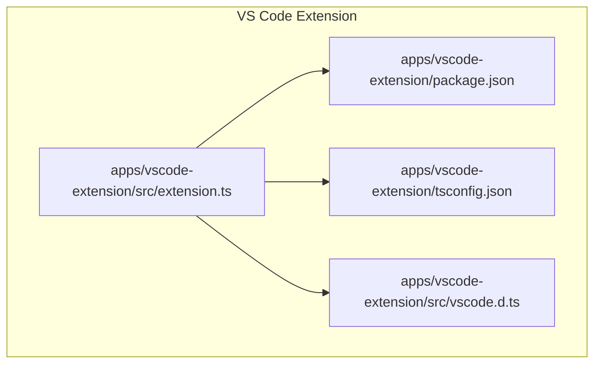
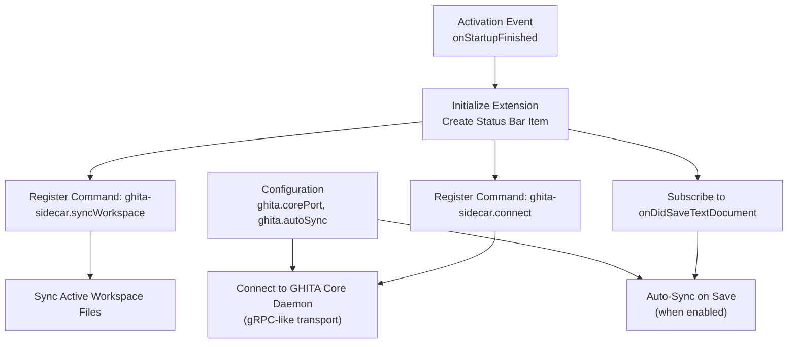
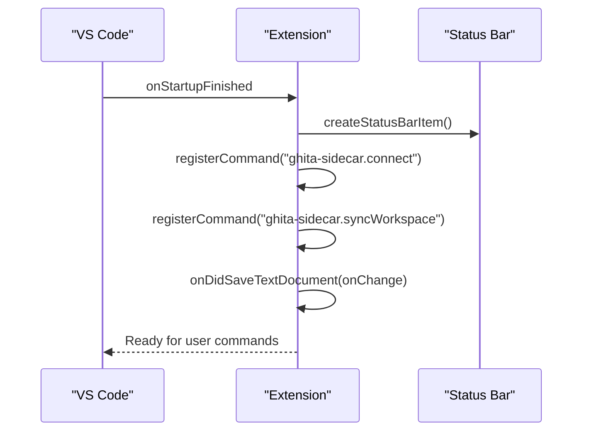
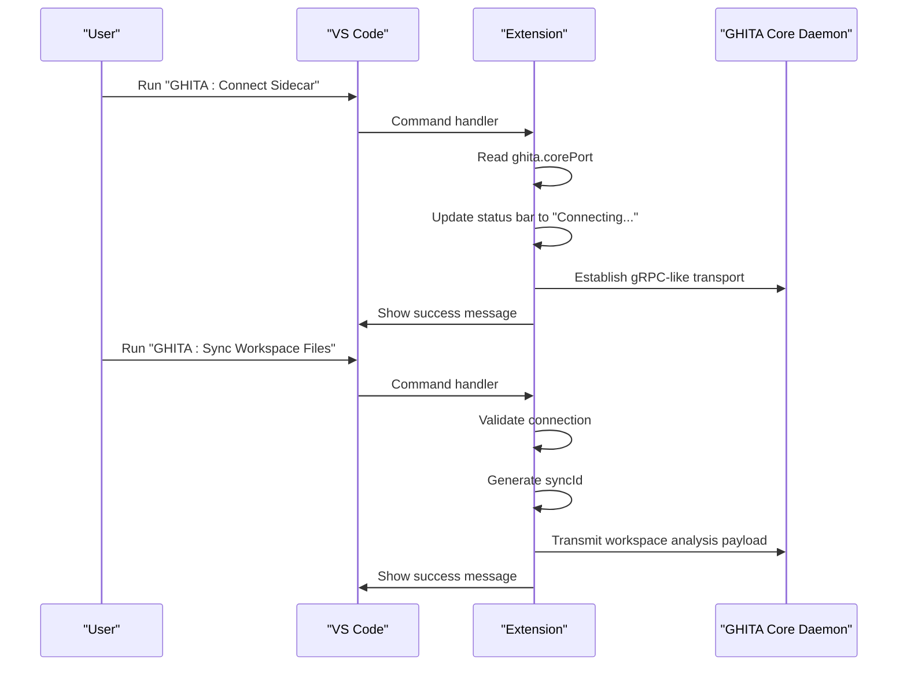
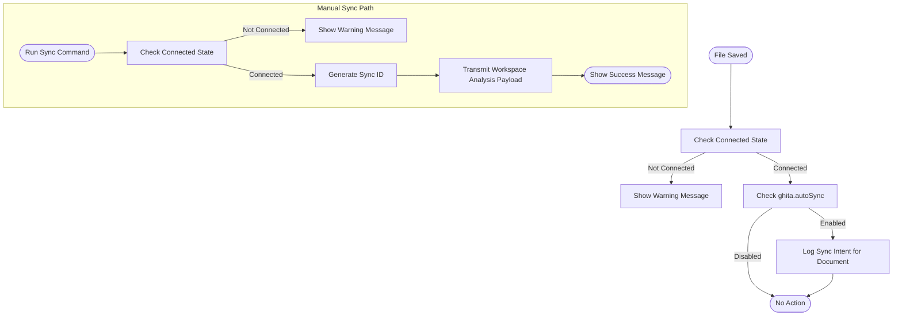
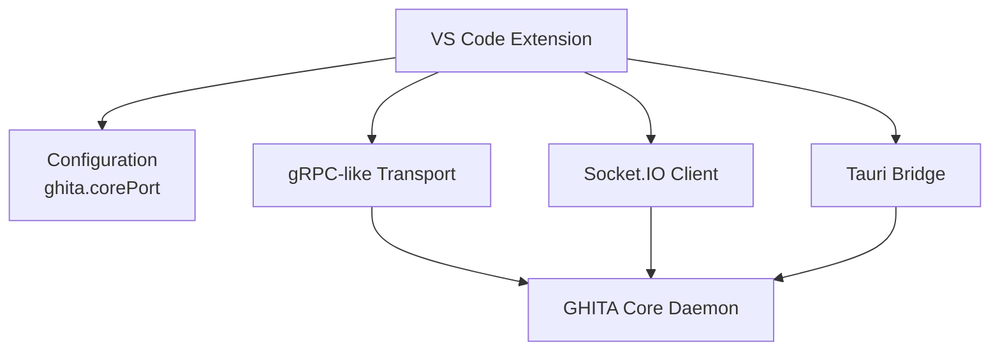
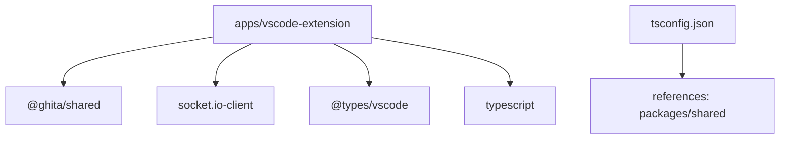

# VS Code Extension

<cite>
**Referenced Files in This Document**
- [extension.ts](file://apps/vscode-extension/src/extension.ts)
- [package.json](file://apps/vscode-extension/package.json)
- [tsconfig.json](file://apps/vscode-extension/tsconfig.json)
- [vscode.d.ts](file://apps/vscode-extension/src/vscode.d.ts)
</cite>

## Table of Contents
1. [Introduction](#introduction)
2. [Project Structure](#project-structure)
3. [Core Components](#core-components)
4. [Architecture Overview](#architecture-overview)
5. [Detailed Component Analysis](#detailed-component-analysis)
6. [Dependency Analysis](#dependency-analysis)
7. [Performance Considerations](#performance-considerations)
8. [Troubleshooting Guide](#troubleshooting-guide)
9. [Conclusion](#conclusion)
10. [Appendices](#appendices)

## Introduction
This document describes the VS Code Extension for the GHITA CODING AGENT ecosystem. It explains how the extension integrates with the GHITA Core daemon to synchronize the active VS Code workspace and maintain consistency between the local editor and the remote desktop application. The extension exposes commands for connecting to the GHITA Core daemon and for synchronizing workspace files. It also demonstrates automatic file synchronization on save and provides a foundation for future integration with Socket.IO and Tauri communication channels.

## Project Structure
The VS Code extension is organized under apps/vscode-extension with a minimal TypeScript implementation, a package manifest defining activation events, commands, and configuration, and a TypeScript configuration for compilation.

**Diagram sources**
- [extension.ts](file://apps/vscode-extension/src/extension.ts)
- [package.json](file://apps/vscode-extension/package.json)
- [tsconfig.json](file://apps/vscode-extension/tsconfig.json)
- [vscode.d.ts](file://apps/vscode-extension/src/vscode.d.ts)

**Section sources**
- [extension.ts](file://apps/vscode-extension/src/extension.ts)
- [package.json](file://apps/vscode-extension/package.json)
- [tsconfig.json](file://apps/vscode-extension/tsconfig.json)
- [vscode.d.ts](file://apps/vscode-extension/src/vscode.d.ts)

## Core Components
- Extension entry point and lifecycle
  - Activation registers commands, creates a status bar indicator, and subscribes to workspace events.
  - Deactivation cleans up resources.
- Commands
  - ghita-sidecar.connect: Establishes a connection to the GHITA Core daemon via a gRPC-like transport abstraction.
  - ghita-sidecar.syncWorkspace: Manually triggers a workspace synchronization operation.
- Configuration
  - ghita.corePort: Port used by the GHITA sidecar server (default 8080).
  - ghita.autoSync: Enables automatic synchronization on file save.

Key behaviors:
- Status bar item reflects connection state and provides a quick action to connect.
- On save, if connected and auto-sync is enabled, the extension logs a sync intent for changed files.
- Manual sync generates a short identifier to correlate synchronization sessions.

**Section sources**
- [extension.ts](file://apps/vscode-extension/src/extension.ts)
- [package.json](file://apps/vscode-extension/package.json)

## Architecture Overview
The extension follows a straightforward architecture:
- Activation event triggers initialization.
- Command registration exposes user actions.
- Workspace event listeners enable automatic synchronization.
- Configuration drives runtime behavior.

**Diagram sources**
- [package.json](file://apps/vscode-extension/package.json)
- [extension.ts](file://apps/vscode-extension/src/extension.ts)

## Detailed Component Analysis

### Extension Entry Point and Lifecycle
The extension activates on startup and performs the following:
- Creates a status bar item indicating connection state and binds a click command to connect.
- Registers two commands: connect and manual workspace sync.
- Subscribes to document save events to optionally trigger auto-sync.
- Cleans up on deactivation.

**Diagram sources**
- [extension.ts](file://apps/vscode-extension/src/extension.ts)
- [package.json](file://apps/vscode-extension/package.json)

**Section sources**
- [extension.ts](file://apps/vscode-extension/src/extension.ts)
- [package.json](file://apps/vscode-extension/package.json)

### Command Bridge Implementation
- ghita-sidecar.connect
  - Reads ghita.corePort from configuration.
  - Updates status bar to reflect connecting and connected states.
  - Emits informational messages to the user.
- ghita-sidecar.syncWorkspace
  - Validates connection state.
  - Generates a short sync identifier and emits informational messages.
  - Simulates sending a workspace analysis payload to the daemon.

**Diagram sources**
- [extension.ts](file://apps/vscode-extension/src/extension.ts)
- [package.json](file://apps/vscode-extension/package.json)

**Section sources**
- [extension.ts](file://apps/vscode-extension/src/extension.ts)
- [package.json](file://apps/vscode-extension/package.json)

### Workspace Management Capabilities
- Automatic synchronization on save:
  - Listens to onDidSaveTextDocument.
  - Checks connection state and ghita.autoSync setting.
  - Logs a sync intent for the saved document.
- Manual synchronization:
  - Provides a command to trigger a full workspace sync with a correlating identifier.

**Diagram sources**
- [extension.ts](file://apps/vscode-extension/src/extension.ts)
- [package.json](file://apps/vscode-extension/package.json)

**Section sources**
- [extension.ts](file://apps/vscode-extension/src/extension.ts)
- [package.json](file://apps/vscode-extension/package.json)

### Integration Patterns with GHITA Core Daemon
- Transport abstraction:
  - The extension simulates a gRPC-like transport to the GHITA Core daemon.
  - Configuration controls the target port for the daemon.
- Communication channels:
  - Socket.IO and Tauri integration are declared as dependencies and can be integrated in future iterations.
- Synchronization mechanisms:
  - Manual sync sends a workspace analysis payload.
  - Auto-sync logs a sync intent per file save.

**Diagram sources**
- [extension.ts](file://apps/vscode-extension/src/extension.ts)
- [package.json](file://apps/vscode-extension/package.json)

**Section sources**
- [extension.ts](file://apps/vscode-extension/src/extension.ts)
- [package.json](file://apps/vscode-extension/package.json)

### Extension API Reference
Available commands:
- ghita-sidecar.connect
  - Category: GHITA CODING AGENT
  - Description: Connect VS Code with GHITA Core daemon using gRPC-like transport.
- ghita-sidecar.syncWorkspace
  - Category: GHITA CODING AGENT
  - Description: Sync active workspace files with the GHITA daemon.

Configuration options:
- ghita.corePort
  - Type: integer
  - Default: 8080
  - Description: Port of the running GHITA sidecar server.
- ghita.autoSync
  - Type: boolean
  - Default: true
  - Description: Whether to auto-sync workspace files on save.

Activation events:
- onStartupFinished

**Section sources**
- [package.json](file://apps/vscode-extension/package.json)

## Dependency Analysis
The extension declares external dependencies and internal references:
- Runtime dependencies:
  - @ghita/shared: workspace-local package used for utilities such as UUID generation.
  - socket.io-client: client library for Socket.IO integration.
- Development dependencies:
  - @types/vscode: VS Code API type definitions.
  - typescript: compiler and tooling.
- Internal references:
  - packages/shared: referenced via project reference in tsconfig.json.

**Diagram sources**
- [package.json](file://apps/vscode-extension/package.json)
- [tsconfig.json](file://apps/vscode-extension/tsconfig.json)

**Section sources**
- [package.json](file://apps/vscode-extension/package.json)
- [tsconfig.json](file://apps/vscode-extension/tsconfig.json)

## Performance Considerations
- Auto-sync on save:
  - Keep ghita.autoSync enabled only when needed to avoid frequent background operations.
  - Consider batching file change notifications in future implementations.
- Manual sync:
  - Use the sync command judiciously to avoid unnecessary load on the daemon.
- Status updates:
  - Status bar updates are lightweight but avoid excessive polling or redundant messages.

## Troubleshooting Guide
Common issues and resolutions:
- Cannot connect to GHITA Core daemon
  - Verify ghita.corePort matches the daemon’s configured port.
  - Ensure the GHITA Core daemon is running before connecting.
- No auto-sync occurs
  - Confirm ghita.autoSync is enabled.
  - Check that the extension is connected (status bar indicates connected).
- Manual sync shows warning
  - Run the connect command first; synchronization requires an active connection.
- Build errors
  - Clean and rebuild using the provided scripts.
  - Ensure TypeScript and project references are correctly configured.

**Section sources**
- [extension.ts](file://apps/vscode-extension/src/extension.ts)
- [package.json](file://apps/vscode-extension/package.json)
- [tsconfig.json](file://apps/vscode-extension/tsconfig.json)

## Conclusion
The VS Code Extension for GHITA CODING AGENT provides a solid foundation for integrating VS Code with the GHITA Core daemon. It offers explicit commands for connection and synchronization, supports automatic file syncing on save, and exposes configuration options to tailor behavior. The extension’s architecture is modular and extensible, enabling future integration with Socket.IO and Tauri channels while maintaining a clean separation of concerns.

## Appendices
- Development workflow improvements
  - AI-assisted coding features: Integrate with GHITA’s AI engine via the established transport channels.
  - Remote control capabilities: Use Tauri bridges to expose remote control actions from VS Code.
  - Collaborative development: Leverage Socket.IO for real-time collaboration signals and notifications.
- Installation and configuration
  - Install the extension in VS Code.
  - Configure ghita.corePort to match the running daemon.
  - Enable ghita.autoSync for seamless file synchronization on save.