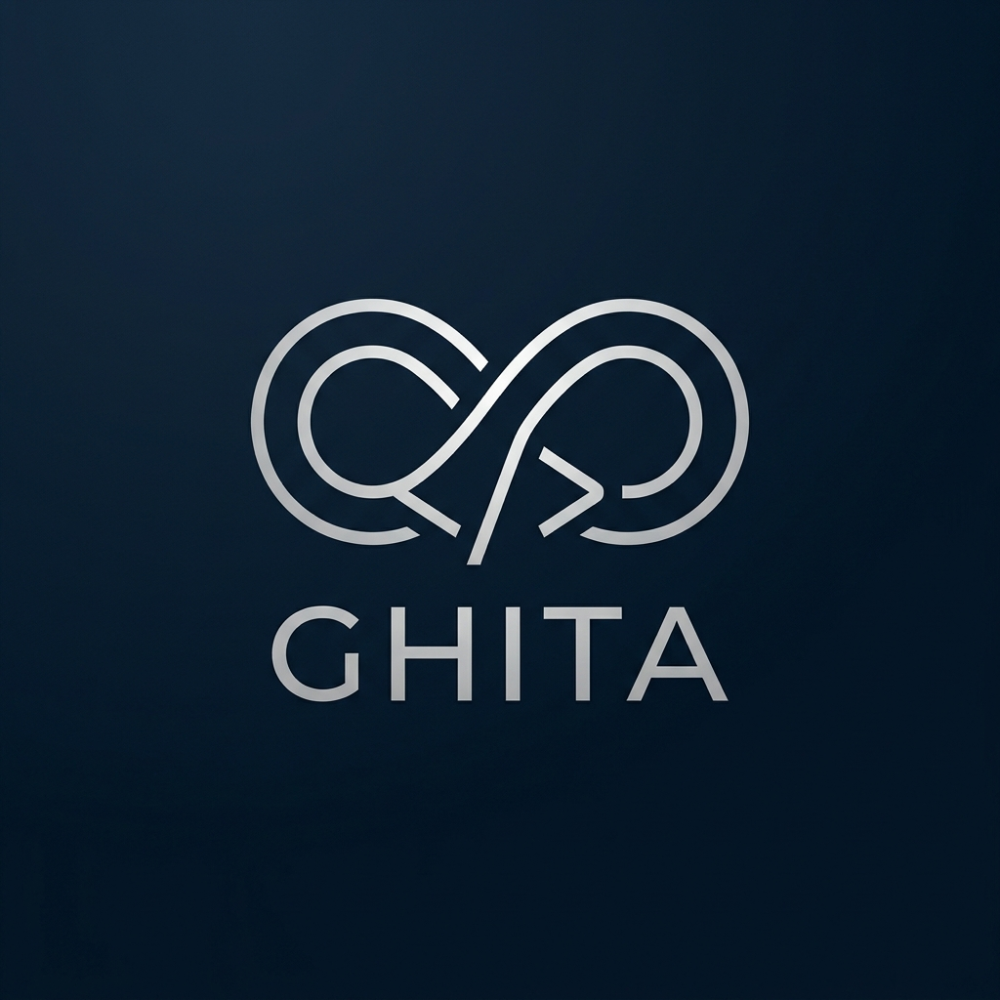

# GHITA CODING AGENT

<div align="center">
  
</div>

<div align="center">


[](https://ghitatruongle.github.io/GHITA-CODING-AGENT/)
[](ROADMAP.md)
[](SECURITY.md)
[](CONTRIBUTING.md)
[](https://discord.gg/ghita)
[](https://github.com/ghitatruongle/GHITA-CODING-AGENT)

</div>

---

<details open>
<summary><b>🇺🇸 English Version</b></summary>

**GHITA CODING AGENT** — A versatile AI desktop application with VS Code-style interface, supporting remote computer control via Android phone.

---

## Features

- **Code Editor** — AI-assisted coding with Monaco Editor
- **AI Multi-Provider** — Manage OpenAI, Anthropic, Google, Ollama and more
- **Skill System** — Create and manage AI skills
- **Agent Groups** — Create specialized agent teams
- **Computer Use** — AI controls mouse, keyboard, and applications
- **Browser Control** — AI opens Chrome, automates web tasks
- **Remote Control** — Remote control via Android (WiFi/Socket.IO)
- **Secure Pairing** — Secure two-way authentication code

> **Android Requirement**: Android 9 (Pie) or higher (API 28+)

---

## Tech Stack

| Component     | Technology                             |
| ------------- | -------------------------------------- |
| Desktop       | Tauri 2.x + React (TypeScript)         |
| Mobile        | React Native (Android) — minSdk=28     |
| AI Engine     | Vercel AI SDK / LiteLLM / LangChain.js |
| Browser       | Playwright / CloakBrowser              |
| Computer Use  | nut.js / UI-TARS                       |
| Communication | Socket.IO                              |
| Local AI      | Ollama                                 |
| Code Editor   | Monaco Editor                          |
| Terminal      | xterm.js + node-pty                    |
| Build         | Turborepo + pnpm workspace             |

---

## Project Structure

```
GHITA-CODING-AGENT/
├── apps/
│   ├── desktop/         # Tauri + React (Windows/Linux)
│   └── mobile/          # React Native (Android)
├── packages/
│   ├── ai-engine/       # AI multi-provider orchestration
│   ├── skills/          # Skill system
│   ├── agents/          # Agent & group management
│   ├── communication/   # Desktop ↔ Mobile
│   ├── browser-control/ # Playwright + CloakBrowser
│   ├── computer-use/    # nut.js + UI-TARS
│   ├── memory/          # AgentMemory
│   └── shared/          # Utils, types, constants
├── scripts/             # Build & setup scripts
├── docs/                # Documentation & assets
├── tests/               # Tests
└── Plan/                # Development plan
```

---

## Installation

### Requirements

- **Node.js** >= 20
- **pnpm** >= 10.x (`npm install -g pnpm`)
- **Rust** (for Tauri desktop)
- **Android Studio** (for React Native)
- **Android device/emulator** running Android 9+ (API 28)
- **Git**

### Step 1: Clone the project

```bash
git clone https://github.com/ghitatruongle/GHITA-CODING-AGENT.git
cd GHITA-CODING-AGENT
```

### Step 2: Install dependencies

```bash
pnpm install
```

### Step 3: Configure environment

```bash
cp .env.example .env
# Edit .env with your API keys
```

See [`.env.example`](.env.example) for required environment variables.

**Important:**

- At minimum, configure one AI provider (OpenAI, Anthropic, Google, or Ollama)
- For local AI, set `OLLAMA_BASE_URL=http://localhost:11434` and ensure Ollama is running
- Default port for Socket.IO server is `8080` (configurable via `SOCKET_PORT`)

### Step 4: Build the sidecar server (required for desktop app)

The desktop app requires a Node.js sidecar server for communication and AI operations:

```bash
# Build the sidecar server bundle
cd apps/desktop/src-tauri/sidecar
node server.mjs --build
cd ../../..
```

### Step 5: Run development

```bash
# Desktop (Tauri + React)
pnpm dev:desktop

# Mobile (React Native - Android)
pnpm dev:android
```

---

## Common Issues & Troubleshooting

### Desktop app won't start

- Ensure Rust is installed: `rustc --version`
- Ensure Node.js >= 20 is installed: `node --version`
- Rebuild the sidecar server if needed
- Check that port 8080 is not already in use

### Mobile app can't connect to desktop

- Ensure both devices are on the same network
- Check that the communication server is running (check Dashboard view)
- Verify the pairing code is correct
- Try using manual IP address instead of cloud discovery

### AI provider not working

- Verify API keys in `.env` file
- Check that the provider is enabled in the API Manager
- For Ollama, ensure it's running: `ollama serve`
- Check network connectivity for cloud providers

### Skills not working

- Some skills require specific adapters (file, terminal, screenshot)
- Computer and browser skills are disabled by default for security
- Enable skills in the Skills view if needed
- Check that required tools are installed (e.g., git, docker)

---

## Scripts

| Script                | Description                                |
| --------------------- | ------------------------------------------ |
| `pnpm dev`            | Run all workspaces in dev mode             |
| `pnpm dev:desktop`    | Run desktop app (Tauri)                    |
| `pnpm dev:android`    | Run Android app                            |
| `pnpm build`          | Build everything                           |
| `pnpm build:desktop`  | Build desktop app                          |
| `pnpm build:android`  | Build Android APK                          |
| `pnpm build:packages` | Build packages only                        |
| `pnpm lint`           | Check code style                           |
| `pnpm lint:fix`       | Auto-fix lint issues                       |
| `pnpm typecheck`      | Check TypeScript                           |
| `pnpm format`         | Format code with Prettier                  |
| `pnpm test`           | Run tests                                  |
| `pnpm clean`          | Remove build artifacts                     |
| `pnpm clean:all`      | Remove everything (including node_modules) |

---

## Changelog

| Version            | Date          | Description                                                                                                                                                                                                                                                                               |
| ------------------ | ------------- | ----------------------------------------------------------------------------------------------------------------------------------------------------------------------------------------------------------------------------------------------------------------------------------------- |
| DEMO               | 19/05/2026    | Initial demo release                                                                                                                                                                                                                                                                      |
| Update 0.0.1       | 21/05/2026    | Optimized phone-computer connection and fixed minor bugs                                                                                                                                                                                                                                  |
| Update 0.0.2 beta1 | 21/05/2026    | Code Editor VSCode-style, File Explorer, Multi-tab, 13 AI providers, Dashboard real-time, API Manager redesign, Chat markdown rendering, Token counter                                                                                                                                    |
| Update 0.0.2 beta2 | 22/05/2026    | Sandboxed workspace tools (CRUD, pure-Node grep search, block traversal), Socket.IO live telemetry and terminal command approval consent gate, integration testing and compilation                                                                                                        |
| Update 0.0.2       | 26/05/2026    | Added 6 breakthrough features: SCTI trajectory self-healing, AST-Lock method protection, Live Telepresence stream, Rust memory addon, AHPI performance heatmap, DebateEngine reviewer panel, and /deep-research command                                                                   |
| Update 0.0.3 beta1 | 02/06/2026    | Real Terminal PTY (node-pty sidecar), Playwright-Stealth multi-tab browser, Agentic Observe & Act layer, Sandbox guardrails, VS Code extension WebSocket sync, Monaco linter diagnostics & diff view, Mobile touch remote control, Embedded Tauri webview, E2E integration & CI benchmark |
| Update 0.0.3       | 07-08/06/2026 | Native AI agent runtime, skills & memory graph, tool-calling engine, performance layer. Critical security hardening (shell injection, Tauri permissions). Production-ready debug→test→publish CI pipeline.                                                                                |
| Update 0.0.4       | 18/06/2026    | Push notification system (toast + queue + sound), multi-channel communication plugin architecture (WebSocket/mDNS/Bluetooth), marketplace double-entry bookkeeping revenue, i18n key validation, mobile screen decomposition. Security & stability: tax calculation fix, Bluetooth error handling, health check latency fix. |

---

## 🤝 Community & Support

| Kênh | Mục đích |
|---|---|
| [](https://discord.gg/ghita) | Community chat, Q&A, feature requests |
| [](https://github.com/ghitatruongle/GHITA-CODING-AGENT/issues/new?labels=bug) | Bug reports |
| [](https://github.com/ghitatruongle/GHITA-CODING-AGENT/issues/new?labels=enhancement) | Feature requests |
| [](SECURITY.md) | Report vulnerabilities |
| [](ROADMAP.md) | Planned features |
| [](https://ghitatruongle.github.io/GHITA-CODING-AGENT/) | API reference |

---

## License

[MIT](LICENSE) — Copyright (c) 2026 GHITA CODING AGENT

</details>

<details>
<summary><b>🇻🇳 Phiên bản Tiếng Việt</b></summary>

**GHITA CODING AGENT** — Ứng dụng AI trên máy tính đa năng với giao diện kiểu VS Code, hỗ trợ điều khiển máy tính từ xa qua điện thoại Android.

---

## Tính năng nổi bật

- **Trình soạn thảo mã nguồn** — Lập trình có sự hỗ trợ của AI với Monaco Editor
- **Đa nhà cung cấp AI** — Quản lý OpenAI, Anthropic, Google, Ollama và nhiều nhà cung cấp khác
- **Hệ thống Kỹ năng** — Tạo và quản lý các kỹ năng AI
- **Nhóm Đại lý (Agent Groups)** — Tạo các nhóm đại lý chuyên biệt để cộng tác làm việc
- **Sử dụng Máy tính (Computer Use)** — AI điều khiển chuột, bàn phím và các ứng dụng
- **Điều khiển Trình duyệt** — AI tự động mở Chrome và thực hiện các tác vụ web
- **Điều khiển Từ xa** — Điều khiển máy tính từ xa thông qua điện thoại Android (kết nối WiFi/Socket.IO)
- **Ghép nối An toàn** — Cơ chế xác thực hai chiều an toàn bằng mã pin ghép nối

> **Yêu cầu hệ điều hành Android**: Android 9 (Pie) trở lên (API 28+)

---

## Công nghệ Sử dụng

| Thành phần   | Công nghệ                              |
| ------------ | -------------------------------------- |
| Desktop      | Tauri 2.x + React (TypeScript)         |
| Mobile       | React Native (Android) — minSdk=28     |
| AI Engine    | Vercel AI SDK / LiteLLM / LangChain.js |
| Browser      | Playwright / CloakBrowser              |
| Computer Use | nut.js / UI-TARS                       |
| Giao tiếp    | Socket.IO                              |
| Local AI     | Ollama                                 |
| Code Editor  | Monaco Editor                          |
| Terminal     | xterm.js + node-pty                    |
| Build Tool   | Turborepo + pnpm workspace             |

---

## Cấu trúc Dự án

```
GHITA-CODING-AGENT/
├── apps/
│   ├── desktop/         # Ứng dụng Tauri + React (Windows/Linux)
│   └── mobile/          # Ứng dụng React Native (Android)
├── packages/
│   ├── ai-engine/       # Bộ điều phối đa nhà cung cấp AI
│   ├── skills/          # Hệ thống kỹ năng
│   ├── agents/          # Quản lý đại lý và nhóm đại lý
│   ├── communication/   # Kết nối Desktop ↔ Mobile
│   ├── browser-control/ # Điều khiển trình duyệt (Playwright + CloakBrowser)
│   ├── computer-use/    # Điều khiển máy tính (nut.js + UI-TARS)
│   ├── memory/          # Bộ nhớ của đại lý (AgentMemory)
│   └── shared/          # Tiện ích, kiểu dữ liệu, hằng số dùng chung
├── scripts/             # Kịch bản xây dựng và thiết lập
├── docs/                # Tài liệu hướng dẫn & tài nguyên
├── tests/               # Các bài kiểm thử
└── Plan/                # Kế hoạch phát triển dự án
```

---

## Hướng dẫn Cài đặt

### Yêu cầu hệ thống

- **Node.js** >= 20
- **pnpm** >= 10.x (`npm install -g pnpm`)
- **Rust** (cho ứng dụng máy tính Tauri)
- **Android Studio** (cho ứng dụng di động React Native)
- **Thiết bị/giả lập Android** chạy phiên bản Android 9+ (API 28)
- **Git**

### Bước 1: Nhân bản dự án (Clone)

```bash
git clone https://github.com/ghitatruongle/GHITA-CODING-AGENT.git
cd GHITA-CODING-AGENT
```

### Bước 2: Cài đặt các gói phụ thuộc

```bash
pnpm install
```

### Bước 3: Cấu hình biến môi trường

```bash
cp .env.example .env
# Chỉnh sửa tệp .env và điền các khóa API của bạn
```

Xem tệp [`.env.example`](.env.example) để biết danh sách các biến môi trường bắt buộc.

**Lưu ý quan trọng:**

- Tối thiểu, hãy cấu hình một nhà cung cấp AI (OpenAI, Anthropic, Google hoặc Ollama)
- Đối với AI cục bộ, hãy đặt `OLLAMA_BASE_URL=http://localhost:11434` và đảm bảo Ollama đang chạy
- Cổng mặc định cho Socket.IO server là `8080` (có thể cấu hình qua `SOCKET_PORT`)

### Bước 4: Xây dựng sidecar server (bắt buộc cho ứng dụng desktop)

Ứng dụng desktop yêu cầu một Node.js sidecar server để giao tiếp và các hoạt động AI:

```bash
# Xây dựng gói sidecar server
cd apps/desktop/src-tauri/sidecar
node server.mjs --build
cd ../../..
```

### Bước 5: Khởi chạy môi trường phát triển

```bash
# Ứng dụng Desktop (Tauri + React)
pnpm dev:desktop

# Ứng dụng Di động (React Native - Android)
pnpm dev:android
```

---

## Các Vấn đề Thường Gặp & Khắc Phục Sự Cố

### Ứng dụng desktop không khởi động được

- Đảm bảo Rust đã được cài đặt: `rustc --version`
- Đảm bảo Node.js >= 20 đã được cài đặt: `node --version`
- Xây dựng lại sidecar server nếu cần
- Kiểm tra rằng cổng 8080 không đang được sử dụng bởi ứng dụng khác

### Ứng dụng di động không thể kết nối với desktop

- Đảm bảo cả hai thiết bị đều trên cùng mạng
- Kiểm tra rằng communication server đang chạy (xem Dashboard view)
- Xác minh mã ghép nối (pairing code) là chính xác
- Thử sử dụng địa chỉ IP thủ công thay vì cloud discovery

### Nhà cung cấp AI không hoạt động

- Xác minh các khóa API trong tệp `.env`
- Kiểm tra rằng nhà cung cấp đã được bật trong API Manager
- Đối với Ollama, đảm bảo nó đang chạy: `ollama serve`
- Kiểm tra kết nối mạng cho các nhà cung cấp đám mây

### Kỹ năng (Skills) không hoạt động

- Một số kỹ năng yêu cầu các adapter cụ thể (file, terminal, screenshot)
- Kỹ năng máy tính và trình duyệt bị tắt mặc định vì lý do bảo mật
- Bật kỹ năng trong Skills view nếu cần
- Kiểm tra rằng các công cụ cần thiết đã được cài đặt (ví dụ: git, docker)

---

## Các Lệnh Scripts

| Lệnh                  | Mô tả                                            |
| --------------------- | ------------------------------------------------ |
| `pnpm dev`            | Chạy tất cả các dự án con ở chế độ dev           |
| `pnpm dev:desktop`    | Chạy ứng dụng máy tính (Tauri)                   |
| `pnpm dev:android`    | Chạy ứng dụng Android                            |
| `pnpm build`          | Xây dựng (build) toàn bộ dự án                   |
| `pnpm build:desktop`  | Xây dựng ứng dụng máy tính                       |
| `pnpm build:android`  | Tạo tệp cài đặt Android (.APK)                   |
| `pnpm build:packages` | Chỉ xây dựng các gói thư viện nội bộ             |
| `pnpm lint`           | Kiểm tra lỗi cú pháp và định dạng mã             |
| `pnpm lint:fix`       | Tự động sửa lỗi cú pháp                          |
| `pnpm typecheck`      | Kiểm tra kiểu TypeScript                         |
| `pnpm format`         | Định dạng mã nguồn bằng Prettier                 |
| `pnpm test`           | Chạy các bài kiểm thử                            |
| `pnpm clean`          | Xóa các tệp build tạm                            |
| `pnpm clean:all`      | Xóa tất cả các tệp tạm (bao gồm cả node_modules) |

---

## Nhật ký Thay đổi (Changelog)

| Phiên bản            | Ngày          | Mô tả                                                                                                                                                                                                                                                                               |
| -------------------- | ------------- | ----------------------------------------------------------------------------------------------------------------------------------------------------------------------------------------------------------------------------------------------------------------------------------- |
| DEMO                 | 19/05/2026    | Bản demo phát hành đầu tiên                                                                                                                                                                                                                                                         |
| Cập nhật 0.0.1       | 21/05/2026    | Tối ưu kết nối điện thoại-máy tính và sửa các lỗi nhỏ                                                                                                                                                                                                                               |
| Cập nhật 0.0.2 beta1 | 21/05/2026    | Tích hợp trình biên tập mã kiểu VSCode, Trình quản lý tệp, Đa thẻ (Multi-tab), 13 nhà cung cấp AI, Bảng điều khiển thời gian thực, Thiết kế lại quản lý API, Hiển thị chat định dạng markdown, Bộ đếm token                                                                         |
| Cập nhật 0.0.2 beta2 | 22/05/2026    | Các công cụ không gian làm việc an toàn (CRUD, tìm kiếm grep thuần Node, duyệt khối), Kết nối Socket.IO trực tiếp và cơ chế phê duyệt lệnh terminal, kiểm thử tích hợp và biên dịch                                                                                                 |
| Cập nhật 0.0.2       | 26/05/2026    | Thêm 6 tính năng đột phá: Tự chữa lành quỹ đạo SCTI, Bảo vệ phương thức AST-Lock, Stream hiện diện trực tiếp, Addon bộ nhớ Rust, Bản đồ nhiệt hiệu năng AHPI, Bảng đánh giá tranh biện DebateEngine và lệnh /deep-research                                                          |
| Cập nhật 0.0.3 beta1 | 02/06/2026    | Terminal PTY thật (node-pty sidecar), Trình duyệt Playwright-Stealth đa thẻ, Lớp Agentic Observe & Act, Bảo vệ sandbox, VS Code extension đồng bộ WebSocket, Monaco chẩn đoán linter & diff view, Mobile điều khiển cảm ứng từ xa, Tauri webview nhúng, Tích hợp E2E & CI benchmark |
| Cập nhật 0.0.3       | 07-08/06/2026 | Runtime AI agent gốc, đồ thị kỹ năng & bộ nhớ, công cụ gọi tool, lớp hiệu năng. Tăng cường bảo mật quan trọng (shell injection, quyền Tauri). Pipeline CI debug→test→publish sẵn sàng production.                                                                                   |
| Cập nhật 0.0.4       | 18/06/2026    | Hệ thống thông báo đẩy (toast + hàng đợi + âm thanh), kiến trúc plugin giao tiếp đa kênh (WebSocket/mDNS/Bluetooth), doanh thu marketplace sổ kế toán kép, xác thực khóa i18n, phân tách màn hình mobile. Bảo mật & ổn định: sửa tính thuế, xử lý lỗi Bluetooth, sửa độ trễ health check. |

---

---

## 🤝 Cộng đồng & Hỗ trợ

| Kênh | Mục đích |
|---|---|
| [](https://discord.gg/ghita) | Trò chuyện cộng đồng, Q&A, yêu cầu tính năng |
| [GitHub Issues](https://github.com/ghitatruongle/GHITA-CODING-AGENT/issues) | Báo cáo lỗi, đóng góp ý tưởng |
| [](SECURITY.md) | Báo cáo lỗ hổng bảo mật |
| [](ROADMAP.md) | Lộ trình phát triển |

## Bản quyền

Sử dụng giấy phép [MIT](LICENSE) — Bản quyền (c) 2026 thuộc về GHITA CODING AGENT

</details>

<details>
<summary><b>🇨🇳 中文版本</b></summary>

**GHITA CODING AGENT** — 一款功能强大的 AI 桌面应用程序,采用 VS Code 风格界面,支持通过安卓手机远程控制电脑。

---

## 核心功能

- **代码编辑器** — 基于 Monaco Editor 的 AI 辅助编程
- **多 AI 服务商支持** — 统一管理 OpenAI、Anthropic、Google、Ollama 等多家服务
- **技能系统** — 创建与管理 AI 技能
- **代理群组** — 创建专业化的代理团队协同工作
- **计算机操作(Computer Use)** — AI 控制鼠标、键盘和应用程序
- **浏览器自动化** — AI 自动打开 Chrome 执行网页任务
- **远程控制** — 通过安卓手机远程操控电脑(WiFi/Socket.IO)
- **安全配对** — 安全的双向身份验证码机制

> **安卓系统要求**:Android 9 (Pie) 或更高版本(API 28+)

---

## 技术栈

| 组件         | 技术                                   |
| ------------ | -------------------------------------- |
| 桌面端       | Tauri 2.x + React (TypeScript)         |
| 移动端       | React Native (Android) — minSdk=28     |
| AI 引擎      | Vercel AI SDK / LiteLLM / LangChain.js |
| 浏览器自动化 | Playwright / CloakBrowser              |
| 计算机操作   | nut.js / UI-TARS                       |
| 通信         | Socket.IO                              |
| 本地 AI      | Ollama                                 |
| 代码编辑器   | Monaco Editor                          |
| 终端         | xterm.js + node-pty                    |
| 构建工具     | Turborepo + pnpm workspace             |

---

## 项目结构

```
GHITA-CODING-AGENT/
├── apps/
│   ├── desktop/         # Tauri + React 桌面应用 (Windows/Linux)
│   └── mobile/          # React Native 移动应用 (Android)
├── packages/
│   ├── ai-engine/       # 多 AI 服务商编排
│   ├── skills/          # 技能系统
│   ├── agents/          # 代理与代理组管理
│   ├── communication/   # 桌面端 ↔ 移动端通信
│   ├── browser-control/ # 浏览器自动化 (Playwright + CloakBrowser)
│   ├── computer-use/    # 计算机操作 (nut.js + UI-TARS)
│   ├── memory/          # 代理记忆 (AgentMemory)
│   └── shared/          # 工具函数、类型、常量
├── scripts/             # 构建与设置脚本
├── docs/                # 文档与资源
├── tests/               # 测试用例
└── Plan/                # 开发计划
```

---

## 安装指南

### 系统要求

- **Node.js** >= 20
- **pnpm** >= 10.x (`npm install -g pnpm`)
- **Rust**(用于 Tauri 桌面端)
- **Android Studio**(用于 React Native 移动端)
- **安卓设备/模拟器**运行 Android 9+(API 28)
- **Git**

### 步骤 1:克隆项目

```bash
git clone https://github.com/ghitatruongle/GHITA-CODING-AGENT.git
cd GHITA-CODING-AGENT
```

### 步骤 2:安装依赖

```bash
pnpm install
```

### 步骤 3:配置环境变量

```bash
cp .env.example .env
# 编辑 .env 文件并填入你的 API 密钥
```

所需环境变量详见 [`.env.example`](.env.example)。

**重要提示:**

- 至少配置一个 AI 服务商(OpenAI、Anthropic、Google 或 Ollama)
- 使用本地 AI 时,请设置 `OLLAMA_BASE_URL=http://localhost:11434` 并确保 Ollama 正在运行
- Socket.IO 服务器默认端口为 `8080`(可通过 `SOCKET_PORT` 配置)

### 步骤 4:构建 sidecar 服务器(桌面端必需)

桌面应用需要 Node.js sidecar 服务器来负责通信和 AI 运算:

```bash
# 构建 sidecar 服务器打包文件
cd apps/desktop/src-tauri/sidecar
node server.mjs --build
cd ../../..
```

### 步骤 5:启动开发环境

```bash
# 桌面端 (Tauri + React)
pnpm dev:desktop

# 移动端 (React Native - Android)
pnpm dev:android
```

---

## 常见问题与故障排除

### 桌面应用无法启动

- 确认已安装 Rust:`rustc --version`
- 确认已安装 Node.js >= 20:`node --version`
- 如有需要请重新构建 sidecar 服务器
- 检查 8080 端口未被其他程序占用

### 移动应用无法连接桌面端

- 确认两台设备处于同一网络
- 检查通信服务器是否正在运行(查看 Dashboard 视图)
- 验证配对码是否正确
- 尝试使用手动 IP 地址代替云发现

### AI 服务商无法使用

- 验证 `.env` 文件中的 API 密钥
- 检查 API Manager 中该服务商是否已启用
- 对于 Ollama,确保其正在运行:`ollama serve`
- 检查云服务商的网络连接

### 技能(Skills)无法使用

- 部分技能需要特定的适配器(file、terminal、screenshot)
- 计算机和浏览器技能默认出于安全考虑被禁用
- 如有需要请在 Skills 视图中启用
- 检查所需工具是否已安装(例如 git、docker)

---

## 常用脚本命令

| 命令                  | 说明                            |
| --------------------- | ------------------------------- |
| `pnpm dev`            | 以开发模式运行所有子项目        |
| `pnpm dev:desktop`    | 运行桌面应用(Tauri)             |
| `pnpm dev:android`    | 运行安卓应用                    |
| `pnpm build`          | 构建整个项目                    |
| `pnpm build:desktop`  | 构建桌面应用                    |
| `pnpm build:android`  | 构建安卓 APK                    |
| `pnpm build:packages` | 仅构建内部库包                  |
| `pnpm lint`           | 检查代码风格                    |
| `pnpm lint:fix`       | 自动修复代码风格问题            |
| `pnpm typecheck`      | 检查 TypeScript 类型            |
| `pnpm format`         | 使用 Prettier 格式化代码        |
| `pnpm test`           | 运行测试用例                    |
| `pnpm clean`          | 清理构建产物                    |
| `pnpm clean:all`      | 清理所有文件(包括 node_modules) |

---

## 更新日志

| 版本             | 日期          | 说明                                                                                                                                                                                                                                         |
| ---------------- | ------------- | -------------------------------------------------------------------------------------------------------------------------------------------------------------------------------------------------------------------------------------------- |
| DEMO             | 19/05/2026    | 首次发布演示版                                                                                                                                                                                                                               |
| 更新 0.0.1       | 21/05/2026    | 优化手机与电脑的连接,修复若干小问题                                                                                                                                                                                                          |
| 更新 0.0.2 beta1 | 21/05/2026    | 集成 VSCode 风格代码编辑器、文件管理器、多标签页、13 家 AI 服务商、实时仪表盘、API 管理器重新设计、聊天 Markdown 渲染、Token 计数器                                                                                                          |
| 更新 0.0.2 beta2 | 22/05/2026    | 安全的工作区工具(CRUD、纯 Node grep 搜索、区块遍历)、Socket.IO 实时遥测与终端命令审批同意机制、集成测试与编译                                                                                                                                |
| 更新 0.0.2       | 26/05/2026    | 新增 6 项突破性功能:SCTI 轨迹自愈、AST-Lock 方法保护、实时远程呈现流、Rust 内存插件、AHPI 性能热力图、DebateEngine 评审面板以及 /deep-research 命令                                                                                          |
| 更新 0.0.3 beta1 | 02/06/2026    | 真实终端 PTY(node-pty sidecar)、Playwright-Stealth 多标签页浏览器、Agentic Observe & Act 层、Sandbox 安全护栏、VS Code 扩展 WebSocket 同步、Monaco linter 诊断与 diff 视图、移动端触摸远程控制、嵌入式 Tauri webview、E2E 集成与 CI 基准测试 |
| 更新 0.0.3       | 07-08/06/2026 | 原生 AI 代理运行时、技能与记忆图谱、工具调用引擎、性能层。关键安全加固(shell 注入、Tauri 权限)。生产就绪的 debug→test→publish CI 流水线。                                                                                                    |
| 更新 0.0.4       | 18/06/2026    | 推送通知系统(toast + 队列 + 声音)、多通道通信插件架构(WebSocket/mDNS/蓝牙)、市场复式记账收入、i18n 键验证、移动端屏幕拆分。安全与稳定性:修复税务计算、蓝牙错误处理、健康检查延迟修复。 |

---

## Security & Configuration Notes / 安全与配置说明

### English

- **Content Security Policy (CSP)**: The `'unsafe-inline'` directive in `style-src` is required during development to support dynamic style injections. For production releases, it is highly recommended to tighten this configuration using nonces or hashes.
- **Sidecar Port Model**: The background PTY and Node helper services run inside a Tauri sidecar model. The communication port is dynamically assigned during launch and stored inside the Tauri application state.
- **Updater Signature**: The public key fingerprint for application updates is:
  `dW50cnVzdGVkIGNvbW1lbnQ6IG1pbmlzaWduIHB1YmxpYyBrZXk6IEU1N0E2RTdGMkQ0MUI5MDgKUldTY09EVmRZV3hzYmxSdllrWnFZMkZ6Y3k5amIyOTFjMkZ1Wkc5M2VYSmhkR2x2Ymw5amEyVnkK`

### Tiếng Việt / 中文

- **Chính sách bảo mật nội dung (CSP) / 内容安全策略**: Directive `'unsafe-inline'` trong `style-src` được yêu cầu trong quá trình phát triển để hỗ trợ chèn CSS động. Trong môi trường production, khuyến nghị thắt chặt chính sách bằng cách sử dụng nonce hoặc hash.
- **Mô hình cổng Sidecar / Sidecar 端口模型**: Dịch vụ hỗ trợ Node và PTY chạy trong mô hình sidecar của Tauri. Cổng kết nối được cấp phát động khi khởi chạy ứng dụng.
- **Chữ ký cập nhật / 更新签名**: Vân tay khóa công khai cho trình cập nhật tự động là:
  `dW50cnVzdGVkIGNvbW1lbnQ6IG1pbmlzaWduIHB1YmxpYyBrZXk6IEU1N0E2RTdGMkQ0MUI5MDgKUldTY09EVmRZV3hzYmxSdllrWnFZMkZ6Y3k5amIyOTFjMkZ1Wkc5M2VYSmhkR2x2Ymw5amEyVnkK`

---

---

## 🤝 社区与支持

| 渠道 | 用途 |
|---|---|
| [](https://discord.gg/ghita) | 社区聊天、问答、功能请求 |
| [GitHub Issues](https://github.com/ghitatruongle/GHITA-CODING-AGENT/issues) | 报告错误、贡献想法 |
| [](SECURITY.md) | 报告安全漏洞 |
| [](ROADMAP.md) | 开发路线图 |

## 许可证

基于 [MIT](LICENSE) 许可证 — 版权所有 (c) 2026 GHITA CODING AGENT

</details>
