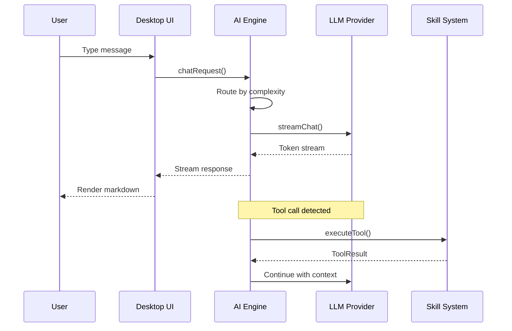
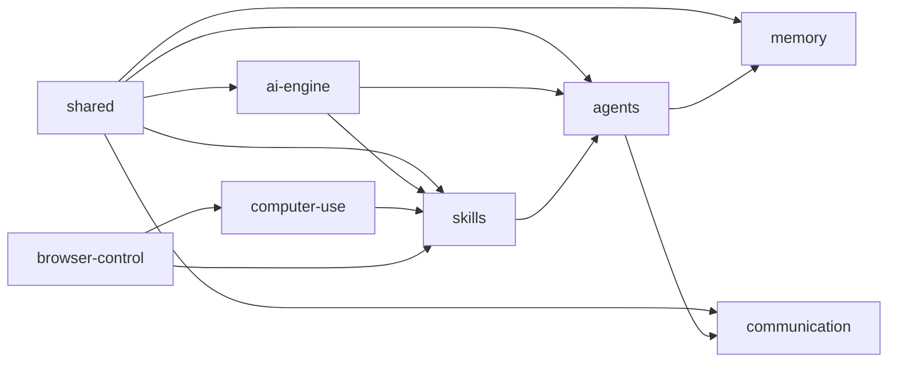
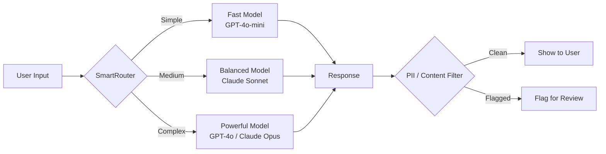
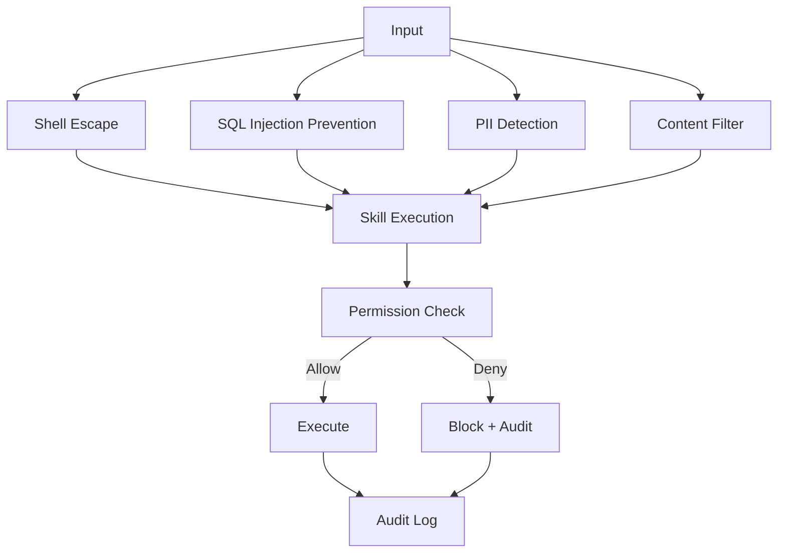
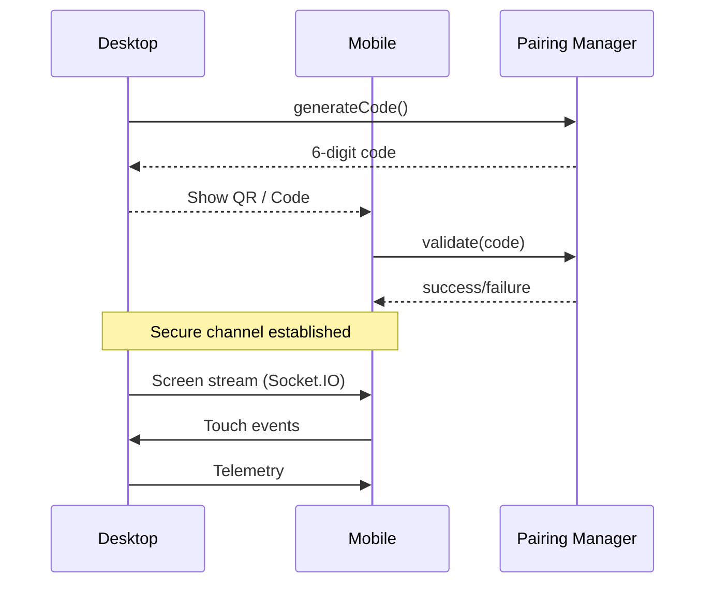
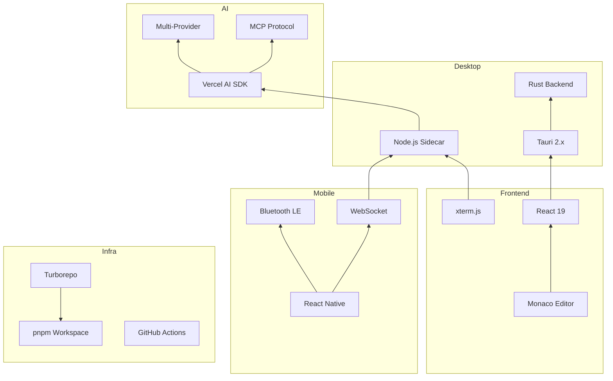

# Architecture Overview

## System Context

```mermaid
graph TB
    subgraph "Desktop App (Tauri 2.x)"
        UI[React UI<br/>Monaco Editor]
        Terminal[xterm.js + node-pty]
        Sidecar[Node.js Sidecar]
        Rust[Rust Native Modules]
    end

    subgraph "AI Engine"
        Router[SmartRouter / AdaptiveRouter]
        Providers[13+ LLM Providers]
        MCP[MCP Client]
        Skills[Skill Registry]
    end

    subgraph "Mobile (React Native)"
        RemoteUI[Remote Control UI]
        ScreenCast[Screen Cast]
        BT[Bluetooth Pairing]
    end

    subgraph "Services"
        WS[Socket.IO Server]
        OAI[OpenAI API]
        ANTH[Anthropic API]
        OLLAMA[Ollama Local]
        GH[GitHub Integration]
    end

    UI --> Sidecar
    Terminal --> Sidecar
    Sidecar --> Rust
    Sidecar --> AI Engine
    Router --> Providers
    Router --> MCP
    MCP --> Skills
    Mobile --> WS
    WS --> Sidecar
    Providers --> OAI
    Providers --> ANTH
    Providers --> OLLAMA
    Skills --> GH
```

## Communication Flow



## Package Dependency Graph



## Data Flow



## Security Layers



## Desktop-Mobile Pairing Flow



## Tech Stack Layers


