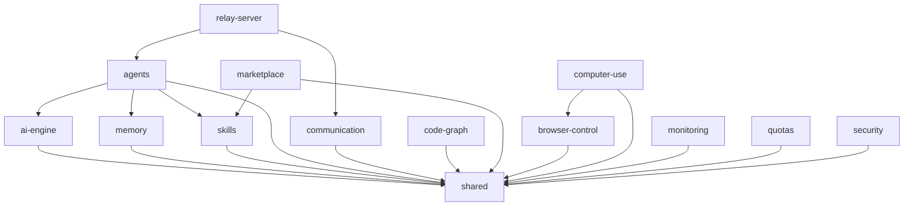

# Architecture

GHITA CODING AGENT là monorepo pnpm workspace gồm **15+ packages** và **3 apps**.

## Sơ đồ tổng quan

```
┌─────────────────────────────────────────────────────────────┐
│  Apps Layer                                                  │
│  ┌──────────────┐  ┌──────────────┐  ┌──────────────────┐  │
│  │  Desktop     │  │  Mobile      │  │  VSCode Ext      │  │
│  │  (Tauri)     │  │  (RN)        │  │                  │  │
│  └──────┬───────┘  └──────┬───────┘  └────────┬─────────┘  │
└─────────┼─────────────────┼────────────────────┼────────────┘
          │                 │                    │
          ▼                 ▼                    ▼
┌─────────────────────────────────────────────────────────────┐
│  Core Engine (packages/)                                     │
│  ┌──────────────┐  ┌──────────────┐  ┌──────────────────┐  │
│  │  ai-engine   │  │  agents      │  │  skills          │  │
│  │  (30+ LLMs)  │◄─┤  (orchestr.) │  │  (marketplace)   │  │
│  └──────┬───────┘  └──────┬───────┘  └────────┬─────────┘  │
│         │                 │                    │            │
│  ┌──────▼─────────────────▼────────────────────▼──────────┐│
│  │  shared (types, constants, utils)                       ││
│  └─────────────────────────────────────────────────────────┘│
└─────────────────────────────────────────────────────────────┘
          │
          ▼
┌─────────────────────────────────────────────────────────────┐
│  Infrastructure (packages/)                                  │
│  ┌──────────┐  ┌──────────┐  ┌──────────┐  ┌──────────┐    │
│  │  memory  │  │  comms   │  │  monitor │  │  quotas  │    │
│  │  (RAG)   │  │  (WS)    │  │  (Sentry)│  │  (limit) │    │
│  └──────────┘  └──────────┘  └──────────┘  └──────────┘    │
│  ┌──────────┐  ┌──────────┐  ┌──────────┐  ┌──────────┐    │
│  │ security │  │  browser │  │  computer│  │  relay   │    │
│  │  (audit) │  │  -control│  │  -use    │  │  -server │    │
│  └──────────┘  └──────────┘  └──────────┘  └──────────┘    │
└─────────────────────────────────────────────────────────────┘
```

## Package dependency graph



## Data flow

1. User input → Desktop UI
2. UI → `agents` orchestrator
3. Orchestrator → `ai-engine` (chat completion)
4. Orchestrator → `skills` (execute skill)
5. Skill → `computer-use` / `browser-control` (tác động desktop/browser)
6. Orchestrator → `memory` (save context, recall past)
7. Result → UI

## Xem thêm

- [Packages overview](./packages)
- [Data flow chi tiết](./data-flow)
- [Multi-provider design](./features/multi-provider)
