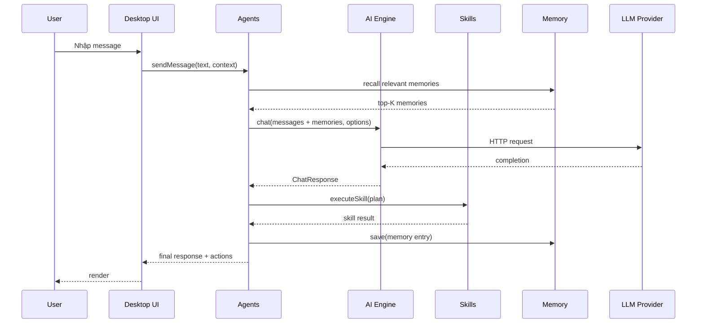

# Data Flow

End-to-end flow khi user gửi 1 message đến agent.

## Sequence diagram

## Message lifecycle

1. **Parse** — User input được parse thành `ChatMessage[]`
2. **Augment** — Inject memory context, skills, system prompt
3. **Route** — Smart router chọn provider + model phù hợp
4. **Cache** — Check response cache (Phase 26)
5. **Batch** — Nếu cùng provider, gộp request (Phase 27)
6. **Load balance** — Round-robin/random giữa các keys (Phase 28)
7. **Send** — HTTP request tới LLM provider
8. **Stream** — Nhận streaming response (SSE)
9. **Trace** — Performance span được ghi (Phase 32)
10. **Bill** — Usage tracker ghi nhận (Phase 33)
11. **Save** — Memory layer lưu lại (Phase 30)
12. **Audit** — Security audit log (Phase 34)
13. **Render** — UI hiển thị
