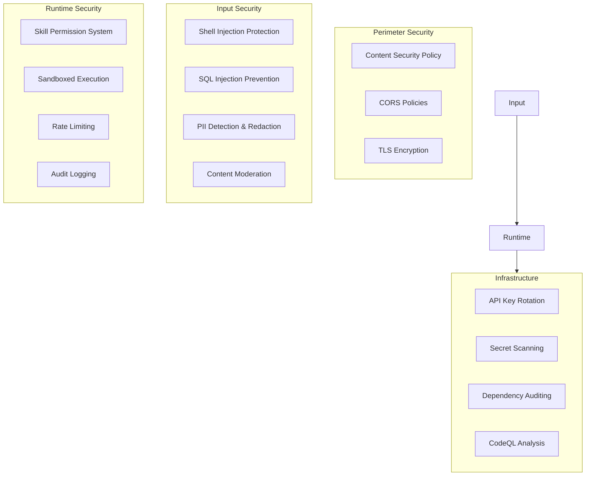

# Security Guide

## Overview

GHITA CODING AGENT takes security seriously. This guide covers the security architecture, threat model, and best practices for using and developing the application.

## Security Architecture



## Threat Model

| Threat | Severity | Mitigation |
|--------|----------|-----------|
| Shell injection via AI prompts | **Critical** | `escapeShellArg()`, `escapePowerShellString()` in all terminal skills |
| SQL injection | **High** | SELECT-only queries enforced by `db.query` skill |
| Cross-site scripting (XSS) | **High** | CSP headers, input sanitization via `security` package |
| API key theft | **High** | Keys stored in environment variables, not in code |
| Unauthorized desktop access | **Medium** | 6-digit pairing codes with 5-min TTL, lockout after 10 failures |
| Denial of service | **Medium** | Rate limiting per endpoint, circuit breakers in smart router |
| Supply chain attack | **Medium** | Lockfile, dependency review CI (deny GPL/AGPL) |
| Data exfiltration | **Medium** | PII detection, content filtering middleware |
| Prompt injection | **Medium** | Content moderation, guardrails middleware |
| Bluetooth eavesdropping | **Low** | Pairing code validation, encrypted channels |

## Security Checklist

### For Developers

When writing code, verify:

- [ ] **Shell commands:** All user-controlled input is sanitized via `escapeShellArg()` or `escapePowerShellString()` before passing to shell execution
- [ ] **API keys:** Keys are read from environment variables, never hardcoded
- [ ] **Database queries:** All queries are SELECT-only and parameterized
- [ ] **HTML output:** User content is escaped to prevent XSS
- [ ] **File paths:** Path traversal attempts are blocked (e.g., `../../etc/passwd`)
- [ ] **Rate limiting:** New API endpoints have appropriate rate limits configured
- [ ] **Audit logging:** Security-relevant operations are logged
- [ ] **Dependencies:** Run `pnpm audit` before adding new dependencies

### For Deployment

- [ ] HTTPS/SSL enabled for all external communication
- [ ] CSP headers configured in production Tauri build
- [ ] Tauri permissions scoped to minimum required
- [ ] Sidecar port not exposed to external network
- [ ] Regular security updates applied (OS, Rust, Node.js)
- [ ] Monitoring alerts configured for suspicious activity
- [ ] Backup strategy in place

## Security Features by Package

| Package | Security Features |
|---------|------------------|
| `ai-engine` | Content filter, PII detection, secret detection, guardrails middleware, permission manager, audit logging |
| `skills` | Shell argument escaping, SQL injection prevention (SELECT-only), adapter sandboxing, permission levels |
| `security` | Input sanitizer, CORS auditor, secret rotator, SSRF protection (IPv4 range validation) |
| `communication` | Pairing code validation, rate limiting (lockout after 10 failures), session security |
| `quotas` | Rate limiting, usage tracking, overage billing protection |
| `monitoring` | Security alert rules, anomaly detection |

## Code Security Examples

### Shell Argument Escaping

```typescript
import { escapeShellArg } from '@ghita/skills';

// ❌ Unsafe — prompt injection could execute arbitrary commands
const result = await exec(`echo ${userInput}`);

// ✅ Safe — special characters are escaped
const result = await exec(`echo ${escapeShellArg(userInput)}`);
```

### SQL Injection Prevention

```typescript
import { db } from '@ghita/skills';

// ❌ Unsafe — string concatenation allows injection
const result = await db.query(`SELECT * FROM users WHERE name = '${input}'`);

// ✅ Safe — SELECT-only + parameterized
const result = await db.query('SELECT * FROM users WHERE name = ?', [input]);
```

### Rate Limiting

```typescript
import { RateLimiter } from '@ghita/quotas';

const limiter = new RateLimiter({
  maxRequests: 10,  // 10 requests
  windowMs: 60000,  // per 60 seconds
});

if (!limiter.allow(clientIp)) {
  return { status: 429, error: 'Too many requests' };
}
```

## Reporting Vulnerabilities

If you discover a security vulnerability, please follow responsible disclosure:

1. **Do NOT** open a public GitHub issue
2. Send details to the project maintainer via [GitHub Security Advisories](https://github.com/ghitatruongle/GHITA-CODING-AGENT/security/advisories)
3. Include: description, steps to reproduce, affected versions, and suggested fix if any
4. Expect initial response within 48 hours
5. We will coordinate disclosure timeline

We follow a **90-day disclosure deadline**: we aim to patch within 90 days of the initial report.

## Security Update Policy

| Severity | Response Time | Release |
|----------|--------------|---------|
| **Critical** | 24 hours | Hotfix release |
| **High** | 1 week | Next patch release |
| **Medium** | 2 weeks | Next minor release |
| **Low** | Next release cycle | Normal schedule |

## Dependency Security

- **Lockfile:** `pnpm-lock.yaml` ensures reproducible, verified installs
- **Audit:** `pnpm audit` runs weekly via scheduled CI
- **Review:** `dependency-review-action` blocks high-severity vulnerabilities and GPL/AGPL licenses on PRs
- **CodeQL:** Static analysis on every PR for both JavaScript/TypeScript and Rust

## See Also

- [Contributing Guide](./contributing.md) — Development best practices
- [Architecture Overview](./architecture-overview.md) — System architecture and data flow
- [Monitoring](./monitoring.md) — Observability and alerting
