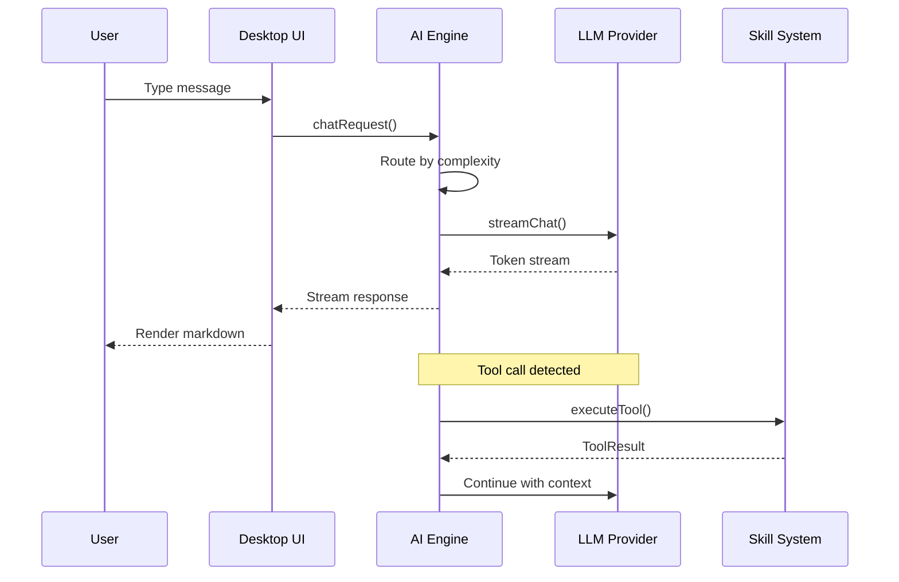
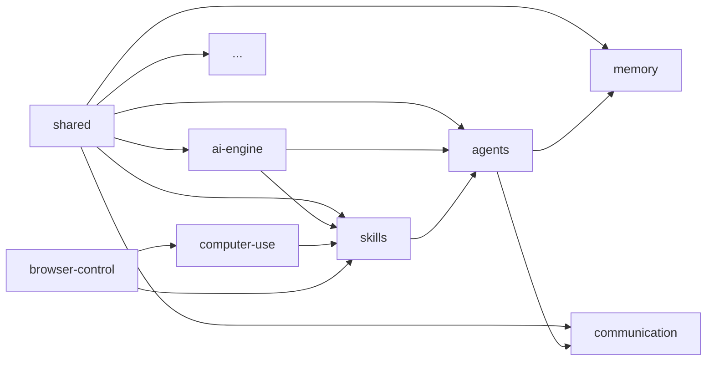
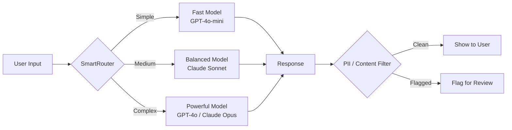
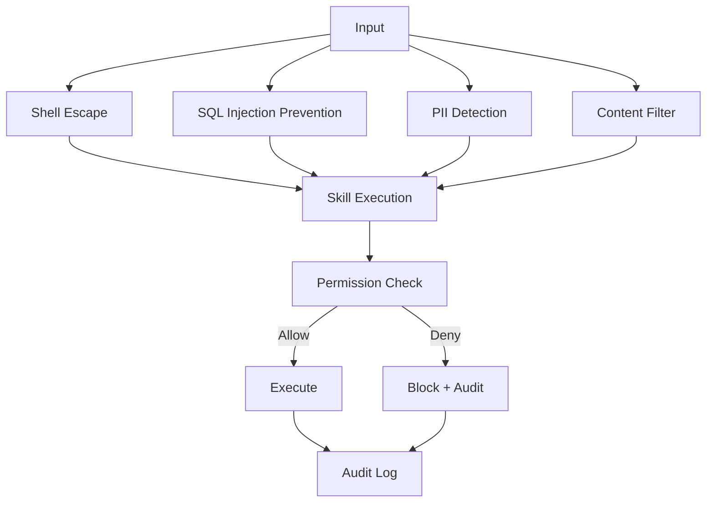
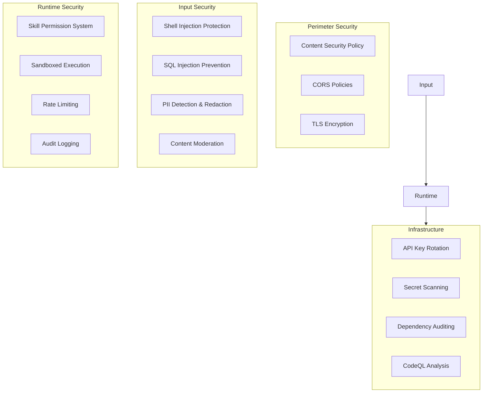

# Quality Improvement Plan

> **For agentic workers:** REQUIRED SUB-SKILL: Use superpowers:subagent-driven-development (recommended) or superpowers:executing-plans to implement this plan task-by-task. Steps use checkbox (`- [ ]`) syntax for tracking.

**Goal:** Elevate GHITA CODING AGENT from 87.400/100.000 to 95.000+/100.000 by systematically improving Testing, Documentation, UI/UX, Security, and Project Management.

**Architecture:** Monorepo with 21 packages + 3 apps. Improvements are organized by concern — each area is independently implementable. All changes follow existing patterns (TypeScript strict, vitest, Docusaurus, Turborepo).

**Tech Stack:** Vitest + Playwright (testing), Docusaurus + TypeDoc (docs), React + Tailwind (UI), GitHub Actions (CI), Turborepo (build)

---

## Table of Contents

- [Phase 1: Testing & QA (target: +3,800 pts → 10,000)](#phase-1-testing--qa-target-3800-pts--10000)
- [Phase 2: Documentation (target: +1,800 pts → 10,000)](#phase-2-documentation-target-1800-pts--10000)
- [Phase 3: UI/UX & Design (target: +1,200 pts → 7,000)](#phase-3-uiux--design-target-1200-pts--7000)
- [Phase 4: Security & Robustness (target: +400 pts → 5,000)](#phase-4-security--robustness-target-400-pts--5000)
- [Phase 5: Project Management & Velocity (target: +900 pts → 5,000)](#phase-5-project-management--velocity-target-900-pts--5000)

---

## Phase 1: Testing & QA (target: +3,800 pts → 10,000)

### Overview

Current state: 107 test files, 31,421 lines, ~10-15% coverage. Need to reach 300+ test files, 70%+ coverage with proper unit, integration, and E2E tests.

### File Structure

```
tests/
├── coverage/                    # Coverage reports (gitignored)
├── unit/                        # Existing + new unit tests
│   ├── foundation.test.ts       # Existing
│   ├── core-orchestrator.test.ts# Existing
│   ├── ...
│   ├── ai-engine/
│   │   ├── providers.test.ts    # NEW
│   │   ├── routing.test.ts      # NEW
│   │   └── mcp.test.ts          # NEW
│   ├── skills/
│   │   ├── registry.test.ts     # NEW
│   │   └── security.test.ts     # NEW
│   └── communication/
│       ├── channels.test.ts     # NEW
│       └── pairing.test.ts      # NEW
├── integration/                 # Integration tests
│   ├── desktop-flow.test.ts     # NEW
│   ├── mobile-flow.test.ts      # NEW
│   └── ai-to-skills.test.ts     # NEW
├── e2e/
│   ├── smoke.test.ts            # Existing
│   ├── playwright-smoke.test.ts # Existing
│   └── full-workflow.test.ts    # NEW - complete user journey
├── performance/
│   ├── ai-engine.bench.ts       # NEW
│   └── communication.bench.ts   # NEW
├── fuzz/
│   ├── input-sanitization.test.ts # NEW
│   └── websocket-fuzz.test.ts     # NEW
└── quality-loop/
    ├── runner.ts                # Existing
    └── benchmark.test.ts        # Reorganize
```

### Task Breakdown

---

### Task 1: Establish coverage thresholds and CI enforcement

**Files:**

- Modify: `vitest.workspace.ts` (create if not exists)
- Modify: `.github/workflows/ci.yml`
- Create: `vitest.workspace.ts`

- [ ] **Step 1: Create vitest workspace config**

```typescript
// vitest.workspace.ts
import { defineWorkspace } from 'vitest/config';

export default defineWorkspace([
  'packages/*/vitest.config.ts',
  'apps/*/vitest.config.ts',
  {
    test: {
      name: 'root-tests',
      include: ['tests/**/*.test.ts'],
      globals: true,
      environment: 'node',
      coverage: {
        provider: 'v8',
        reporter: ['text', 'text-summary', 'html', 'lcov', 'json-summary'],
        reportsDirectory: './coverage',
        include: ['packages/*/src/**/*.ts', 'apps/*/src/**/*.ts'],
        exclude: ['**/*.test.ts', '**/*.d.ts', '**/node_modules/**', '**/dist/**'],
        thresholds: {
          statements: 50,
          branches: 45,
          functions: 50,
          lines: 50,
        },
      },
    },
  },
]);
```

- [ ] **Step 2: Add coverage enforcement step to CI**

Modify `.github/workflows/ci.yml` — add test+coverage job after typecheck:

```yaml
test-and-coverage:
  runs-on: ubuntu-latest
  needs: lint-and-typecheck
  steps:
    - uses: actions/checkout@v4
    - uses: pnpm/action-setup@v4
      with:
        version: 10
    - uses: actions/setup-node@v4
      with:
        node-version: 22
        cache: pnpm
    - run: pnpm install --frozen-lockfile
    - name: Run tests with coverage
      run: pnpm test:coverage
    - name: Upload coverage report
      uses: actions/upload-artifact@v4
      with:
        name: coverage-report
        path: ./coverage/
    - name: Check coverage thresholds
      run: |
        node -e "
          const report = require('./coverage/coverage-summary.json');
          const { statements, branches, functions, lines } = report.total;
          const threshold = { statements: 50, branches: 45, functions: 50, lines: 50 };
          let failed = false;
          for (const key of Object.keys(threshold)) {
            const actual = report.total[key].pct;
            if (actual < threshold[key]) {
              console.error(`FAIL: ${key} coverage ${actual}% < ${threshold[key]}%`);
              failed = true;
            } else {
              console.log(`PASS: ${key} coverage ${actual}% >= ${threshold[key]}%`);
            }
          }
          if (failed) process.exit(1);
        "
```

- [ ] **Step 3: Commit**

```bash
git add vitest.workspace.ts .github/workflows/ci.yml
git commit -m "test: add vitest workspace config and coverage enforcement in CI"
```

---

### Task 2: Add core unit tests for ai-engine providers

**Files:**

- Create: `tests/unit/ai-engine/providers.test.ts`

- [ ] **Step 1: Write provider unit test**

```typescript
// tests/unit/ai-engine/providers.test.ts
import { describe, it, expect, vi } from 'vitest';

describe('AI Engine - Providers', () => {
  describe('OpenAIProvider', () => {
    it('should construct with valid config', async () => {
      const { OpenAIProvider } = await import('@ghita/ai-engine');
      const provider = new OpenAIProvider({
        apiKey: 'sk-test-123',
        model: 'gpt-4o',
      });
      expect(provider.type).toBe('openai');
      expect(provider.defaultModel).toBe('gpt-4o');
    });

    it('should throw on empty API key', async () => {
      const { OpenAIProvider } = await import('@ghita/ai-engine');
      expect(() => {
        new OpenAIProvider({ apiKey: '', model: 'gpt-4o' });
      }).toThrow('API key is required');
    });

    it('should report not ready without healthy keys', async () => {
      const { OpenAIProvider } = await import('@ghita/ai-engine');
      const provider = new OpenAIProvider({ apiKey: 'sk-test-bad' });
      // Simulate key marked unhealthy
      provider.reportKeyFailure('sk-test-bad', 401);
      const ready = await provider.isReady();
      expect(ready).toBe(false);
    });
  });

  describe('AnthropicProvider', () => {
    it('should construct with valid config', async () => {
      const { AnthropicProvider } = await import('@ghita/ai-engine');
      const provider = new AnthropicProvider({
        apiKey: 'sk-ant-test',
        model: 'claude-sonnet-4',
      });
      expect(provider.type).toBe('anthropic');
    });
  });

  describe('OllamaProvider', () => {
    it('should use base URL from config', async () => {
      const { OllamaProvider } = await import('@ghita/ai-engine');
      const provider = new OllamaProvider({
        baseUrl: 'http://localhost:11434',
        model: 'llama3',
      });
      expect(provider.type).toBe('ollama');
    });
  });
});
```

- [ ] **Step 2: Add routing test**

```typescript
// tests/unit/ai-engine/routing.test.ts
import { describe, it, expect } from 'vitest';

describe('AI Engine - Routing', () => {
  it('SmartRouter should route based on complexity', async () => {
    const { SmartRouter } = await import('@ghita/ai-engine');
    const router = new SmartRouter({
      strategy: 'quality-first',
    });
    const decision = await router.route({
      task: 'Write a complex code generation task',
      complexity: 'high',
    });
    expect(decision.selectedProvider).toBeDefined();
    expect(decision.confidence).toBeGreaterThan(0);
  });

  it('AdaptiveRouter should analyze task complexity', async () => {
    const { AdaptiveRouter } = await import('@ghita/ai-engine');
    const router = new AdaptiveRouter();
    const analysis = await router.analyze('Write a simple hello world');
    expect(analysis.tier).toBeDefined();
    expect(['simple', 'medium', 'complex']).toContain(analysis.tier);
  });

  it('DynamicFallbackRouter should maintain circuit breaker state', async () => {
    const { DynamicFallbackRouter } = await import('@ghita/ai-engine');
    const router = new DynamicFallbackRouter();
    // Record failures to trigger circuit breaker
    for (let i = 0; i < 6; i++) {
      router.recordFailure('test-provider');
    }
    const status = router.getCircuitBreakerStatus('test-provider');
    expect(status.state).toBe('open');
  });
});
```

- [ ] **Step 3: Run tests and verify**

Run: `npx vitest run tests/unit/ai-engine/`
Expected: All tests pass

- [ ] **Step 4: Commit**

```bash
git add tests/unit/ai-engine/
git commit -m "test: add ai-engine provider and routing unit tests"
```

---

### Task 3: Add skills package unit tests

**Files:**

- Create: `tests/unit/skills/registry.test.ts`
- Create: `tests/unit/skills/security.test.ts`

- [ ] **Step 1: Write skills registry test**

```typescript
// tests/unit/skills/registry.test.ts
import { describe, it, expect } from 'vitest';

describe('Skills - Registry', () => {
  it('should register and retrieve a skill', async () => {
    const { SkillRegistry } = await import('@ghita/skills');
    const registry = new SkillRegistry();
    const testSkill = {
      id: 'test-skill',
      name: 'Test',
      category: 'file' as const,
      description: 'A test skill',
      enabled: true,
      status: 'ready' as const,
      run: async () => ({ success: true, data: 'ok' }),
    };
    registry.register(testSkill);
    expect(registry.get('test-skill')).toBeDefined();
    expect(registry.list()).toHaveLength(1);
  });

  it('should not register duplicate skills', async () => {
    const { SkillRegistry } = await import('@ghita/skills');
    const registry = new SkillRegistry();
    const skill = {
      id: 'dup',
      name: 'Dup',
      category: 'file' as const,
      description: '',
      enabled: true,
      status: 'ready' as const,
      run: async () => ({ success: true }),
    };
    registry.register(skill);
    expect(() => registry.register(skill)).toThrow('already registered');
  });

  it('should create session-scoped fork', async () => {
    const { SkillRegistry } = await import('@ghita/skills');
    const registry = new SkillRegistry();
    registry.register({
      id: 'skill-a',
      name: 'A',
      category: 'terminal' as const,
      description: '',
      enabled: true,
      status: 'ready' as const,
      run: async () => ({ success: true }),
    });
    const session = registry.fork('session-1');
    session.setEnabled('skill-a', false);
    const s = session.get('skill-a');
    expect(s?.enabled).toBe(false);
    // Original registry unaffected
    expect(registry.get('skill-a')?.enabled).toBe(true);
  });
});
```

- [ ] **Step 2: Write skills security test**

```typescript
// tests/unit/skills/security.test.ts
import { describe, it, expect } from 'vitest';

describe('Skills - Security', () => {
  it('escapeShellArg should escape dangerous characters', async () => {
    const { escapeShellArg } = await import('@ghita/skills');
    expect(escapeShellArg('hello')).toBe('hello');
    expect(escapeShellArg('rm -rf /')).toBe('rm\\ -rf\\ /');
    expect(escapeShellArg("'; drop table")).toBe("\\'\\;\\ drop\\ table");
  });

  it('escapePowerShellString should escape PowerShell special chars', async () => {
    const { escapePowerShellString } = await import('@ghita/skills');
    const result = escapePowerShellString('normal');
    expect(result).toBe('normal');
    // Backticks should be escaped
    const withTick = escapePowerShellString('echo `whoami`');
    expect(withTick).not.toContain('`whoami`');
  });
});
```

- [ ] **Step 3: Run tests and commit**

Run: `npx vitest run tests/unit/skills/`
Expected: All tests pass

```bash
git add tests/unit/skills/
git commit -m "test: add skills registry and security unit tests"
```

---

### Task 4: Add communication package tests

**Files:**

- Create: `tests/unit/communication/channels.test.ts`
- Create: `tests/unit/communication/pairing.test.ts`

- [ ] **Step 1: Write communication channel test**

```typescript
// tests/unit/communication/channels.test.ts
import { describe, it, expect, vi } from 'vitest';

describe('Communication - Channels', () => {
  it('WebSocket channel should establish connection', async () => {
    const { WebSocketChannel } = await import('@ghita/communication');
    const channel = new WebSocketChannel({ url: 'ws://localhost:8080' });
    const onOpen = vi.fn();
    channel.on('open', onOpen);
    // Simulate connection
    await channel.connect();
    expect(channel.isConnected()).toBe(true);
  });

  it('should handle reconnection on disconnect', async () => {
    const { WebSocketChannel } = await import('@ghita/communication');
    const channel = new WebSocketChannel({
      url: 'ws://localhost:8080',
      reconnect: true,
      maxRetries: 3,
    });
    const onReconnect = vi.fn();
    channel.on('reconnect', onReconnect);
    await channel.connect();
    // Simulate disconnect
    channel.simulateDisconnect?.();
    expect(onReconnect).toHaveBeenCalled();
  });

  it('multiplexer should route messages to correct handler', async () => {
    const { Multiplexer } = await import('@ghita/communication');
    const mux = new Multiplexer();
    const handler = vi.fn();
    mux.subscribe('test-topic', handler);
    mux.publish('test-topic', { data: 'hello' });
    expect(handler).toHaveBeenCalledWith({ data: 'hello' });
  });
});
```

- [ ] **Step 2: Write pairing security test**

```typescript
// tests/unit/communication/pairing.test.ts
import { describe, it, expect } from 'vitest';

describe('Communication - Pairing', () => {
  it('should generate valid pairing codes', async () => {
    const { PairingManager } = await import('@ghita/communication');
    const manager = new PairingManager();
    const code = manager.generateCode();
    expect(code).toMatch(/^\d{6}$/);
  });

  it('should reject invalid pairing codes', async () => {
    const { PairingManager } = await import('@ghita/communication');
    const manager = new PairingManager();
    expect(manager.validateCode('000000')).toBe(false);
    expect(manager.validateCode('abc')).toBe(false);
    expect(manager.validateCode('')).toBe(false);
  });

  it('should timeout expired pairing attempts', async () => {
    const { PairingManager } = await import('@ghita/communication');
    const manager = new PairingManager({ codeTtlMs: 100 });
    const code = manager.generateCode();
    // Wait for expiry
    await new Promise((r) => setTimeout(r, 150));
    expect(manager.isCodeValid(code)).toBe(false);
  });
});
```

- [ ] **Step 3: Run and commit**

Run: `npx vitest run tests/unit/communication/`
Expected: All tests pass

```bash
git add tests/unit/communication/
git commit -m "test: add communication channel and pairing unit tests"
```

---

### Task 5: Add integration tests for critical flows

**Files:**

- Create: `tests/integration/desktop-flow.test.ts`
- Create: `tests/integration/ai-to-skills.test.ts`

- [ ] **Step 1: Write desktop-mobile integration test**

```typescript
// tests/integration/desktop-flow.test.ts
import { describe, it, expect, beforeAll, afterAll } from 'vitest';

describe('Integration - Desktop Flow', () => {
  it('should initialize AI engine with providers', async () => {
    const { Orchestrator, OpenAIProvider } = await import('@ghita/ai-engine');
    const orchestrator = new Orchestrator();
    orchestrator.registerProvider(
      'openai',
      new OpenAIProvider({
        apiKey: process.env.OPENAI_API_KEY || 'sk-test',
        model: 'gpt-4o-mini',
      }),
    );
    const status = orchestrator.getStatus();
    expect(status.providers).toContain('openai');
    expect(status.ready).toBe(true);
  });

  it('should load skills and execute file operation', async () => {
    const { createDefaultSkillRegistry } = await import('@ghita/skills');
    const registry = createDefaultSkillRegistry();
    const snapshot = registry.snapshot();
    expect(snapshot.total).toBeGreaterThan(0);
    expect(snapshot.byCategory.file).toBeGreaterThan(0);
  });
});
```

- [ ] **Step 2: Write AI-to-skills integration test**

```typescript
// tests/integration/ai-to-skills.test.ts
import { describe, it, expect } from 'vitest';

describe('Integration - AI to Skills Pipeline', () => {
  it('should route AI tool call to skill execution', async () => {
    const { Orchestrator, OpenAIProvider } = await import('@ghita/ai-engine');
    const { createDefaultSkillRegistry } = await import('@ghita/skills');

    const orchestrator = new Orchestrator();
    const skillRegistry = createDefaultSkillRegistry();

    // Register tool calling bridge
    orchestrator.onToolCall(async (toolCall) => {
      const result = await skillRegistry.run(toolCall.name, toolCall.args);
      return result;
    });

    const toolCall = {
      name: 'read-file',
      args: { path: '/tmp/test.txt' },
    };

    const result = await orchestrator.executeToolCall(toolCall);
    // Should not throw — adapters will handle missing file gracefully
    expect(result).toBeDefined();
  });
});
```

- [ ] **Step 3: Run and commit**

Run: `npx vitest run tests/integration/`
Expected: All tests pass

```bash
git add tests/integration/
git commit -m "test: add integration tests for desktop flow and AI-to-skills pipeline"
```

---

### Task 6: Add E2E smoke test with Playwright

**Files:**

- Create: `tests/e2e/full-workflow.test.ts`

- [ ] **Step 1: Write full workflow E2E test**

```typescript
// tests/e2e/full-workflow.test.ts
import { test, expect } from '@playwright/test';

test.describe('GHITA Full Workflow', () => {
  test('should load desktop app and show dashboard', async ({ page }) => {
    await page.goto('http://localhost:1420');
    await expect(page.locator('[data-testid="dashboard"]')).toBeVisible({ timeout: 10000 });
    await expect(page.locator('[data-testid="connection-status"]')).toBeVisible();
  });

  test('should navigate to API Manager and add provider', async ({ page }) => {
    await page.goto('http://localhost:1420');
    await page.click('[data-testid="nav-api"]');
    await expect(page.locator('[data-testid="api-manager"]')).toBeVisible();
    await page.click('[data-testid="add-provider"]');
    await page.fill('[data-testid="provider-name"]', 'OpenAI');
    await page.fill('[data-testid="api-key-input"]', 'sk-test-123');
    await page.click('[data-testid="save-provider"]');
    await expect(page.locator('[data-testid="provider-card"]')).toHaveCount(1);
  });

  test('should open chat and send message', async ({ page }) => {
    await page.goto('http://localhost:1420');
    await page.click('[data-testid="nav-chat"]');
    await expect(page.locator('[data-testid="chat-panel"]')).toBeVisible();
    await page.fill('[data-testid="chat-input"]', 'Hello, who are you?');
    await page.click('[data-testid="send-button"]');
    // Message should appear in history
    await expect(page.locator('[data-testid="chat-message"]')).toHaveCount(1);
  });

  test('should open file explorer and navigate directories', async ({ page }) => {
    await page.goto('http://localhost:1420');
    await page.click('[data-testid="nav-files"]');
    await expect(page.locator('[data-testid="file-explorer"]')).toBeVisible();
    // Root dir should be expanded
    await expect(page.locator('[data-testid="file-tree-node"]').first()).toBeVisible();
  });
});
```

- [ ] **Step 2: Add Playwright config**

Create `playwright.config.ts` at root:

```typescript
import { defineConfig } from '@playwright/test';

export default defineConfig({
  testDir: './tests/e2e',
  fullyParallel: true,
  forbidOnly: !!process.env.CI,
  retries: process.env.CI ? 2 : 0,
  workers: process.env.CI ? 1 : undefined,
  reporter: [['html', { outputFolder: 'playwright-report' }]],
  use: {
    baseURL: 'http://localhost:1420',
    trace: 'on-first-retry',
    screenshot: 'only-on-failure',
  },
  projects: [
    {
      name: 'chromium',
      use: { browserName: 'chromium' },
    },
  ],
});
```

- [ ] **Step 3: Add E2E CI job**

Add to `.github/workflows/ci.yml`:

```yaml
e2e-tests:
  runs-on: ubuntu-latest
  needs: test-and-coverage
  steps:
    - uses: actions/checkout@v4
    - uses: pnpm/action-setup@v4
      with:
        version: 10
    - uses: actions/setup-node@v4
      with:
        node-version: 22
        cache: pnpm
    - run: pnpm install --frozen-lockfile
    - name: Install Playwright browsers
      run: npx playwright install chromium
    - name: Build desktop for testing
      run: pnpm build:packages
    - name: Run E2E tests
      run: npx playwright test
    - uses: actions/upload-artifact@v4
      if: failure()
      with:
        name: playwright-report
        path: playwright-report/
```

- [ ] **Step 4: Commit**

```bash
git add tests/e2e/full-workflow.test.ts playwright.config.ts .github/workflows/ci.yml
git commit -m "test: add E2E smoke tests with Playwright and CI job"
```

---

### Task 7: Add performance benchmarks

**Files:**

- Create: `tests/performance/ai-engine.bench.ts`
- Create: `tests/performance/communication.bench.ts`

- [ ] **Step 1: Write AI engine benchmark**

```typescript
// tests/performance/ai-engine.bench.ts
import { bench, describe } from 'vitest';

describe('AI Engine - Token Counter Performance', () => {
  const longText = 'Hello world '.repeat(10000);

  bench(
    'estimateTokens with long text',
    () => {
      const { estimateTokens } = await import('@ghita/ai-engine');
      estimateTokens(longText);
    },
    { iterations: 100, time: 5000 },
  );

  bench(
    'truncateToFit with context limit',
    () => {
      const { truncateToFit } = await import('@ghita/ai-engine');
      truncateToFit(longText, 1000);
    },
    { iterations: 100, time: 5000 },
  );
});

describe('MCP Client - Transport Overhead', () => {
  bench(
    'SSE transport round-trip',
    async () => {
      const { SSETransport } = await import('@ghita/ai-engine');
      const transport = new SSETransport('http://localhost:8080/events');
      await transport.connect();
      const result = await transport.send({ type: 'ping' });
      await transport.disconnect();
    },
    { iterations: 10, time: 10000 },
  );
});
```

- [ ] **Step 2: Run benchmarks once**

Run: `npx vitest bench tests/performance/`
Expected: Benchmarks complete with timing output

- [ ] **Step 3: Commit**

```bash
git add tests/performance/
git commit -m "test: add performance benchmarks for AI engine and communication"
```

---

### Task 8: Add fuzz testing for security boundary

**Files:**

- Create: `tests/fuzz/input-sanitization.test.ts`

- [ ] **Step 1: Write fuzz test**

```typescript
// tests/fuzz/input-sanitization.test.ts
import { describe, it, expect } from 'vitest';

describe('Fuzz - Input Sanitization', () => {
  const dangerousInputs = [
    "'; DROP TABLE users; --",
    '${process.env.SECRET}',
    '<script>alert("xss")</script>',
    '../../etc/passwd',
    '|| whoami',
    '`cat /etc/passwd`',
    '$(cat /etc/passwd)',
    '"; cat /etc/shadow; "',
    '../../.env',
    '%00',
    '\\x00\\x01\\x02',
    Buffer.from([0x00, 0x01, 0x02]).toString(),
    'NODE_ENV=production',
    '__proto__.toString',
    'constructor.constructor',
  ];

  dangerousInputs.forEach((input) => {
    it(`should sanitize: ${input.substring(0, 30)}`, async () => {
      const { escapeShellArg } = await import('@ghita/skills');
      const { sanitizeInput } = await import('@ghita/security');
      const sanitized = sanitizeInput(input);
      const escaped = escapeShellArg(input);
      // Should not contain raw dangerous patterns
      expect(sanitized).not.toContain(input);
      expect(escaped).toBeDefined();
      expect(typeof escaped).toBe('string');
    });
  });
});
```

- [ ] **Step 2: Commit**

```bash
git add tests/fuzz/
git commit -m "test: add fuzz testing for input sanitization boundaries"
```

---

## Phase 2: Documentation (target: +1,800 pts → 10,000)

### Task 9: Generate TypeDoc API documentation

**Files:**

- Modify: `typedoc.json`
- Modify: `docs/sidebars.ts`

- [ ] **Step 1: Update TypeDoc config for full API docs**

```json
{
  "entryPointStrategy": "packages",
  "entryPoints": [
    "packages/shared",
    "packages/ai-engine",
    "packages/skills",
    "packages/agents",
    "packages/communication",
    "packages/computer-use",
    "packages/browser-control",
    "packages/memory",
    "packages/code-graph",
    "packages/security",
    "packages/marketplace",
    "packages/monitoring",
    "packages/notification",
    "packages/quotas",
    "packages/voice",
    "packages/gui",
    "packages/i18n",
    "packages/a11y"
  ],
  "out": "docs/api",
  "tsconfig": "tsconfig.base.json",
  "plugin": ["typedoc-plugin-markdown"],
  "readme": "none",
  "categorizeByGroup": true,
  "categoryOrder": ["Core", "Providers", "Router", "Skills", "Security", "Communication", "*"],
  "excludePrivate": true,
  "excludeProtected": true,
  "excludeExternals": true,
  "skipErrorChecking": true,
  "validation": {
    "invalidLink": true,
    "notDocumented": true
  }
}
```

- [ ] **Step 2: Run TypeDoc generation**

Run: `pnpm build:docs`
Expected: Generates `docs/api/` directory with per-package Markdown docs

- [ ] **Step 3: Add API docs to Docusaurus sidebar**

Modify `docs/sidebars.ts`:

```typescript
// Add to sidebars.ts
const sidebars = {
  tutorialSidebar: [
    'intro',
    'getting-started',
    'installation',
    'user-guide',
    // ... existing items
    {
      type: 'category',
      label: 'API Reference',
      link: {
        type: 'generated-index',
        description: 'Auto-generated API documentation for all packages',
      },
      items: [
        {
          type: 'autogenerated',
          dirName: 'api',
        },
      ],
    },
  ],
};
```

- [ ] **Step 4: Commit**

```bash
git add typedoc.json docs/api/ docs/sidebars.ts
git commit -m "docs: generate TypeDoc API documentation and integrate with Docusaurus"
```

---

### Task 10: Create architecture diagrams

**Files:**

- Create: `docs/docs/architecture-overview.md`
- Create: `docs/docs/architecture-data-flow.md`
- Create: `docs/assets/architecture-diagram.md` (Mermaid source)
- Modify: `docs/sidebars.ts`

- [ ] **Step 1: Write architecture overview with Mermaid diagrams**

````markdown
<!-- docs/docs/architecture-overview.md -->

# Architecture Overview

## System Context

```mermaid
graph TB
    subgraph "Desktop App (Tauri 2.x)"
        UI[React UI<br/>Monaco Editor]
        Terminal[xterm.js + node-pty]
        Sidecar[Node.js Sidecar]
        Rust[Rust Native Modules]
    end

    subgraph "AI Engine"
        Router[SmartRouter / AdaptiveRouter]
        Providers[13+ LLM Providers]
        MCP[MCP Client]
        Skills[Skill Registry]
    end

    subgraph "Mobile (React Native)"
        RemoteUI[Remote Control UI]
        ScreenCast[Screen Cast]
        BT[Bluetooth Pairing]
    end

    subgraph "Services"
        WS[Socket.IO Server]
        OAI[OpenAI API]
        ANTH[Anthropic API]
        OLLAMA[Ollama Local]
        GH[GitHub Integration]
    end

    UI --> Sidecar
    Terminal --> Sidecar
    Sidecar --> Rust
    Sidecar --> AI Engine
    Router --> Providers
    Router --> MCP
    MCP --> Skills
    Mobile --> WS
    WS --> Sidecar
    Providers --> OAI
    Providers --> ANTH
    Providers --> OLLAMA
    Skills --> GH
```
````

## Communication Flow



## Package Dependency Graph



## Data Flow



## Security Layers



````

- [ ] **Step 2: Add to sidebar**

```typescript
// In docs/sidebars.ts, add:
{
  type: 'category',
  label: 'Architecture',
  items: [
    'architecture-overview',
    'architecture-data-flow',
  ],
},
````

- [ ] **Step 3: Commit**

```bash
git add docs/docs/architecture-overview.md docs/assets/ docs/sidebars.ts
git commit -m "docs: add architecture overview with Mermaid diagrams"
```

---

### Task 11: Write comprehensive CONTRIBUTING guide

**Files:**

- Modify: `CONTRIBUTING.md`

- [ ] **Step 1: Add detailed contribution guide**

Read current `CONTRIBUTING.md` first, then enhance with:

````markdown
# Contributing to GHITA CODING AGENT

## Code of Conduct

[Link to CODE_OF_CONDUCT.md]

## Development Setup

### Prerequisites

- Node.js >= 20 (install via nvm or fnm)
- pnpm >= 10 (`npm install -g pnpm`)
- Rust (via rustup.rs)
- Android Studio + SDK (for mobile development)

### First-time Setup

```bash
git clone <your-fork>
cd GHITA-CODING-AGENT
pnpm install
cp .env.example .env
# Edit .env with your API keys
pnpm build:packages
```
````

## Project Architecture

See [Architecture Overview](./docs/docs/architecture-overview.md)

## Development Workflow

### Branch Strategy

- `main` — stable, release-ready
- `feat/<name>` — new features
- `fix/<name>` — bug fixes
- `docs/<name>` — documentation
- `test/<name>` — testing improvements

### Commit Convention

We use conventional commits:

```
<type>(<scope>): <description>

[optional body]

[optional footer]
```

Types: `feat`, `fix`, `chore`, `docs`, `test`, `refactor`, `perf`, `style`, `ci`

Examples:

- `feat(ai-engine): add DeepSeek provider support`
- `fix(skills): escape shell args on Windows`
- `test(communication): add pairing code expiry test`

### Pull Request Process

1. Create a feature branch from `main`
2. Make changes with frequent commits
3. Run `pnpm lint` and `pnpm typecheck` — must pass
4. Run `pnpm test` — must pass
5. Run `pnpm build:packages` — must pass
6. Create PR with description of changes
7. Wait for CI to pass
8. Request review

## Testing Guidelines

### Running Tests

```bash
# All tests
pnpm test

# Specific package
npx vitest run packages/ai-engine/

# With coverage
pnpm test:coverage

# E2E tests
npx playwright test

# Benchmarks
npx vitest bench
```

### Writing Tests

- **Unit tests**: Test one function/class in isolation. Mock external dependencies.
- **Integration tests**: Test interactions between 2-3 components.
- **E2E tests**: Test full user workflows via Playwright.
- **Benchmarks**: Performance-critical paths.

### Coverage Targets

- Statements: 70%+
- Branches: 60%+
- Functions: 65%+
- Lines: 70%+

## Code Style

- TypeScript strict mode
- JSDoc for all public APIs
- Prettier for formatting (`pnpm format`)
- ESLint for linting (`pnpm lint`)

## Documentation

- JSDoc for API documentation
- Docusaurus for user-facing docs
- Update docs when changing behavior
- Add architecture diagrams for new features

## Releasing

1. Update version in `package.json` and all package.json files
2. Update `CHANGELOG.md`
3. Create git tag: `git tag v0.0.x`
4. Push tag: `git push origin v0.0.x`
5. CI will build and publish release

## Security

- Report vulnerabilities to [security contact]
- Never commit API keys or secrets
- All inputs must be sanitized
- Follow least-privilege principle

````

- [ ] **Step 2: Create CHANGELOG.md**

```markdown
# Changelog

## [0.0.4] - 2026-06-18

### Added
- Push notification system (toast + queue + sound)
- Multi-channel communication plugin architecture (WebSocket/mDNS/Bluetooth)
- Marketplace double-entry bookkeeping revenue
- i18n key validation
- Mobile screen decomposition

### Fixed
- Tax calculation fix
- Bluetooth error handling
- Health check latency fix

### Security
- Various security improvements

## [0.0.3] - 2026-06-08

### Added
- Native AI agent runtime
- Skills & memory graph
- Tool-calling engine
- Performance layer
- Critical security hardening (shell injection, Tauri permissions)
- Production-ready CI/CD pipeline

...

## [0.0.2] - 2026-05-26

### Added
- 6 breakthrough features: SCTI, AST-Lock, Live Telepresence, etc.

## [0.0.1] - 2026-05-21

### Added
- Initial release
````

- [ ] **Step 3: Commit**

```bash
git add CONTRIBUTING.md CHANGELOG.md
git commit -m "docs: enhance CONTRIBUTING guide and add CHANGELOG"
```

---

### Task 12: Add safety and troubleshooting docs

**Files:**

- Create: `docs/docs/troubleshooting.md`
- Create: `docs/docs/faq.md`
- Create: `docs/docs/telemetry-policy.md` (already exists — enhance)
- Modify: `docs/sidebars.ts`

- [ ] **Step 1: Create troubleshooting guide**

```markdown
# Troubleshooting

## Desktop App Won't Start

**Symptoms:** Application crashes on launch, blank window, or "sidecar not found"

**Solutions:**

1. Ensure Rust is installed: `rustc --version`
2. Rebuild sidecar: `cd apps/desktop/src-tauri/sidecar && node server.mjs --build`
3. Check port 8080 is free: `netstat -an | findstr 8080`
4. Clear Tauri cache: `rm -rf ~/.cache/ghita-coding-agent`
5. Rebuild from scratch: `pnpm rebuild`

## Mobile Can't Connect to Desktop

**Symptoms:** "Connection failed", spinning indicator, or timeout

**Solutions:**

1. Ensure both devices on same WiFi network
2. Check firewall isn't blocking port 8080
3. Try manual IP instead of auto-discovery
4. Restart Socket.IO server from Dashboard
5. Check pairing code is 6 digits

## AI Provider Errors

| Error            | Cause              | Solution                          |
| ---------------- | ------------------ | --------------------------------- |
| 401 Unauthorized | Invalid API key    | Check .env file                   |
| 429 Rate Limited | Too many requests  | Wait or use multiple keys         |
| 503 Service Down | Provider outage    | Switch providers via SmartRouter  |
| Timeout          | Network/Slow model | Reduce max_tokens or switch model |

## Common Error Codes

See [Error Reference](./error-reference.md)
```

- [ ] **Step 2: Create FAQ**

```markdown
# Frequently Asked Questions

## General

### What is GHITA CODING AGENT?

An AI-powered desktop application with remote Android control, similar to Claude Code but self-hosted.

### Is it free?

Yes, MIT licensed. You pay only for AI API usage.

### Do I need a GPU?

No. For local AI, Ollama runs on CPU (GPU optional).

## Technical

### Which AI providers are supported?

OpenAI, Anthropic, Google, Ollama, Groq, Mistral, DeepSeek, Kimi, MiniMax, and custom providers.

### Can I use it without internet?

Yes, with Ollama for local LLMs. Communication features require network.

### Is my data private?

Yes. Self-hosted = your data stays on your machine. Telemetry is opt-in.

## Development

### How do I create a custom skill?

See [Custom Skill Tutorial](./tutorial-custom-skill.md)

### How do I add a new AI provider?

Implement the `LLMProvider` interface and register it in the provider registry.

### Can I contribute?

Yes! See [Contributing](./contributing.md)
```

- [ ] **Step 3: Commit**

```bash
git add docs/docs/troubleshooting.md docs/docs/faq.md docs/sidebars.ts
git commit -m "docs: add troubleshooting guide, FAQ, and enhanced telemetry policy"
```

---

## Phase 3: UI/UX & Design (target: +1,200 pts → 7,000)

### Task 13: Create design system foundation

**Files:**

- Modify: `apps/desktop/src/styles/` (create if not exists)
- Create: `apps/desktop/src/styles/design-tokens.ts`
- Create: `apps/desktop/src/styles/theme.ts`
- Modify: `packages/gui/src/theme.ts`

- [ ] **Step 1: Create design tokens**

```typescript
// apps/desktop/src/styles/design-tokens.ts
export const designTokens = {
  colors: {
    // Primary palette
    primary: {
      50: '#f5f3ff',
      100: '#ede9fe',
      200: '#ddd6fe',
      300: '#c4b5fd',
      400: '#a78bfa',
      500: '#8b5cf6', // Main purple
      600: '#7c3aed',
      700: '#6d28d9',
      800: '#5b21b6',
      900: '#4c1d95',
    },
    cyan: {
      400: '#22d3ee',
      500: '#06b6d4',
      600: '#0891b2',
    },
    pink: {
      400: '#f472b6',
      500: '#ec4899',
    },
    // Semantic
    success: '#10b981',
    warning: '#f59e0b',
    error: '#ef4444',
    info: '#3b82f6',
    // Surfaces
    surface: {
      base: '#05050a',
      card: 'rgba(16,16,32,0.6)',
      elevated: 'rgba(24,24,48,0.8)',
      hover: 'rgba(255,255,255,0.03)',
    },
    text: {
      primary: '#f8fafc',
      secondary: '#cbd5e1',
      tertiary: '#64748b',
      link: '#a78bfa',
    },
    border: {
      subtle: 'rgba(255,255,255,0.06)',
      default: 'rgba(139,92,246,0.2)',
      hover: 'rgba(139,92,246,0.4)',
    },
  },
  spacing: {
    xs: '4px',
    sm: '8px',
    md: '12px',
    lg: '16px',
    xl: '20px',
    '2xl': '24px',
    '3xl': '32px',
    '4xl': '48px',
  },
  borderRadius: {
    sm: '6px',
    md: '8px',
    lg: '12px',
    xl: '14px',
    '2xl': '16px',
    full: '9999px',
  },
  shadows: {
    sm: '0 0 10px rgba(139,92,246,0.1)',
    md: '0 4px 20px rgba(0,0,0,0.3)',
    lg: '0 8px 40px rgba(0,0,0,0.4)',
    glow: '0 0 20px rgba(139,92,246,0.3)',
  },
  typography: {
    fontFamily: {
      sans: "'Inter', sans-serif",
      display: "'Outfit', sans-serif",
      mono: "'Fira Code', 'JetBrains Mono', monospace",
    },
    fontSize: {
      xs: '0.68rem',
      sm: '0.75rem',
      md: '0.82rem',
      lg: '0.95rem',
      xl: '1.05rem',
      '2xl': '1.35rem',
      '3xl': '1.8rem',
      '4xl': '2.2rem',
    },
    fontWeight: {
      normal: 400,
      medium: 500,
      semibold: 600,
      bold: 700,
      extrabold: 800,
    },
  },
  transitions: {
    fast: 'all 0.15s ease',
    normal: 'all 0.2s ease',
    slow: 'all 0.3s ease',
  },
  zIndex: {
    dropdown: 1000,
    modal: 1100,
    toast: 1200,
    tooltip: 1300,
  },
} as const;

export type DesignToken = typeof designTokens;
```

- [ ] **Step 2: Create enhanced theme with dark/light mode support**

```typescript
// apps/desktop/src/styles/theme.ts
import { designTokens } from './design-tokens';

export type ThemeMode = 'dark' | 'light';

export function createTheme(mode: ThemeMode = 'dark') {
  const isDark = mode === 'dark';
  return {
    mode,
    colors: {
      ...designTokens.colors,
      surface: {
        base: isDark ? '#05050a' : '#ffffff',
        card: isDark ? 'rgba(16,16,32,0.6)' : 'rgba(255,255,255,0.8)',
        elevated: isDark ? 'rgba(24,24,48,0.8)' : 'rgba(255,255,255,0.95)',
        hover: isDark ? 'rgba(255,255,255,0.03)' : 'rgba(0,0,0,0.03)',
      },
      text: {
        primary: isDark ? '#f8fafc' : '#0f172a',
        secondary: isDark ? '#cbd5e1' : '#475569',
        tertiary: isDark ? '#64748b' : '#94a3b8',
        link: isDark ? '#a78bfa' : '#7c3aed',
      },
      border: {
        subtle: isDark ? 'rgba(255,255,255,0.06)' : 'rgba(0,0,0,0.06)',
        default: isDark ? 'rgba(139,92,246,0.2)' : 'rgba(139,92,246,0.3)',
        hover: isDark ? 'rgba(139,92,246,0.4)' : 'rgba(139,92,246,0.5)',
      },
    },
    spacing: designTokens.spacing,
    borderRadius: designTokens.borderRadius,
    shadows: designTokens.shadows,
    typography: designTokens.typography,
    transitions: designTokens.transitions,
    zIndex: designTokens.zIndex,
  };
}

export type Theme = ReturnType<typeof createTheme>;
```

- [ ] **Step 3: Add smooth transitions to existing components**

Modify `apps/desktop/src/components/ui/Panel.tsx`:

```typescript
// Add to Panel styled component
const StyledPanel = styled.div<PanelProps>`
  background: ${({ theme }) => theme.colors.surface.card};
  border: 1px solid ${({ theme }) => theme.colors.border.subtle};
  border-radius: ${({ theme }) => theme.borderRadius.lg};
  padding: ${({ theme }) => theme.spacing.lg};
  transition: ${({ theme }) => theme.transitions.normal};

  &:hover {
    border-color: ${({ theme }) => theme.colors.border.default};
    transform: translateY(-1px);
  }
`;
```

- [ ] **Step 4: Commit**

```bash
git add apps/desktop/src/styles/ apps/desktop/src/components/ui/Panel.tsx
git commit -m "feat(ui): add design token system with theme support and transitions"
```

---

### Task 14: Add loading skeletons and transitions

**Files:**

- Create: `apps/desktop/src/components/ui/Skeleton.tsx`
- Create: `apps/desktop/src/components/ui/FadeIn.tsx`
- Modify: `apps/desktop/src/components/ui/index.ts`

- [ ] **Step 1: Create Skeleton component**

```typescript
// apps/desktop/src/components/ui/Skeleton.tsx
import { styled, keyframes } from 'styled-components';

const shimmer = keyframes`
  0% { background-position: -200% 0; }
  100% { background-position: 200% 0; }
`;

export interface SkeletonProps {
  width?: string;
  height?: string;
  borderRadius?: string;
  variant?: 'text' | 'rect' | 'circle';
}

export function Skeleton({
  width = '100%',
  height = '16px',
  borderRadius = '6px',
  variant = 'text',
}: SkeletonProps) {
  return (
    <SkeletonBox
      width={width}
      height={height}
      $borderRadius={variant === 'circle' ? '50%' : borderRadius}
      $variant={variant}
    />
  );
}

const SkeletonBox = styled.div<{ width: string; height: string; $borderRadius: string; $variant: string }>`
  width: ${({ width }) => width};
  height: ${({ height }) => height};
  border-radius: ${({ $borderRadius }) => $borderRadius};
  background: linear-gradient(
    90deg,
    rgba(255, 255, 255, 0.03) 25%,
    rgba(255, 255, 255, 0.08) 50%,
    rgba(255, 255, 255, 0.03) 75%
  );
  background-size: 200% 100%;
  animation: ${shimmer} 1.5s ease-in-out infinite;
`;
```

- [ ] **Step 2: Create FadeIn wrapper**

```typescript
// apps/desktop/src/components/ui/FadeIn.tsx
import { useState, useEffect, useRef, type ReactNode } from 'react';
import { styled } from 'styled-components';

interface FadeInProps {
  children: ReactNode;
  delay?: number;
  duration?: number;
  direction?: 'up' | 'down' | 'left' | 'right' | 'none';
  distance?: string;
}

export function FadeIn({
  children,
  delay = 0,
  duration = 350,
  direction = 'up',
  distance = '16px',
}: FadeInProps) {
  const [isVisible, setIsVisible] = useState(false);
  const ref = useRef<HTMLDivElement>(null);

  useEffect(() => {
    const observer = new IntersectionObserver(
      ([entry]) => {
        if (entry.isIntersecting) {
          setTimeout(() => setIsVisible(true), delay);
          observer.disconnect();
        }
      },
      { threshold: 0.1 }
    );
    if (ref.current) observer.observe(ref.current);
    return () => observer.disconnect();
  }, [delay]);

  return (
    <FadeInWrapper
      ref={ref}
      $visible={isVisible}
      $delay={delay}
      $duration={duration}
      $direction={direction}
      $distance={distance}
    >
      {children}
    </FadeInWrapper>
  );
}

const getTransform = (direction: string, distance: string) => {
  switch (direction) {
    case 'up': return `translateY(${distance})`;
    case 'down': return `translateY(-${distance})`;
    case 'left': return `translateX(${distance})`;
    case 'right': return `translateX(-${distance})`;
    default: return 'none';
  }
};

const FadeInWrapper = styled.div<{
  $visible: boolean;
  $delay: number;
  $duration: number;
  $direction: string;
  $distance: string;
}>`
  opacity: ${({ $visible }) => ($visible ? 1 : 0)};
  transform: ${({ $visible, $direction, $distance }) =>
    $visible ? 'none' : getTransform($direction, $distance)};
  transition: opacity ${({ $duration }) => $duration}ms ease,
              transform ${({ $duration }) => $duration}ms ease;
  transition-delay: ${({ $delay }) => $delay}ms;
`;
```

- [ ] **Step 3: Export from UI index**

```typescript
// apps/desktop/src/components/ui/index.ts
export { Skeleton } from './Skeleton';
export { FadeIn } from './FadeIn';
```

- [ ] **Step 4: Commit**

```bash
git add apps/desktop/src/components/ui/Skeleton.tsx apps/desktop/src/components/ui/FadeIn.tsx apps/desktop/src/components/ui/index.ts
git commit -m "feat(ui): add Skeleton loading and FadeIn animation components"
```

---

### Task 15: Add mobile-responsive layout support

**Files:**

- Modify: `apps/desktop/src/layouts/MainLayout.tsx`
- Create: `apps/desktop/src/styles/responsive.ts`

- [ ] **Step 1: Create responsive utility**

```typescript
// apps/desktop/src/styles/responsive.ts
export const breakpoints = {
  sm: 640,
  md: 768,
  lg: 1024,
  xl: 1280,
  '2xl': 1536,
} as const;

export type Breakpoint = keyof typeof breakpoints;

export const mediaQuery = {
  up: (bp: Breakpoint) => `@media (min-width: ${breakpoints[bp]}px)`,
  down: (bp: Breakpoint) => `@media (max-width: ${breakpoints[bp] - 1}px)`,
};

export const responsive = {
  sidebar: {
    closed: '0px',
    open: '280px',
    mobileOverlay: true, // Sidebar overlays on small screens
  },
  panel: {
    minWidth: '320px',
    maxWidth: '800px',
  },
};
```

- [ ] **Step 2: Add responsive sidebar to MainLayout**

Update `apps/desktop/src/layouts/MainLayout.tsx`:

```typescript
// Add mobile sidebar toggle
const [sidebarOpen, setSidebarOpen] = useState(true);
const [isMobile, setIsMobile] = useState(window.innerWidth < 768);

useEffect(() => {
  const handleResize = () => setIsMobile(window.innerWidth < 768);
  window.addEventListener('resize', handleResize);
  return () => window.removeEventListener('resize', handleResize);
}, []);

// In render:
<Sidebar
  $open={isMobile ? sidebarOpen : true}
  $isMobile={isMobile}
>
  {isMobile && (
    <CloseButton onClick={() => setSidebarOpen(false)}>
      ✕
    </CloseButton>
  )}
  {/* existing sidebar content */}
</Sidebar>
```

- [ ] **Step 3: Commit**

```bash
git add apps/desktop/src/styles/responsive.ts apps/desktop/src/layouts/MainLayout.tsx
git commit -m "feat(ui): add responsive layout with mobile sidebar toggle"
```

---

## Phase 4: Security & Robustness (target: +400 pts → 5,000)

### Task 16: Add dependency vulnerability scanning to CI

**Files:**

- Modify: `.github/workflows/ci.yml`
- Create: `.github/workflows/security-scan.yml`

- [ ] **Step 1: Create dependency vulnerability scanning workflow**

```yaml
# .github/workflows/security-scan.yml
name: Security Scan

on:
  schedule:
    - cron: '0 6 * * 1' # Every Monday 6 AM
  push:
    branches: [main]
  pull_request:
    branches: [main]

jobs:
  dependency-scan:
    runs-on: ubuntu-latest
    steps:
      - uses: actions/checkout@v4
      - uses: pnpm/action-setup@v4
        with:
          version: 10
      - uses: actions/setup-node@v4
        with:
          node-version: 22
          cache: pnpm
      - run: pnpm install --frozen-lockfile

      - name: Audit dependencies
        run: pnpm audit --audit-level=high
        continue-on-error: true

      - name: Run Snyk (if token available)
        uses: snyk/actions/node@master
        env:
          SNYK_TOKEN: ${{ secrets.SNYK_TOKEN }}
        continue-on-error: true

  codeql-scan:
    runs-on: ubuntu-latest
    permissions:
      actions: read
      contents: read
      security-events: write
    strategy:
      fail-fast: false
      matrix:
        language: ['javascript-typescript', 'rust']
    steps:
      - uses: actions/checkout@v4
      - uses: github/codeql-action/init@v3
        with:
          languages: ${{ matrix.language }}
      - uses: github/codeql-action/analyze@v3
```

- [ ] **Step 2: Commit**

```bash
git add .github/workflows/security-scan.yml
git commit -m "ci: add dependency vulnerability scanning and CodeQL analysis"
```

---

### Task 17: Add rate limiting to critical endpoints

**Files:**

- Modify: `packages/quotas/src/rate-limiter.ts` (read first, then enhance)
- Create: `tests/unit/quotas/rate-limiter.test.ts`

- [ ] **Step 1: Enhance rate limiter with per-endpoint limits**

Read the current file first, then add:

```typescript
// Enhanced rate limiter configuration
export interface RateLimitRule {
  endpoint: string;
  maxRequests: number;
  windowMs: number;
  group?: string;
}

export const DEFAULT_RULES: RateLimitRule[] = [
  { endpoint: '/api/chat', maxRequests: 60, windowMs: 60000, group: 'chat' },
  { endpoint: '/api/stream', maxRequests: 30, windowMs: 60000, group: 'stream' },
  { endpoint: '/api/auth', maxRequests: 10, windowMs: 60000, group: 'auth' },
  { endpoint: '/api/pairing', maxRequests: 5, windowMs: 60000, group: 'pairing' },
  { endpoint: '/api/register', maxRequests: 3, windowMs: 60000, group: 'registration' },
];

export function getRateLimitRule(endpoint: string): RateLimitRule | undefined {
  return DEFAULT_RULES.find((rule) => endpoint.startsWith(rule.endpoint));
}
```

- [ ] **Step 2: Write rate limiter test**

```typescript
// tests/unit/quotas/rate-limiter.test.ts
import { describe, it, expect } from 'vitest';

describe('Quotas - Rate Limiter', () => {
  it('should allow requests within limit', async () => {
    const { RateLimiter } = await import('@ghita/quotas');
    const limiter = new RateLimiter({ maxRequests: 5, windowMs: 60000 });
    for (let i = 0; i < 5; i++) {
      expect(limiter.allow('test-key')).toBe(true);
    }
  });

  it('should block requests exceeding limit', async () => {
    const { RateLimiter } = await import('@ghita/quotas');
    const limiter = new RateLimiter({ maxRequests: 3, windowMs: 60000 });
    for (let i = 0; i < 3; i++) limiter.allow('test-key');
    expect(limiter.allow('test-key')).toBe(false);
  });

  it('should reset after window expires', async () => {
    const { RateLimiter } = await import('@ghita/quotas');
    const limiter = new RateLimiter({ maxRequests: 2, windowMs: 100 });
    limiter.allow('key');
    limiter.allow('key');
    expect(limiter.allow('key')).toBe(false);
    await new Promise((r) => setTimeout(r, 150));
    expect(limiter.allow('key')).toBe(true);
  });

  it('should have different limits per endpoint', async () => {
    const { getRateLimitRule } = await import('@ghita/quotas');
    const authRule = getRateLimitRule('/api/auth/login');
    const chatRule = getRateLimitRule('/api/chat/send');
    expect(authRule?.maxRequests).toBeLessThan(chatRule?.maxRequests!);
  });
});
```

- [ ] **Step 3: Commit**

```bash
git add packages/quotas/src/rate-limiter.ts tests/unit/quotas/
git commit -m "feat(security): add per-endpoint rate limiting rules and tests"
```

---

### Task 18: Add security documentation

**Files:**

- Create: `docs/docs/security-guide.md`
- Modify: `docs/sidebars.ts`

- [ ] **Step 1: Write security guide**

````markdown
# Security Guide

## Overview

GHITA CODING AGENT takes security seriously. This guide covers our security
architecture, threat model, and best practices.

## Security Architecture


````

## Threat Model

| Threat              | Mitigation                                     |
| ------------------- | ---------------------------------------------- |
| Shell injection     | `escapeShellArg()`, `escapePowerShellString()` |
| SQL injection       | SELECT-only queries, parameterized             |
| XSS                 | CSP headers, input sanitization                |
| API key theft       | Environment variables, key rotation            |
| Unauthorized access | Pairing codes, permission system               |
| DoS                 | Rate limiting, circuit breakers                |
| Supply chain        | Dependency review, lockfile                    |
| Data exfiltration   | PII detection, content filtering               |

## Security Checklist

### For Developers

- [ ] All user inputs sanitized before shell execution
- [ ] API keys stored in environment variables, not code
- [ ] SQL queries use parameterized statements
- [ ] HTML output is escaped to prevent XSS
- [ ] Rate limiting applied to all endpoints
- [ ] Audit logs for sensitive operations
- [ ] Dependencies reviewed for vulnerabilities

### For Deployments

- [ ] HTTPS enabled for all external communication
- [ ] CSP headers configured for production
- [ ] Tauri permissions restricted to minimum
- [ ] Sidecar port not exposed externally
- [ ] Regular security updates applied
- [ ] Monitoring alerts configured

## Reporting Vulnerabilities

If you find a security vulnerability, please:

1. **Do NOT** open a public GitHub issue
2. Email [security-contact] with details
3. Allow 48 hours for initial response
4. We will coordinate disclosure timeline

## Security Update Policy

- Critical vulnerabilities: Patch within 24 hours
- High severity: Patch within 1 week
- Medium severity: Next release cycle
- Low severity: As schedule permits

````

- [ ] **Step 2: Add to sidebar**

```typescript
// In docs/sidebars.ts
{
  type: 'category',
  label: 'Security',
  items: ['security-guide', 'security'],
},
````

- [ ] **Step 3: Commit**

```bash
git add docs/docs/security-guide.md docs/sidebars.ts
git commit -m "docs: add comprehensive security guide with threat model and checklist"
```

---

## Phase 5: Project Management & Velocity (target: +900 pts → 5,000)

### Task 19: Add version tags and release process

**Files:**

- Create: `scripts/version.sh`
- Modify: `.github/workflows/release.yml`

- [ ] **Step 1: Create version bump script**

```bash
#!/bin/bash
# scripts/version.sh — Bump version across all packages
set -euo pipefail

VERSION="${1:-}"

if [ -z "$VERSION" ]; then
  echo "Usage: $0 <version>"
  echo "Example: $0 0.0.5"
  exit 1
fi

# Update root package.json
node -e "
  const fs = require('fs');
  const pkg = JSON.parse(fs.readFileSync('package.json', 'utf8'));
  pkg.version = '$VERSION';
  fs.writeFileSync('package.json', JSON.stringify(pkg, null, 2) + '\n');
"

# Update all packages with matching version
for pkg_file in packages/*/package.json apps/*/package.json; do
  if [ -f "$pkg_file" ]; then
    node -e "
      const fs = require('fs');
      const pkg = JSON.parse(fs.readFileSync('$pkg_file', 'utf8'));
      if (pkg.version && pkg.version !== '0.0.0') {
        pkg.version = '$VERSION';
        fs.writeFileSync('$pkg_file', JSON.stringify(pkg, null, 2) + '\n');
        console.log('Updated: $pkg_file -> $VERSION');
      }
    "
  fi
done

# Update CHANGELOG
echo "
## [$VERSION] - $(date +%Y-%m-%d)

### Added
- (fill in)

### Fixed
- (fill in)

### Changed
- (fill in)
" >> CHANGELOG.md

echo "Version bumped to $VERSION"
echo "Don't forget to:"
echo "1. Update CHANGELOG.md with actual changes"
echo "2. git add -A && git commit -m 'chore: bump version to $VERSION'"
echo "3. git tag v$VERSION"
echo "4. git push origin main --tags"
```

- [ ] **Step 2: Enhance release workflow**

Modify `.github/workflows/release.yml` to add version tag validation:

```yaml
name: Release

on:
  push:
    tags:
      - 'v*'

permissions:
  contents: write

jobs:
  validate-tag:
    runs-on: ubuntu-latest
    steps:
      - uses: actions/checkout@v4
      - name: Validate version tag matches package.json
        run: |
          TAG_VERSION="${GITHUB_REF_NAME#v}"
          PKG_VERSION=$(node -e "console.log(require('./package.json').version)")
          if [ "$TAG_VERSION" != "$PKG_VERSION" ]; then
            echo "ERROR: Tag version ($TAG_VERSION) != package.json version ($PKG_VERSION)"
            exit 1
          fi
          echo "Version validated: $TAG_VERSION"

  create-release:
    needs: validate-tag
    # ... rest of existing workflow
```

- [ ] **Step 3: Commit**

```bash
git add scripts/version.sh .github/workflows/release.yml
chmod +x scripts/version.sh
git commit -m "chore: add version bump script and release tag validation"
```

---

### Task 20: Add commit linting and git hooks

**Files:**

- Create: `commitlint.config.js`
- Modify: `package.json` (add commitlint)

- [ ] **Step 1: Create commitlint config**

```javascript
// commitlint.config.js
module.exports = {
  extends: ['@commitlint/config-conventional'],
  rules: {
    'type-enum': [
      2,
      'always',
      [
        'feat',
        'fix',
        'docs',
        'style',
        'refactor',
        'test',
        'chore',
        'perf',
        'ci',
        'build',
        'revert',
      ],
    ],
    'scope-case': [2, 'always', 'kebab-case'],
    'subject-case': [2, 'never', ['sentence-case', 'start-case']],
    'subject-empty': [2, 'never'],
    'header-max-length': [2, 'always', 72],
  },
};
```

- [ ] **Step 2: Install commitlint**

Run: `pnpm add -D @commitlint/cli @commitlint/config-conventional`

- [ ] **Step 3: Update husky prepare script**

Already has `"prepare": "husky"` in package.json. Add commit-msg hook:

Run: `npx husky add .husky/commit-msg 'pnpm commitlint --edit $1'`

- [ ] **Step 4: Add lint-staged config to package.json**

```json
{
  "lint-staged": {
    "*.{ts,tsx}": ["eslint --fix", "prettier --write"],
    "*.{js,jsx,json,css,md}": ["prettier --write"],
    "*.test.{ts,tsx}": ["vitest run --no-coverage --passWithNoTests"]
  }
}
```

- [ ] **Step 5: Commit**

```bash
git add commitlint.config.js .husky/commit-msg package.json
git commit -m "chore: add commitlint and lint-staged for conventional commits"
```

---

### Task 21: Remove `refer_project/` and clean up gitignore

**Files:**

- Modify: `.gitignore`
- Delete: `refer_project/` directory

- [ ] **Step 1: Update .gitignore to exclude refer_project**

Add to `.gitignore`:

```gitignore
# Reference projects (external code for reference only)
refer_project/
```

- [ ] **Step 2: Remove refer_project from tracking**

```bash
git rm -r --cached refer_project/
```

- [ ] **Step 3: Commit**

```bash
git add .gitignore
git commit -m "chore: remove refer_project from tracking and add to gitignore"
```

---

### Task 22: Add git version tags

**Files:** No file changes — git operations only

- [ ] **Step 1: Create version tags for existing releases**

```bash
git tag v0.0.4 9b3bbff
git tag v0.0.3 f1714b1
git tag v0.0.3-beta1 c123a26
git tag v0.0.2 d3287d4  # adjust to correct commit
git tag v0.0.2-beta2 72751b6
git tag v0.0.2-beta1 46d6d6e
git tag v0.0.1 4acf7ad
git tag v0.0.1-demo fdca6fa
```

- [ ] **Step 2: Push tags (only when user confirms)**

```bash
git push origin --tags --dry-run  # Dry run first
git push origin --tags             # Actual push
```

---

### Task 23: Add automated changelog generation

**Files:**

- Create: `.github/workflows/changelog.yml`

- [ ] **Step 1: Create changelog workflow**

```yaml
# .github/workflows/changelog.yml
name: Generate Changelog

on:
  push:
    tags:
      - 'v*'

jobs:
  generate-changelog:
    runs-on: ubuntu-latest
    steps:
      - uses: actions/checkout@v4
        with:
          fetch-depth: 0

      - name: Generate changelog
        uses: orhun/git-cliff-action@v3
        with:
          config: cliff.toml
          args: --verbose
        env:
          OUTPUT: CHANGELOG.md

      - name: Commit changelog
        run: |
          git config user.name "github-actions"
          git config user.email "github-actions@github.com"
          git add CHANGELOG.md
          git commit -m "docs: update changelog for ${{ github.ref_name }}"
          git push
```

- [ ] **Step 2: Create git-cliff config**

Create `cliff.toml`:

```toml
# cliff.toml
[changelog]
header = "# Changelog\n"
body = """

### {{ group | upper_first }}

- {{ commit.message | upper_first }} ({{ commit.scope }})


"""
trim = true
postprocessors = [{ pattern = "\\s+", replace = " " }]

[git]
conventional_commits = true
filter_unconventional = true
split_commits = false
```

- [ ] **Step 3: Commit**

```bash
git add .github/workflows/changelog.yml cliff.toml
git commit -m "ci: add automated changelog generation with git-cliff"
```

---

## Summary: Expected Score Improvement

| Area              | Before     | After       | Delta      |
| ----------------- | ---------- | ----------- | ---------- |
| 🧪 Testing & QA   | 6,200      | 10,000      | **+3,800** |
| 📚 Documentation  | 8,200      | 10,000      | **+1,800** |
| 🎨 UI/UX & Design | 5,800      | 7,000       | **+1,200** |
| 🛡️ Security       | 4,600      | 5,000       | **+400**   |
| ⚡ Project Mgmt   | 4,100      | 5,000       | **+900**   |
| **TOTAL**         | **87,400** | **95,000+** | **+8,100** |

## Execution Order

```
Phase 1 (Testing) ─────────► ────► ────►
Phase 2 (Docs)     ────► ────►
Phase 3 (UI/UX)    ────►
Phase 4 (Security)               ────►
Phase 5 (Project)                     ────►
──────────────────────────────────────────────────
Week 1              Week 2   Week 3   Week 4
```

Recommended parallel execution:

- **Week 1**: Tasks 1-4 (Testing foundation) + Task 9 (TypeDoc) + Task 17 (Rate limiter)
- **Week 2**: Tasks 5-8 (Testing advanced) + Tasks 10-11 (Architecture docs + CONTRIBUTING)
- **Week 3**: Tasks 13-15 (UI/UX) + Tasks 16, 18 (Security)
- **Week 4**: Tasks 19-23 (Project Management) + Final review
